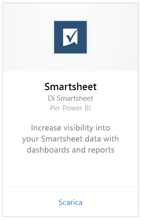
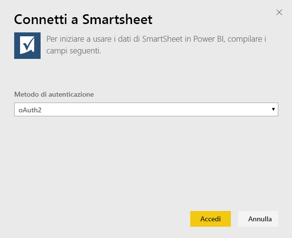
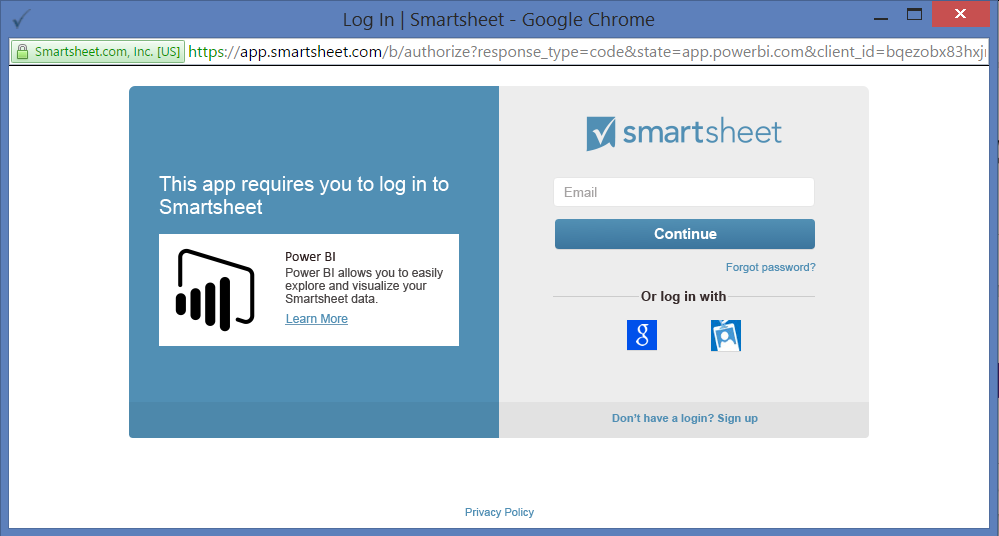
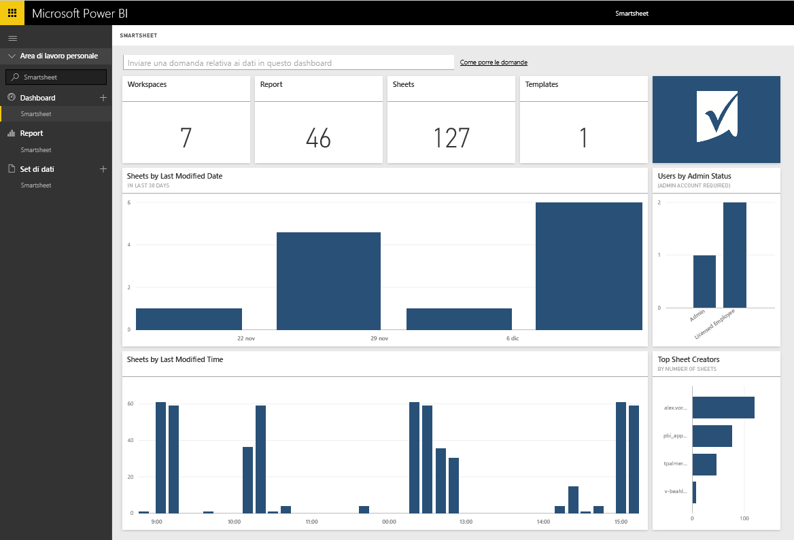

# Connettersi a Smartsheet con Power BI
Smartsheet offre una piattaforma semplice per la collaborazione e la condivisione di file. Il pacchetto di contenuto Smartsheet per Power BI fornisce un dashboard, report e set di dati che mostrano una panoramica del proprio account Smartsheet. È anche possibile usare [Power BI Desktop](desktop-connect-to-data.md) per connettersi direttamente a singoli fogli nell'account. 

Connettersi al [pacchetto di contenuto Smartsheet](https://app.powerbi.com/groups/me/getdata/services/smartsheet) per Power BI.

>[!NOTE]
>È preferibile usare l'account amministratore Smartsheet per connettersi e caricare il pacchetto di contenuto di Power BI perché ha l'accesso aggiuntivo.

## Come connettersi
1. Selezionare **Recupera dati** nella parte inferiore del riquadro di spostamento sinistro.
   
   
2. Nella casella **Servizi** selezionare **Recupera**.
   
    
3. Selezionare **Smartsheet \> Recupera**.
   
   
4. In Metodo di autenticazione selezionare **oAuth2 \> Accedi**.
   
   Quando richiesto, immettere le credenziali di Smartsheet e seguire il processo di autenticazione.
   
   
   
   
5. Dopo l'importazione dei dati in Power BI, nel riquadro di spostamento sinistro vengono visualizzati il nuovo dashboard, il nuovo report e il nuovo set di dati. I nuovi elementi vengono contrassegnati con un asterisco giallo \*. Selezionare la voce Smartsheet.
   
   

**Altre operazioni**

* Provare a [porre una domanda nella casella Domande e risposte](power-bi-q-and-a.md) nella parte superiore del dashboard
* [Cambiare i riquadri](service-dashboard-edit-tile.md) nel dashboard.
* [Selezionare un riquadro](service-dashboard-tiles.md) per aprire il report sottostante.
* Anche se la pianificazione prevede che il set di dati venga aggiornato quotidianamente, è possibile modificare la frequenza di aggiornamento o provare ad aggiornarlo su richiesta usando **Aggiorna ora**

## Cosa è incluso
Il pacchetto di contenuto Smartsheet per Power BI include una panoramica dell'account di Smartsheet, ad esempio il numero di aree di lavoro, i report e i fogli disponibili, le date di modifica di questi elementi e così via. Gli utenti amministratori visualizzano anche alcune informazioni sugli utenti del proprio sistema, ad esempio i principali creatori di fogli.  

Per connettersi direttamente a singoli fogli nell'account, è possibile usare il connettore Smartsheet in [Power BI Desktop](desktop-connect-to-data.md).  

## Passaggi successivi:

[Che cos'è Power BI?](power-bi-overview.md)

[Recuperare dati per Power BI](service-get-data.md)