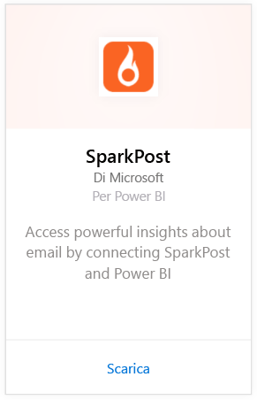
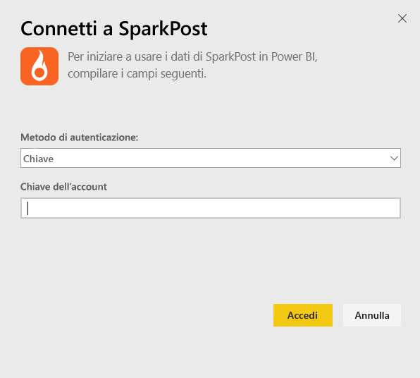
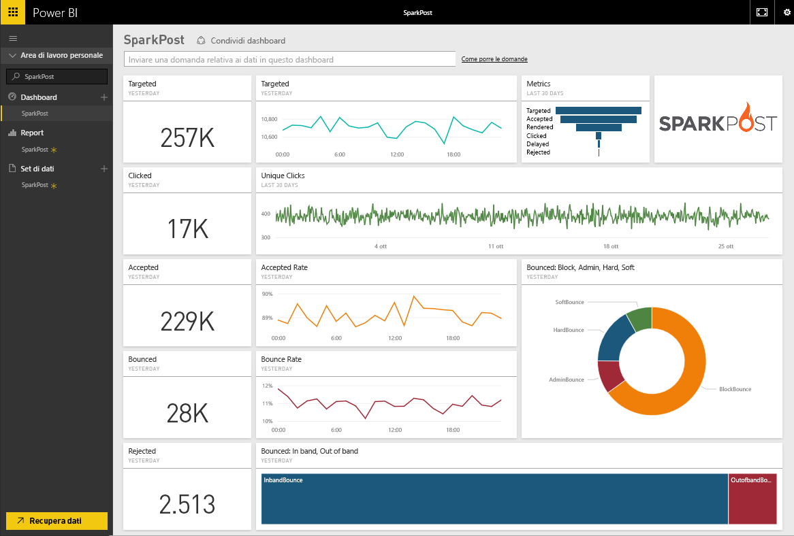
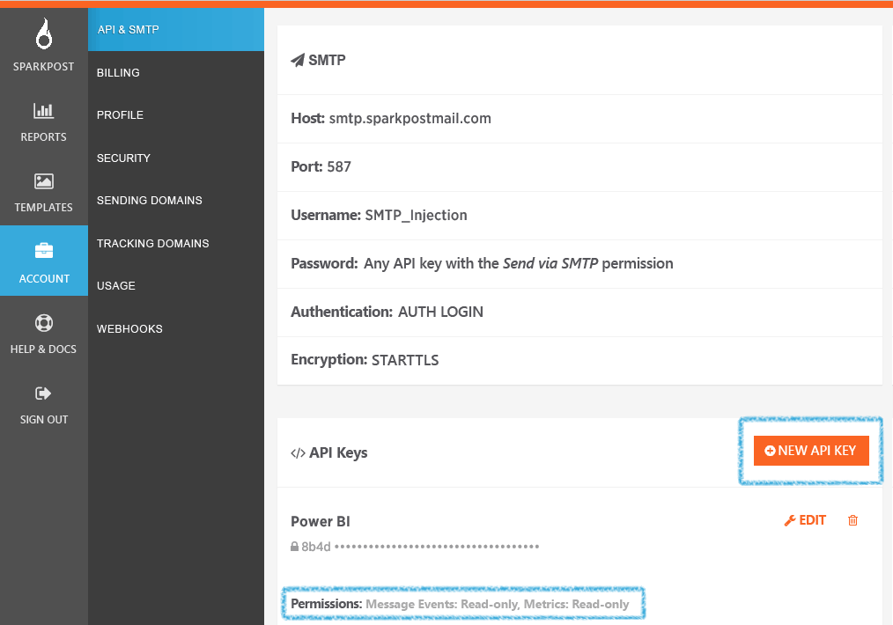

# Connettersi a SparkPost con Power BI
Il pacchetto di contenuto di Power BI per SparkPost consente di estrarre tutti i set di dati importanti dall'account di SparkPost in un unico dashboard dettagliato. L'uso del pacchetto di contenuto SparkPost consente di visualizzare le statistiche di posta elettronica complessive, inclusi domini, campagne e impegno da parte del provider di servizi Internet.

Connettersi al [pacchetto di contenuto SparkPost per Power BI](https://app.powerbi.com/getdata/services/spark-post).

## Come connettersi
1. Selezionare **Recupera dati** nella parte inferiore del riquadro di spostamento sinistro.
   
   
2. Nella casella **Servizi** selezionare **Recupera**.
   
   
3. Selezionare il pacchetto di contenuto **SparkPost** e fare clic su **Recupera**. 
   
   
4. Quando richiesto, specificare la chiave API SparkPost e selezionare Accedi. Per informazioni dettagliate su [come trovare questo parametro](#FindingParams), vedere più avanti.
   
   
5. Verrà avviato il caricamento dei dati, che a seconda delle dimensioni dell'account l'operazione potrebbe richiedere alcuni minuti. Dopo l'importazione dei dati in Power BI, nel riquadro di spostamento sinistro vengono visualizzati il dashboard, il report e il set di dati predefiniti, popolati con le statistiche relative ai messaggi di posta elettronica degli ultimi 90 giorni. I nuovi elementi sono contrassegnati con un asterisco giallo \*.
   
   

**Altre operazioni**

* Provare a [porre una domanda nella casella Domande e risposte](power-bi-q-and-a.md) nella parte superiore del dashboard
* [Cambiare i riquadri](service-dashboard-edit-tile.md) nel dashboard.
* [Selezionare un riquadro](service-dashboard-tiles.md) per aprire il report sottostante.
* Anche se la pianificazione prevede che il set di dati venga aggiornato quotidianamente, è possibile modificare la frequenza di aggiornamento o provare ad aggiornarlo su richiesta usando **Aggiorna ora**

## Cosa è incluso
Il pacchetto di contenuto SparkPost per Power BI include informazioni come il numero di clic univoci e le percentuali di elementi accettati, non recapitati, ritardati, rifiutati e così via.

## Individuazione dei parametri
Il pacchetto di contenuto usa una chiave API per connettere l'account di SparkPost a Power BI. La chiave API è disponibile nell'account in Account \> API & SMTP (vedere [qui](https://support.sparkpost.com/customer/portal/articles/1933377-create-api-keys) per altre informazioni). È consigliabile usare una chiave API con le autorizzazioni per `Message Events: Read-only ` e `Metrics: Read-only`

