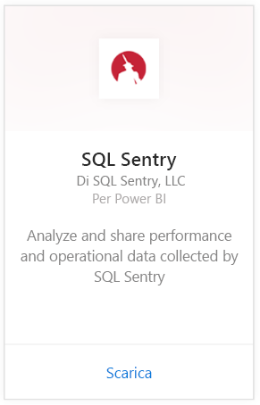
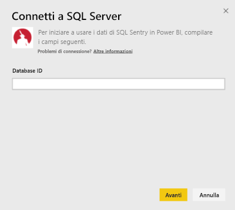
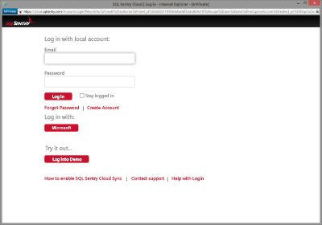
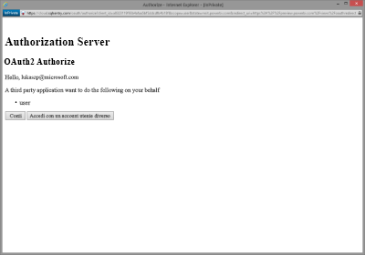
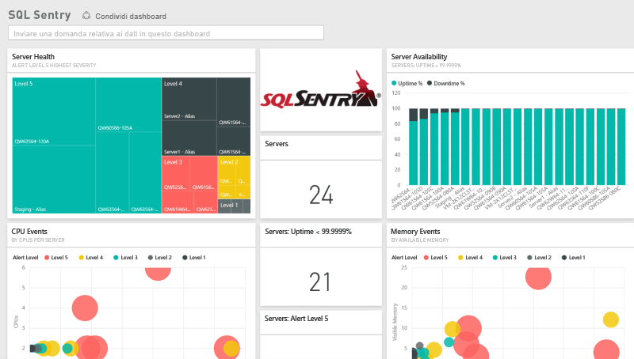
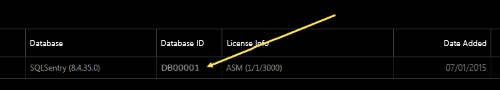
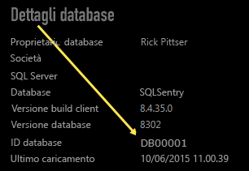

# Connettersi a SQL Sentry con Power BI
L'analisi dei dati delle prestazioni raccolti da SQL Sentry è facile con Power BI. Power BI recupera infatti i dati, creando quindi un dashboard predefinito e report correlati basati su tali dati.

Connettersi al [pacchetto di contenuto SQL Sentry](https://app.powerbi.com/groups/me/getdata/services/sql-sentry) per Power BI.

>[!NOTE]
>Per la connessione sono necessari l'accesso a un account SQL Sentry usato per connettersi a http://cloud.sqlsentry.com e un ID del database da monitorare.  Qui di seguito sono disponibili le istruzioni su dove trovare l'ID del database.

## Come connettersi
1. Selezionare **Recupera dati** nella parte inferiore del riquadro di spostamento sinistro.
   
   
2. Nella casella **Servizi** selezionare **Recupera**.
   
    
3. Selezionare **SQL Sentry \> Recupera**.
   
   
4. Fornire l' **ID** del database che si vuole monitorare in Power BI. Per informazioni dettagliate su come [trovare questo valore](#FindingParams), vedere più avanti.
   
   
5. In Metodo di autenticazione selezionare **oAuth2 \> Accedi**.
   
   Quando richiesto, immettere le credenziali di cloud.sqlsentry.com e seguire il processo di autenticazione di SQL Sentry.
   
   
   
   Alla prima connessione Power BI chiede di consentire l'accesso in sola lettura all'account. Selezionare Consenti per avviare il processo di importazione.  L'operazione di importazione può richiedere qualche minuto a seconda del volume dei dati dell'account.
   
   
6. Dopo l'importazione dei dati in Power BI, nel riquadro di spostamento sinistro vengono visualizzati il nuovo dashboard, il nuovo report e il nuovo set di dati. I nuovi elementi sono contrassegnati con un asterisco giallo \*:
   
   
7. Selezionare il dashboard di SQL Sentry.
   
   Si tratta del dashboard predefinito creato da Power BI per visualizzare i dati, che è possibile modificare per visualizzare i dati nel modo desiderato.
   
   

**Altre operazioni**

* Provare a [porre una domanda nella casella Domande e risposte](power-bi-q-and-a.md) nella parte superiore del dashboard
* [Cambiare i riquadri](service-dashboard-edit-tile.md) nel dashboard.
* [Selezionare un riquadro](service-dashboard-tiles.md) per aprire il report sottostante.
* Anche se la pianificazione prevede che il set di dati venga aggiornato quotidianamente, è possibile modificare la frequenza di aggiornamento o provare ad aggiornarlo su richiesta usando **Aggiorna ora**

## Cosa è incluso
I dati seguenti sono disponibili da SQL Sentry in Power BI:

| Nome tabella | Descrizione |
| --- | --- |
| Connessione |Questa tabella fornisce informazioni sulle connessioni SQL Sentry definite. |
| Data  |Questa tabella contiene date dalla data odierna fino alla prima data in cui sono stati raccolti e conservati i dati delle prestazioni. |
| Tempo di inattività  |Questa tabella contiene informazioni relative ai tempi di inattività e di attività per ogni server monitorato nell'ambiente in uso. |
| Utilizzo memoria  |Questa tabella contiene dati sulla quantità di memoria disponibile o libera in ogni server.  |
| Server  |Questa tabella contiene record per ogni server nell'ambiente in uso. |
| Integrità del server  |Questa tabella contiene dati per tutti gli eventi generati da condizioni personalizzate nell'ambiente in uso, tra cui gravità e conteggio. |

## Individuazione dei parametri
È possibile trovare l'**ID database** accedendo a <https://cloud.sqlsentry.com> in una nuova finestra del Web browser.  L' **ID database** è elencato nella pagina di panoramica principale:

    

L' **ID database** viene visualizzato anche nella schermata Dettagli database:

    

## Risoluzione dei problemi
Se i dati di qualche app non vengono visualizzati in Power BI, verificare di stare usando l'ID database corretto e di avere l'autorizzazione a visualizzare i dati. 

Se non si è proprietari del database SQL Sentry che viene sincronizzato con <https://cloud.sqlsentry.com>, contattare l'amministratore per verificare di avere i diritti per la visualizzazione dei dati raccolti.

## Passaggi successivi
[Introduzione a Power BI](service-get-started.md)

[Recuperare dati per Power BI](service-get-data.md)

