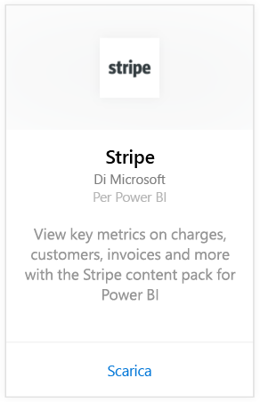
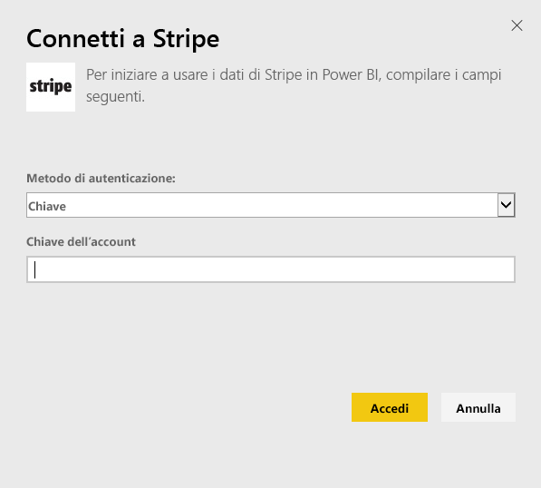
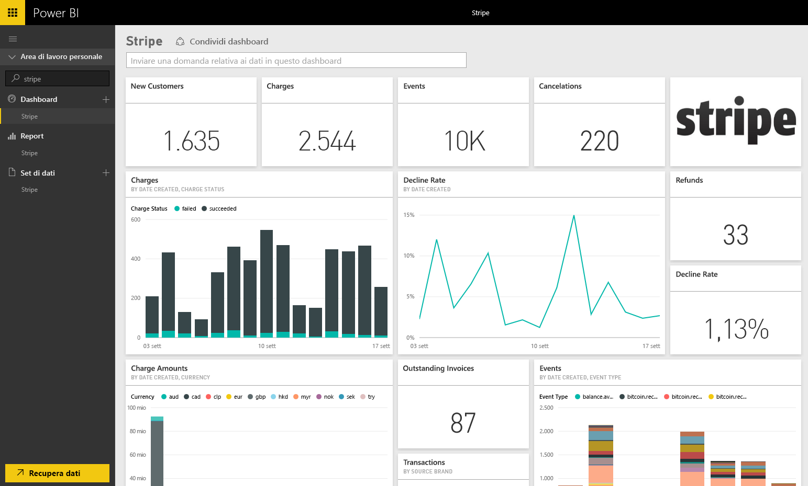

# Connettersi a Stripe con Power BI
Visualizzare ed esplorare i dati di Stripe in Power BI con il pacchetto di contenuto Power BI. Il pacchetto di contenuto Stripe di Power BI esegue il pull dei dati su clienti, spese, eventi e fatture. I dati includono i diecimila eventi più recenti e le cinquemila spese effettuate negli ultimi 30 giorni. Il contenuto verrà aggiornato automaticamente una volta al giorno secondo una pianificazione controllata dall'utente. 

Connettersi al [pacchetto di contenuto Stripe per Power BI](https://app.powerbi.com/getdata/services/stripe).

## Come connettersi
1. Selezionare Recupera dati nella parte inferiore del riquadro di spostamento sinistro.  
   
    
2. Nella casella **Servizi** selezionare **Recupera**.  
   
      
3. Selezionare **Stripe** &gt; **Recupera**.  
   
      
4. Specificare la [chiave API](https://dashboard.stripe.com/account/apikeys) di Stripe per la connessione.  
   
    
5. Il processo di importazione inizierà automaticamente. Al termine nel riquadro di spostamento verranno visualizzati un nuovo dashboard, un nuovo report e un nuovo set di dati, contrassegnato con un asterisco. Selezionare il dashboard per visualizzare i dati importati.
   
    

**Altre operazioni**

* Provare a [porre una domanda nella casella Domande e risposte](power-bi-q-and-a.md) nella parte superiore del dashboard
* [Cambiare i riquadri](service-dashboard-edit-tile.md) nel dashboard.
* [Selezionare un riquadro](service-dashboard-tiles.md) per aprire il report sottostante.
* Anche se la pianificazione prevede che il set di dati venga aggiornato quotidianamente, è possibile modificare la frequenza di aggiornamento o provare ad aggiornarlo su richiesta usando **Aggiorna ora**

## Passaggi successivi
[Introduzione a Power BI](service-get-started.md)

[Recuperare dati per Power BI](service-get-data.md)

