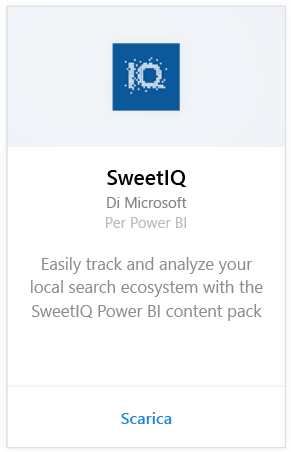
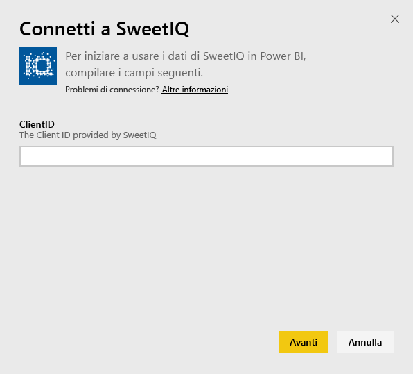
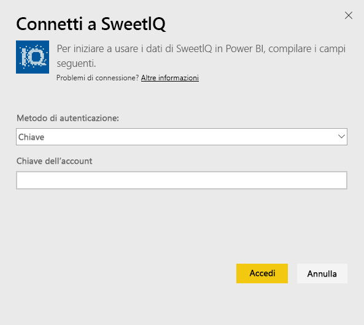
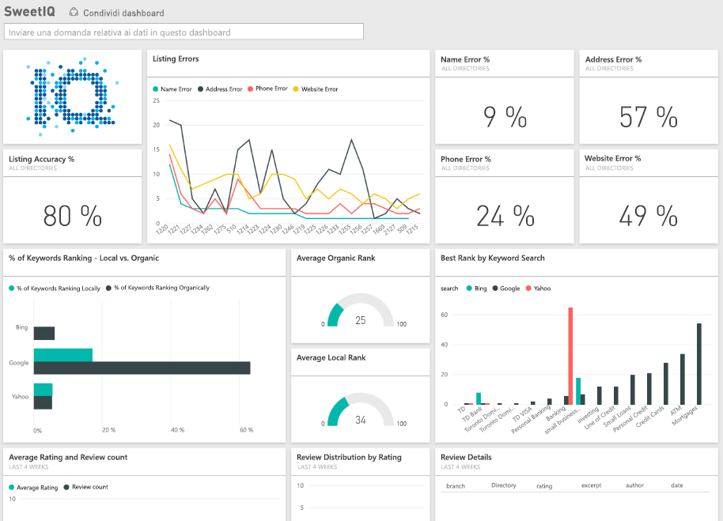

# Connettersi a SweetIQ con Power BI
Il pacchetto di contenuto di Power BI estrae i dati dall'account SweetIQ e genera un set di contenuto predefinito che consente di esplorare facilmente i dati. Usare il pacchetto di contenuto SweetIQ per analizzare i dati relativamente a posizioni, elenchi, classificazioni e revisioni. I dati sono impostati in modo da essere aggiornati quotidianamente.

Connettersi al [pacchetto di contenuto SweetIQ](https://app.powerbi.com/groups/me/getdata/services/sweetiq) per Power BI.

## Come connettersi
1. Nel riquadro di spostamento a sinistra fare clic su **Recupera dati**.
   
    
2. Selezionare **SweetIQ** e fare clic su **Recupera**.
   
    
3. Fornire l'ID client di SweetIQ. In genere si tratta di un valore alfanumerico. Per altre informazioni dettagliate sull'individuazione di questo valore, vedere le informazioni seguenti.
   
    
4. Selezionare il tipo di autenticazione **Chiave** e fornire la chiave API di Sweet IQ. In genere si tratta di un valore alfanumerico. Per altre informazioni dettagliate sull'individuazione di questo valore, vedere le informazioni seguenti.
   
    
5. Power BI inizierà a caricare i dati, operazione che richiederà alcuni minuti a seconda della dimensione dei dati dell'account. Dopo aver completato il caricamento, nel riquadro di spostamento sinistro vengono visualizzati il nuovo dashboard, il nuovo report e il nuovo set di dati.
   
    

**Altre operazioni**

* Provare a [porre una domanda nella casella Domande e risposte](power-bi-q-and-a.md) nella parte superiore del dashboard
* [Cambiare i riquadri](service-dashboard-edit-tile.md) nel dashboard.
* [Selezionare un riquadro](service-dashboard-tiles.md) per aprire il report sottostante.
* Anche se la pianificazione prevede che il set di dati venga aggiornato quotidianamente, è possibile modificare la frequenza di aggiornamento o provare ad aggiornarlo su richiesta usando **Aggiorna ora**

## Individuazione dei parametri
L'ID client e la chiave API per questo pacchetto di contenuto non è uguale al nome utente e password di SweetIQ.

Selezionare un ID client per uno dei client a cui ha accesso il proprio account. È possibile trovare l'elenco di client in "Gestione dei client" nell'account SweetIQ.

Rivolgersi all'amministratore per la propria chiave API, per accedere ai dati per un client specifico.

## Passaggi successivi
[Introduzione a Power BI](service-get-started.md)

[Recuperare dati per Power BI](service-get-data.md)

