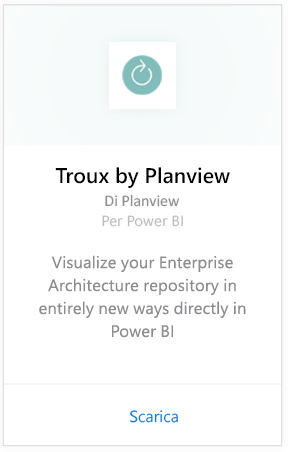
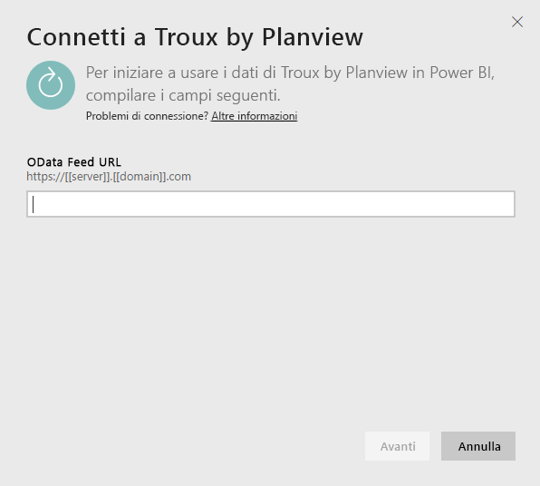
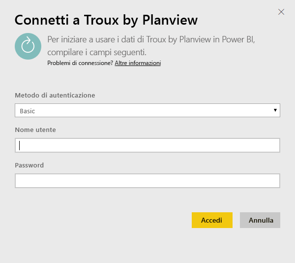
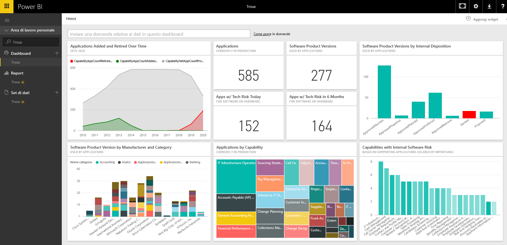

# Connettersi a Troux per Power BI
Con il pacchetto di contenuto Troux per Power BI è possibile visualizzare il repository Enterprise Architecture in modi completamente nuovi direttamente in Power BI. Il pacchetto di contenuto offre una serie di informazioni sulle funzionalità aziendali, le applicazioni che consentono di distribuire tali funzionalità e le tecnologie che supportano le applicazioni che possono essere completamente personalizzate usando Power BI.

Connettersi al [pacchetto di contenuto Troux](https://app.powerbi.com/getdata/services/troux) per Power BI.

## Come connettersi
1. Selezionare **Recupera dati** nella parte inferiore del riquadro di spostamento sinistro.
   
   
2. Nella casella **Servizi** selezionare **Recupera**.
   
   
3. Selezionare **Troux** \> **Recupera**.
   
   
4. Specificare l'URL OData di Troux. Per informazioni dettagliate su come [trovare questi parametri](#FindingParams), vedere più avanti.
   
   
5. In **Metodo di autenticazione**selezionare **Di base** e fornire il nome utente e la password (distinzione tra maiuscole e minuscole), quindi selezionare **Accedi**.
   
    
6. Dopo l'approvazione, il processo di importazione inizierà automaticamente. Al termine nel riquadro di spostamento verranno visualizzati un nuovo dashboard, un nuovo report e un nuovo set di dati. Selezionare il dashboard per visualizzare i dati importati.
   
     

**Altre operazioni**

* Provare a [porre una domanda nella casella Domande e risposte](power-bi-q-and-a.md) nella parte superiore del dashboard
* [Cambiare i riquadri](service-dashboard-edit-tile.md) nel dashboard.
* [Selezionare un riquadro](service-dashboard-tiles.md) per aprire il report sottostante.
* Anche se la pianificazione prevede che il set di dati venga aggiornato quotidianamente, è possibile modificare la frequenza di aggiornamento o provare ad aggiornarlo su richiesta usando **Aggiorna ora**

## Requisiti di sistema
L'accesso al feed OData di Troux e a Troux 9.5.1 o versione successiva è obbligatorio.

## Individuazione dei parametri
Il team Servizio clienti può fornire all'utente l'URL del feed OData di Troux univoco

## Risoluzione dei problemi
Se viene visualizzato un errore di timeout dopo avere fornito le credenziali, riprovare a connettersi.

## Passaggi successivi
[Introduzione a Power BI](service-get-started.md)

[Recuperare dati in Power BI](service-get-data.md)

