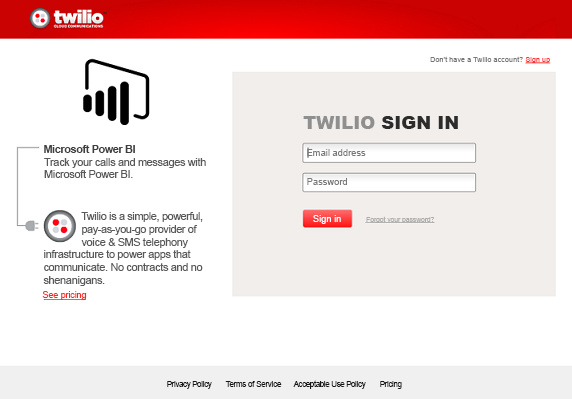
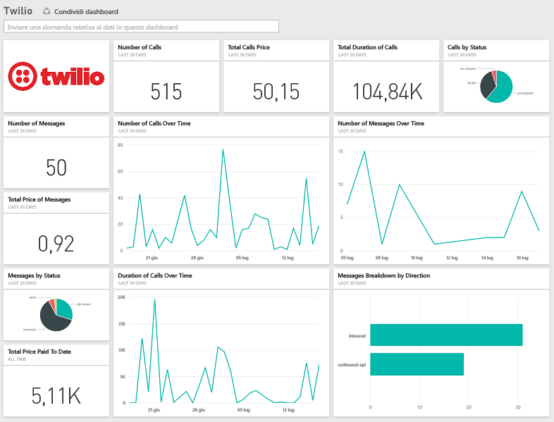

# Connettersi a Twilio con Power BI
Il pacchetto di contenuto Microsoft Twilio per Power BI consente di effettuare il pull dei dati in Power BI e crea un [dashboard Twilio](https://powerbi.microsoft.com/integrations/twilio) pronto all'uso e un report con informazioni dettagliate sui dati. È anche possibile creare dashboard e report personalizzati per il set di dati creato da Power BI. I dati verranno aggiornati una volta al giorno, di conseguenza quelli visualizzati saranno sempre recenti.

Connettersi al [pacchetto di contenuto Twilio](https://app.powerbi.com/getdata/services/twilio) per Power BI.

## Come connettersi
1. Selezionare **Recupera dati** nella parte inferiore del riquadro di spostamento sinistro.
   
    
2. Nella casella **Servizi** selezionare **Recupera**.
   
    
3. Selezionare **Twilio** \> **Recupera**.
   
   
4. In **Metodo di autenticazione** selezionare **oAuth2** \> Accedi. Quando richiesto specificare le credenziali Twilio e autorizzare l'applicazione di Power BI per accedere ai dati.
   
   
5. Verrà avviata l'importazione di dati dall'account di Twilio e il dashboard verrà popolato con i dati relativi a chiamate e messaggi degli ultimi 30 giorni. 
   
   

**Altre operazioni**

* Provare a [porre una domanda nella casella Domande e risposte](power-bi-q-and-a.md) nella parte superiore del dashboard
* [Cambiare i riquadri](service-dashboard-edit-tile.md) nel dashboard.
* [Selezionare un riquadro](service-dashboard-tiles.md) per aprire il report sottostante.
* Anche se la pianificazione prevede che il set di dati venga aggiornato quotidianamente, è possibile modificare la frequenza di aggiornamento o provare ad aggiornarlo su richiesta usando **Aggiorna ora**

## Cosa è incluso
Dettagli relativi alle transazioni di tipo chiamata e messaggio per gli ultimi 30 giorni. Questi dati possono essere usati per qualsiasi tipo di analisi e aggregazione.

Un set di statistiche già aggregate che può essere utile esaminare. Questo set include:

        All Time Calls Count  
        All Time Calls Duration  
        All Time Calls Price  
        All Time Messages Price  
        All Time Messages Count  
        All Time Count of Phone Numbers  
        All Time Price of Phone Numbers  
        All Time Twilio Client Calls Price  
        All Time Twilio Client Calls Duration  
        All Time Twilio Client Calls Count  
        All Time Total Price  
        All Time Inbound Calls Price  
        All Time Inbound Calls Duration  
        All Time Inbound Calls Count  
        All Time Outbound Calls Price  
        All Time Outbound Calls Duration  
        All Time Outbound Calls Count  
        This Month Calls Price  
        This Month Calls Duration  
        This Month Calls Count  
        This Month Messages Count  
        This Month Messages Price  
        This Month Count of Phone Numbers  
        This Month Price of Phone Numbers  
        This Month Twilio Client Calls Price  
        This Month Twilio Client Calls Duration  
        This Month Twilio Client Calls Count  
        This Month Total Price  
        This Month Inbound Calls Price  
        This Month Inbound Calls Duration  
        This Month Inbound Calls Count  
        This Month Outbound Calls Price  
        This Month Outbound Calls Duration  
        This Month Outbound Calls Count  
        This Month Inbound Messages Price  
        This Month Inbound Messages Count  
        This Month Outbound Messages Price  
        This Month Outbound Messages Count

## Risoluzione dei problemi
Se la quantità di dati relativa agli ultimi 30 giorni è elevata (centinaia di migliaia di transazioni), il recupero dei dati potrebbe non riuscire. Il problema è noto e Microsoft si sta già adoperando per risolverlo. Nel frattempo, se si riscontra questo problema, usare il collegamento nella parte superiore della pagina di Power BI per informare Microsoft ed essere contattati per ulteriori chiarimenti.

## Passaggi successivi
[Introduzione a Power BI](service-get-started.md)

[Recuperare dati in Power BI](service-get-data.md)

