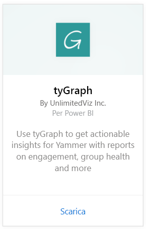
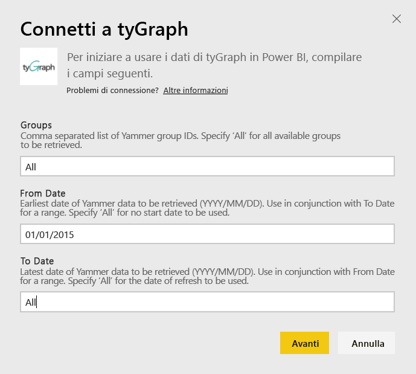
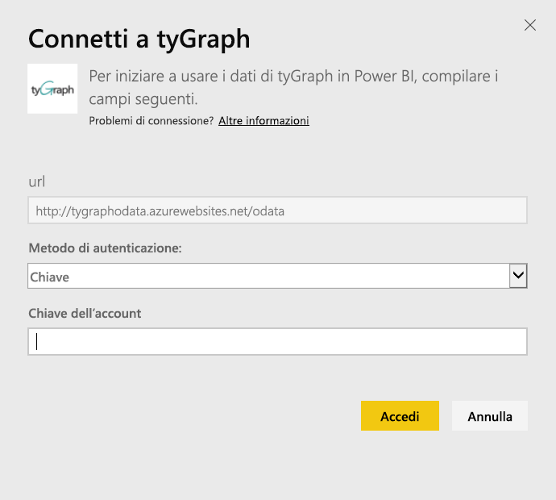
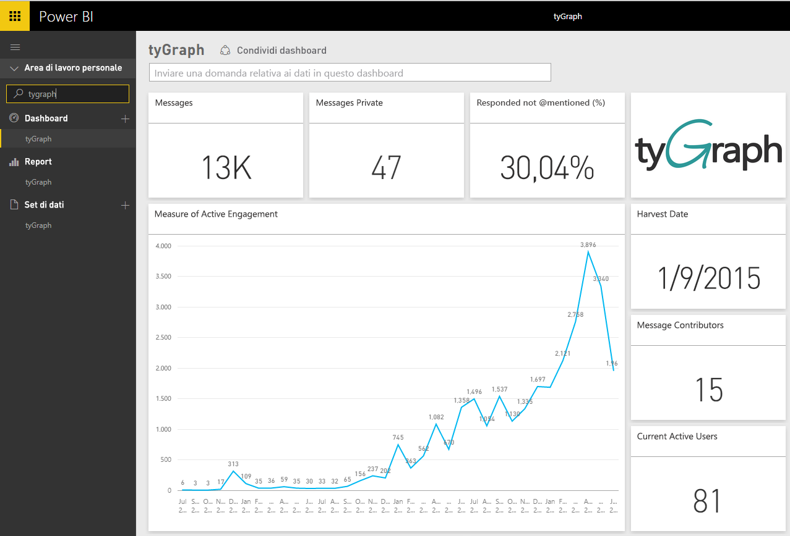
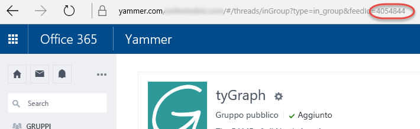

# Connettersi a tyGraph con Power BI
Visualizzare ed esplorare i dati di tyGraph in Power BI con il pacchetto di contenuto Power BI. Per iniziare, connettersi all'account tyGraph e caricare il dashboard, i report e il set di dati. Il contenuto predefinito include informazioni come misura del coinvolgimento attivo (punteggio MAE) e principali collaboratori. Personalizzarlo ulteriormente per evidenziare le informazioni a cui si è maggiormente interessati.  I dati verranno aggiornati automaticamente in base a una pianificazione impostata dall'utente.

Connettersi a [tyGraph per Power BI](https://app.powerbi.com/getdata/services/tygraph).

## Come connettersi
1. Selezionare **Recupera dati** nella parte inferiore del riquadro di spostamento sinistro.
   
   
2. Nella casella **Servizi** selezionare **Recupera**.
   
   
3. Selezionare **tyGraph** \> **Recupera**.
   
   
4. Specificare i gruppi e l'intervallo di tempo a cui connettersi, in caso contrario specificare "Tutto" per visualizzare tutti i dati. Si noti che il formato della data previsto è AAAA/MM/GG. Per informazioni dettagliate su come [trovare questi parametri](#FindingParams), vedere più avanti.
   
   
5. Specificare la chiave tyGraph per la connessione. Per informazioni dettagliate sull'individuazione di questo valore, vedere più avanti.
   
    **Se si è un amministratore Yammer verificato**  
    La chiave API viene inviata tramite posta elettronica dopo la creazione dell'account tyGraph. Se non si trova più la chiave, è possibile richiederne una nuova inviando un messaggio di posta elettronica a support@unlimitedviz.com. Se non si ha ancora un account tyGraph, è possibile avviare una versione di valutazione dalla pagina [http://www.tygraph.com/](http://www.tygraph.com/). 
   
    **Se non si è un amministratore Yammer verificato**
   
    Il pacchetto di contenuto tyGraph richiede un account tyGraph creato da un amministratore Yammer verificato. Una volta creato, è possibile rilasciare altre chiavi agli utenti all'interno della stessa organizzazione. Se l'amministratore verificato non ha ancora creato un account tyGraph, contattarlo e chiedergli di crearne uno. Se l'account è stato creato, è possibile richiedere una chiave inviando un messaggio di posta elettronica a <support@unlimitedviz.com>.
   
    
6. Dopo l'autenticazione, il processo di importazione verrà avviato automaticamente. Al termine nel riquadro di spostamento verranno visualizzati un nuovo dashboard, un nuovo report e un nuovo set di dati. Selezionare il dashboard per visualizzare i dati importati.
   
    

**Altre operazioni**

* Provare a [porre una domanda nella casella Domande e risposte](consumer/end-user-q-and-a.md) nella parte superiore del dashboard
* [Cambiare i riquadri](service-dashboard-edit-tile.md) nel dashboard.
* [Selezionare un riquadro](consumer/end-user-tiles.md) per aprire il report sottostante.
* Anche se la pianificazione prevede che il set di dati venga aggiornato quotidianamente, è possibile modificarne la frequenza di aggiornamento o provare ad aggiornarlo su richiesta usando **Aggiorna ora**

## Individuazione dei parametri
È possibile visualizzare i dati di tutti i gruppi a cui si ha accesso oppure è possibile scegliere un subset di dati specifico. È possibile anche creare un subset di dati in base alla data. È possibile creare più dashboard tyGraph per monitorare set di gruppi e/o date specifici. I dettagli su questi parametri sono riportati di seguito.

**Gruppi**

L'API tyGraph può filtrare i dati in base a un ID gruppo specifico. I dati sono inclusi nel pacchetto di contenuto in un elenco con valori delimitati da virgole. 

    Example: 2427647,946595,1154464

È possibile identificare l'ID di un gruppo specifico in Yammer passando al feed per il gruppo e esaminando l'URL.

Nell'esempio precedente, l'ID gruppo Yammer è 4054844.

**Da data**

Il campo Da data consente di limitare il valore meno recente per i dati restituiti. Solo i dati creati a partire da tale data verranno caricati nel pacchetto di contenuto. Il formato del campo Da data è AAAA/MM/GG. 

    Example: 2013/10/29

Nell'esempio precedente verranno caricati nel pacchetto di contenuto tutti i dati a partire dal 29 ottobre 2013. 

**A data** Il campo A data consente di limitare il valore più recente per i dati restituiti. Può essere usato insieme al campo Da data per caricare i dati da un intervallo di date. Solo i dati creati fino a tale data verranno caricati nel pacchetto di contenuto. Il formato del campo A data è AAAA/MM/GG. 

    Example: 2014/10/20

Nell'esempio precedente verranno caricati nel pacchetto di contenuto tutti i dati fino al 20 ottobre 2014. 

## Passaggi successivi
[Introduzione a Power BI](service-get-started.md)

[Recuperare dati in Power BI](service-get-data.md)

