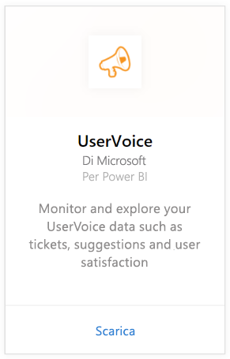
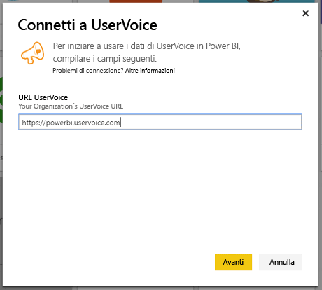
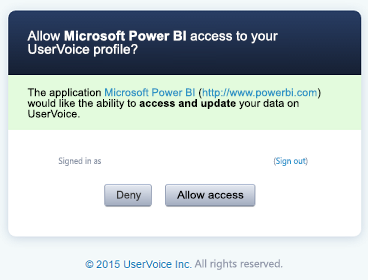
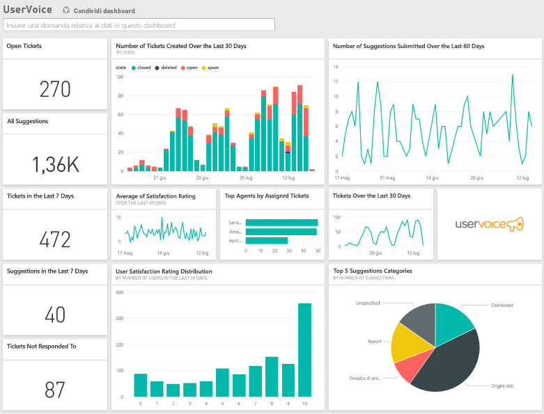

# Connettersi a UserVoice con Power BI
Tenere traccia ed esplorare i dati di UserVoice è facile con Power BI e il pacchetto di contenuto UserVoice. Power BI recupera i dati, inclusi ticket, suggerimenti e valutazioni della soddisfazione, quindi crea un dashboard e dei report predefiniti in base a tali dati.

Connettersi al [pacchetto di contenuto UserVoice](https://app.powerbi.com/getdata/services/uservoice) per Power BI.

>[!NOTE]
>Per connettersi al pacchetto di contenuto di Power BI, è necessario un account amministratore. Il pacchetto di contenuto usa anche l'API UserVoice e contribuisce all'utilizzo verso il raggiungimento dei limiti di UserVoice. Altre informazioni sono disponibili di seguito.

## Come connettersi
1. Selezionare **Recupera dati** nella parte inferiore del riquadro di spostamento sinistro.
   
   
2. Nella casella **Servizi** selezionare **Recupera**.
   
    
3. Selezionare **UserVoice**, quindi selezionare **Recupera**.
   
   
4. Quando richiesto, immettere l'URL di UserVoice. L'URL deve rispettare esattamente il modello https://fabrikam.uservoice.com, sostituendo "fabrikam" con il nome del prodotto o del servizio appropriato.
   
   >[!NOTE]
   >Alla fine dell'URL non c'è la barra e la connessione è di tipo http**s**.
   
   
5. Quando richiesto, immettere le credenziali di UserVoice e seguire il processo di autenticazione di UserVoice. Se è già stato effettuato l'accesso a UserVoice nel browser, le credenziali potrebbero non essere richieste. Concedere l'accesso ai dati alle applicazioni di Power BI facendo clic su "Consenti accesso".
   
   >[!NOTE]
   >Sono necessarie le credenziali dell'account amministratore di UserVoice.
   
   
6. Power BI recupererà i dati di UserVoice e creerà automaticamente un dashboard e un report pronti da usare. Power BI recupererà i dati seguenti: tutti i suggerimenti, tutti i ticket aperti, tutti i ticket creati negli ultimi 30 giorni inclusi quelli chiusi e tutte le valutazioni di soddisfazione degli utenti.
   
   

**Altre operazioni**

* Provare a [porre una domanda nella casella Domande e risposte](power-bi-q-and-a.md) nella parte superiore del dashboard
* [Cambiare i riquadri](service-dashboard-edit-tile.md) nel dashboard.
* [Selezionare un riquadro](service-dashboard-tiles.md) per aprire il report sottostante.
* Anche se la pianificazione prevede che il set di dati venga aggiornato quotidianamente, è possibile modificare la frequenza di aggiornamento o provare ad aggiornarlo su richiesta usando **Aggiorna ora**

## Risoluzione dei problemi
**"La convalida dei parametri non è riuscita. Verificare che tutti i parametri siano validi"**

Se questo errore viene visualizzato dopo aver digitato l'URL di UserVoice, verificare che siano soddisfatti i requisiti seguenti:

* L'URL deve rispettare esattamente questo modello "https://fabrikam.uservoice.com" sostituendo "fabrikam" con il prefisso dell'URL di UserVoice corretto.
* Verificare che tutte le lettere siano minuscole.
* Verificare che l'URL sia di tipo "http**s**".
* Verificare che non vi sia la barra finale alla fine dell'URL.

**"L'accesso non è riuscito"**

Se questo errore si verifica dopo aver usato le credenziali di UserVoice per eseguire accesso, significa che l'account in uso non ha le autorizzazioni per recuperare i dati di UserVoice dall'account. Verificare che sia un account amministratore e riprovare.

"**Si è verificato un errore**"

Se viene visualizzato questo messaggio di errore durante il caricamento dei dati, verificare che l'account UserVoice non abbia superato la quota di uso mensile delle API. Se non è stata superata la quota, provare a riconnettersi. Se il problema persiste, contattare il supporto di Power BI alla pagina [https://community.powerbi.com](https://community.powerbi.com/).

**Altro**  

Il pacchetto di contenuto UserVoice per Power BI usa le API di UserVoice per recuperare i dati. Assicurarsi di monitorare l'uso delle API in modo da non superare il limite. Se si ha una grande quantità di dati nell'account UserVoice, un suggerimento per ridurre al minimo l'impatto sull'uso delle API consiste nel modificare la frequenza di aggiornamento sostituendo il valore predefinito corrente impostato su una volta al giorno con un valore che prevede l'aggiornamento solo nei giorni feriali o ogni due giorni a seconda delle esigenze. Un altro suggerimento consiste nel chiedere a un solo amministratore di creare il pacchetto di contenuto e condividerlo con il resto del team invece che incaricare della creazione ogni amministratore dell'organizzazione, con un conseguente carico aggiuntivo non necessario per le API.

## Passaggi successivi
[Introduzione a Power BI](service-get-started.md)

[Recuperare dati in Power BI](service-get-data.md)

