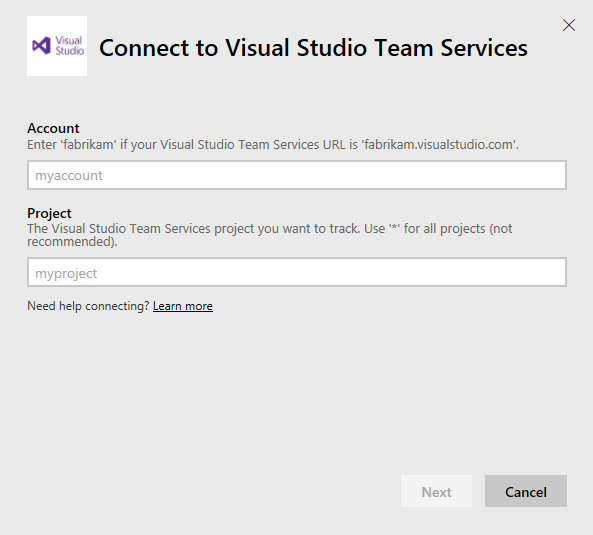
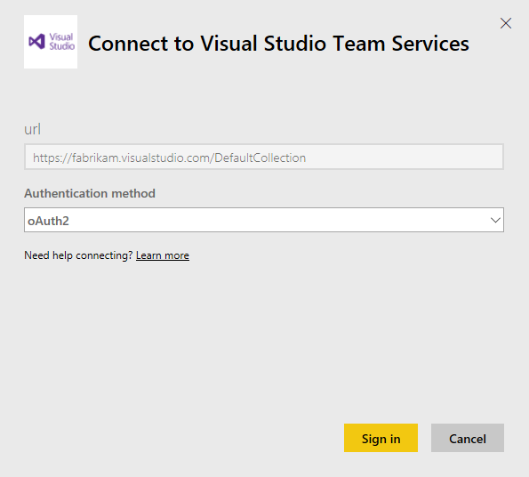
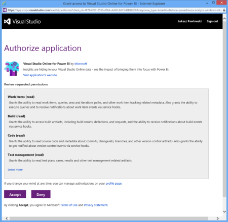
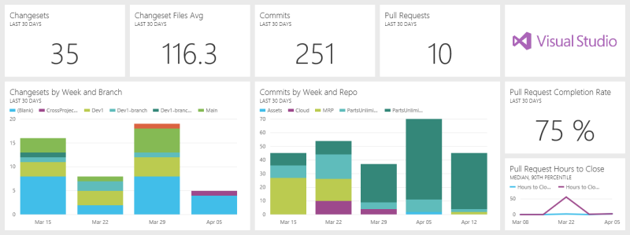
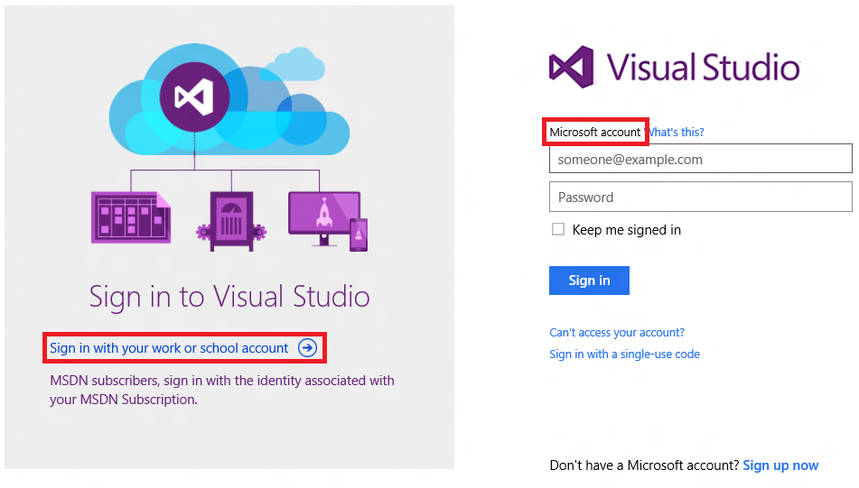
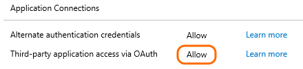

# Connettersi a Visual Studio Team Services con Power BI
Usare il pacchetto di contenuto Visual Studio Team Services per Power BI per ottenere informazioni sui progetti dei team git e TFVC. Dopo aver effettuato una connessione, i dati vengono recapitati automaticamente in un dashboard e nei report. 

Connettersi al [pacchetto di contenuto Visual Studio Team Services](https://app.powerbi.com/getdata/services/visual-studio-online) oppure leggere altre informazioni sull'[integrazione di Visual Studio Team Services](https://powerbi.microsoft.com/integrations/visual_studio_online) con Power BI.

>[!NOTE]
>Questo pacchetto di contenuto richiede l'accesso a un account con OAuth abilitato. Di seguito sono fornite informazioni più dettagliate sui requisiti.

## Come connettersi
1. Selezionare **Recupera dati** nella parte inferiore del riquadro di spostamento sinistro.  
    
2. Nella casella **Servizi** selezionare **Recupera**.  
    
3. Selezionare il pacchetto di contenuto **Visual Studio Team Services** e fare clic su **Recupera**.     
   
4. Immettere le informazioni sull'account di Visual Studio Team Services. Per informazioni dettagliate su [come trovare questi parametri](#FindingParams), vedere più avanti.
   
   
   
   Il nome dell'account è la parte iniziale dell'URL a visualstudio.com:    
   
   
   Il nome del progetto è il nome visualizzato nella parte superiore di ogni pagina in Visual Studio Team Services:  
   
5. Eseguire l'autenticazione con Visual Studio Team Services usando oAuth2. Potrebbe essere visualizzata una finestra di dialogo di accesso di Visual Studio Team Services. 
   
   > [!IMPORTANT]
   > Alcune distribuzioni di Visual Studio Team Services non supportano oAuth2.  Se l'accesso non riesce, seguire le istruzioni nella sezione Risoluzione dei problemi.
   > 
   > 
   
   
6. Seguire le schermate di autenticazione di Visual Studio Team Services per concedere l'autorizzazione del pacchetto di contenuto Visual Studio per Power BI ai dati del progetto team.   
   
7. Dopo la connessione al progetto di Visual Studio Team Services, vengono visualizzati un nuovo dashboard, report e set di dati nel riquadro di spostamento sinistro. I nuovi elementi sono contrassegnati con un asterisco giallo \*.  
    

**Altre operazioni**

* Provare a [porre una domanda nella casella Domande e risposte](service-q-and-a.md) nella parte superiore del dashboard
* [Cambiare i riquadri](service-dashboard-edit-tile.md) nel dashboard.
* [Selezionare un riquadro](service-dashboard-tiles.md) per aprire il report sottostante.
* Anche se la pianificazione prevede che il set di dati venga aggiornato quotidianamente, è possibile modificare la frequenza di aggiornamento o provare ad aggiornarlo su richiesta usando **Aggiorna ora**

## Cosa è incluso
Visual Studio Team Services in Power BI offre un'ampia gamma di tabelle e campi per la creazione di report. L'elenco completo degli elementi inclusi nel pacchetto di contenuto è disponibile all'indirizzo <https://www.visualstudio.com/get-started/report/vso-pbi-whats-available-vs>

## Requisiti di sistema
* Accesso all'account di Visual Studio Team Services con l'autorizzazione per raccogliere i dati usando l'API REST.  
* Autorizzazione concessa all'applicazione "Power BI" durante la connessione iniziale. Per disconnettere Power BI e rimuovere l'autorizzazione per accedere all'account di Visual Studio Team Services, è possibile revocare l'accesso in Visual Studio Team Services. Vedere <https://www.visualstudio.com/get-started/setup/change-application-access-policies-vs>.  

Per altre informazioni, vedere <https://www.visualstudio.com/en-us/get-started/report/connect-vso-pbi-vs>.

## Individuazione dei parametri
Il nome dell'account è la parte iniziale dell'URL a visualstudio.com:    
    

Il nome del progetto è il nome visualizzato nella parte superiore di ogni pagina in Visual Studio Team Services:  
    

È anche possibile usare caratteri jolly per selezionare più progetti. È ad esempio possibile selezionare tutti i progetti immettendo semplicemente "\*" o tutti i progetti che iniziano con "Azure" immettendo "Azure\*".

## Risoluzione dei problemi
Quando si prova a eseguire l'accesso all'account di Visual Studio Team Services, potrebbe essere visualizzato un messaggio di accesso non riuscito.

Esistono due motivi comuni per cui potrebbe non essere possibile eseguire correttamente l'autenticazione:

1) L'accesso è stato eseguito con un account personale invece che con l'account aziendale o dell'istituto di istruzione  

2) La distribuzione di Visual Studio Team Services non supporta oAuth 

**Accesso con l'account aziendale o dell'istituto di istruzione**  
Se viene visualizzato questo problema, significa che è già stata eseguita l'autenticazione con Visual Studio Team Services con un account diverso rispetto all'account con cui si sta provando a caricare i dati, ad esempio, la connessione a Visual Studio Team Services è stata eseguita con un account Microsoft personale, mentre quella a PowerBI con un account aziendale o dell'istituto di istruzione.

Per risolvere il problema:  

* Annullare la finestra di dialogo di configurazione  
* Disconnettersi da Visual Studio Team Services con l'account personale  
* Accedere a Visual Studio Online usando il proprio account aziendale o dell'istituto di istruzione  
* Riavviare il processo "Recupera dati" precedente 

Connessione con l'account aziendale o dell'istituto di istruzione (Azure Active Directory/AAD):  
    

Se viene visualizzata questa finestra di dialogo e ci si vuole connettere con il proprio account aziendale o dell'istituto di istruzione (Azure Active Directory), verificare di fare clic sul collegamento a sinistra per accedere con tale account; non fornire le credenziali AAD sul lato destro, perché questa sezione prevede l'uso di un account Microsoft (l'account personale).

**Distribuzioni di Visual Studio Team Services che non supportano oAuth2**  
L'amministratore di Visual Studio Team Services potrebbe aver disabilitato oAuth per la distribuzione di Visual Studio Team Services.  In questo caso non sarà al momento possibile usare il pacchetto di contenuto di Visual Studio per Power BI. 

## Passaggi successivi
* [Introduzione a Power BI](service-get-started.md)
* [Recuperare i dati](service-get-data.md)

