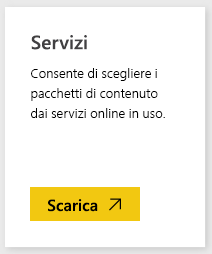

# Connettersi a VMob con Power BI
Tenere traccia ed esplorare i dati di VMob è facile con Power BI e il pacchetto di contenuto VMob. Power BI recupera i dati seguenti: statistiche utenti per tutti i tempi e negli ultimi 30 giorni, indicatore KPI di vendita al dettaglio per gli ultimi 30 giorni e prestazioni della campagna per gli ultimi 30 giorni.

Connettersi al [pacchetto di contenuto VMob](https://app.powerbi.com/getdata/services/vmob) per Power BI.

## Come connettersi
1. Selezionare **Recupera dati** nella parte inferiore del riquadro di spostamento sinistro.
   
    
2. Nella casella **Servizi** selezionare **Recupera**.
   
   
3. Selezionare **VMob** \> **Recupera**.
   
   
4. Quando richiesto, immettere l'URL VMob e fare clic sul pulsante Avanti. Questo URL viene fornito da VMob separatamente.
   
    
5. Scegliere l’opzione **Basic** nell'elenco a discesa del metodo di autenticazione, immettere il nome utente VMob e la password e fare clic sul pulsante **Accedi** .
   
    
6. Il processo di importazione verrà avviato automaticamente e Power BI recupererà i dati VMob per creare un dashboard pronto all’uso e il report per l'utente.
   
   

**Altre operazioni**

* Provare a [porre una domanda nella casella Domande e risposte](consumer/end-user-q-and-a.md) nella parte superiore del dashboard
* [Cambiare i riquadri](service-dashboard-edit-tile.md) nel dashboard.
* [Selezionare un riquadro](consumer/end-user-tiles.md) per aprire il report sottostante.
* Anche se la pianificazione prevede che il set di dati venga aggiornato quotidianamente, è possibile modificarne la frequenza di aggiornamento o provare ad aggiornarlo su richiesta usando **Aggiorna ora**

## Passaggi successivi
[Introduzione a Power BI](service-get-started.md)

[Recuperare dati in Power BI](service-get-data.md)

