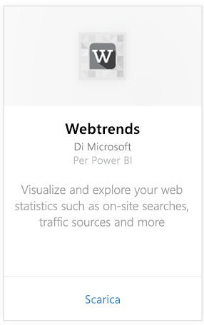
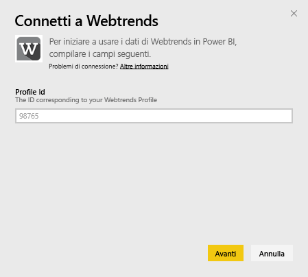
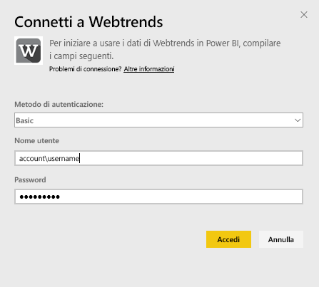
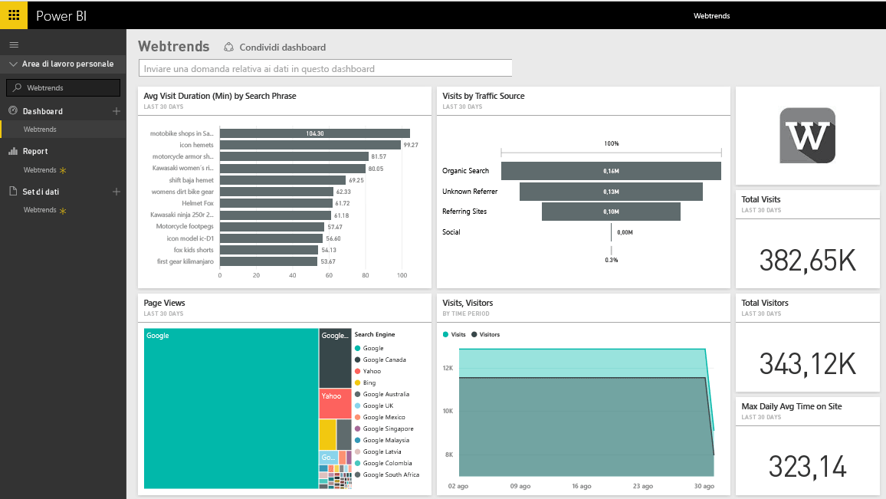
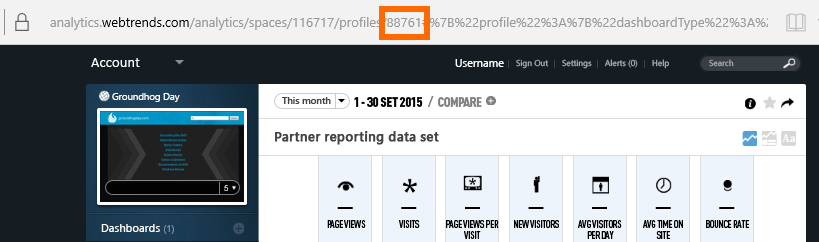
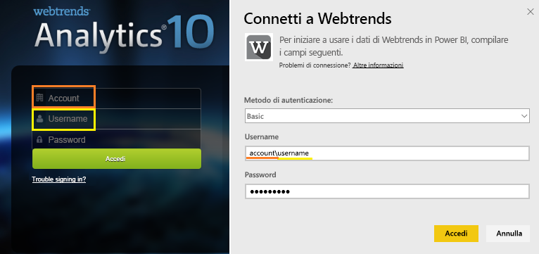

# Connettersi a Webtrends con Power BI
Il pacchetto di contenuto Webtrends per Power BI include una serie di metriche predefinite come, ad esempio, visualizzazioni pagina totali e visite per origine traffico. La visualizzazione dei dati Webtrends in Power BI inizia con la connessione al proprio account Webtrends. È possibile usare il dashboard e i report forniti oppure personalizzarli per evidenziare le informazioni a cui si è maggiormente interessati.  I dati verranno aggiornati automaticamente una volta al giorno.

Connettersi al [pacchetto di contenuto di Webtrends per Power BI](https://app.powerbi.com/getdata/services/webtrends).

## Come connettersi
1. Selezionare **Recupera dati** nella parte inferiore del riquadro di spostamento sinistro.
   
   
2. Nella casella **Servizi** selezionare **Recupera**.
   
   
3. Selezionare **Webtrends** \> **Recupera**.
   
   
4. Il pacchetto di contenuto si connette a un ID profilo Webtrends specifico. Per informazioni dettagliate su come [trovare questo parametro](#FindingParams), vedere più avanti.
   
   
5. Fornire le proprie credenziali Webtrends per connettersi. Si noti che il campo nome utente prevede l'account e il nome utente. Per [informazioni dettagliate](#FindingParams), vedere più avanti.
   
   
6. Dopo l'approvazione, il processo di importazione inizierà automaticamente. Al termine nel riquadro di spostamento verranno visualizzati un nuovo dashboard, un nuovo report e un nuovo set di dati. Selezionare il dashboard per visualizzare i dati importati.
   
   

**Altre operazioni**

* Provare a [porre una domanda nella casella Domande e risposte](power-bi-q-and-a.md) nella parte superiore del dashboard
* [Cambiare i riquadri](service-dashboard-edit-tile.md) nel dashboard.
* [Selezionare un riquadro](service-dashboard-tiles.md) per aprire il report sottostante.
* Anche se la pianificazione prevede che il set di dati venga aggiornato quotidianamente, è possibile modificare la frequenza di aggiornamento o provare ad aggiornarlo su richiesta usando **Aggiorna ora**

## Cosa è incluso

Il pacchetto di contenuto Webtrends estrae i dati dai report seguenti:  

| Nome del report | ID del report |
| --- | --- |
| Key Metrics | |
| On-Site Searches |34awBVEP0P6 |
| Exit Pages |7FshY8eP0P6 |
| Next Pages |CTd5rpeP0P6 |
| Previous Pages |aSdOeaUgnP6 |
| Site Pages |oOEWQj3sUo6 |
| Onsite Ads Clickthroughs |41df19b6d9f |
| Cities |aUuHskcP0P6 |
| Countries |JHWXJNcP0P6 |
| Visitors |xPcmTDDP0P6 |
| Visit Duration |U5KAyqdP0P6 |
| Search Phrases |IKYEDxIP0P6 |
| Traffic Sources |JmttAoIP0P6 |
| Search Engines |yGz3gAGP0P6 |
| Entry Pages |i6LrkNVRUo6 |

>[!NOTE]
>Per i profili di SharePoint, i nomi delle metriche potrebbero essere leggermente diversi rispetto a quanto mostrato nell'interfaccia utente di Webtrends. Viene eseguito il mapping seguente per mantenere la coerenza tra i profili di SharePoint e Web:   

    - Sessions = Visits  
    - New Users = New Visitors  
    - Views per Session = Page Views per Visit  
    - Avg Daily User Duration = Avg Time on Site per Visitor  

## Requisiti di sistema
Il pacchetto di contenuto richiede l'accesso a un profilo di Webtrends con il [set di report corretto](#Included) abilitato.

## Individuazione dei parametri
È possibile trovare l'ID profilo Webtrends nell'URL dopo aver selezionato un profilo:

Le credenziali sono uguali a quelle immesse per l'accesso a Webtrends, tuttavia è previsto che l'account e il nome utente siano sulla stessa riga, separati da una barra rovesciata:

## Risoluzione dei problemi
È possibile riscontrare un problema durante il caricamento del pacchetto di contenuto dopo aver fornito le credenziali. Se viene visualizzato il messaggio "Si è verificato un errore" durante il caricamento, consultare i seguenti suggerimenti per la risoluzione dei problemi. Se i problemi persistono, aprire un ticket di supporto all'indirizzo https://support.powerbi.com

1. Viene usato l'ID di profilo corretto (per informazioni dettagliate su come [trovare i parametri](#FindingParams), vedere più avanti).
2. L'utente ha accesso ai report elencati nella sezione ["Cosa è incluso"](#Included)

## Passaggi successivi
[Introduzione a Power BI](service-get-started.md)

[Power BI - Concetti di base](service-basic-concepts.md)

