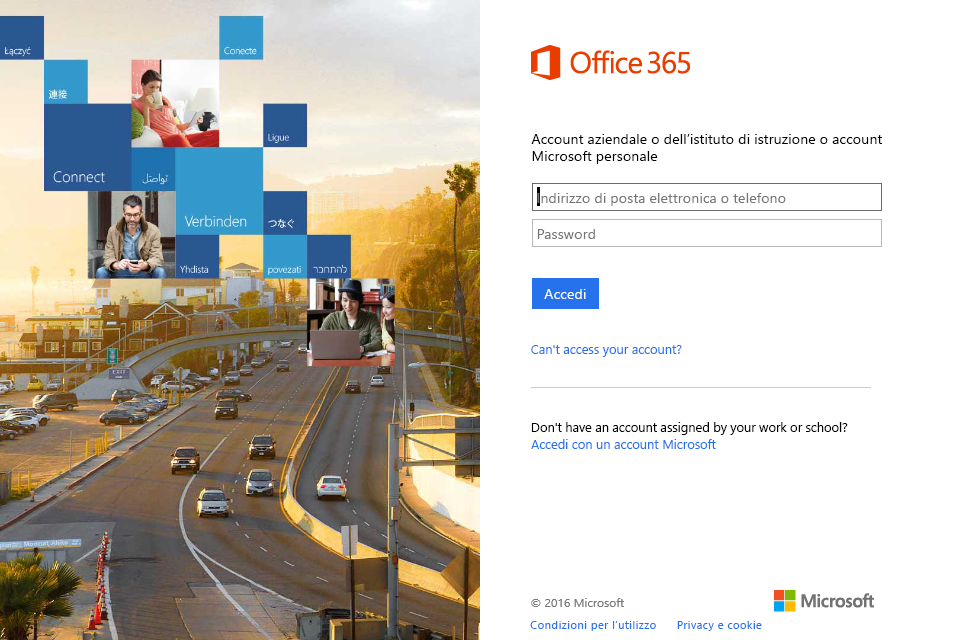

# Connettersi a Windows Dev Center con Power BI
Esplorare e monitorare i dati di analisi delle app di Windows Dev Center in Power BI con il pacchetto di contenuto Power BI. I dati verranno aggiornati automaticamente una volta al giorno.

Connettersi al [pacchetto di contenuto Windows Dev Center](https://app.powerbi.com/getdata/services/devcenter) per Power BI.

## Come connettersi
1. Selezionare **Recupera dati** nella parte inferiore del riquadro di spostamento sinistro.
   
   
2. Nella casella **Servizi** selezionare **Recupera**.
   
   
3. Selezionare **Windows Dev Center** \>  **Recupera**.
   
   
4. Immettere l'ID applicazione di una delle proprie app e fare clic su Avanti. Per informazioni dettagliate su come [trovare questi parametri](#FindingParams), vedere più avanti.
   
   
5. In **Metodo di autenticazione** selezionare **oAuth2** \> **Accedi**. Quando richiesto, immettere le credenziali di Azure Active Directory associate all'account di Windows Dev Center. Per altre informazioni, vedere [Requisiti di sistema](#Requirements).
   
    
   
    
6. Dopo l'approvazione, il processo di importazione inizierà automaticamente. Al termine nel riquadro di spostamento verranno visualizzati un nuovo dashboard, un nuovo report e un nuovo set di dati. Selezionare il dashboard per visualizzare i dati importati e scegliere un riquadro per passare ai report sottostanti.
   
    
   
    

**Altre operazioni**

* Provare a [porre una domanda nella casella Domande e risposte](power-bi-q-and-a.md) nella parte superiore del dashboard
* [Cambiare i riquadri](service-dashboard-edit-tile.md) nel dashboard.
* [Selezionare un riquadro](service-dashboard-tiles.md) per aprire il report sottostante.
* Anche se la pianificazione prevede che il set di dati venga aggiornato quotidianamente, è possibile modificare la frequenza di aggiornamento o provare ad aggiornarlo su richiesta usando **Aggiorna ora**

## Cosa è incluso
Il pacchetto di contenuto Dev Center Power BI include dati di analisi per l'app e le acquisizioni IAP, le classificazioni, le revisioni e l'integrità dell'applicazione. I dati sono limitati agli ultimi 3 mesi. Questo intervallo è una finestra mobile e quindi le date incluse vengono aggiornate quando viene aggiornato il set di dati.

## Requisiti di sistema
Questo pacchetto di contenuto richiede almeno un'app pubblicata in Windows Store e un account di Windows Dev Center. Per altre informazioni, vedere [qui](https://msdn.microsoft.com/windows/uwp/publish/manage-account-users).

## Individuazione dei parametri
È possibile trovare l'ID applicazione per un'app visitando la relativa pagina di identità nella gestione delle app.

L'ID applicazione si trova alla fine dell'URL di Windows 10 Store, https://www.microsoft.com/store/apps/ **{IDapplicazione}**

## Passaggi successivi
[Introduzione a Power BI](service-get-started.md)

[Recuperare dati in Power BI](service-get-data.md)

