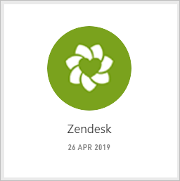
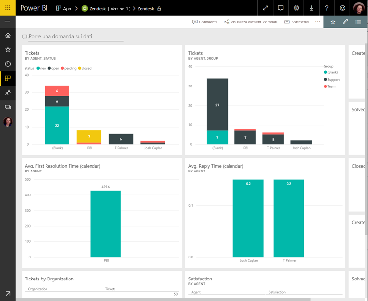
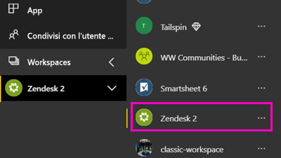
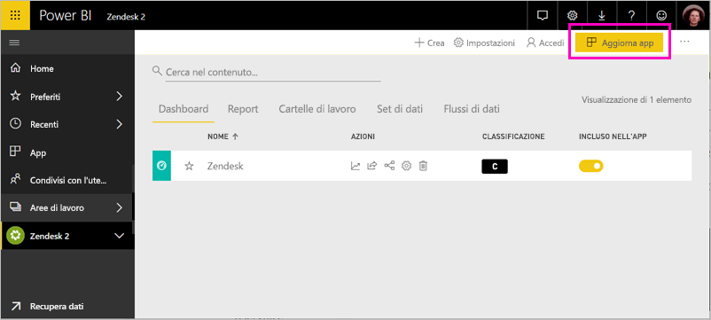

# Connettersi a Zendesk con Power BI

Questo articolo illustra il pull dei dati dall'account Zendesk con un'app di modello di Power BI. L'app Zendesk offre un dashboard di Power BI e un set di report di Power BI che forniscono informazioni dettagliate sul numero di ticket e sulle prestazioni degli agenti. I dati vengono aggiornati automaticamente una volta al giorno. 

Dopo aver installato l'app per il modello, è possibile personalizzare il dashboard e report per evidenziare le informazioni più importanti. Quindi è possibile distribuirla come app per i colleghi all'interno dell'organizzazione.

Connettersi al [pacchetto di contenuto Zendesk](https://app.powerbi.com/getdata/services/zendesk) oppure leggere altre informazioni sull'[integrazione di Zendesk](https://powerbi.microsoft.com/integrations/zendesk) con Power BI.

Dopo aver installato l'app per il modello, è possibile modificare il dashboard e report. Quindi è possibile distribuirla come app per i colleghi all'interno dell'organizzazione.

>[!NOTE]
>È necessario un account Zendesk Admin per la connessione. Altre informazioni sui [requisiti](#system-requirements) sono disponibili più avanti.

## Come connettersi

[!INCLUDE [powerbi-service-apps-get-more-apps](./includes/powerbi-service-apps-get-more-apps.md)]

3. Selezionare **Zendesk** \> **Scarica adesso**.
4. Nelle **installare questa App di Power BI?** selezionate **installare**.
4. Nel **Apps** riquadro, selezionare la **Zendesk** riquadro.

    

6. Nelle **iniziare con la nuova app**, selezionare **connettere dati**.

    

4. Specificare l'URL associato all'account. L'URL ha il formato **https://company.zendesk.com** . Per informazioni dettagliate su [come trovare questi parametri](#finding-parameters), vedere più avanti.
   
   

5. Quando richiesto, immettere le credenziali di Zendesk.  Selezionare **oAuth 2** come meccanismo di autenticazione e fare clic su **Accedi**. Seguire il flusso di autenticazione di Zendesk. (Se è già connessi a Zendesk nel browser, potrebbero non essere richieste le credenziali.)
   
   > [!NOTE]
   > Questo pacchetto di contenuto richiede la connessione con un account Zendesk Admin. 
   > 
   
   
6. Fare clic su **Consenti** per consentire a Power BI di accedere ai dati Zendesk.
   
   
7. Fare clic su **Connetti** per avviare il processo di importazione. 
8. Dopo che Power BI Importa i dati, viene visualizzato l'elenco del contenuto per l'app Zendesk: un nuovo dashboard, report e set di dati.
9. Selezionare il dashboard per avviare il processo di esplorazione.

    
   
## Modificare e distribuire l'app

È stata installata l'app di modello di Zendesk. Ciò significa che è inoltre stata creata l'area di lavoro di app Zendesk. Nell'area di lavoro, è possibile modificare il report e dashboard e quindi distribuirlo come una *app* ai colleghi all'interno dell'organizzazione. 

1. Per visualizzare tutto il contenuto dell'area di lavoro nuovo Zendesk, nella barra di spostamento a sinistra, selezionare **aree di lavoro** > **Zendesk**. 

    

    Questa vista è l'elenco di contenuto per l'area di lavoro. Nell'angolo superiore destro, vedrai **Aggiorna app**. Quando si è pronti per distribuire l'app con i colleghi, ovvero si apprenderà come iniziare. 

    

2. Selezionare **Reports** e **i set di dati** per visualizzare gli altri elementi nell'area di lavoro.

    Conoscenza [distribuzione di app](service-create-distribute-apps.md) ai colleghi.

## Requisiti di sistema
Per accedere al pacchetto di contenuto Zendesk, è necessario un account amministratore di Zendesk. Se si ha un agente o un utente finale e si è interessati a visualizzare i dati di Zendesk, aggiungere un suggerimento ed esaminare il connettore di Zendesk nel [Power BI Desktop](desktop-connect-to-data.md).

## Individuazione dei parametri
L'URL di Zendesk corrisponderà a quello usato per accedere all'account Zendesk. Se non si è certi di quale sia l'URL di Zendesk, è possibile vedere la [Guida di accesso](https://www.zendesk.com/login/) di Zendesk.

## Risoluzione dei problemi
Se si verificano problemi di connessione, verificare l'URL di Zendesk e confermare che si sta usando un account amministratore Zendesk.

## Passaggi successivi

* [Creare le nuove aree di lavoro in Power BI](service-create-the-new-workspaces.md)
* [Installare e usare app in Power BI](consumer/end-user-apps.md)
* [Connettersi all'app di Power BI per servizi esterni](service-connect-to-services.md)
* Domande? [Provare a rivolgersi alla community di Power BI](http://community.powerbi.com/)

