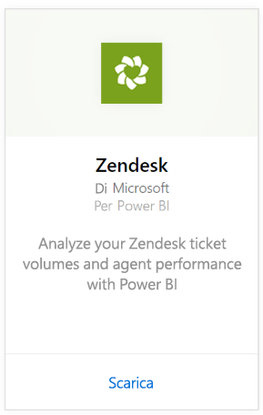
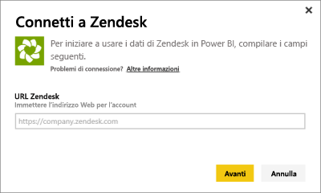
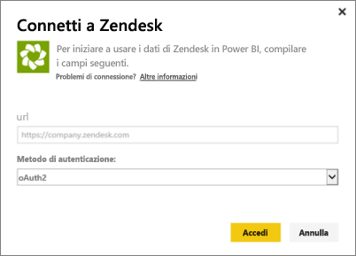
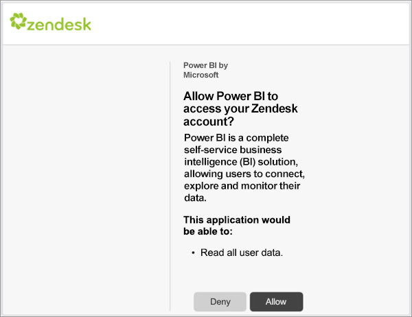

# Connettersi a Zendesk con Power BI
Il pacchetto di contenuto Zendesk offre un dashboard di Power BI e un set di report di Power BI che forniscono informazioni dettagliate sul numero di ticket e sulle prestazioni degli agenti. È possibile usare il dashboard e i report forniti oppure personalizzarli per evidenziare le informazioni a cui si è maggiormente interessati.  I dati verranno aggiornati automaticamente una volta al giorno. 

Connettersi al [pacchetto di contenuto Zendesk](https://app.powerbi.com/getdata/services/zendesk) oppure leggere altre informazioni sull'[integrazione di Zendesk](https://powerbi.microsoft.com/integrations/zendesk) con Power BI.

>[!NOTE]
>Per la connessione, è necessario un account amministratore di Zendesk. Altre informazioni sui [requisiti](#Requirements) sono disponibili più avanti.

## Come connettersi
1. Selezionare **Recupera dati** nella parte inferiore del riquadro di spostamento sinistro.
   
   
2. Nella casella **Servizi** selezionare **Recupera**.
   
    
3. Selezionare **Zendesk** \> **Recupera**.
   
   
4. Specificare l'URL associato all'account. Il formato dell'URL sarà **https://company.zendesk.com**. Per informazioni dettagliate sull'[individuazione dei parametri](#FindingParams), vedere più avanti.
   
   
5. Quando richiesto, immettere le credenziali di Zendesk.  Selezionare **oAuth 2** come meccanismo di autenticazione e fare clic su **Accedi**. Seguire il flusso di autenticazione di Zendesk. Se è già stato effettuato l'accesso a Zendesk nel browser, le credenziali potrebbero non essere richieste.
   
   > [!NOTE]
   > Questo pacchetto di contenuto richiede la connessione a un account amministratore Zendesk. 
   > 
   > 
   
   
6. Fare clic su **Consenti** per consentire a Power BI di accedere ai dati Zendesk.
   
   
7. Fare clic su **Connetti** per avviare il processo di importazione. Dopo l'importazione dei dati in Power BI, nel riquadro di spostamento sinistro vengono visualizzati il nuovo dashboard, il nuovo report e il nuovo set di dati. I nuovi elementi sono contrassegnati con un asterisco giallo \*.
   
   

**Altre operazioni**

* Provare a [porre una domanda nella casella Domande e risposte](consumer/end-user-q-and-a.md) nella parte superiore del dashboard
* [Cambiare i riquadri](service-dashboard-edit-tile.md) nel dashboard.
* [Selezionare un riquadro](consumer/end-user-tiles.md) per aprire il report sottostante.
* Anche se la pianificazione prevede che il set di dati venga aggiornato quotidianamente, è possibile modificarne la frequenza di aggiornamento o provare ad aggiornarlo su richiesta usando **Aggiorna ora**

## Cosa è incluso
Il pacchetto di contenuto di Power BI include i dati relativi a:  

* Utenti (utenti finali e agenti)  
* Organizzazioni  
* Gruppi  
* Ticket  

Sono anche disponibili diverse misure calcolate, ad esempio per quanto riguarda il tempo medio di attesa e il numero di ticket risolti negli ultimi 7 giorni. Nel pacchetto di contenuto è incluso un elenco completo.

## Requisiti di sistema
Per accedere al pacchetto di contenuto Zendesk, è necessario un account amministratore di Zendesk. Gli agenti o gli utenti finali interessati a visualizzare i dati di Zendesk possono aggiungere un suggerimento ed esaminare il connettore di Zendesk in [Power BI Desktop](desktop-connect-to-data.md).

## Individuazione dei parametri
L'URL di Zendesk corrisponderà a quello usato per accedere all'account Zendesk. Se non si è certi di quale sia l'URL di Zendesk, è possibile vedere la [Guida di accesso](https://www.zendesk.com/login/) di Zendesk.

## Risoluzione dei problemi
In caso di problemi di connessione, verificare l'URL di Zendesk e assicurarsi che si stia usando un account amministratore di Zendesk.

## Passaggi successivi
* [Che cos'è Power BI?](power-bi-overview.md)
* [Recuperare i dati](service-get-data.md)

