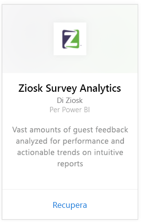

# Connettersi a Ziosk Survey Analytics con Power BI
Il pacchetto di contenuto Ziosk Survey Analytics per Power BI offre ai ristoranti con tablet Ziosk un accesso senza confronti ai dati di analisi forniti da Ziosk, tra cui la segmentazione in base a giorno, luogo, dipendente e altro.

Connettersi al [pacchetto di contenuto Ziosk Survey Analytics](https://app.powerbi.com/getdata/services/ziosk-survey-analytics) per Power BI.

## Come connettersi
1. Selezionare **Recupera dati** nella parte inferiore del riquadro di spostamento sinistro.  
   
    
2. Nella casella **Servizi** selezionare **Recupera**.  
   
    
3. Selezionare **Ziosk Survey Analytics** e quindi **Recupera**.  
   
    
4. Selezionare **OAuth 2**, quindi **Accedi**. Quando richiesto, fornire le credenziali di Ziosk.
   
    
   
    
5. Dopo la connessione vengono caricati automaticamente un dashboard, un report e un set di dati. Al termine, i riquadri vengono aggiornati con i dati dell'account Ziosk.
   
    

**Altre operazioni**

* Provare a [porre una domanda nella casella Domande e risposte](consumer/end-user-q-and-a.md) nella parte superiore del dashboard
* [Cambiare i riquadri](service-dashboard-edit-tile.md) nel dashboard.
* [Selezionare un riquadro](consumer/end-user-tiles.md) per aprire il report sottostante.
* Anche se la pianificazione prevede che il set di dati venga aggiornato quotidianamente, è possibile modificarne la frequenza di aggiornamento o provare ad aggiornarlo su richiesta usando **Aggiorna ora**

## Cosa è incluso
Il pacchetto di contenuto include i dati delle tabelle seguenti:  

    - Alcohol Category  
    - Appetizer Category  
    - CommentKeywords  
    - Data  
    - Daypart  
    - Dessert Category  
    - FreeForm  
    - Kids Category  
    - Messages  
    - Premium Content Category  
    - Question  
    - Store  
    - Surveys  
    - Weekday  

## Requisiti di sistema
È necessario un account Ziosk con le autorizzazioni per le tabelle precedenti per creare un'istanza di questo pacchetto di contenuto.

## Passaggi successivi
[Che cos'è Power BI?](power-bi-overview.md)

[Power BI - Concetti di base](consumer/end-user-basic-concepts.md)

