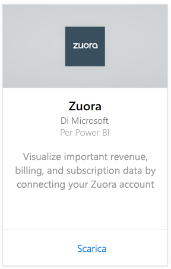
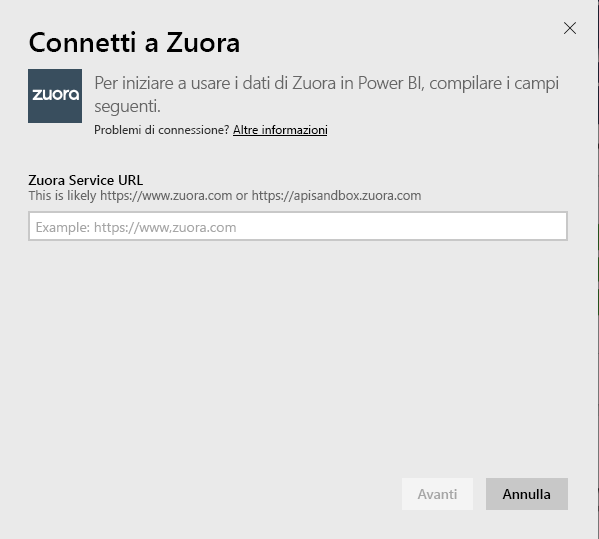
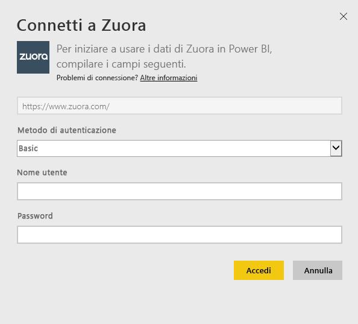
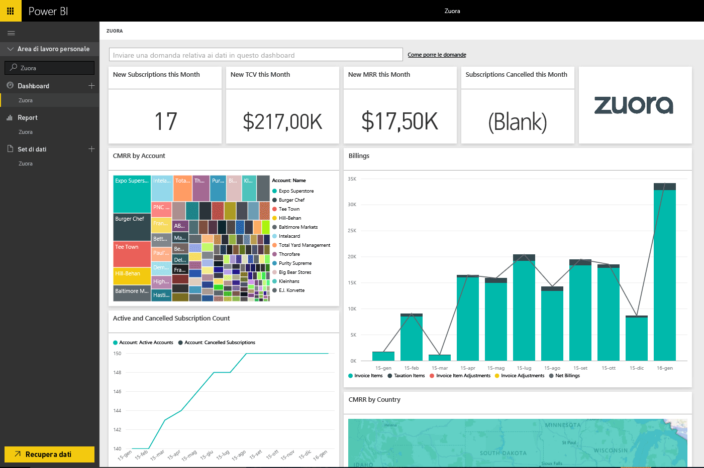

# Connettersi a Zuora con Power BI
Zuora per Power BI consente di visualizzare dati importanti relativi a ricavi, fatturazione e sottoscrizioni. È possibile usare il dashboard e i report predefiniti per analizzare le tendenze di utilizzo, tenere traccia di fatture e pagamenti e monitorare i ricavi ricorrenti oppure personalizzare dashboard e report in base alle esigenze specifiche.

Connettersi a [Zuora](https://app.powerbi.com/getdata/services/Zuora) per Power BI.

## Come connettersi
1. Selezionare **Recupera dati** nella parte inferiore del riquadro di spostamento sinistro.

   
2. Nella casella **Servizi** selezionare **Recupera**.

   
3. Selezionare **Zuora** \> **Recupera**.

   
4. Specificare l'URL di Zuora. Il percorso è solitamente "https://www.zuora.com". Per informazioni dettagliate sulla [ricerca dei parametri](#FindingParams), vedere più avanti.

   
5. In **Metodo di autenticazione**selezionare **Di base** e fornire il nome utente e la password (distinzione tra maiuscole e minuscole), quindi selezionare **Accedi**.

    
6. Dopo l'approvazione, il processo di importazione inizierà automaticamente. Al termine nel riquadro di spostamento verranno visualizzati un nuovo dashboard, un nuovo report e un nuovo set di dati. Selezionare il dashboard per visualizzare i dati importati.

     

**Altre operazioni**

* Provare a [porre una domanda nella casella Domande e risposte](power-bi-q-and-a.md) nella parte superiore del dashboard
* [Cambiare i riquadri](service-dashboard-edit-tile.md) nel dashboard.
* [Selezionare un riquadro](service-dashboard-tiles.md) per aprire il report sottostante.
* Anche se la pianificazione prevede che il set di dati venga aggiornato quotidianamente, è possibile modificare la frequenza di aggiornamento o provare ad aggiornarlo su richiesta usando **Aggiorna ora**

## Cosa è incluso
Il pacchetto di contenuto usa l'API di Zuora AQUA per recuperare le tabelle seguenti:

| Tabelle |  |  |
| --- | --- | --- |
| Account |InvoiceItemAdjustment |Refund |
| AccountingCode |Payment |RevenueSchedule |
| AccountingPeriod |PaymentMethod |RevenueScheduleItem |
| BillTo |Product |Subscription |
| DateDim |ProductRatePlan |TaxationItem |
| Invoice |ProductRatePlanCharge |Usage |
| InvoiceAdjustment |RatePlan | |
| InvoiceItem |RatePlanCharge | |

It also includes these calculated measures:

| Misura | Descrizione | Pseudo-calcolo |
| --- | --- | --- |
| Account: Payments |Importo totale dei pagamenti in un periodo di tempo, in base alla data effettiva del pagamento. |SUM (Payment.Amount)  WHERE Payment.EffectiveDate =< TimePeriod.EndDate AND    Payment.EffectiveDate >= TimePeriod.StartDate |
| Account: Refunds |Importo totale dei rimborsi in un periodo di tempo, in base alla data del rimborso. L'importo viene riportato come numero negativo. |-1*SUM(Refund.Amount) WHERE Refund.RefundDate =< TimePeriod.EndDate AND    Refund.RefundDate >= TimePeriod.StartDate |
| Account: Net Payments |Somma dei pagamenti e dei rimborsi degli account in periodo di tempo. |Account.Payments + Account.Refunds |
| Account: Active Accounts |Numero di account attivi in un periodo di tempo. Le sottoscrizioni devono essere iniziate prima (o in corrispondenza) della data iniziale del periodo di tempo. |COUNT (Account.AccountNumber) WHERE     Subscription.Status != "Expired" AND    Subscription.Status != "Draft" AND    Subscription.SubscriptionStartDate <= TimePeriod.StartDate AND    (Subscription.SubscriptionEndDate > TimePeriod.StartDate OR Subscription.SubscriptionEndDate = null) –evergreen subscription |
| Account: Average Recurring Revenue |MRR lordo per account attivo in un periodo di tempo. |Gross MRR / Account.ActiveAccounts |
| Account: Cancelled Subscriptions |Numero di account che hanno annullato una sottoscrizione in un periodo di tempo. |COUNT (Account.AccountNumber) WHERE Subscription.Status = "Cancelled" AND    Subscription.SubscriptionStartDate <= TimePeriod.StartDate AND    Subscription.CancelledDate >= TimePeriod.StartDate |
| Account: Payment Errors |Valore totale degli errori di pagamento. |SUM (Payment.Amount) WHERE Payment.Status = "Error" |
| Revenue Schedule Item: Recognized Revenue |Fatturato riconosciuto totale in un periodo contabile. |SUM (RevenueScheduleItem.Amount) WHERE AccountingPeriod.StartDate = TimePeriod.StartDate |
| Subscription: New Subscriptions |Numero di nuove sottoscrizioni in un periodo di tempo. |COUNT (Subscription.ID) WHERE Subscription.Version = "1" AND    Subscription.CreatedDate <= TimePeriod.EndDate AND    Subscription.CreatedDate >= TimePeriod.StartDate |
| Invoice: Invoice Items |Importi totali addebiti per voci fattura in un periodo di tempo. |SUM (InvoiceItem.ChargeAmount) WHERE     Invoice.Status = "Posted" AND    Invoice.InvoiceDate <= TimePeriod.EndDate AND    Invoice.InvoiceDate >= TimePeriod.StartDate |
| Invoice: Taxation Items |Importi totali imposte per voci di imposta in un periodo di tempo. |SUM (TaxationItem.TaxAmount) WHERE Invoice.Status = "Posted" AND    Invoice.InvoiceDate <= TimePeriod.EndDate AND    Invoice.InvoiceDate >= TimePeriod.StartDate |
| Invoice: Invoice Item Adjustments |Importi totali rettifiche di voci fattura in un periodo di tempo. |SUM (InvoiceItemAdjustment.Amount)  WHERE     Invoice.Status = "Posted" AND    InvoiceItemAdjustment.AdjustmentDate <= TimePeriod.EndDate AND    InvoiceItemAdjustment.AdjustmentDate >= TimePeriod.StartDate |
| Invoice: Invoice Adjustments |Importi totali rettifiche di fatture in un periodo di tempo. |SUM (InvoiceAdjustment.Amount)  WHERE     Invoice.Status = "Posted" AND    InvoiceAdjustment.AdjustmentDate <= TimePeriod.EndDate AND    InvoiceAdjustment.AdjustmentDate >= TimePeriod.StartDate |
| Invoice: Net Billings |Somma di voci fattura, voci di imposta, rettifiche di voci fattura e rettifiche di fatture in un periodo di tempo. |Invoice.InvoiceItems + Invoice.TaxationItems + Invoice.InvoiceItemAdjustments + Invoice.InvoiceAdjustments |
| Invoice: Invoice Aging Balance |Somma dei saldi delle fatture registrate. |SUM (Invoice.Balance)  WHERE     Invoice.Status = "Posted" |
| Invoice: Gross Billings |Somma degli importi di addebito per le voci delle fatture registrate in un periodo di tempo. |SUM (InvoiceItem.ChargeAmount)  WHERE     Invoice.Status = "Posted" AND    Invoice.InvoiceDate <= TimePeriod.EndDate AND    Invoice.InvoiceDate >= TimePeriod.StartDate |
| Invoice: Total Adjustments |Somma delle rettifiche di fatture e delle rettifiche di voci di fattura elaborate associate alle fatture registrate. |SUM (InvoiceAdjustment.Amount)  WHERE     Invoice.Status = "Posted" AND    InvoiceAdjustment.Status = "Processed" + SUM (InvoiceItemAdjustment.Amount)  WHERE     Invoice.Status = "Posted" AND    invoiceItemAdjustment.Status = "Processed" |
| Rate Plan Charge: Gross MRR |Somma dei ricavi periodici mensili da sottoscrizioni in un periodo di tempo. |SUM (RatePlanCharge.MRR)  WHERE     Subscription.Status != "Expired" AND    Subscription.Status != "Draft" AND    RatePlanCharge.EffectiveStartDate <= TimePeriod.StartDate AND        RatePlanCharge.EffectiveEndDate > TimePeriod.StartDate     OR    RatePlanCharge.EffectiveEndDate = null --evergreen subscription |

## Requisiti di sistema
È necessario l'accesso all'API Zuora.

## Individuazione dei parametri
Fornire l'URL usato in genere per accedere ai dati di Zuora. Le opzioni valide sono:  

* https://www.zuora.com  
* https://www.apisandbox.zuora.com  
* URL corrispondente all'istanza del servizio  

## Risoluzione dei problemi
Il pacchetto di contenuto Zuora effettua il pull di numerosi elementi dell'account Zuora. Se non si usano determinate funzionalità, i riquadri o i report corrispondenti potrebbero apparire vuoti. Se si verificano problemi di caricamento, contattare il supporto di Power BI.

## Passaggi successivi
[Introduzione a Power BI](service-get-started.md)

[Recuperare dati in Power BI](service-get-data.md)
