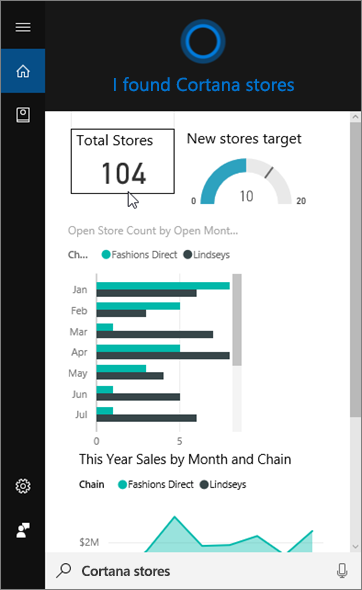
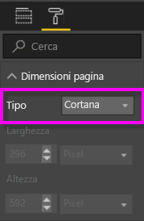
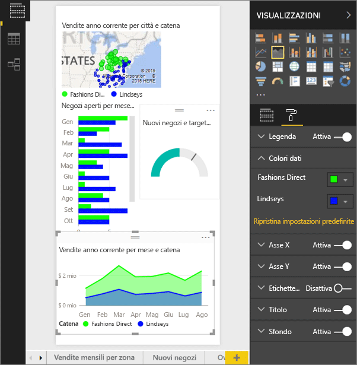
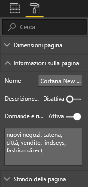
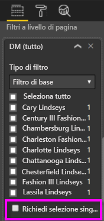

# Usare il servizio Power BI o Power BI Desktop per creare una pagina di risposte personalizzata per Cortana
Usare le funzionalità complete di Power BI per creare speciali pagine di report, dette *pagine di risposte di Cortana* o *schede risposte di Cortana*, progettate specificamente per rispondere alle domande di Cortana.

> [!IMPORTANT]
> Se si sta provando la versione di anteprima del **dashboard** di Cortana e Power BI, è possibile ignorare il resto dell'articolo. Non sono previsti requisiti di installazione per consentire a Cortana di cercare i dashboard di Power BI.
> 
> 

## Prima di iniziare
Sono disponibili quattro documenti che illustrano la configurazione e l'uso di Cortana per Power BI. Se non è già stato fatto, leggere prima di tutto l'articolo uno. L'articolo due è particolarmente importante perché illustra alcune procedure da eseguire prima di iniziare a usare le pagine di risposte di Cortana.

**Articolo 1**: [Informazioni sull'interazione tra Cortana e Power BI](service-cortana-intro.md)

**Articolo 2**: [per la ricerca di report di Power BI - Abilitare l'integrazione tra Cortana, Power BI e Windows](service-cortana-enable.md)

**Articolo 3**: questo articolo

**Articolo 4**: [Risolvere i problemi](service-cortana-troubleshoot.md)

## Creare una pagina di risposte progettata specificamente per Cortana
Una *pagina di risposte* in un report viene ridimensionata appositamente per Cortana, in modo che Cortana possa visualizzarla su schermo come risposta a una domanda. Per creare una pagina di risposte per Cortana:

1. È consigliabile iniziare con una pagina del report vuota.
2. Nel riquadro **Visualizzazioni** selezionare l'icona del rullo e scegliere **Dimensioni pagina** > **Tipo** > **Cortana**.
   
    
3. Creare un elemento visivo o un set di elementi visivi che si desidera visualizzare in Cortana in risposta a una domanda particolare (o set di domande).

> [!NOTE]
> Attualmente le pagine di risposta di Cortana non supportano le immagini con immagini statiche. È possibile inserire immagini negli oggetti visivi di tabelle o matrici di cui è stato eseguito dinamicamente il pull in base a un URL nei dati. 
> 
> 

4. Assicurarsi che tutti gli elementi visivi rientrino nei bordi della pagina. Facoltativamente, modificare le impostazioni di visualizzazione, le etichette dei dati, i colori e gli sfondi.  
   
    
5. Denominare la pagina e aggiungere nomi alternativi. Cortana utilizza questi nomi durante la ricerca dei risultati. Nel riquadro **Visualizzazioni** selezionare l'icona del pennello e scegliere **Informazioni sulla pagina**. Abilitare le Domande e risposte per questo oggetto visivo spostando il dispositivo di scorrimento su **Sì**.
   
    
   
   > [!TIP]
   > Per migliorare i risultati, evitare di usare parole che sono anche nomi di colonna.
   > 
   > 
6. Facoltativamente, se il report include filtri a livello di pagina, è consigliabile impostare **Richiedi selezione singola**. Cortana visualizzerà solo questo report come risposta se uno, e solo uno, degli elementi del filtro è specificato nella domanda. L'opzione **Richiedi selezione singola** è disponibile nella parte inferiore del riquadro **Filtri**.
   
   > [!NOTE]
   > Non è necessario impostare l'opzione **Richiedi selezione singola** per chiedere a Cortana di visualizzare un report con i filtri a livello di pagina. Ad esempio la richiesta "Mostra le vendite di Charlotte Lindseys" mostrerà una pagina di risposta indipendentemente dallo stato dell'impostazione Richiedi selezione singola.
   > 
   > 
   
     
   
      Ad esempio, se si chiede a Cortana:
   
   * "show sales by store name", questa pagina di risposte non viene visualizzata perché gli elementi non sono inclusi nel filtro richiesto a livello di pagina.
   * "show sales for Cary Lindseys and Charlotte Lindseys", questa pagina di risposte non viene visualizzata poiché è stato specificato più di un elemento dal filtro richiesto di livello di pagina.
   * "show sales for Charlotte Lindseys", questa pagina di risposte viene visualizzata.
     
     = "show sales", questa pagina di risposte non viene visualizzata perché gli elementi non sono inclusi nel filtro richiesto a livello di pagina.

> [!IMPORTANT]
> Prima che Cortana possa accedere alla pagina di risposte sarà necessario [Abilitare il set di dati per Cortana](service-cortana-enable.md).
> 
> 

## Metodo per l’ordine dei risultati di Cortana
I risultati con risposte ad alto punteggio (ad esempio, una corrispondenza completa di un nome di una pagina specificata) vengono visualizzati per primi come *migliore corrispondenza* in Cortana. Se sono presenti più pagine di risposte di Cortana in Power BI, possono essere visualizzate più corrispondenze migliori. Le risposte con punteggio medio o basso, ad esempio le risposte non basate sul nome di una pagina di risposte o una domanda con parole non riconosciute da Power BI, sono elencate come collegamenti e riportate di seguito alle corrispondenze migliori in Cortana.

> [!NOTE]
> Quando un nuovo set di dati o una pagina di risposte personalizzata di Cortana vengono aggiunti a Power BI e attivati per Cortana possono essere necessari fino a 30 minuti perché i risultati compaiano in Cortana. Accedere e uscire da Windows 10, o riavviare il processo di Cortana in Windows 10, per visualizzare immediatamente il nuovo contenuto.
> 
> 

## Passaggi successivi
[Utilizzo di Cortana con Power BI](service-cortana-intro.md)

Non si riesce comunque a usare Cortana con Power BI?  Provare i suggerimenti per la [risoluzione dei problemi di Cortana](service-cortana-troubleshoot.md).

Altre domande? [Provare la community di Power BI](http://community.powerbi.com/)

