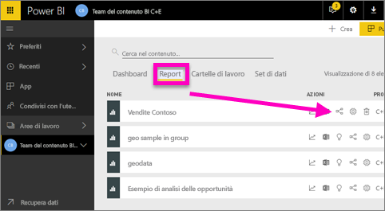
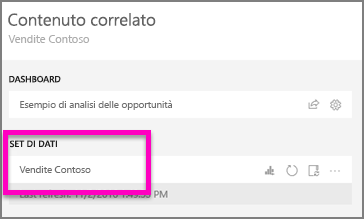
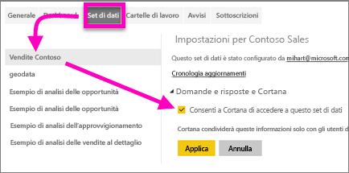
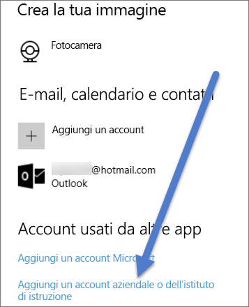

# Abilitare Cortana per l'accesso ai report di Power BI e ai rispettivi set di dati sottostanti
Si è letto l'argomento [Introduzione a Cortana per Power BI](service-cortana-intro.md) (in caso contrario, è preferibile leggerlo prima di procedere). Ora si è pronti per provare in autonomia.  Prima di porre domande in linguaggio naturale in Cortana e trovare le risposte dai dati archiviati nei ***report*** di Power BI, è necessario che siano soddisfatti alcuni requisiti. In particolare, sono necessari gli elementi seguenti.

> [!NOTE]
> Se si sta provando la versione di anteprima del ***dashboard*** di Cortana e Power BI, è possibile ignorare il resto dell'articolo. Non sono previsti requisiti di installazione per consentire a Cortana di cercare i dashboard di Power BI.
> 
> 

Nel servizio Power BI

* Abilitare uno o più set di dati per Cortana. I report sono basati sui set di dati, quindi è necessario concedere a Cortana l'accesso a tali set di dati

In Microsoft Windows

* Verificare che sia in esecuzione Windows 10 versione 1511 o versioni successive
* Assicurarsi che Power BI e Windows possano "comunicare". A questo scopo è necessario connettere il proprio account a Windows.

## Usare il servizio Power BI per abilitare l'accesso di Cortana alle pagine dei report in Power BI
L'abilitazione dei report in Power BI per l'accesso da parte di Cortana è un processo semplice.  È sufficiente abilitare il set di dati sottostante del report selezionando "Consenti a Cortana di accedere a questo set di dati". A quel punto, tutti gli utenti che hanno accesso al set di dati in Power BI, tramite le normali funzionalità di Power BI per condivisione, app e pacchetti di contenuto, potranno ottenere risposte dal report in Cortana in Windows 10.

È necessario eseguire di nuovo l'accesso al servizio Power BI e ripetere questi passaggi per ogni set di dati a cui si vuole che Cortana acceda.

1. Determinare quali set di dati abilitare. Dall'elenco del contenuto del report selezionare il report a cui si vuole che Cortana possa accedere e quindi scegliere l'icona **Visualizza elementi correlati**  .
   
    
2. Il set di dati associato a questo report è **Contoso Sales**.
   
    
3. A destra del nome del set di dati selezionare i **puntini di sospensione (...) > Impostazioni**.  
   
    
4. Selezionare **Domande e risposte e Cortana** > **Consenti a Cortana di accedere a questo set di dati** > **Applica**.
   
   
   
   In questo esempio, si abilita Cortana per il set di dati Contoso Sales.
   
   > [!NOTE]
   > Quando si aggiunge a Power BI e si abilita per Cortana un nuovo set di dati o una scheda di risposta di Cortana, possono essere necessari fino a 30 minuti perché i risultati compaiano. Accedere ed uscire da Windows 10, o riavviare il processo di Cortana in Windows 10, permetterà di visualizzare immediatamente il nuovo contenuto.
   > 
   > Se si abilita per Cortana un set di dati che fa parte di un pacchetto di contenuto o di un'app di proprietà, sarà necessario ripubblicarlo perché anche i colleghi possano usarlo con Cortana.
   > 
   > 

## Aggiungere le proprie credenziali di Power BI a Windows
È necessario che sia in esecuzione Windows 10 versione 1511 o versioni successive.

1. Determinare quale versione di Windows 10 è in esecuzione. Aprire **Impostazioni**.
    

    Selezionare quindi **Sistema > Informazioni**. Nella parte inferiore dello schermo verrà visualizzato **Specifiche Windows > Versione**

   * Se si ha una versione di Windows 10 compresa tra la 1511 (aggiornamento di Windows 10 di novembre 2015) e la 1607, aggiungere l'account aziendale o dell'istituto di istruzione e l'account Microsoft (completare i passaggi 2 e 3 riportati sotto).
   * Se si ha Windows 10 versione 1607 (aggiornamento di Windows 10 di luglio 2016) o versioni successive, aggiungere l'account aziendale o dell'istituto di istruzione (completare solo il passaggio 2 riportato sotto).
1. Aggiungere l'account aziendale o dell'istituto di istruzione per Cortana.
   
   * Aprire **Impostazioni** > **Account**.
     
       
   * Scorrere fino alla fine e selezionare **Aggiungi un account aziendale o dell'istituto di istruzione**. In alternativa, dalla pagina **Account** selezionare **Accedi all'azienda o all'istituto di istruzione > Connetti**.
     
     

Cortana utilizza l’account aziendale o dell’istituto di istruzione per controllare Power BI per potenziali risposte alle domande in Cortana.

## Passaggi successivi
[Creare le *schede di risposta* di Cortana in Power BI](service-cortana-answer-cards.md)

[Risolvere i problemi di integrazione tra Cortana e Power BI](service-cortana-troubleshoot.md)

Altre domande? [Provare la community di Power BI](http://community.powerbi.com/)

