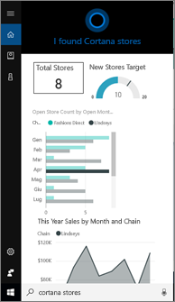
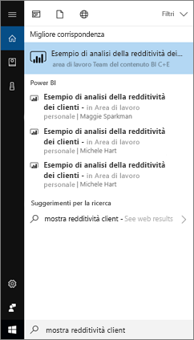
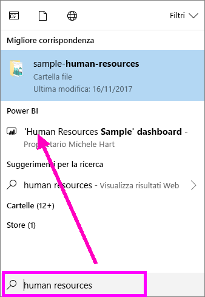
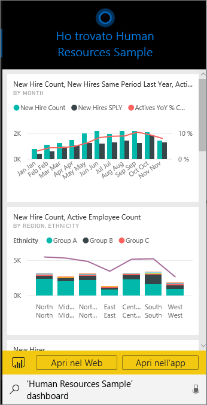
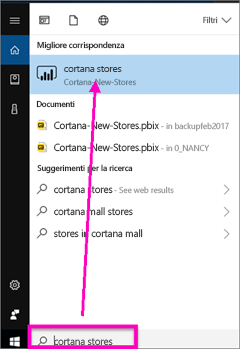
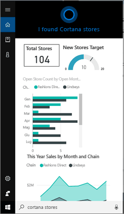
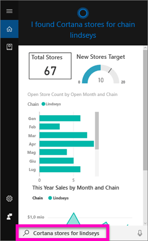
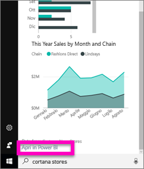
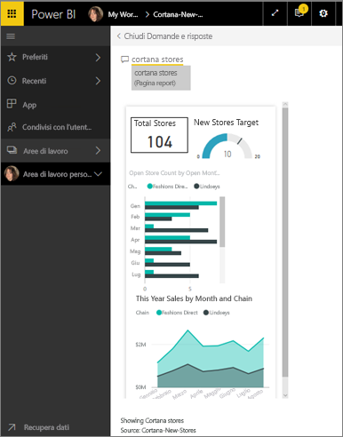

# Trovare e visualizzare rapidamente i dati di Power BI con Cortana per Power BI
Usare Cortana nei dispositivi Windows 10 per ottenere risposte immediate alle domande aziendali più importanti. Grazie all'integrazione con Power BI, Cortana può recuperare informazioni chiave direttamente dai dashboard e dai report di Power BI. È sufficiente avere Windows 10 versione di novembre 2015 o versioni successive, Cortana, Power BI e l'accesso ad almeno un set di dati.

## Anteprima della nuova esperienza di ricerca nel *dashboard* di Cortana per Windows 10
Da qualche tempo è possibile [usare Cortana per recuperare alcuni tipi di pagine di report](service-cortana-answer-cards.md). Ora è disponibile una **nuova esperienza**, ovvero la possibilità di recuperare anche i dashboard. È possibile provarla e [inviare commenti e suggerimenti](mailto:pbicortanasg@microsoft.com). La *nuova esperienza* verrà estesa in modo da includere anche la ricerca di report in Cortana.  Uno dei vantaggi principali della nuova esperienza è costituito dal fatto che non sono necessarie operazioni di configurazione particolari: non è necessario abilitare Cortana o configurare Windows 10. L'esperienza è pronta per l'uso.

> [!NOTE]
> In caso di problemi, vedere l'[articolo relativo alla risoluzione dei problemi](service-cortana-troubleshoot.md) per ottenere assistenza.
> 
> 

La tecnologia sottostante usa il [servizio Ricerca di Microsoft Azure](). Questo servizio di ricerca offre funzionalità aggiuntive, ad esempio la classificazione smart, la correzione degli errori e il completamento automatico.

Entrambe le esperienze di Cortana coesisteranno.

## Documentazione di Cortana per Power BI
Sono disponibili quattro documenti che illustrano la configurazione e l'uso di Cortana per Power BI. Questa serie di articoli illustra in dettaglio le procedure per

**Articolo 1** (questo articolo): comprendere l'interazione tra Cortana e Power BI

**Articolo 2**: [cercare report di Power BI - Abilitare l'integrazione tra Cortana, Power BI e Windows](service-cortana-enable.md)

**Articolo 3**: [cercare report di Power BI - Creare speciali *schede risposte Cortana*](service-cortana-answer-cards.md)

**Articolo 4**: [Risolvere i problemi](service-cortana-troubleshoot.md)

## Collaborazione di Cortana e Power BI
Quando si usa Cortana per porre una domanda, Power BI può essere uno dei posti in cui Cortana cerca le risposte. In Power BI Cortana può trovare risposte basate sui dati avanzati presenti nei report di Power BI, che contengono un tipo speciale di pagina di report denominata *scheda risposte Cortana*, e dai dashboard di Power BI.

Se Cortana trova una corrispondenza, visualizza il nome del dashboard o della pagina del report direttamente nella schermata di Cortana. È possibile aprire il dashboard o la pagina del report in Power BI. Le pagine del report possono essere esplorate anche direttamente in Cortana, poiché sono interattive.

### Cortana e i dashboard (*nuova esperienza*)
Cortana può trovare risposte nei dashboard di proprietà dell'utente e nei dashboard condivisi con l'utente. È possibile porre domande a Cortana usando titoli, parole chiave, nomi di proprietari, nomi di aree di lavoro, nomi di app e altro ancora.

Per consentire a Cortana di trovare una risposta, è necessario che la domanda includa almeno due parole. Se si cerca in un dashboard il cui nome è costituito da una sola parola (Marketing), aggiungere la parola "show" o "Power BI" o "<owner name>" alla domanda, ad esempio "show Marketing" e "michele hart sample". 

Se il titolo del dashboard include più parole, Cortana restituirà tale dashboard solo se la ricerca corrisponde ad almeno due parole o se il dashboard corrisponde a una delle parole e al nome del proprietario. Per un dashboard denominato "Customer Profitability Sample": 

* "show me customer" *non* restituirà alcun risultato relativo a un dashboard di Power BI.   
* Criteri come "show me customer profitability", "customer p", "customer s", "profitability sample", "michele hart sample", "show customer profitability sample" e "show me customer p" *consentiranno* la restituzione di un risultato di Power BI.
* L'aggiunta della parola "powerbi" viene conteggiata come una delle due parole necessarie, quindi "powerbi sample" *restituirà* un risultato di Power BI. 
  
    

### Cortana e i report
 Cortana può trovare risposte nei report che includono [pagine progettate in modo specifico per la visualizzazione in Cortana](service-cortana-answer-cards.md). È sufficiente porre domande usando il titolo o le parole chiave di una di tali pagine speciali dei report.  

La tecnologia sottostante per i report usa [Domande e risposte di Microsoft Power BI](service-q-and-a.md).

Quando si pone una domanda in Cortana, Power BI risponde da pagine di report progettate in modo specifico per Cortana. Le potenziali risposte vengono determinate da Cortana direttamente dalle *schede di risposta* di Cortana già create in Power BI.  Per esplorare ulteriormente una risposta, è sufficiente aprire un risultato in Power BI.

> [!NOTE]
> Prima che Cortana possa cercare risposte nei report di Power BI, è necessario [abilitare questa funzionalità usando il servizio Power BI e configurare Windows per comunicare con Power BI](service-cortana-enable.md).  
> 
> 

## Uso di Cortana per ottenere risposte da Power BI
1. Avviare Cortana. È possibile *aprire* Cortana in diversi modi: selezionare l'icona di Cortana sulla barra delle applicazioni (illustrata di seguito), usare comandi vocali o toccare l'icona di ricerca nel dispositivo mobile Windows.
   
     
2. Quando Cortana è pronta, digitare o pronunciare la domanda nella barra di ricerca di Cortana. Cortana visualizza i risultati disponibili. Se è presente un dashboard di Power BI che corrisponde alla domanda, viene visualizzato in **Corrispondenza migliore** o **Power BI**.
   
     
   
   > [!NOTE]
   > È attualmente supportata solo la lingua inglese.
   > 
   > 
3. Selezionare il dashboard per aprirlo in Cortana.

    

    È possibile modificare il layout [modificando la *visualizzazione telefono* del dashboard](service-create-dashboard-mobile-phone-view.md). 

1. Da Cortana è anche possibile aprire il dashboard nel servizio Power BI o in Power BI per dispositivi mobili. Aprire il dashboard nel servizio Power BI selezionando **Apri nel Web**. 
   
      
4. È ora possibile usare Cortana per cercare un report. Sarà necessario conoscere un [report che include una pagina con una scheda risposte Cortana](service-cortana-answer-cards.md). In questo esempio un report denominato "Cortana-New-Stores" include una pagina di scheda risposte Cortana denominata "cortana stores".  
   
     Digitare o pronunciare la domanda nella barra di ricerca di Cortana. Cortana visualizza i risultati disponibili. Se è presente una pagina di report di Power BI che corrisponde alla domanda, viene visualizzata in **Corrispondenza migliore** o **Power BI**. In questo esempio, inoltre, il file con estensione pbix (e il backup) usato per creare le schede di risposta viene visualizzato anche in **Documenti**.
   
      
5. Selezionare la pagina di report **Cortana stores** per visualizzarla nella finestra di Cortana.
   
       
   
    Tenere presente che una *scheda di risposta* è un particolare tipo di pagina di report di Power BI creato dal proprietario di un set di dati.  Per altre informazioni, vedere [Creare una scheda di risposta di Cortana](service-cortana-answer-cards.md).
6. Ma non è tutto. Interagire con le visualizzazioni nella scheda di risposta così come si farebbe in Power BI.
   
   * Ad esempio, selezionare un elemento in una visualizzazione per applicare il filtro incrociato ed evidenziare le altre visualizzazioni nella scheda di risposta.
     
     
   * In alternativa, usare il linguaggio naturale per filtrare i risultati.  Ad esempio, chiedere "Cortana stores for Lindseys" e visualizzare la scheda filtrata in modo da mostrare solo i dati relativi alla catena Lindseys.
     
     
7. Continuare a esplorare. Scorrere fino alla parte inferiore della finestra di Cortana e selezionare **Apri in Power BI**.
   
     
8. La pagina del report viene aperta in Power BI.    
     

## Considerazioni e risoluzione dei problemi
* Cortana non avrà accesso alle schede Cortana che non sono state [abilitate per Power BI](service-cortana-enable.md).
* Non si riesce comunque a usare Cortana con Power BI?  Provare i suggerimenti per la [risoluzione dei problemi di Cortana](service-cortana-troubleshoot.md).
* Cortana per Power BI è attualmente disponibile solo in inglese.
* Cortana per Power BI è disponibile solo in dispositivi mobili Windows.

Altre domande? [Provare la community di Power BI](http://community.powerbi.com/)

## Passaggi successivi
[Abilitare l'integrazione di Cortana, Power BI e- Windows per i report](service-cortana-enable.md)

