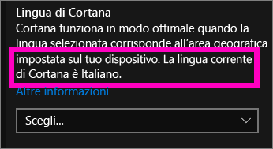
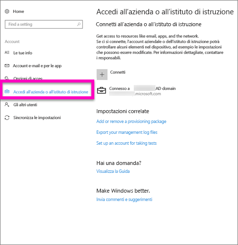
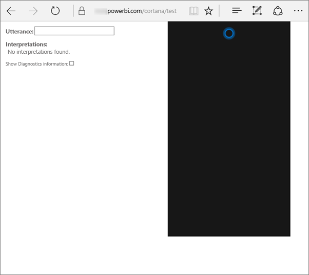
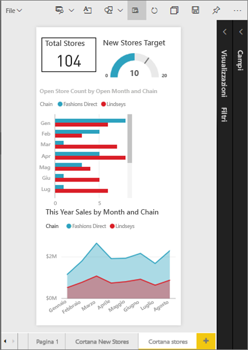
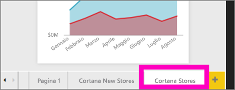
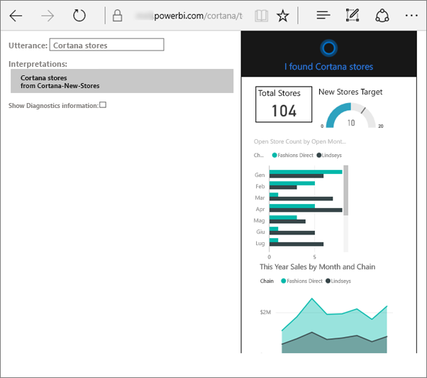
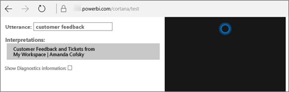

# Risolvere i problemi relativi a Cortana per Power BI
Questo articolo fa parte di una serie. 

> [!IMPORTANT]
> L'integrazione di Cortana verrà deprecata in Power BI. A partire dall'11 giugno, Cortana non funzionerà più per i dashboard e i report.

Se si verificano problemi di integrazione di Cortana con Power BI, leggere questo articolo. Seguire questa procedura per diagnosticare e risolvere il problema.

## Perché Cortana non trova risposte dai report o dashboard di Power BI?
1. Non si ha un account Power BI?  Se la risposta è negativa, [iscriversi per una versione di valutazione gratuita](https://powerbi.microsoft.com/get-started/).
2. Cortana funziona?  L'icona di Cortana è presente sulla barra delle applicazioni?

    

    Quando la si seleziona, Cortana si apre mostrando un campo in cui è possibile digitare testo?
3. Sono state usate almeno due parole nella ricerca? Cortana necessita di frasi di almeno due parole per trovare risposte in Power BI. Provare ad aggiungere "show" all'inizio della domanda.
4. Se il titolo del dashboard include più parole, Cortana restituirà tale dashboard solo se la ricerca corrisponde ad almeno due parole. Per un dashboard denominato "Sales FY16":

   * "show sales" *non* restituirà alcun risultato di Power BI.   
   * "show me sales fy16", "sales fy16", "show sales fy16" e "show me sales f" *consentiranno* la restituzione di un risultato di Power BI.    
   * L'aggiunta delle parole "powerbi" viene conteggiata come una delle due parole necessarie, quindi "powerbi sales" *restituirà* un risultato di Power BI.
5. Si hanno autorizzazioni di accesso o di modifica per report o dashboard? Per i report, assicurarsi che il contenuto che si prova a cercare includa una [scheda risposte](service-cortana-answer-cards.md).  Per i dashboard, assicurarsi che il contenuto che si sta cercando si trovi in **Condivisi con l'utente corrente**, in un'area di lavoro o in **Area di lavoro personale**. [Usare lo strumento per la risoluzione dei problemi](#try-the-cortana-troubleshooting-tool) per semplificare l'identificazione del problema.
6. Si usa un dispositivo mobile?  L'integrazione di Power BI e Cortana è attualmente supportata solo nei dispositivi mobili Windows.
7. In Cortana è configurata la lingua inglese?  L'integrazione tra Cortana e Power BI è attualmente supportata solo in lingua inglese. Aprire Cortana e selezionare l'icona della ruota dentata per visualizzare le impostazioni. Scorrere verso il basso fino a **Lingua di Cortana** e verificare che sia impostata su una delle opzioni relative alla lingua inglese.

   
8. Si hanno più di 100 report abilitati per Cortana?  Cortana può cercare in un massimo di 100.  Per assicurarsi che un report venga incluso, spostarlo o copiarlo nell'**Area di lavoro personale**, che è il punto da cui Cortana inizia la ricerca.
9. Può essere necessario attendere un po' di tempo. La prima volta che si digita una query, il modello potrebbe essere *freddo*. Attendere alcuni secondi che i dati vengano caricati in memoria e quindi riprovare.
10. Perché i dati dei dashboard risultino accessibili a Cortana potrebbero essere necessarie fino a 24 ore.    
11. Per i report, quando si aggiunge a Power BI e si abilita per Cortana un nuovo set di dati o una scheda risposte personalizzata, possono essere necessari fino a 30 minuti perché i risultati compaiano in Cortana. Per visualizzare immediatamente il nuovo contenuto è possibile accedere e uscire da Windows 10 o riavviare il processo di Cortana in Windows 10.  
12. L'amministratore di Power BI può "rifiutare esplicitamente". Verificare con l'amministrazione se questa è la causa del problema.

## Solo per i report: perché Cortana non trova risposte dai report di Power BI?
1. Se si cercano risponde nei report, sono disponibili report con **schede risposte** di Cortana? Le schede risposte sono l'unico modo in cui Cortana può trovare risposte nei report di Power BI.  Per informazioni su come creare una scheda di risposta, leggere [Creare schede di risposta di Cortana nel servizio Power BI e in Power BI Desktop](service-cortana-answer-cards.md).
2. Si esegue Windows versione 1511 o versioni successive?  Per scoprirlo, aprire Impostazioni di Windows e selezionare **Sistema > Informazioni su**. In caso contrario, aggiornare la versione di Windows.
3. Gli account di Windows e Power BI sono connessi? Questa operazione può risultare poco chiara. Seguire le istruzioni in [Abilitare Cortana per Power BI](service-cortana-enable.md#add-your-power-bi-credentials-to-windows).
4. I set di dati sottostanti sono stati abilitati per Cortana? È possibile che un collega abbia condiviso un set di dati già abilitato per Cortana. Se così non fosse, sono disponibili [informazioni su come abilitare set di dati per Cortana](service-cortana-enable.md). Si tratta di una procedura facile e veloce.

## Solo per i dashboard: perché Cortana non trova risposte dai dashboard di Power BI?
1. Assicurarsi di essere connessi al proprio account aziendale. Power BI necessita di questa connessione per consentire l'autenticazione delle autorizzazioni di accesso dell'utente ai dati. Per verificare se la connessione è attiva o per connettere l'account aziendale, usare la casella di ricerca di Windows per passare a "Connetti all'azienda o all'istituto di istruzione".  

    
2. Si ha accesso a Cortana? Selezionare la casella di ricerca di Windows e fornire a Cortana le informazioni di accesso per le informazioni.

## Provare lo strumento per la risoluzione dei problemi di Cortana
Se i problemi persistono,  questo è un buon momento per eseguire lo strumento di risoluzione dei problemi di Cortana e ridurre il numero di problemi possibili.

### Non si riesce a recuperare risposte da un report?
1. Per i report, prima di eseguire lo strumento di risoluzione dei problemi, impostare i filtri **a livello di pagina** nelle schede risposte di Cortana su **Richiedi selezione singola**. Per informazioni della Guida a questo proposito, vedere [Creare schede di risposta di Cortana](service-cortana-answer-cards.md).
2. Per aprire lo strumento di risoluzione dei problemi, aggiungere "/cortana/test" alla fine dell'URL del servizio Power BI. L'URL dovrebbe essere simile a questo:

   app.powerbi.com/cortana/test

   
3. Per risolvere i problemi dei report, nel campo **Utterance** digitare il nome di una scheda risposte di Cortana ***esattamente come appare nella scheda di Power BI***.

   

    

   
4. In alcuni casi, la prima volta che si digita qualcosa nel campo **Utterance** non accade nulla. Può essere considerata come una sorta di innesco del sistema: si sta comunicando allo strumento di risoluzione dei problemi che è tempo di attivarsi. Tagliare e incollare oppure digitare di nuovo nel campo **Utterance**. In questo esempio, il nome della scheda di risposta è **Cortana stores**. Quando si incolla o si digita **Cortana stores**, nello strumento, viene generato un unico risultato che viene visualizzato nel campo **Interpretations**. Fare clic per visualizzare la scheda risposte nella finestra di Cortana, in questo caso, **Cortana stores**.

   

   Il fatto di avere ottenuto un risultato conferma che Cortana **è** abilitata in Power BI. A questo punto il problema è riconducibile a Windows oppure all'impostazione della lingua di Cortana o alla presenza di più di 100 set di dati abilitati per Cortana.

### Non si riesce a recuperare risposte da un dashboard?
Si cerca un dashboard condiviso con l'utente corrente?  Aprire Power BI > **Condivisi con l'utente corrente** e individuare il nome del dashboard.  Digitare quindi tale nome nel campo **Utterances** (Espressioni).

#### Problemi noti dello strumento di risoluzione dei problemi
* Se lo strumento non recupera i risultati la prima volta, incollare la query nella casella di testo Utterance.
* La query deve contenere 2 o più parole, da progettazione.  Se la query è troppo breve, aggiungere la parola "show".
* Alcune stringhe di query con preposizioni potrebbero non funzionare (ad esempio, vendite per articolo). Provare a usare termini di query diversi che non contengano preposizioni e siano significativi/univoci.

Altre domande? [Provare la community di Power BI](https://community.powerbi.com/)
