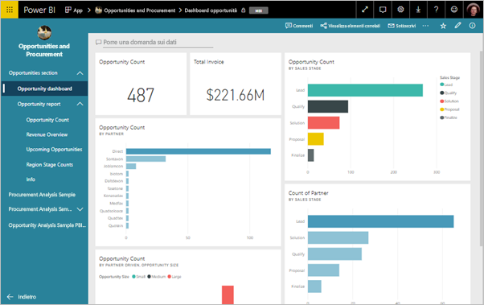
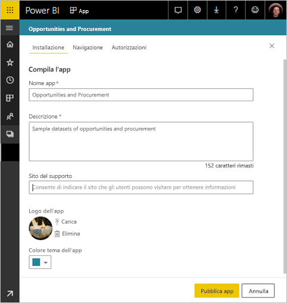
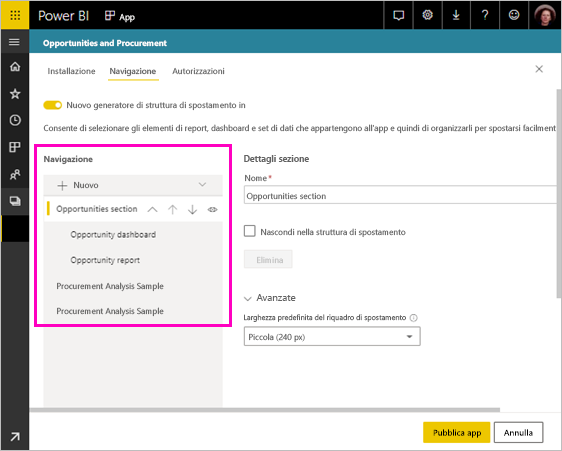
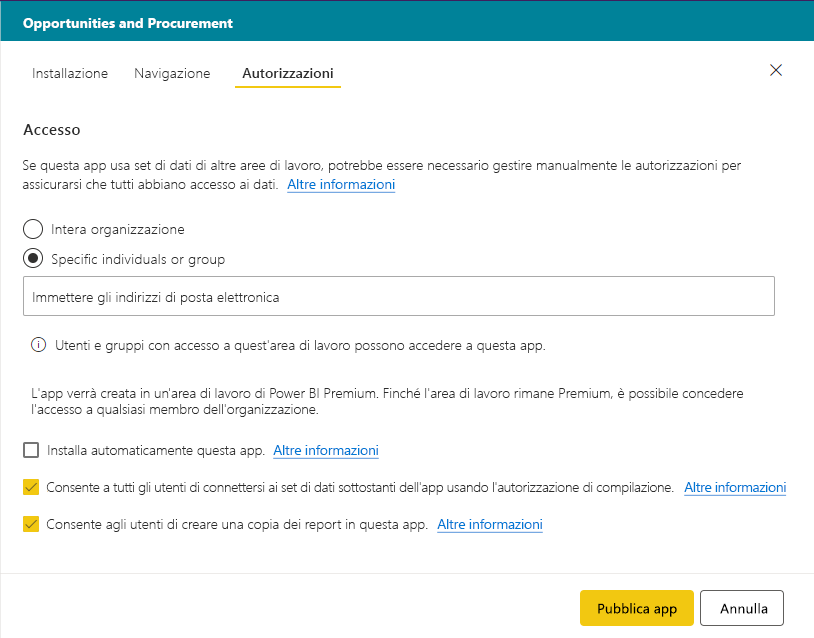
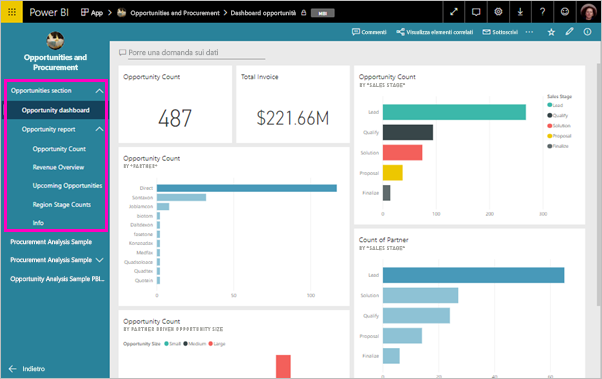

# Pubblicare un'app in Power BI

In Power BI è possibile creare contenuto ufficiale in pacchetti e quindi distribuirlo a un'ampia platea sotto forma di *app*. È possibile creare app nelle *aree di lavoro*, in cui è possibile collaborare sul contenuto di Power BI con i colleghi. È quindi possibile pubblicare le app complete in ampi gruppi di persone all'interno dell'organizzazione. 

Gli utenti aziendali spesso hanno bisogno di più dashboard e report di Power BI per l'esecuzione delle loro attività aziendali. Con le app Power BI è possibile creare raccolte di dashboard e report e pubblicare le raccolte come app nell'intera organizzazione o soltanto per gruppi o utenti specifici. Per l'utente amministratore o autore del report, le app rendono più semplice gestire le autorizzazioni per queste raccolte.

Gli utenti aziendali possono ottenere le app in diversi modi:

- Possono trovare l'app in Microsoft AppSource e installarla.
- È possibile inviare un collegamento diretto.
- Se l'amministratore di Power BI concede l'autorizzazione, è possibile installarla automaticamente nell'account Power BI dei colleghi.
- Power BI non invia alcun messaggio di posta elettronica agli utenti interni quando si distribuisce o si aggiorna un'app. Se la si distribuisce a utenti esterni, questi riceveranno un messaggio di posta elettronica con un collegamento diretto. 

È possibile creare l'app con la relativa struttura di spostamento predefinita, in modo che gli utenti possano orientarsi facilmente all'interno del contenuto. Gli utenti non possono modificare il contenuto dell'app. Possono interagire con esso nel servizio Power BI o in una delle app per dispositivi mobili filtrando, evidenziando e ordinando i dati autonomamente. Riceveranno gli aggiornamenti automaticamente e sarà possibile controllare la frequenza con cui vengono aggiornati i dati. È anche possibile assegnare loro l'autorizzazione di compilazione per connettersi ai set di dati sottostanti e per creare copie dei report nell'app. Per altre informazioni, vedere l'[autorizzazione di compilazione](service-datasets-build-permissions.md).

## Licenze per le app
Per creare o aggiornare un'app è necessaria una licenza Power BI Pro. Per gli *utenti* dell'app sono disponibili due opzioni.

* **Opzione 1** L'area di lavoro per questa app *non* è in una capacità Power BI Premium: tutti gli utenti aziendali devono avere licenze Power BI Pro per visualizzare l'app. 
* **Opzione 2** L'area di lavoro per questa app *è* in una capacità Power BI Premium: gli utenti aziendali senza licenze di Power BI Pro all'interno dell'organizzazione possono visualizzare il contenuto dell'app. Non possono tuttavia copiare i report o creare report basati sui set di dati sottostanti. Per informazioni dettagliate, leggere [What is Power BI Premium?](service-premium.md) (Che cos'è Power BI Premium?).

## Pubblicare l'app
Quando i dashboard e i report dell'area di lavoro sono pronti, è possibile scegliere i dashboard e i report da pubblicare e quindi pubblicarli come app. 

1. Nella visualizzazione elenco dell'area di lavoro decidere quali dashboard e report impostare come **Incluso nell'app**.

    

    Se si sceglie di non includere un report con un dashboard correlato, viene visualizzato un avviso accanto al report. È comunque possibile pubblicare l'app, ma il dashboard correlato non riporterà i riquadri del report.

    

2. Selezionare il pulsante **Pubblica app** in alto a destra per avviare il processo di creazione e pubblicazione di un'app dall'area di lavoro.
   
    

3. In **Installazione** immettere il nome e la descrizione per aiutare gli utenti a trovare l'app. È possibile impostare un colore tema per personalizzarla. È anche possibile aggiungere un collegamento a un sito di supporto.
   
    

4. In **Navigazione** selezionare il contenuto da pubblicare come parte dell'app. Aggiungere quindi la struttura di spostamento dell'app per organizzare il contenuto in sezioni. Per i dettagli, vedere [Progettare l'esperienza di navigazione per l'app](#design-the-navigation-experience) in questo articolo.
   
    

5. In **Autorizzazioni** decidere chi ha accesso all'app e quali operazioni può eseguire. 

    - Nelle [aree di lavoro classiche](service-create-workspaces.md): tutti gli utenti nell'organizzazione, utenti specifici o gruppi di sicurezza di Azure Active Directory (Azure AD).
    - Nelle [aree di lavoro della nuova esperienza](service-create-the-new-workspaces.md): utenti specifici, gruppi di sicurezza e liste di distribuzione di Azure AD e gruppi di Office 365. Viene concesso automaticamente l'accesso all'app per l'area di lavoro a tutti gli utenti dell'area di lavoro.
    - È possibile consentire agli utenti dell'app di connettersi a set di dati sottostanti dell'app concedendo loro l'autorizzazione di compilazione. Questi set di dati verranno visualizzati durante la ricerca dei set di dati condivisi. Per altre informazioni su come [consentire agli utenti di connettersi ai set di dati dell'app](#allow-users-to-connect-to-datasets), vedere più avanti in questo articolo.
    - Gli utenti con l'autorizzazione di compilazione possono anche avere l'autorizzazione per copiare i report da questa app a un'altra area di lavoro. Per altre informazioni su come [consentire agli utenti di copiare i report nell'app](#allow-users-to-copy-reports), vedere più avanti in questo articolo.
    
    >[!IMPORTANT]
    >Se l'app si basa su set di dati di altre aree di lavoro, è necessario verificare che tutti gli utenti dell'app abbiano accesso ai set di dati sottostanti.
    >

6. È possibile installare l'app in modo automatico per i destinatari, se l'amministratore di Power BI ha abilitato questa impostazione nel portale di amministrazione di Power BI. Vedere altre informazioni sull'[installazione automatica di un'app](#automatically-install-apps-for-end-users) in questo articolo.

    

7. Quando si seleziona **Pubblica app**, viene visualizzato un messaggio che conferma che l'app è pronta per la pubblicazione. Nella finestra di dialogo **Condividi questa app** è possibile copiare l'URL che è un collegamento diretto all'app.
   
    

È possibile inviare il collegamento diretto alle persone con cui l'app è stata condivisa oppure questa sarà reperibile nella scheda App passando a **Scarica ed esplora altre app da AppSource**. Altre informazioni sull'[esperienza dell'app per gli utenti aziendali](consumer/end-user-apps.md).

## Modificare l'app pubblicata
Dopo aver pubblicato l'app, si potrebbe volerla modificare o aggiornare. È facile aggiornarla se si è un amministratore o un membro della nuova area di lavoro. 

1. Aprire l'area di lavoro che corrisponde all'app. 
   
    

2. Modificare i dashboard o i report in base alle esigenze.
 
    L'area di lavoro è l'area di staging personale, quindi le modifiche non risultano applicate nell'app fino a quando non si pubblica di nuovo l'app. Ciò consente di apportare modifiche senza influire sulle app pubblicate.  
 
    > [!IMPORTANT]
    > Se si rimuove un report e si aggiorna l'app, anche se il report viene di nuovo aggiunto all'app, gli utenti perderanno tutte le personalizzazioni, ad esempio segnalibri, commenti e così via.  
 
3. Tornare all'elenco di contenuti dell'area di lavoro e selezionare **Aggiorna app** nell'angolo superiore destro.
   
1. Aggiornare **Installazione**, **Navigazione** e **Autorizzazioni**, se necessario, quindi selezionare **Aggiorna app**.
   
Le persone per cui è stata pubblicata l'app visualizzano automaticamente la versione aggiornata dell'app. 

## Progettare l'esperienza di navigazione
L'opzione **Nuovo generatore di struttura di spostamento** consente di creare una struttura di spostamento personalizzata per l'app. La struttura di spostamento personalizzata consente agli utenti di trovare e usare più facilmente il contenuto disponibile nell'app. Le app esistenti hanno questa opzione disattivata, mentre per le nuove app l'opzione è attivata per impostazione predefinita.

Quando questa opzione è disattivata, in **Pagina di destinazione dell'app** è possibile selezionare **Contenuto specifico**, ad esempio un dashboard o un report, oppure **Nessuna** in modo che l'utente visualizzi un elenco di contenuti di base.

Quando si attiva **Nuovo generatore di struttura di spostamento**, è possibile progettare una struttura di spostamento personalizzata. Per impostazione predefinita, tutti i report, i dashboard e le cartelle di lavoro di Excel inclusi nell'app sono visualizzati come elenco semplice. 

Per personalizzare ulteriormente la struttura di spostamento dell'app è possibile:

* Riordinare gli elementi usando le frecce SU e GIÙ. 
* Rinominare gli elementi in **Dettagli report**, **Dettagli dashboard** e **Dettagli della cartella di lavoro**.
* Nascondere determinati elementi nella struttura di spostamento.
* Usare l'opzione **Nuovo** per aggiungere **sezioni** per raggruppare contenuti correlati.
* Usare l'opzione **Nuovo** per aggiungere un **collegamento** a una risorsa esterna nel riquadro di spostamento. 

Quando si aggiunge un **collegamento**, in **Dettagli collegamento** è possibile scegliere dove questo verrà aperto. Per impostazione predefinita, i collegamenti vengono aperti in **Scheda corrente**, ma è possibile selezionare **Nuova scheda** o **Area del contenuto**. 

### Considerazioni sull'uso dell'opzione Nuovo generatore di struttura di spostamento
Di seguito sono riportati aspetti generali da tenere presente quando si usa il nuovo generatore di struttura di spostamento:

* Le pagine dei report vengono visualizzate nell'area della struttura di spostamento dell'app come sezione espandibile. Quando un report ha una pagina visibile, viene visualizzato solo il nome del report. Se si fa clic sul nome del report nel riquadro di spostamento, viene visualizzata la prima pagina del report. 

    > [!NOTE]
    > Il report potrebbe avere una sola pagina visibile perché il passaggio alle altre pagine è stato configurato con pulsanti o azioni di drill-through.

* Se si disattiva il nuovo generatore di struttura di spostamento e quindi si pubblica o si aggiorna l'app, le personalizzazioni apportate andranno perse. Ad esempio sezioni, ordinamento, collegamenti e nomi personalizzati per gli elementi della struttura di spostamento andranno persi.
* È disponibile l'opzione per non usare il generatore di app.

Quando si aggiungono collegamenti alla struttura di spostamento dell'app e si seleziona l'opzione Area del contenuto:
* Verificare che il collegamento possa essere incorporato. Alcuni servizi bloccano l'incorporamento dei propri contenuti in siti di terze parti, come Power BI.
* L'incorporamento di contenuti del servizio Power BI come report o dashboard in altre aree di lavoro non è supportato. 
* Incorporare il contenuto del server di report di Power BI tramite il contenuto del relativo URL di incorporamento nativo da una distribuzione locale. Usare la procedura descritta in [Creazione dell'URL del server di report di Power BI](https://docs.microsoft.com/power-bi/report-server/quickstart-embed#create-the-power-bi-report-url) per ottenere l'URL. Tenere presente che si applicano le regole di autenticazione. Per la visualizzazione del contenuto è pertanto necessaria una connessione VPN al server locale. 
* Nella parte superiore del contenuto incorporato viene visualizzato un avviso di sicurezza a indicare che il contenuto non si trova in Power BI.

## Installare automaticamente le app per gli utenti finali
Se un amministratore concede le autorizzazioni necessarie, è possibile installare automaticamente le app, effettuandone il *push* agli utenti finali. Questa funzionalità push semplifica la distribuzione delle app giuste alle persone o ai gruppi appropriati. L'app viene visualizzata automaticamente nell'elenco del contenuto App degli utenti finali che non dovranno così cercarla in Microsoft AppSource o seguire un collegamento di installazione. Vedere come gli amministratori abilitano il [push delle app agli utenti finali](service-admin-portal.md#push-apps-to-end-users) nell'articolo Portale di amministrazione di Power BI.

### Push automatico di un'app agli utenti finali
Dopo che l'amministratore ha assegnato le autorizzazioni, sarà disponibile una nuova opzione per **installare automaticamente l'app**. Quando si seleziona la casella e quindi **Pubblica app** (o **Aggiorna app**), viene effettuato il push dell'app a tutti gli utenti o gruppi definiti nella sezione **Autorizzazioni** dell'app nella scheda **Accesso**.

### Ricezione delle app distribuite tramite push
Dopo che è stato effettuato il push di un'app, questa viene automaticamente visualizzata nell'elenco App degli utenti. In questo modo, è possibile curare le app che utenti o ruoli specifici all'interno dell'organizzazione devono avere a portata di mano.

### Considerazioni per l'installazione automatica delle app
Ecco alcuni aspetti da tenere in considerazione quando si effettua il push delle app agli utenti finali:

* L'installazione automatica di un'app per gli utenti può richiedere tempo. La maggior parte delle app viene installata immediatamente per gli utenti, ma il push delle app può richiedere tempo.  Dipende dal numero di elementi nell'app e dal numero di utenti a cui viene consentito l'accesso. Si consiglia di effettuare il push delle app durante le ore non lavorative con molto anticipo prima che siano necessarie agli utenti. Prima di inviare una comunicazione generale sulla disponibilità delle app, eseguire una verifica con più utenti.

* Aggiornare il browser. Prima di visualizzare l'app di cui è stato effettuato il push nell'elenco App, l'utente potrebbe dover aggiornare o chiudere e riaprire il browser.

* Se gli utenti non vedono immediatamente l'app nell'elenco App, dovranno aggiornare o chiudere e riaprire il browser.

* Cercare di non sovraccaricare gli utenti. Prestare attenzione a non effettuare il push di troppe app in modo che gli utenti capiscano che le app preinstallate sono utili. È consigliabile controllare chi può effettuare il push delle app agli utenti finali per coordinare i tempi. Stabilire un punto di contatto per il push delle app disponibili nell'organizzazione agli utenti finali.

* Per gli utenti guest che non hanno accettato un invito, le app non verranno installate automaticamente.  

## Consentire agli utenti di connettersi ai set di dati

Quando si seleziona l'opzione **Allow users to connect to the app's underlying datasets** (Consente agli utenti di connettersi ai set di dati sottostanti dell'app), si concede agli utenti dell'app l'*autorizzazione di compilazione* per tali set di dati. Con questa autorizzazione, possono eseguire diverse azioni chiave:

- [Usare i set di dati dell'app](service-datasets-across-workspaces.md) come base per i report.
- Cercare questi set di dati in Power BI Desktop e nell'esperienza di acquisizione dei dati nel servizio Power BI.
- Creare report e dashboard basati su questi set di dati.

Se si deseleziona questa opzione, i nuovi utenti aggiunti all'app non ottengono l'autorizzazione di compilazione. Tuttavia, per gli utenti esistenti dell'app, le autorizzazioni per i set di dati sottostanti non cambiano. È possibile rimuovere manualmente l'autorizzazione di compilazione per gli utenti dell'app che non devono più averla. Per altre informazioni, vedere l'[autorizzazione di compilazione](service-datasets-build-permissions.md).

## Consentire agli utenti di copiare i report

Quando si seleziona l'opzione **Consente agli utenti di creare una copia dei report in questa app**, gli utenti possono salvare i report dell'app in Area di lavoro personale o in un'altra area di lavoro. Per creare una copia, gli utenti devono avere una licenza Pro, anche se il report originale si trova in un'area di lavoro in una capacità Premium. Questi report potranno poi essere personalizzati in base a esigenze specifiche. È necessario selezionare prima l'opzione **Consente a tutti gli utenti di connettersi ai set di dati sottostanti dell'app usando l'autorizzazione di compilazione**. Selezionando queste opzioni, si abilita la nuova funzionalità di [copia di report da altre aree di lavoro](service-datasets-copy-reports.md).

## Annullare la pubblicazione di un'app
Qualsiasi membro di un'area di lavoro può annullare la pubblicazione dell'app.

>[!IMPORTANT]
>Quando si annulla la pubblicazione di un'app, gli utenti dell'app perdono le loro personalizzazioni. Segnalibri e commenti personali o sottoscrizioni associate al contenuto dell'app andranno persi. Annullare la pubblicazione di un'app solo se è necessario rimuoverla.
> 

* In un'area di lavoro selezionare i puntini di sospensione ( **...** ) nell'angolo superiore destro > **Annulla pubblicazione app**.
  
    

Questa azione disinstalla l'app per tutti gli utenti a cui è stata pubblicata, i quali non potranno più accedervi. L'area di lavoro o il relativo contenuto non verrà eliminato.

## Visualizzare l'app pubblicata

All'apertura dell'app, gli utenti visualizzano la struttura di spostamento creata, invece del riquadro di spostamento standard di Power BI. La struttura di spostamento dell'app elenca i report e i dashboard nelle sezioni definite. Elenca inoltre le singole pagine di ogni report, anziché semplicemente il nome del report. È possibile espandere e comprimere il riquadro di spostamento a sinistra usando le frecce sulla barra dei menu.

In modalità schermo intero è possibile visualizzare o nascondere il riquadro di spostamento selezionando l'opzione nell'angolo.

## Considerazioni e limitazioni
Aspetti da tenere presenti sulla pubblicazione di app:

* La pagina delle autorizzazioni non modifica l'autorizzazione per i set di dati in altre aree di lavoro. Viene visualizzato un avviso in cui si ricorda di concedere l'accesso a tali set di dati in modo indipendente. È consigliabile contattare il proprietario del set di dati prima di iniziare a compilare l'app per assicurarsi che sia accettabile concedere a tutti gli utenti dell'app l'accesso a tali set di dati. 
* È possibile avere al massimo 100 utenti o gruppi nell'elenco di accesso per l'app. Si può però consentire l'accesso a più di 100 utenti. A tale scopo, usare uno o più gruppi di utenti che contengono tutti gli utenti desiderati.
* Per la nuova esperienza dell'area di lavoro, se l'utente aggiunto all'elenco di accesso all'app ha già accesso all'app tramite l'area di lavoro, non verrà visualizzato nell'elenco di accesso per l'app.  
* Quando si usa il nuovo aspetto per il servizio Power BI, l'URL del sito di supporto viene visualizzato nella scheda informazioni dell'elemento. Vedere altre informazioni sul ["nuovo aspetto" in Power BI](service-new-look.md).
* Le app hanno un'opzione che consente agli utenti di condividere l'app e i set di dati sottostanti dell'app usando l'autorizzazione per la condivisione. Per le nuove app, questa opzione è disattivata per impostazione predefinita. È consigliabile disattivare questa opzione per le app esistenti e aggiornare l'autorizzazione nei set di dati sottostanti. L'opzione è stata abilitata per le app esistenti perché le app sono state progettate inizialmente per sostituire i pacchetti di contenuto, che avevano questo comportamento.

## Passaggi successivi
* [Creare un'area di lavoro](service-create-workspaces.md)
* [Installare e usare app in Power BI](consumer/end-user-apps.md)
* [App Power BI per dispositivi esterni](service-connect-to-services.md)
* [Portale di amministrazione di Power BI](https://docs.microsoft.com/power-bi/service-admin-portal)
* Domande? [Provare a rivolgersi alla community di Power BI](https://community.powerbi.com/)