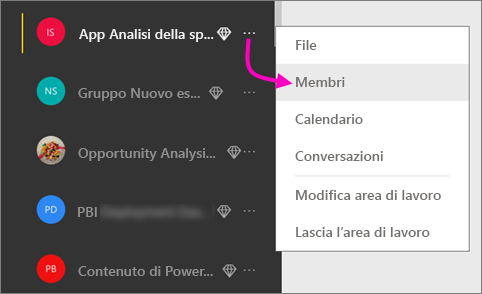
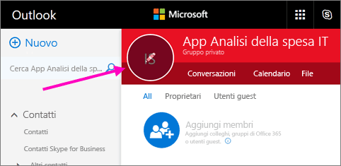
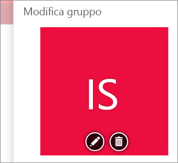
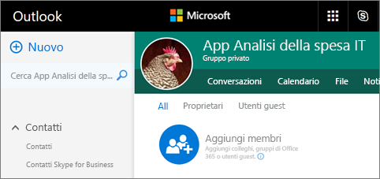
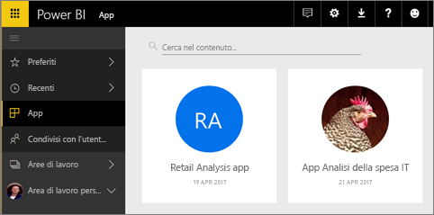
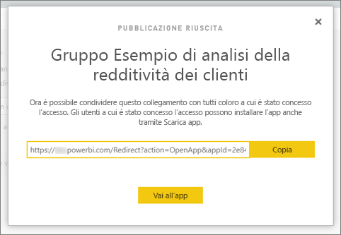

# Creare e pubblicare app con dashboard e report in Power BI

In Power BI è possibile creare *app* per riunire dashboard e report correlati, tutti in un'unica posizione, e quindi pubblicarle a gruppi di utenti di grandi dimensioni nell'organizzazione. È anche possibile connettersi alle [app di Power BI per servizi esterni](service-connect-to-services.md), come Google Analytics e Microsoft Dynamics CRM.

Gli utenti aziendali spesso hanno bisogno di più dashboard e report di Power BI per l'esecuzione delle loro attività aziendali. Le app riuniscono tutti questi elementi, quindi gli utenti non devono ricordare i nomi e le posizioni di tutti i dashboard.  

Con le app Power BI, ora in anteprima, è possibile creare raccolte di dashboard e report e pubblicare le app nell'intera organizzazione o soltanto a gruppi o utenti specifici. Per l'utente amministratore o autore del report, le app rendono più semplice gestire le autorizzazioni per le raccolte di dashboard.

Gli utenti aziendali possono ottenere le app in diversi modi. Se l'amministratore di Power BI concede l'autorizzazione, è possibile installarle automaticamente nell'account Power BI dei colleghi. Altrimenti, è possibile installare le app da Microsoft AppSource oppure è possibile inviare loro un collegamento diretto. Potranno facilmente trovare l'intero contenuto e tornarvi in seguito, perché è disponibile in un'unica posizione. Riceveranno gli aggiornamenti automaticamente e sarà possibile controllare la frequenza con cui vengono aggiornati i dati. Altre informazioni sull'[esperienza dell'app per gli utenti aziendali](service-install-use-apps.md).

### Licenze per le app
L'autore di un'app necessita di una licenza Power BI Pro. Per gli utenti di app sono disponibili due opzioni.

* Opzione 1: tutti gli utenti aziendali devono disporre di una licenza **Power BI Pro** per visualizzare le app. 
* Opzione 2: gli utenti del piano gratuito all'interno dell'organizzazione possono visualizzare il contenuto delle app se queste si trovano in una capacità di Power BI Premium. Per informazioni dettagliate, leggere [What is Power BI Premium?](service-premium.md) (Che cos'è Power BI Premium?).

### App e pacchetti di contenuto aziendali
Le app rappresentano l'evoluzione dei pacchetti di contenuto aziendali. Se si hanno già pacchetti di contenuto aziendali, questi continueranno a funzionare contemporaneamente alle app.

Dopo questa panoramica delle app, verranno prese in esame le *aree di lavoro per le app* in cui si creano le app. 

## Video: app e aree di lavoro per le app
<iframe width="640" height="360" src="https://www.youtube.com/embed/Ey5pyrr7Lk8?showinfo=0" frameborder="0" allowfullscreen></iframe>

## Aree di lavoro per le app
Le *aree di lavoro per le app* sono i posti in cui si creano le app; dunque, prima di creare un'app, è necessario creare l'area di lavoro per le app. Se l'area di lavoro del gruppo è già stata usata in Power BI, le aree di lavoro per le app risulteranno familiari. Tali aree sono infatti l'evoluzione delle aree di lavoro del gruppo, ovvero aree di gestione temporanea e contenitori per il contenuto nell'app. 

È possibile aggiungere altri colleghi a queste aree di lavoro come membri o amministratori. Tutti i membri dell'area di lavoro per le app e gli amministratori necessitano di una licenza Power BI Pro. Nell'area di lavoro tutti i membri possono collaborare su dashboard, report e altri articoli da rendere disponibili a un pubblico più ampio o all'intera organizzazione. 

Quando il contenuto è pronto, è possibile scegliere quali dashboard e report pubblicare e quindi pubblicare l'app. È possibile inviare un collegamento diretto a un gruppo di destinatari più ampio oppure rendere disponibili le app dalla scheda App scegliendo **Scarica ed esplora altre app da AppSource**. Tali utenti non possono modificare il contenuto dell'app, ma possono interagirvi nel servizio Power BI o in una delle app per dispositivi mobili, filtrando, evidenziando e ordinando i dati autonomamente. 

## Creare un'area di lavoro per le app
[!INCLUDE [powerbi-service-create-app-workspace](./includes/powerbi-service-create-app-workspace.md)]

L'area di lavoro è vuota, quindi è possibile aggiungervi contenuto. Si noti che quando la si crea per la prima volta potrebbe essere necessario attendere circa un'ora per la propagazione dell'area di lavoro in Office 365. 

Questa operazione è analoga all'aggiunta di contenuto all'Area di lavoro personale, tranne per il fatto che anche gli altri utenti dell'area di lavoro potranno vederlo ed elaborarlo. Un'enorme differenza consiste nel fatto che, al termine dell'elaborazione, sarà possibile pubblicare il contenuto come app. All'interno dell'area di lavoro per le app è possibile caricare o connettersi ai file oppure connettersi ai servizi di terze parti, proprio come avviene nell'Area di lavoro personale. ad esempio:

* [Connettersi ai servizi](service-connect-to-services.md), ad esempio Microsoft Dynamics CRM, Salesforce o Google Analytics.
* [Ottenere dati da file](service-get-data-from-files.md), ad esempio i file Excel, CSV o Power BI Desktop (PBIX).

Quando si visualizza il contenuto in un'area di lavoro per le app, il proprietario viene visualizzato come nome dell'area di lavoro.

## Aggiungere un'immagine all'app (facoltativo)
Per impostazione predefinita, Power BI crea un cerchietto colorato per l'app, con le iniziali dell'app, ma potrebbe essere opportuno personalizzarlo con un'immagine. Per aggiungere un'immagine occorre una licenza per Exchange Online.

1. Selezionare **Aree di lavoro**, selezionare i puntini di sospensione (...) accanto al nome dell'area di lavoro, quindi **Membri**. 
   
     
   
    L'account Outlook di Office 365 per l'area di lavoro verrà aperto in una nuova finestra del browser.
2. Quando si passa con il mouse sul cerchio colorato in alto a sinistra, il puntatore si trasforma in un'icona a forma di matita. Selezionarla.
   
     
3. Selezionare nuovamente l'icona a forma di matita e trovare l'immagine che si vuole usare.
   
     
4. Selezionare **Salva**.
   
     
   
    L'immagine sostituisce il cerchio colorato nella finestra di Outlook di Office 365. 
   
     
   
    In pochi minuti, verrà visualizzata anche nell'app Power BI.
   
     

## Pubblicare l'app
Quando i dashboard e i report nell'area di lavoro per le app sono pronti, è possibile pubblicarli come un'app. Tenere presente che non è necessario pubblicare tutti i report e i dashboard nell'area di lavoro. È possibile pubblicare solo quelli che sono pronti.

1. Nella visualizzazione elenco dell'area di lavoro, decidere quali dashboard e report si vogliono includere nell'app.

     

     Se si sceglie di non pubblicare un report, viene visualizzato un avviso accanto al report e al dashboard correlato. È comunque possibile pubblicare l'app, ma nel dashboard correlato mancheranno i riquadri da tale report.

     

2. Selezionare il pulsante **Pubblica app** in alto a destra per avviare il processo di condivisione di tutto il contenuto nell'area di lavoro.
   
     

3. In **Dettagli** inserire la descrizione per aiutare gli utenti a trovare l'app. È possibile impostare un colore di sfondo per personalizzarla.
   
     

4. In **Contenuto** viene visualizzato il contenuto che verrà pubblicato come parte dell'app, ossia tutto il contenuto selezionato in tale area di lavoro. È anche possibile impostare la pagina di destinazione dell'app, cioè il dashboard o il report che gli utenti vedranno per primo quando accedono all'app. È possibile scegliere **Nessuno**: in tal modo, verrà visualizzato per primo un elenco dell'intero contenuto dell'app. 
   
     

5. In **Accesso** decidere chi avrà accesso all'app, ovvero tutti gli utenti dell'organizzazione, utenti specifici oppure gruppi di sicurezza di Active Directory. Se si hanno le opportune autorizzazioni, è possibile decidere di installare automaticamente l'app per i destinatari. È possibile abilitare questa impostazione nel [portale di amministrazione di Power BI](#how-to-enable-pushing-apps). Esistono altre considerazioni da fare sul [push di un'app](#how-to-enable-pushing-apps).

    

6. Quando si seleziona **Fine**, viene visualizzato un messaggio che conferma che l'app è pronta per la pubblicazione. Nella finestra di dialogo di operazione completata è possibile copiare l'URL, ossia il collegamento diretto a questa app, e inviarlo alle persone con cui è stata condivisa.
   
     

Gli utenti aziendali per cui è stata pubblicata l'app potranno trovarla in diversi modi. Se è stata installata automaticamente, viene visualizzata in App nel proprio account Power BI. È possibile inviare loro il collegamento diretto all'app oppure potranno cercarla in Microsoft AppSource, in cui sono visualizzate tutte le app a cui possono accedere. In entrambi i casi, da quel momento vedranno questa app nel proprio elenco ogni volta che accedono ad App.

Altre informazioni sull'[esperienza dell'app per gli utenti aziendali](service-install-use-apps.md).

## Modificare l'app pubblicata
Dopo aver pubblicato l'app, si potrebbe volerla modificare o aggiornare. È facile aggiornarla se si è un amministratore o un membro dell'area di lavoro per le app. 

1. Aprire l'area di lavoro per le app che corrisponde all'app. 
   
     
2. Aprire il dashboard o il report. Si noterà che è possibile apportare le modifiche desiderate.
   
     L'area di lavoro per le app è l'area di gestione temporanea personale, quindi il push delle modifiche nell'app non viene eseguito in tempo reale fino a quando non si pubblica di nuovo. Ciò consente di apportare modifiche senza influire sulle app pubblicate.  
 
3. Tornare all'elenco di contenuti dell'area di lavoro per le app e selezionare **Aggiorna app**.
   
     

4. Aggiornare **Dettagli**, **Contenuto**, e **Accesso**, se necessario, quindi selezionare **Aggiorna app**.
   
     

Le persone per cui è stata pubblicata l'app visualizzano automaticamente la versione aggiornata dell'app. 

# Installare automaticamente le app per gli utenti finali
È possibile installare automaticamente le app per gli utenti finali, per poter distribuire più facilmente le app corrette alle persone o ai gruppi corretti.

Le app forniscono agli utenti finali i dati necessari per lavorare. È ora possibile installare automaticamente queste app nell'elenco di contenuti App invece che trovarle da Microsoft AppSource o seguendo un collegamento di installazione. In questo modo sarà più semplice implementare il contenuto di Power BI standard per gli utenti.

## Come installare automaticamente un'app per gli utenti finali
Dopo che l'amministratore ha abilitato la funzionalità, gli autori delle app hanno a disposizione una nuova opzione per **installare l'app automaticamente**. Quando la casella è ***selezionata*** e l'autore dell'applicazione seleziona **Fine** (o **Aggiorna app**, per le app esistenti), verrà effettuato il push dell'app a tutti gli utenti o gruppi definiti nella sezione **Autorizzazioni** dell'app nella scheda **Accesso**.

## Come gli utenti possono recuperare le app di cui è stato effettuato il push
Un'app, dopo che ne è stato effettuato il push, viene automaticamente visualizzata nell'elenco App. È possibile curare le app che un ruolo utente o un ruolo nell'organizzazione deve avere a portata di mano.

### Considerazioni per l'installazione automatica delle app
Ecco alcuni aspetti da tenere in considerazione quando si effettua il push delle app agli utenti finali:

* L'installazione automatica di un'app per gli utenti può richiedere tempo. La maggior parte delle app verrà installata immediatamente per gli utenti, ma il push delle app può richiedere tempo.  Dipende dal numero di elementi nell'app e dal numero di utenti a cui viene consentito l'accesso. Si consiglia di effettuare il push delle app durante le ore non lavorative con molto anticipo prima che siano necessarie agli utenti. Prima di inviare una comunicazione generale sulla disponibilità delle app, eseguire una verifica con più utenti.

* Aggiornare il browser. Prima di visualizzare l'app di cui è stato effettuato il push nell'elenco App, l'utente potrebbe dover aggiornare o chiudere e riaprire il browser.

* Se l'utente non visualizza immediatamente l'app nell'elenco App, deve aggiornare o chiudere e riaprire il browser.

* Cercare di non sovraccaricare gli utenti. Prestare attenzione a non effettuare il push di troppe app in modo che gli utenti capiscano che le app preinstallate sono utili. È consigliabile controllare chi può effettuare il push delle app agli utenti finali per coordinare i tempi. È possibile stabilire un punto di contatto per effettuare il push delle app nell'organizzazione agli utenti finali.

* Per gli utenti guest che non hanno accettato un invito, le app non verranno installate automaticamente.  

## Annullare la pubblicazione di un'app
Qualsiasi membro di un'area di lavoro per le app può annullare la pubblicazione dell'app.

* In un'area di lavoro per le app, selezionare i punti di sospensione (**...**) nell'angolo superiore destro > **Annulla pubblicazione app**.
  
     

Questa azione disinstalla l'app per tutti gli utenti a cui è stata pubblicata, i quali non potranno più accedervi. Non verranno eliminati l'area di lavoro per le app o il relativo contenuto.

## Domande frequenti sulle app di Power BI
### Quali sono le differenze tra le aree di lavoro per le app e le aree di lavoro del gruppo?
Con questa versione, tutte le aree di lavoro del gruppo sono state rinominate in aree di lavoro per le app. È possibile pubblicare un'app da una qualsiasi di queste aree di lavoro. La funzionalità rimane per la maggior parte allineata al livello delle aree di lavoro del gruppo. Nei mesi successivi, si prevedono i seguenti miglioramenti alle aree di lavoro per le app: 

* La creazione di aree di lavoro per le app non crea entità corrispondenti in Office 365, come succede con le aree di lavoro del gruppo. È quindi possibile creare un numero qualsiasi di aree di lavoro per le app senza doversi preoccupare dei diversi gruppi di Office 365 creati dietro le quinte (è ancora possibile usare OneDrive for Business di un gruppo Office 365 per archiviare i file). 
* Oggi è possibile aggiungere solo singoli utenti agli elenchi di membri e amministratori. Presto sarà possibile aggiungere più gruppi di sicurezza o gruppi moderni di Active Directory a questi elenchi per consentire una gestione più semplice.  

### Quali sono le differenze tra le app e i pacchetti di contenuto aziendali?
Le app sono un'evoluzione e la semplificazione dei pacchetti di contenuto, con alcune differenze importanti. 

* Dopo che gli utenti aziendali avranno installato un pacchetto di contenuto, questo perde la propria identità raggruppata: è solo un elenco di dashboard e report intervallati da altri dashboard e report. Le app, d'altra parte, mantengono l'identità e il raggruppamento anche dopo l'installazione. Questo semplifica agli utenti aziendali di continuare a passare alle app nel tempo.
* È possibile creare più pacchetti di contenuto da qualsiasi area di lavoro, ma un'app ha una relazione 1:1 con la relativa area di lavoro. In questo modo, le app saranno più facili da comprendere e gestire a lungo termine. Per altre informazioni sulla pianificazione dei miglioramenti di quest'area, vedere l'apposita sezione del blog di Power BI. 
* Nel corso del tempo i pacchetti di contenuto aziendali verranno deprecati, quindi si consiglia di creare app da oggi in poi.  

### E per quanto riguarda i membri di sola lettura nei gruppi?
Nei gruppi si possono aggiungere membri di sola lettura che possono solo visualizzare il contenuto. Il problema principale con questo approccio è che non è possibile aggiungere gruppi di sicurezza come membri. 

Con le app, è possibile pubblicare una versione di sola lettura dell'area di lavoro per le app a un vasto pubblico, inclusi i gruppi di sicurezza. È possibile gestire temporaneamente le modifiche ai dashboard e ai report nell'app senza influire sugli utenti finali. In futuro, è consigliabile usare le app in questo modo. A lungo termine, si prevede che saranno deprecati anche i membri di sola lettura delle aree di lavoro.  

## Passaggi successivi
* [Installare e usare app in Power BI](service-install-use-apps.md)
* [App Power BI per dispositivi esterni](service-connect-to-services.md)
* [Portale di amministrazione di Power BI](https://docs.microsoft.com/en-us/power-bi/service-admin-portal)
* Domande? [Provare a rivolgersi alla community di Power BI](http://community.powerbi.com/)
