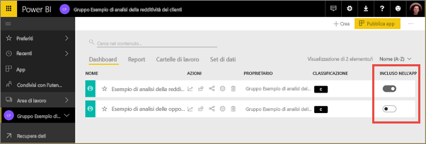
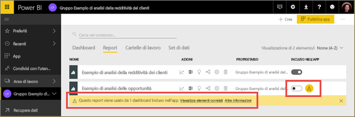
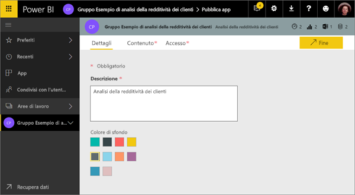
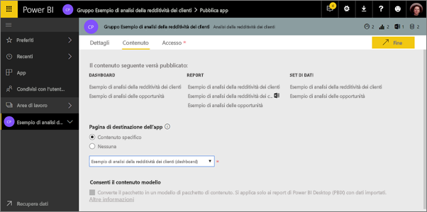
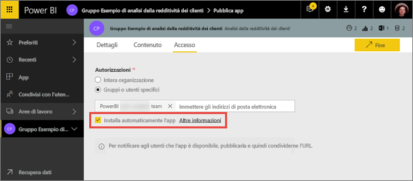
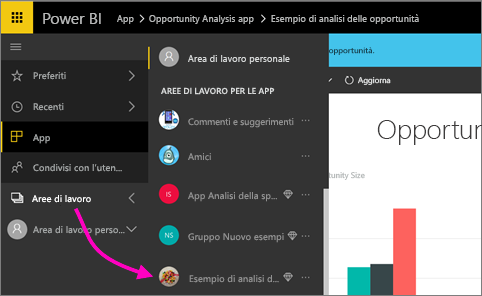
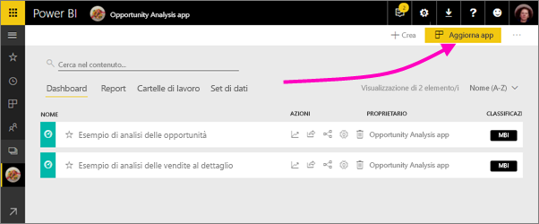
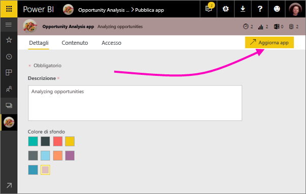
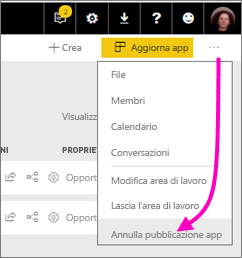

# Pubblicare app con dashboard e report in Power BI

In Power BI è possibile pubblicare *app* con raccolte di dashboard e report correlati. È possibile creare app nelle *aree di lavoro per le app*, in cui è possibile collaborare sul contenuto di Power BI con i colleghi. È quindi possibile pubblicare le app complete in ampi gruppi di persone all'interno dell'organizzazione. Altre informazioni sulla [creazione di aree di lavoro per le app](service-create-workspaces.md).

Gli utenti aziendali spesso hanno bisogno di più dashboard e report di Power BI per l'esecuzione delle loro attività aziendali. Con le app Power BI è possibile creare raccolte di dashboard e report e pubblicare le app nell'intera organizzazione o soltanto a gruppi o utenti specifici. Per l'utente amministratore o autore del report, le app rendono più semplice gestire le autorizzazioni per queste raccolte.

Gli utenti aziendali possono ottenere le app in diversi modi. Se l'amministratore di Power BI concede l'autorizzazione, è possibile installare le app automaticamente negli account Power BI dei colleghi. Altrimenti, è possibile installare le app da Microsoft AppSource oppure è possibile inviare loro un collegamento diretto. Potranno facilmente trovare l'intero contenuto e tornarvi in seguito, perché è disponibile in un'unica posizione. Tali utenti non possono modificare il contenuto dell'app, ma possono interagirvi nel servizio Power BI o in una delle app per dispositivi mobili, filtrando, evidenziando e ordinando i dati autonomamente. Riceveranno gli aggiornamenti automaticamente e sarà possibile controllare la frequenza con cui vengono aggiornati i dati. Altre informazioni sull'[esperienza dell'app per gli utenti aziendali](consumer/end-user-apps.md).

**Non tutti lo sanno, ma** Power BI ha introdotto una nuova esperienza dell'area di lavoro in anteprima. Vedere [Creare le nuove aree di lavoro (anteprima)](service-create-the-new-workspaces.md) per scoprire come le aree di lavoro cambieranno in futuro. 

## App e pacchetti di contenuto aziendali
Le app rappresentano l'evoluzione dei pacchetti di contenuto aziendali. I pacchetti di contenuto non sono disponibili nell'anteprima delle nuove esperienze delle aree di lavoro. Quando la nuova esperienza dell'area di lavoro sarà disponibile a livello generale, non sarà possibile usare i pacchetti di contenuto nelle aree di lavoro appena create. Se non è stato ancora fatto, iniziare la migrazione dei pacchetti di contenuto nelle app.

## Video: app e aree di lavoro per le app
<iframe width="640" height="360" src="https://www.youtube.com/embed/Ey5pyrr7Lk8?showinfo=0" frameborder="0" allowfullscreen></iframe>

## Licenze per le app
Ogni membro di un'area di lavoro per le app deve possedere una licenza di Power BI Pro. Per gli utenti delle app sono disponibili due opzioni.

* Opzione 1: tutti gli utenti aziendali devono disporre di una licenza **Power BI Pro** per visualizzare le app. 
* Opzione 2: gli utenti del piano gratuito all'interno dell'organizzazione possono visualizzare il contenuto delle app se queste si trovano in una capacità di Power BI Premium. Per informazioni dettagliate, leggere [What is Power BI Premium?](service-premium.md) (Che cos'è Power BI Premium?).

## Pubblicare l'app
Quando i dashboard e i report dell'area di lavoro sono pronti, è possibile scegliere i dashboard e i report da pubblicare e quindi pubblicarli come app. È possibile inviare un collegamento diretto a un gruppo di destinatari più ampio oppure rendere disponibili le app dalla scheda App scegliendo **Scarica ed esplora altre app da AppSource**. 

1. Nella visualizzazione elenco dell'area di lavoro, decidere quali dashboard e report si vogliono includere nell'app.

     

     Se si sceglie di non pubblicare un report, viene visualizzato un avviso accanto al report e al dashboard correlato. È comunque possibile pubblicare l'app, ma nel dashboard correlato mancheranno i riquadri da tale report.

     

2. Selezionare il pulsante **Pubblica app** in alto a destra per avviare il processo di condivisione di tutto il contenuto nell'area di lavoro.
   
     

3. In **Dettagli** inserire la descrizione per aiutare gli utenti a trovare l'app. È possibile impostare un colore di sfondo per personalizzarla.
   
     

4. In **Contenuto** viene visualizzato il contenuto che verrà pubblicato come parte dell'app, ossia tutto il contenuto selezionato in tale area di lavoro. È anche possibile impostare la pagina di destinazione dell'app, cioè il dashboard o il report che gli utenti vedranno per primo quando accedono all'app. È possibile scegliere **Nessuno**: in tal modo, verrà visualizzato per primo un elenco dell'intero contenuto dell'app. 
   
     

5. In **Accesso** decidere chi avrà accesso all'app, ovvero tutti gli utenti dell'organizzazione, utenti specifici oppure gruppi di sicurezza di Active Directory. Se si hanno le opportune autorizzazioni, è possibile decidere di installare automaticamente l'app per i destinatari. È possibile abilitare questa impostazione nel [portale di amministrazione di Power BI](#how-to-enable-pushing-apps). Esistono altre considerazioni da fare sul [push di un'app](#how-to-enable-pushing-apps).

    

6. Quando si seleziona **Fine**, viene visualizzato un messaggio che conferma che l'app è pronta per la pubblicazione. Nella finestra di dialogo di operazione completata è possibile copiare l'URL, ossia il collegamento diretto a questa app, e inviarlo alle persone con cui è stata condivisa.
   
     

Altre informazioni sull'[esperienza dell'app per gli utenti aziendali](consumer/end-user-apps.md).

## Modificare l'app pubblicata
Dopo aver pubblicato l'app, si potrebbe volerla modificare o aggiornare. È facile aggiornarla se si è un amministratore o un membro dell'area di lavoro per le app oppure se si è un collaboratore in una nuova area di lavoro per le app. 

1. Aprire l'area di lavoro per le app che corrisponde all'app. 
   
     
2. Aprire il dashboard o il report. Si noterà che è possibile apportare le modifiche desiderate.
   
     L'area di lavoro per le app è l'area di gestione temporanea personale, quindi le modifiche nell'app non vengono eseguite in tempo reale fino a quando non si pubblica di nuovo l'app. Ciò consente di apportare modifiche senza influire sulle app pubblicate.  
 
3. Tornare all'elenco di contenuti dell'area di lavoro per le app e selezionare **Aggiorna app**.
   
     

4. Aggiornare **Dettagli**, **Contenuto**, e **Accesso**, se necessario, quindi selezionare **Aggiorna app**.
   
     

Le persone per cui è stata pubblicata l'app visualizzano automaticamente la versione aggiornata dell'app. 

## Installare automaticamente le app per gli utenti finali
Le app forniscono agli utenti finali i dati necessari per lavorare. Se un amministratore concede le autorizzazioni, è possibile installare automaticamente le app per gli utenti finali, per poter distribuire più facilmente le app corrette alle persone o ai gruppi corretti. L'app verrà visualizzata automaticamente nell'elenco di contenuti App degli utenti finali invece di doverla trovare in Microsoft AppSource o seguendo un collegamento di installazione. In questo modo sarà più semplice implementare il contenuto di Power BI standard per gli utenti.

### Come installare automaticamente un'app per gli utenti finali
Dopo che l'amministratore ha assegnato le autorizzazioni, sarà disponibile una nuova opzione per **installare automaticamente l'app**. Quando si seleziona la casella e si seleziona **Fine** (o **Aggiorna app** per le app esistenti), verrà effettuato il push dell'app a tutti gli utenti o gruppi definiti nella sezione **Autorizzazioni** dell'app nella scheda **Accesso**.

### Come gli utenti possono recuperare le app di cui è stato effettuato il push
Un'app, dopo che ne è stato effettuato il push, viene automaticamente visualizzata nell'elenco App. È possibile curare le app che utenti o ruoli specifici all'intero dell'organizzazione devono avere a portata di mano.

### Considerazioni per l'installazione automatica delle app
Ecco alcuni aspetti da tenere in considerazione quando si effettua il push delle app agli utenti finali:

* L'installazione automatica di un'app per gli utenti può richiedere tempo. La maggior parte delle app verrà installata immediatamente per gli utenti, ma il push delle app può richiedere tempo.  Dipende dal numero di elementi nell'app e dal numero di utenti a cui viene consentito l'accesso. Si consiglia di effettuare il push delle app durante le ore non lavorative con molto anticipo prima che siano necessarie agli utenti. Prima di inviare una comunicazione generale sulla disponibilità delle app, eseguire una verifica con più utenti.

* Aggiornare il browser. Prima di visualizzare l'app di cui è stato effettuato il push nell'elenco App, l'utente potrebbe dover aggiornare o chiudere e riaprire il browser.

* Se l'utente non visualizza immediatamente l'app nell'elenco App, deve aggiornare o chiudere e riaprire il browser.

* Cercare di non sovraccaricare gli utenti. Prestare attenzione a non effettuare il push di troppe app in modo che gli utenti capiscano che le app preinstallate sono utili. È consigliabile controllare chi può effettuare il push delle app agli utenti finali per coordinare i tempi. È possibile stabilire un punto di contatto per effettuare il push delle app nell'organizzazione agli utenti finali.

* Per gli utenti guest che non hanno accettato un invito, le app non verranno installate automaticamente.  

## Annullare la pubblicazione di un'app
Qualsiasi membro di un'area di lavoro per le app può annullare la pubblicazione dell'app.

* In un'area di lavoro per le app, selezionare i punti di sospensione (**...**) nell'angolo superiore destro > **Annulla pubblicazione app**.
  
     

Questa azione disinstalla l'app per tutti gli utenti a cui è stata pubblicata, i quali non potranno più accedervi. Non verranno eliminati l'area di lavoro per le app o il relativo contenuto.

## Passaggi successivi
* [Creare un'area di lavoro per le app](service-create-workspaces.md)
* [Installare e usare app in Power BI](consumer/end-user-apps.md)
* [App Power BI per dispositivi esterni](service-connect-to-services.md)
* [Portale di amministrazione di Power BI](https://docs.microsoft.com/power-bi/service-admin-portal)
* Domande? [Provare a rivolgersi alla community di Power BI](http://community.powerbi.com/)
