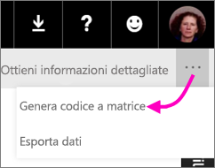

# Creare un codice a matrice per un riquadro in Power BI da usare nelle app per dispositivi mobili
I codici a matrice in Power BI possono connettere qualsiasi cosa nel mondo reale direttamente a informazioni correlate di BI &#151; senza dover effettuare nessuno spostamento o ricerca.

È possibile creare un codice a matrice nel servizio Power BI per i riquadri in un qualsiasi dashboard, persino in quelli che non è possibile modificare. Inserire quindi il codice a matrice in un percorso chiave. Si potrebbe ad esempio, incollarlo in un messaggio di posta elettronica, o stamparlo e incollarlo in un percorso specifico. 

I colleghi con cui si è condiviso il dashboard possono [scansionare il codice a matrice per l'accesso al riquadro, direttamente dal proprio dispositivo mobile](mobile-apps-qr-code.md). Per fare questo possono usare lo scanner del codice a matrice che si trova nell'app Power BI o qualsiasi altro scanner di codici a matrice installato nel proprio dispositivo.

## Creare un codice a matrice per un riquadro
1. Aprire un dashboard nel servizio Power BI.
2. Selezionare i puntini di sospensione (...) nell'angolo in alto a destra del riquadro e selezionare **Modalità messa a fuoco** .
3. Selezionare i puntini di sospensione (...) nell'angolo in alto a destra e selezionare **Genera codice a matrice**. 
   
    
4. Viene visualizzata una finestra di dialogo con il codice a matrice. 
   
    
5. Da qui è possibile scansionare il codice a matrice o scaricarlo e salvarlo in modo da poter: 
   
   * Aggiungerlo a un messaggio di posta elettronica o un altro documento, o 
   * Stamparlo e posizionarlo in una posizione specifica. 

## Stampare il codice a matrice
Power BI genera il codice a matrice come file JPG, pronto per la stampa. 

1. Selezionare **Scarica** e quindi aprire il file JPG in un computer connesso a una stampante.  
   
   > [!TIP]
   > Il file JPG ha lo stesso nome del riquadro, ad esempio "Numero di opportunità - per mese, fase vendite.jpg".
   > 
   > 
2. Stampare il file al 100% o a "dimensioni effettive".  
3. Tagliare il codice a matrice e associarlo a una posizione rilevante per il riquadro. 

## Passaggi successivi
* [Connettersi ai dati di Power BI dal mondo reale](mobile-apps-data-in-real-world-context.md) con le app per dispositivi mobili
* [Scansionare un codice a matrice di Power BI dal dispositivo mobile](mobile-apps-qr-code.md)
* [Creare un codice a matrice per un report](service-create-qr-code-for-report.md)
* Domande? [Provare a rivolgersi alla community di Power BI](http://community.powerbi.com/)

