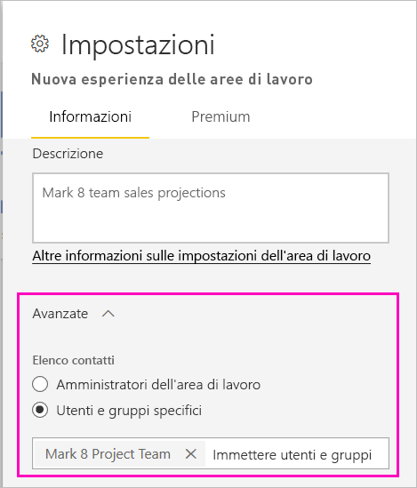
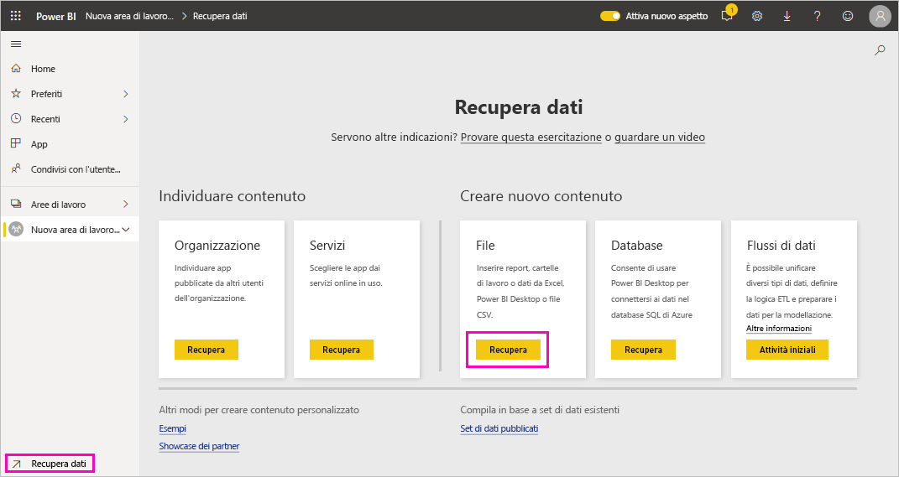
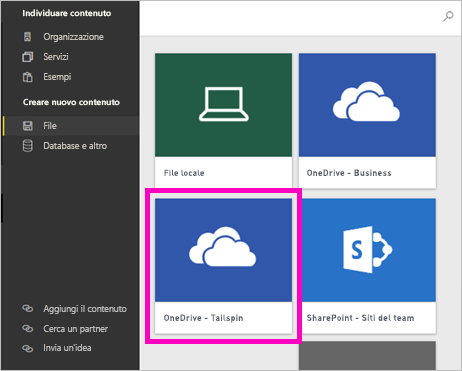
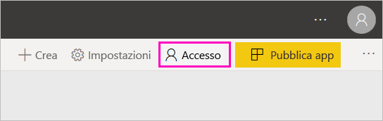
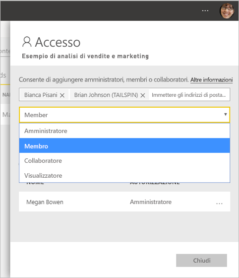

# Creare le nuove aree di lavoro in Power BI

Power BI ha introdotto una nuova esperienza di area di lavoro. Le aree di lavoro continuano a essere uno spazio dove collaborare con i colleghi per creare raccolte di dashboard, report e report impaginati. Le raccolte si possono poi riunire in *app* da distribuire all'intera organizzazione o a specifici utenti o gruppi. 

Ecco quali sono le differenze. Nelle nuove aree di lavoro è possibile:

- Assegnare ruoli dell'area di lavoro a gruppi di utenti: gruppi di sicurezza, liste di distribuzione, gruppi di Office 365 e singoli utenti.
- Creare un'area di lavoro in Power BI senza creare un gruppo di Office 365.
- Usare ruoli dell'area di lavoro con maggiore granularità per aumentare la flessibilità di gestione delle autorizzazioni in un'area di lavoro.

> [!NOTE]
> Per applicare la sicurezza a livello di riga per gli utenti di Power BI Pro che esplorano il contenuto in un'area di lavoro, assegnare agli utenti il ruolo Visualizzatore.

Per altre informazioni, vedere l'articolo relativo alle [nuove aree di lavoro](service-new-workspaces.md).

## Creare una delle nuove aree di lavoro

1. Iniziare creando l'area di lavoro. Selezionare **Aree di lavoro** > **Crea area di lavoro**.
   
     

2. Verrà automaticamente creata un'area di lavoro aggiornata, a meno che non si scelga di **ripristinare la versione classica**.
   
     
     
     Se si seleziona **Ripristina versione classica**, si crea un'[area di lavoro basata su un gruppo di Office 365](service-create-workspaces.md). 

2. Assegnare un nome all'area di lavoro. Se il nome non è disponibile, modificarlo in modo da ottenere un nome univoco.
   
     L'app per l'area di lavoro avrà lo stesso nome e la stessa icona dell'area di lavoro.
   
1. Ecco alcuni elementi facoltativi che è possibile impostare per l'area di lavoro:

    Caricare un'**immagine dell'area di lavoro**. I file possono essere in formato PNG o JPG. Le dimensioni massime dei file non possono superare 45 KB.
    
    [Aggiungere un **Elenco contatti**](#workspace-contact-list). Per impostazione predefinita, gli amministratori dell'area di lavoro sono i contatti. 
    
    [Specificare un **OneDrive area di lavoro**](#workspace-onedrive) digitando solo il nome, non l'URL, di un gruppo di Office 365 esistente. Ora questa area di lavoro può usare la posizione di archiviazione dei file del gruppo di Office 365. 

    

    Per assegnare l'area di lavoro a una **capacità dedicata**, nella scheda **Premium** selezionare **Capacità dedicata**.
     
    

1. Selezionare **Salva**.

    Power BI crea l'area di lavoro, che verrà aperta e visualizzata nell'elenco delle aree di lavoro di cui si è membri. 

## Elenco contatti dell'area di lavoro

È possibile specificare gli utenti che ricevono una notifica relativa ai problemi che si verificano nell'area di lavoro. Per impostazione predefinita, qualsiasi utente o gruppo specificato come amministratore dell'area di lavoro riceve una notifica, ma è possibile personalizzare l'elenco aggiungendo gli utenti all'*elenco contatti*. Gli utenti o i gruppi inclusi nell'elenco contatti vengono visualizzati nell'interfaccia utente per consentire agli utenti di ottenere informazioni correlate all'area di lavoro.

1. Accedere alla nuova impostazione **Elenco contatti** in uno dei due modi seguenti:

    Nel riquadro **Crea un'area di lavoro** quando si crea l'area per la prima volta.

    Nel riquadro di spostamento selezionare la freccia accanto ad **Aree di lavoro**, selezionare **Altre opzioni** (...) accanto al nome dell'area di lavoro > **Impostazioni dell'area di lavoro**. Si apre il riquadro **Impostazioni**.

    

2. In **Avanzate** > **Elenco contatti** accettare l'impostazione predefinita, **Amministratori dell'area di lavoro**, o aggiungere il proprio elenco di **Gruppi o utenti specifici**. 

    

3. Selezionare **Salva**.

## OneDrive area di lavoro

La funzionalità OneDrive area di lavoro consente di configurare un gruppo di Office 365 la cui archiviazione file nella raccolta documenti di SharePoint è disponibile per gli utenti dell'area di lavoro. Per prima cosa si crea il gruppo all'esterno di Power BI. 

Power BI non sincronizza le autorizzazioni di utenti o gruppi che sono configurati per l'accesso all'area di lavoro con l'appartenenza a un gruppo di Office 365. È consigliabile consentire l'[accesso all'area di lavoro](#give-access-to-your-workspace) allo stesso gruppo di Office 365 di cui si configura l'archiviazione file in questa impostazione. Gestire quindi l'accesso all'area di lavoro usando l'appartenenza al gruppo Office 365. 

1. Accedere alla nuova impostazione **OneDrive area di lavoro** in uno dei due modi seguenti:

    Nel riquadro **Crea un'area di lavoro** quando si crea l'area per la prima volta.

    Nel riquadro di spostamento selezionare la freccia accanto ad **Aree di lavoro**, selezionare **Altre opzioni** (...) accanto al nome dell'area di lavoro > **Impostazioni dell'area di lavoro**. Si apre il riquadro **Impostazioni**.

    

2. In **Avanzate** > **OneDrive area di lavoro** digitare il nome del gruppo di Office 365 creato in precedenza. Power BI seleziona automaticamente il OneDrive per il gruppo.

    

3. Selezionare **Salva**.

### Accedere al percorso di OneDrive area di lavoro

Dopo aver configurato la posizione di OneDrive, è possibile accedervi allo stesso modo in cui si accede ad altre origini dati nel servizio Power BI.

1. Nel riquadro di spostamento selezionare **Dati**, quindi nella casella **File** selezionare **Scarica**.

    

1.  La voce **OneDrive - Business** è OneDrive for Business. Il secondo OneDrive è quello aggiunto.

    

### Connessione a servizi di terze parti nelle nuove aree di lavoro

Nell'esperienza delle nuove aree di lavoro sono state apportate modifiche per concentrarsi sulle *app*. Le app per i servizi di terze parti semplificano il recupero dei dati dai servizi che usano, ad esempio Microsoft Dynamics CRM, Salesforce o Google Analytics.

Nella nuova esperienza di area di lavoro non è possibile creare o usare pacchetti di contenuto aziendali. È invece possibile usare le app fornite per connettersi a servizi di terze parti o chiedere ai team interni di fornire le app per gli eventuali pacchetti di contenuto in uso. 

## Consentire l'accesso all'area di lavoro

1. Nell'elenco del contenuto dell'area di lavoro, poiché si è un amministratore, viene visualizzata una nuova azione, **Accesso**.

    

1. Aggiungere a queste aree di lavoro gruppi di sicurezza, liste di distribuzione, gruppi di Office 365 o singoli utenti come visualizzatori, membri, collaboratori o amministratori. Per una spiegazione dei diversi ruoli disponibili, vedere [Ruoli nelle nuove aree di lavoro](service-new-workspaces.md#roles-in-the-new-workspaces).

    

9. Selezionare **Aggiungi** > **Chiudi**.

## Distribuire un'app

Per distribuire contenuto ufficiale a un ampio gruppo di destinatari all'interno dell'organizzazione, è possibile pubblicare un'app dall'area di lavoro.  Quando il contenuto è pronto, è possibile scegliere quali dashboard e report pubblicare e quindi pubblicarli come *app*. È possibile creare un'app da ogni area di lavoro.

Altre informazioni sulla [pubblicazione di un'app dalle nuove aree di lavoro](service-create-distribute-apps.md)

## Passaggi successivi
* Informazioni su come [organizzare il lavoro nella nuova esperienza di area di lavoro in Power BI](service-new-workspaces.md)
* [Creare le aree di lavoro classiche](service-create-workspaces.md)
* [Pubblicare un'app dalle nuove aree di lavoro in Power BI](service-create-distribute-apps.md)
* Domande? [Provare a rivolgersi alla community di Power BI](https://community.powerbi.com/)
