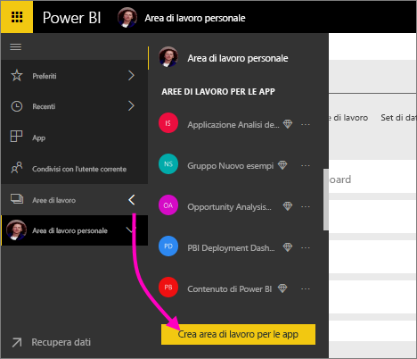
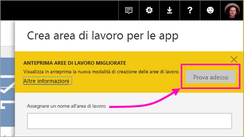
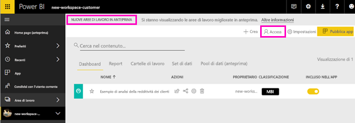
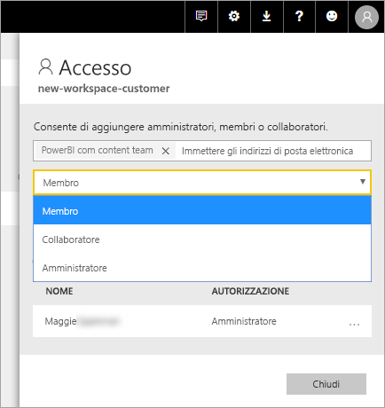
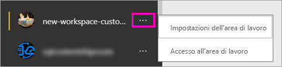

# Creare le nuove aree di lavoro (anteprima) in Power BI

Power BI ha introdotto una nuova esperienza dell'area di lavoro in anteprima. Le aree di lavoro consentono di collaborare con i colleghi per creare raccolte di dashboard e report che possono quindi essere aggregate in *app* e distribuite all'intera organizzazione o a gruppi o utenti specifici. 

Con le nuove aree di lavoro in anteprima è possibile:

- Assegnare ruoli dell'area di lavoro a gruppi di utenti: gruppi di sicurezza, liste di distribuzione, gruppi di Office 365 e singoli utenti.
- Creare un'area di lavoro in Power BI senza creare un gruppo di Office 365.
- Usare ruoli dell'area di lavoro con maggiore granularità per aumentare la flessibilità di gestione delle autorizzazioni in un'area di lavoro.

Per altre informazioni, vedere l'articolo relativo alle [nuove aree di lavoro (anteprima)](service-new-workspaces.md).

## Creare una delle nuove aree di lavoro per le app

1. Iniziare creando l'area di lavoro per le app. Selezionare **Aree di lavoro** > **Creare un'area di lavoro per le app**.
   
     

2. In **Anteprima aree di lavoro migliorate** selezionare **Prova adesso**.
   
     

2. Assegnare un nome all'area di lavoro. Se il nome non è disponibile, modificarlo in modo da ottenere un ID univoco.
   
     All'app sarà assegnato lo stesso nome dell'area di lavoro.
   
1. Se si vuole, è possibile aggiungere un'immagine. Le dimensioni massime del file non possono superare 45 kB.
 
    

1. Selezionare **Salva**.

    Nella schermata di **Benvenuto** della nuova area di lavoro, sarà possibile aggiungere i dati. 

    

1. Ad esempio, selezionare **Esempi** > **Esempio di analisi della redditività dei clienti**.

    Nell'elenco del contenuto dell'area di lavoro, è visualizzata l'opzione **Anteprima nuove aree di lavoro**. Poiché l'utente è un amministratore, è visualizzata anche una nuova azione, **Accesso**.

    

1. Selezionare **Accesso**.

1. Aggiungere a queste aree di lavoro gruppi di sicurezza, liste di distribuzione, gruppi di Office 365 o singoli utenti come membri, collaboratori o amministratori. Per una spiegazione dei diversi ruoli disponibili, vedere [Ruoli nelle nuove aree di lavoro](#roles-in-the-new-workspaces) più avanti in questo articolo.

    

9. Selezionare **Aggiungi** > **Chiudi**.

1. Power BI crea l'area di lavoro, che verrà aperta e visualizzata nell'elenco delle aree di lavoro di cui si è membri. Gli amministratori potranno a questo punto selezionare i puntini di sospensione (…) per tornare indietro e apportare modifiche alle impostazioni dell'area di lavoro, aggiungere nuovi membri o modificarne le autorizzazioni.

     

## Aggiungere contenuto all'area di lavoro per le app

Dopo aver creato un'area di lavoro per le app con il nuovo stile, è possibile aggiungere il contenuto. L'aggiunta del contenuto nelle nuove aree di lavoro funziona come per quelle precedenti, con una sola eccezione. All'interno dell'area di lavoro per le app è possibile caricare o connettersi ai file proprio come avviene nell'Area di lavoro personale. Nelle nuove aree di lavoro non è tuttavia possibile connettersi ai pacchetti di contenuto aziendali o pacchetti di contenuto di terze parti, ad esempio Microsoft Dynamics CRM, Salesforce o Google Analytics. Nelle aree di lavoro correnti è possibile connettersi a pacchetti di contenuto.

Quando si visualizza il contenuto in un'area di lavoro per le app, il nome dell'area di lavoro per le app è indicato come il proprietario.

### Connessione a servizi di terze parti nelle nuove aree di lavoro (anteprima)

Nell'esperienza delle nuove aree di lavoro sono state apportate modifiche per concentrarsi sulle *app*. Le app per i servizi di terze parti semplificano il recupero dei dati dai servizi che usano, ad esempio Microsoft Dynamics CRM, Salesforce o Google Analytics.
Le app aziendali forniscono agli utenti i dati interni di cui hanno bisogno. È prevista l'aggiunta di funzionalità alle app aziendali per consentire agli utenti di personalizzare il contenuto trovato nelle app. Con questa capacità i pacchetti di contenuto non saranno più necessari. 

Con l'anteprima delle nuove aree di lavoro, non è possibile creare o utilizzare pacchetti di contenuto aziendali. È invece possibile usare le app fornite per connettersi a servizi di terze parti o chiedere ai team interni di fornire le app per gli eventuali pacchetti di contenuto in uso. 

## Distribuire un'app

Quando il contenuto è pronto, è possibile scegliere quali dashboard e report pubblicare e quindi pubblicarli come un'*app*. È possibile creare un'app da ogni area di lavoro. I colleghi possono ottenere l'app in diversi modi. Se l'amministratore di Power BI concede l'autorizzazione, è possibile installarla automaticamente nell'account Power BI dei colleghi. Altrimenti, è possibile trovare e installare l'app da Microsoft AppSource oppure è possibile inviare loro un collegamento diretto. Riceveranno gli aggiornamenti automaticamente e sarà possibile controllare la frequenza con cui vengono aggiornati i dati. Per informazioni dettagliate, vedere [Creare e pubblicare app con dashboard e report in Power BI](service-create-distribute-apps.md).

## Convertire le aree di lavoro per le app precedenti nelle nuove aree di lavoro per le app

Durante il periodo di anteprima, non è possibile convertire automaticamente le aree di lavoro per le app precedenti in quelle nuove. È tuttavia possibile creare una nuova area di lavoro per le app e pubblicare il contenuto nella nuova posizione. 

Quando le nuove aree di lavoro saranno disponibili a livello generale, sarà possibile scegliere di eseguire automaticamente la migrazione delle aree di lavoro precedenti. A un certo punto, una volta disponibili a livello generale, sarà comunque necessario eseguire la migrazione.

## Passaggi successivi
* Informazioni su come [organizzare il lavoro nelle nuove aree di lavoro (anteprima) in Power BI](service-new-workspaces.md)
* [Creare le aree di lavoro correnti](service-create-workspaces.md)
* [Installare e usare app in Power BI](service-create-distribute-apps.md)
* Domande? [Provare a rivolgersi alla community di Power BI](http://community.powerbi.com/)
