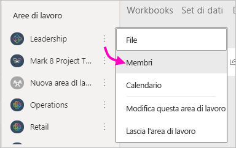
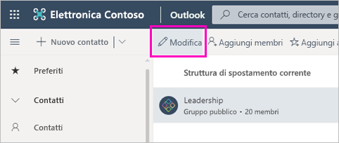

# Creare aree di lavoro classiche in Power BI

In Power BI è possibile creare *aree di lavoro*, ovvero spazi per collaborare con i colleghi per creare e ridefinire raccolte di dashboard, report e report impaginati. È possibile quindi riunire la raccolta in *app* da distribuire all'intera organizzazione o a specifici utenti o gruppi. 

**Non tutti lo sanno, ma** Power BI offre una nuova esperienza di area di lavoro, che ora è l'impostazione predefinita. Vedere [Organizzare il lavoro nelle nuove aree di lavoro](service-new-workspaces.md) per informazioni dettagliate sulle nuove aree di lavoro. 

Quando si crea un'area di lavoro classica, si crea un gruppo di Office 365 sottostante associato. Tutta l'amministrazione dell'area di lavoro viene gestita in Office 365. È possibile aggiungere altri colleghi a queste aree di lavoro come membri o amministratori. Nell'area di lavoro tutti gli utenti possono collaborare su dashboard, report e altri articoli che si intende pubblicare e rendere disponibili a un pubblico più ampio. Tutti gli utenti che vengono aggiunti a un'area di lavoro devono possedere una licenza di Power BI Pro. 

## Video: App e aree di lavoro
<iframe width="640" height="360" src="https://www.youtube.com/embed/Ey5pyrr7Lk8?showinfo=0" frameborder="0" allowfullscreen></iframe>

## Creare un'area di lavoro classica basata su un gruppo di Office 365

L'area di lavoro viene creata in base a un gruppo di Office 365.

[!INCLUDE [powerbi-service-create-app-workspace](./includes/powerbi-service-create-app-workspace.md)]

Quando la si crea per la prima volta potrebbe essere necessario attendere circa un'ora per la propagazione dell'area di lavoro in Office 365. 

### Aggiungere un'immagine all'area di lavoro di Office 365 (facoltativo)
Per impostazione predefinita, Power BI crea un cerchietto colorato per l'app, con le iniziali dell'app, ma potrebbe essere opportuno personalizzarlo con un'immagine. Per aggiungere un'immagine occorre una licenza per Exchange Online.

1. Selezionare **Aree di lavoro**, **Altre opzioni** (...) accanto al nome dell'area di lavoro e quindi **Membri**. 
   
     
   
    L'account Outlook di Office 365 per l'area di lavoro verrà aperto in una nuova finestra del browser.
2. Selezionare l'icona della matita di **modifica**.
   
     
3. Selezionare l'immagine della fotocamera e trovare l'immagine che si vuole usare.
   
     

     Le immagini possono essere file con estensione png, jpg o bmp. Le dimensioni dei file possono arrivare fino a 3 MB. 

4. Selezionare **OK** e quindi **Salva**.
   
    L'immagine sostituisce il cerchio colorato nella finestra di Outlook di Office 365. 
   
     
   
    In pochi minuti, verrà visualizzata anche nell'app Power BI.

## Aggiungere contenuto all'area di lavoro

Dopo aver creato un'area di lavoro è possibile aggiungere il contenuto. Questa operazione è analoga all'aggiunta di contenuto all'Area di lavoro personale, tranne per il fatto che anche gli altri utenti dell'area di lavoro potranno vederlo ed elaborarlo. Un'enorme differenza consiste nel fatto che, al termine dell'elaborazione, sarà possibile pubblicare il contenuto come app. Quando si visualizza il contenuto nell'elenco del contenuto di un'area di lavoro, il nome dell'area di lavoro è indicato come proprietario.

### Connettersi ai servizi di terze parti nelle aree di lavoro

Le app vengono fornite per tutti i servizi di terze parti supportati da Power BI, rendendo più semplice il recupero dei dati dai servizi usati come ad esempio Microsoft Dynamics CRM, Salesforce o Google Analytics. È possibile pubblicare app aziendali per fornire agli utenti i dati di cui hanno bisogno.

Nelle aree di lavoro correnti è possibile connettersi anche con i pacchetti di contenuto aziendali e i pacchetti di contenuto di terze parti, ad esempio Microsoft Dynamics CRM, Salesforce o Google Analytics. Prendere in considerazione la migrazione dei pacchetti di contenuto aziendali nelle app.

## Distribuire un'app

Per distribuire contenuto ufficiale a un ampio gruppo di destinatari all'interno dell'organizzazione, è possibile pubblicare un'app dall'area di lavoro.  Quando il contenuto è pronto, è possibile scegliere quali dashboard e report pubblicare e quindi pubblicarli come *app*. È possibile creare un'app da ogni area di lavoro.

L'elenco App nel riquadro di spostamento visualizza tutte le app installate. I colleghi possono ottenere l'app in diversi modi. 
- Possono trovare l'app in Microsoft AppSource e installarla.
- È possibile inviare un collegamento diretto. 
- Se l'amministratore di Power BI concede l'autorizzazione, è possibile installarla automaticamente nell'account Power BI dei colleghi. 

Gli utenti visualizzano automaticamente il contenuto dell'app aggiornato dopo la pubblicazione di un aggiornamento dall'area di lavoro. È possibile controllare la frequenza con cui vengono aggiornati i dati impostando la pianificazione dell'aggiornamento nei set di dati usati dal contenuto dell'app nell'area di lavoro. Per informazioni dettagliate, vedere [Pubblicare un'app dalle nuove aree di lavoro in Power BI](service-create-distribute-apps.md).

## Domande frequenti sulle app Power BI classiche

### Quali sono le differenze tra le app e i pacchetti di contenuto aziendali?
Le app rappresentano l'evoluzione dei pacchetti di contenuto aziendali. Se si hanno già pacchetti di contenuto aziendali, questi continueranno a funzionare contemporaneamente alle app. Le app e i pacchetti di contenuto hanno alcune differenze importanti. 

* Dopo che gli utenti aziendali avranno installato un pacchetto di contenuto, questo perde la propria identità raggruppata: è solo un elenco di dashboard e report intervallati da altri dashboard e report. Le app, d'altra parte, mantengono l'identità e il raggruppamento anche dopo l'installazione. Questo raggruppamento rende semplice per gli utenti aziendali continuare a passare alle app nel tempo.
* È possibile creare più pacchetti di contenuto da qualsiasi area di lavoro, ma un'app ha una relazione 1:1 con la relativa area di lavoro. 
* Nel corso del tempo i pacchetti di contenuto aziendali verranno deprecati, quindi si consiglia di creare app da oggi in poi.  
* Con la nuova esperienza dell'area di lavoro, vengono eseguiti i primi passaggi per la deprecazione dei pacchetti di contenuto dell'organizzazione. Non sarà possibile utilizzare o creare i pacchetti nelle nuove aree di lavoro.

Per fare un confronto, vedere le [differenze tra le nuove aree di lavoro e quelle esistenti](service-new-workspaces.md#how-the-new-workspaces-are-different). 

## Passaggi successivi
* [Installare e usare app in Power BI](service-create-distribute-apps.md)
- [Creare le nuove aree di lavoro](service-create-the-new-workspaces.md)
* Domande? [Provare a rivolgersi alla community di Power BI](https://community.powerbi.com/)
