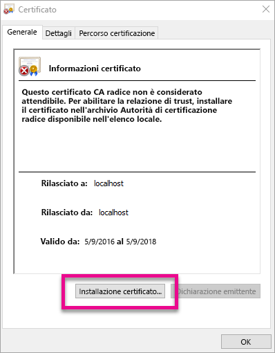
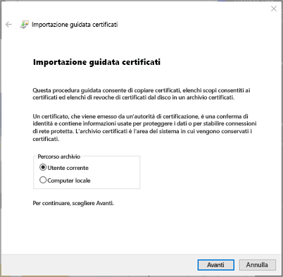
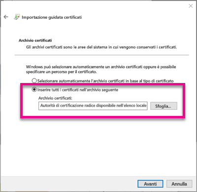
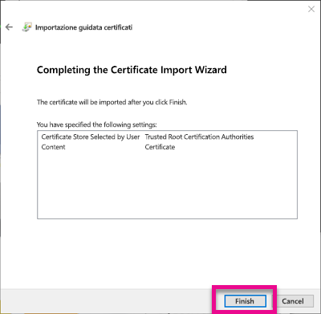
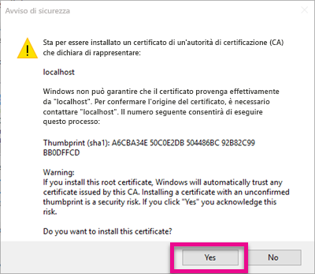
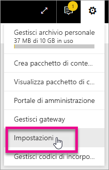
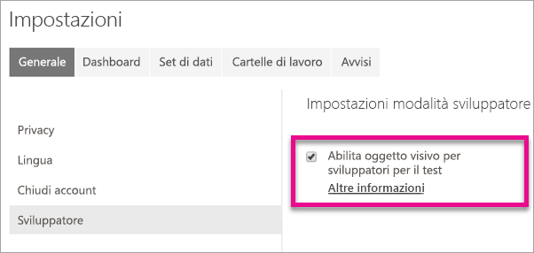
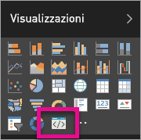
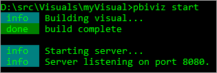

# <a name="use-developer-tools-to-create-custom-visuals"></a>Usare gli strumenti di sviluppo per la creazione di oggetti visivi personalizzati
Gli oggetti visivi personalizzati consentono di soddisfare le esigenze degli utenti e rispettare la progettazione dell'applicazione. Ecco come creare un oggetto visivo personalizzato per Power BI usando gli strumenti di sviluppo.

> [!NOTE]
> Leggere questo documento per iniziare a usare Power BI rapidamente. Per informazioni più dettagliate, vedere le informazioni di riferimento all'interno del [repository git degli oggetti visivi di Power BI](https://github.com/Microsoft/PowerBI-visuals).
> 
> 

## <a name="requirements"></a>Requisiti
* NodeJS 4.0 + richiesto (consigliato 5.0 o versioni successive) [Scarica NodeJS](https://nodejs.org)

## <a name="install-nodejs-and-the-power-bi-tools"></a>Installare NodeJS e gli strumenti di Power BI
Per creare un oggetto visivo personalizzato, è necessario installare NodeJS. NodeJS è necessario per eseguire gli strumenti da riga di comando.

1. Scaricare e installare [NodeJS](https://nodejs.org). È necessaria la versione 4.0 o versioni successive, ma è consigliata la versione 5.0 o versioni successive.
2. Installare gli strumenti da riga di comando. Eseguire il comando seguente dal prompt dei comandi.
   
        npm install -g powerbi-visuals-tools
3. È possibile confermare che gli strumenti vengano installati eseguendo il comando seguente senza parametri.
   
        pbiviz
   
    Si otterrà l'output della guida.
   
    <pre><code>
         +syyso+/
    oms/+osyhdhyso/
    ym/       /+oshddhys+/
    ym/              /+oyhddhyo+/
    ym/                     /osyhdho
    ym/                           sm+
    ym/               yddy        om+
    ym/         shho /mmmm/       om+
     /    oys/ +mmmm /mmmm/       om+
    oso  ommmh +mmmm /mmmm/       om+
   ymmmy smmmh +mmmm /mmmm/       om+
   ymmmy smmmh +mmmm /mmmm/       om+
   ymmmy smmmh +mmmm /mmmm/       om+
   +dmd+ smmmh +mmmm /mmmm/       om+
         /hmdo +mmmm /mmmm/ /so+//ym/
               /dmmh /mmmm/ /osyhhy/
                 //   dmmd
                       ++
   
       PowerBI Custom Visual Tool
   
    Usage: pbiviz [options] [command]
   
    Commands:
   
    new [name]        Create a new visual
    info              Display info about the current visual
    start             Start the current visual
    package           Package the current visual into a pbiviz file
    update [version]  Updates the api definitions and schemas in the current visual. Changes the version if specified
    help [cmd]        display help for [cmd]
   
    Options:
   
    -h, --help      output usage information
    -V, --version   output the version number
    --install-cert  Install localhost certificate
    </code></pre>

<a name"ssl-setup"></a>

### <a name="server-certificate-setup"></a>Installazione del certificato server
Per abilitare l'anteprima dinamica dell'oggetto visivo, è necessario un server https attendibile. Prima di iniziare, è necessario installare un certificato SSL in modo da permettere il caricamento di asset visivi nel Web browser. 

> [!NOTE]
> Si tratta di una singola configurazione per la workstation di sviluppo.
> 
> 

Per *aggiungere* un certificato, eseguire il comando seguente.

    pbiviz --install-cert

**Sistema operativo Windows**

1. Selezionare **Installa certificato...**.
   
    
2. Selezionare **Utente corrente**, quindi scegliere **Avanti**.
   
    
3. Selezionare **Colloca tutti i certificati nel seguente archivio** e quindi selezionare **Sfoglia...**.
4. Selezionare **Autorità di certificazione radice disponibile nell'elenco locale** e quindi selezionare **OK**. Fare clic su **Avanti**.
   
    
5. Fare clic su **Fine**.
   
    
6. Selezionare **Sì** nella finestra di dialogo dell'avviso di sicurezza.
   
    
7. Chiudere qualsiasi browser aperto.

> [!NOTE]
> Se il certificato non viene riconosciuto, potrebbe essere necessario riavviare il computer.
> 
> 

**OSX**

1. Se il lucchetto in alto a sinistra è bloccato, selezionarlo per sbloccarlo. Cercare *localhost* e fare doppio clic sul certificato.
   
    
2. Selezionare **Considera sempre attendibile** e chiudere la finestra.
   
    
3. Immettere il nome utente e password. Selezionare **Impostazioni aggiornamento**.
   
    
4. Chiudere qualsiasi browser aperto.

> [!NOTE]
> Se il certificato non viene riconosciuto, potrebbe essere necessario riavviare il computer.
> 
> 

## <a name="enable-live-preview-of-developer-visual"></a>Abilitare l'anteprima dinamica dell'oggetto visivo della modalità sviluppatore
Per abilitare un'anteprima dinamica dell'oggetto visivo personalizzato, seguire questi passaggi. In questo modo l'oggetto visivo verrà usato all'interno del servizio Power BI durante la modifica di report.

1. Passare ad [app.powerbi.com](https://app.powerbi.com) ed eseguire l'accesso.
2. Selezionare l'**icona dell'ingranaggio** e quindi selezionare **Impostazioni**.
   
    
3. Selezionare **Sviluppatore** e quindi selezionare **Abilita oggetto visivo per sviluppatori per il test**.
   
    
4. Selezionare **Oggetto visivo della modalità sviluppatore** nel riquadro **Visualizzazione**.
   
    
   
   > [!NOTE]
   > Questa operazione richiede che sia stato eseguito `pbiviz start` dalla cartella dell'oggetto visivo nel computer di sviluppo. Per altre informazioni su come creare l'oggetto visivo, vedere [Creare un nuovo oggetto visivo](#create-a-new-visual) in questo articolo.
   > 
   > 
5. Selezionare l'oggetto visivo nell'area di disegno report. È possibile associare i dati nello stesso modo in cui si associano altri oggetti visivi.

È ora possibile iniziare lo sviluppo dell'oggetto visivo.

## <a name="create-a-new-visual"></a>Creare un nuovo oggetto visivo
È possibile creare un nuovo progetto di oggetto visivo eseguendo il comando seguente.

```
pbiviz new My Visual name
```

È possibile sostituire *My Visual Name* con il nome che si vuole assegnare all'oggetto visivo. È possibile cambiarlo in un secondo momento modificando i campi `name` e `displayName` all'interno del file `pbiviz.json` generato.

Questo comando crea una nuova cartella nella directory in cui è stato eseguito il comando. Verrà generato un modello iniziale di base per l'oggetto visivo. Al termine dell'esecuzione del comando, è possibile aprire la directory e usare l'editor preferito per iniziare a elaborare il nuovo oggetto visivo.

## <a name="testing-your-visual-in-power-bi"></a>Test dell'oggetto visivo in Power BI
È possibile testare l'oggetto visivo nel servizio Power BI all'interno di rapporti e dashboard.

<a name="running-your-visual"></a>

### <a name="running-your-visual"></a>Esecuzione dell'oggetto visivo
È possibile eseguire l'oggetto visivo effettuando le operazioni seguenti.

1. Aprire un prompt dei comandi.
2. Modificare la directory nella cartella dell'oggetto visivo, che contiene il file `pbiviz.json`.
3. Eseguire il comando seguente.
   
    ```
    pbiviz start
    ```
   
    

Se si è nella posizione errata, verrà visualizzato un errore simile al seguente.

```
    error  LOAD ERROR Error: pbiviz.json not found. You must be in the root of a visual project to run this command.
        at e (C:\Users\[user]\AppData\Roaming\npm\node_modules\powerbi-visuals-tools\lib\VisualPackage.js:67:35)
        at Function.loadVisualPackage (C:\Users\[user]\AppData\Roaming\npm\node_modules\powerbi-visuals-tools\lib\VisualPackage.js:62:16)
        at Object.<anonymous> (C:\Users\[user]\AppData\Roaming\npm\node_modules\powerbi-visuals-tools\bin\pbiviz-start.js:43:15)
        at Module._compile (module.js:556:32)
        at Object.Module._extensions..js (module.js:565:10)
        at Module.load (module.js:473:32)
        at tryModuleLoad (module.js:432:12)
        at Function.Module._load (module.js:424:3)
        at Module.runMain (module.js:590:10)
        at run (bootstrap_node.js:394:7)
```

### <a name="viewing-your-visual-in-power-bi"></a>Visualizzazione dell'oggetto visivo in Power BI
Per visualizzare l'oggetto visivo in un report, passare a tale report e selezionare l'oggetto visivo all'interno del riquadro **Visualizzazioni**.

> [!NOTE]
> È necessario eseguire il comando `pbiviz start` prima di procedere come descritto nella sezione [Esecuzione dell'oggetto visivo](#running-your-visual).
> 
> 


Verrà quindi visualizzato il modello iniziale per l'oggetto visivo.


| Elemento di barra degli strumenti | Descrizione |
| --- | --- |
| Refresh visual (Aggiorna oggetto visivo) |Aggiornare manualmente l'oggetto visivo se il ricaricamento automatico è disabilitato. |
| Attiva/Disattiva ricaricamento automatico |Quando attivato, l'oggetto visivo verrà automaticamente aggiornato ogni volta che si salva il file dell'oggetto visivo. |
| Mostra vista dati |Mostra la visualizzazione dati sottostante dell'oggetto visivo per il debug |
| Guida |Documentazione in GitHub |
| Invia commenti e suggerimenti |Segnalare se è possibile migliorare ulteriormente l'esperienza. (Richiede un account GitHub) |

## <a name="package-your-visual-for-use-in-power-bi-desktop-and-distribution"></a>Creare pacchetti di oggetti visivi da usare in Power BI Desktop e per la distribuzione
Prima di caricare l'oggetto visivo in [Power BI Desktop](https://powerbi.microsoft.com/desktop/) o condividerlo con la community nella [Raccolta oggetti visivi di Power BI](https://visuals.powerbi.com), sarà necessario generare un file `pbiviz`.

È possibile creare un pacchetto per l'oggetto visivo effettuando le operazioni seguenti.

1. Aprire un prompt dei comandi.
2. Modificare la directory nella cartella dell'oggetto visivo, che contiene il file `pbiviz.json`.
3. Eseguire il comando seguente.
   
    ```
    pbiviz package
    ```

Questo comando crea un file `pbiviz` nella directory `dist/` del progetto di oggetto visivo. Se esiste già un file `pbiviz`, verrà sovrascritto.

## <a name="updating-the-visuals-api-version"></a>Aggiornamento della versione dell'API degli oggetti visivi
Quando si crea un oggetto visivo usando `pbiviz new`, una copia delle definizioni di tipo API e degli schemi JSON appropriati viene aggiunta alla directory dell'oggetto visivo. È possibile usare il comando `pbiviz update` per aggiornare questi file, se necessario. Può essere utile se si rilascia una correzione per una versione precedente dell'API o se si vuole eseguire l'aggiornamento alla versione dell'API più recente.

### <a name="updating-your-existing-api-version"></a>Aggiornamento della versione dell'API esistente
Se viene rilasciato un aggiornamento per un'API esistente, è possibile ottenere la versione più recente eseguendo le operazioni seguenti.

```
#Update your version of pbiviz
npm install -g powerbi-visuals-tools

#Run update from the root of your visual project, where pbiviz.json is located
pbiviz update
```

Verranno scaricati gli strumenti più recenti da npm che includono le definizioni di tipo e gli schemi aggiornati. Se si usa `pbiviz update` verrà sovrascritta la proprietà `apiVersion` nel file *pbiviz.json* con la versione più recente.

### <a name="upgrading-to-a-different-api-version"></a>Aggiornamento a una versione diversa dell'API
È possibile aggiornare a una versione diversa dell'API usando gli stessi passaggi indicati in precedenza. È possibile specificare in modo esplicito la versione dell'API da usare.

```
#Update your version of pbiviz
npm install -g powerbi-visuals-tools

#Run update from the root of your visual project, where pbiviz.json is located
pbiviz update 1.2.0
```

In questo modo l'oggetto visivo verrà aggiornato alla versione dell'API 1.2.0. È possibile sostituire `1.2.0` con qualsiasi versione che si vuole usare.

> [!WARNING]
> La versione dell'API predefinita usata dagli strumenti sarà sempre la versione stabile dell'API. Tutte le versioni successive alla versione dell'API predefinita sono instabili e soggette a modifiche. Possono presentare comportamenti imprevisti e si comportano in modo diverso tra il servizio Power BI e Power BI Desktop. Per la versione dell'API stabile corrente, vedere il [log delle modifiche](https://github.com/Microsoft/PowerBI-visuals/blob/master/ChangeLog.md). Per altre informazioni sulle versioni non definitive, vedere le [funzionalità previste](https://github.com/Microsoft/PowerBI-visuals/blob/master/Roadmap/README.md).
> 
> 

## <a name="inside-the-visual-project"></a>All'interno del progetto di oggetto visivo
Il progetto di oggetto visivo è la cartella che viene creata quando si esegue il comando `pbiviz new`. 

### <a name="file-structure"></a>Struttura di file
| Elemento | Descrizione |
| --- | --- |
| assets/ |Usato per archiviare gli asset visivi (icona, schermate e così via). |
| dist/ |Quando si esegue `pbiviz package`, verrà generato il file pbiviz qui. |
| src/ |Codice TypeScript per l'oggetto visivo. |
| style/ |Stili Less per l'oggetto visivo. |
| .gitignore |Indica di ignorare i file che non devono essere rilevati nel repository git. |
| capabilities.json |Usato per definire le [funzionalità](https://github.com/Microsoft/PowerBI-visuals/blob/master/Capabilities/Capabilities.md) dell'oggetto visivo. |
| package.json |Usato da [npm](https://www.npmjs.com/) per gestire i moduli. |
| pbiviz.json |File di configurazione principale. |
| tsconfig.json |Impostazioni del servizio di compilazione TypeScript. Altre informazioni su [tsconfig](https://www.typescriptlang.org/docs/handbook/tsconfig-json.html). |

### <a name="pbivizjson"></a>pbiviz.json
Questo file è il file di configurazione principale per l'oggetto visivo. Contiene i metadati, nonché informazioni sui file, necessari per compilare l'oggetto visivo.

```
{
    "visual": {
        "name": "myVisual", // internal visual name (should not contain spaces)
        "displayName": "My Visual!", // visual name displayed to user (used in gallery)
        "guid": "PBI_CV_xxxxxxx", // a unique id for this visual MUST BE UNIQUE
        "visualClassName": "Visual" // the entry class for your visual
        "version": "1.0.0", // visual version. Should be semantic version (increment if you update the visual)
        "description": "", // description used in gallery
        "supportUrl": "", // url to where users can get support for this visual
        "gitHubUrl": "" // url to the source in github (if applicable)
    },
    "apiVersion": "1.0.0", //API version this visual was created with
    "author": {
        "name": "", // your name
        "email": "" // your e-mail
    },
    "assets": {
        "icon": "assets/icon.png" // relative path to your icon file (20x20 png)
    },
    "style": "style/visual.less", // relative path to your less file
    "capabilities": "capabilities.json" // relative path to your capabilities definition 
}
```

### <a name="visual-source-typescript"></a>Origine oggetto visivo (TypeScript)
Il codice dell'oggetto visivo deve essere scritto in TypeScript, cioè un soprainsieme di JavaScript che supporta caratteristiche più avanzate e l'accesso anticipato alla funzionalità ES6/ES7.

Tutti i file TypeScript devono essere archiviati nella directory `src/` e aggiunti alla matrice `files` in `tsconfig.json`. Ciò consente al servizio di compilazione di TypeScript di caricarli nell'ordine preferito.

Quando viene compilato l'oggetto visivo, tutto il linguaggio TypeScript verrà compilato in un singolo file JavaScript. Ciò consente di fare riferimento agli elementi esportati da altri file senza dover eseguire `require` manualmente finché entrambi i file saranno elencati in tsconfig.

È possibile creare il numero di file e classi necessario per creare l'oggetto visivo.

Altre informazioni su [TypeScript](http://www.typescriptlang.org/).

### <a name="visual-style-less"></a>Stile di oggetto visivo (Less)
L'applicazione di stili visivi viene gestita usando i fogli di stile CSS. Per praticità, verrà usato il servizio di pre-compilazione Less che supporta alcune funzionalità avanzate, ad esempio la nidificazione, le variabili, le combinazioni, le condizioni, i cicli e così via. Se non si vuole usare nessuna di queste funzionalità, è possibile scrivere semplicemente fogli di stile CSS normali nel file di Less.

Tutti i file di Less devono essere archiviati nella directory `style/`. Verrà caricato il file specificato nel campo `style` all'interno del file `pbiviz.json`. Eventuali file aggiuntivi devono essere caricati usando `@import`.

Altre informazioni su [Less](http://lesscss.org/).

## <a name="debugging"></a>Debug
Per suggerimenti sul debug dell'oggetto visivo personalizzato, vedere la [guida al debug](https://github.com/Microsoft/PowerBI-visuals/blob/master/tools/debugging.md).

## <a name="submit-your-visual-to-the-office-store"></a>Inviare l'oggetto visivo a Office Store
È possibile inviare un oggetto visivo da includere in Office Store. Per altre informazioni su questo procedimento, vedere [Pubblicare oggetti visivi personalizzati in Office Store](developer/office-store.md).

## <a name="troubleshooting"></a>Risoluzione dei problemi
**Comando Pbiviz non trovato (o errori simili)**

Se si esegue `pbiviz` nella riga di comando / del terminal, verrà visualizzata la finestra della Guida in linea. In caso contrario, l'installazione non è stata eseguita correttamente. Assicurarsi di avere almeno la versione 4.0 di NodeJS installata.

Per altre informazioni, vedere [Installare NodeJS e gli strumenti di Power BI](#install-nodejs-and-the-power-bi-tools).

**Non è possibile trovare l'oggetto visivo di debug nella scheda Visualizzazioni**

L'oggetto visivo di debug all'interno della scheda **Visualizzazioni** ha l'aspetto di un'icona di prompt dei comandi.


Se non è visualizzata, verificare che sia stata abilitata nelle impostazioni di Power BI. 

> [!NOTE]
> L'oggetto visivo di debug è attualmente disponibile solo nel servizio Power BI e non in Power BI Desktop o nell'app per dispositivi mobili. L'oggetto visivo in pacchetto continuerà a funzionare ovunque.
> 
> 

Per altre informazioni, vedere [Abilitare l'anteprima dinamica dell'oggetto visivo della modalità sviluppatore](#enable-live-preview-of-developer-visual).

**Non è possibile contattare il server dell'oggetto visivo**

Eseguire il server dell'oggetto visivo con il comando `pbiviz start` nella riga di comando / del terminal dalla radice del progetto di oggetto visivo. Se il server è in esecuzione, è probabile che i certificati SSL non siano stati installati correttamente.

Per altre informazioni, vedere [Esecuzione dell'oggetto visivo](#running-your-visual) oppure [Installazione del certificato server](#ssl-setup).

## <a name="next-steps"></a>Passaggi successivi
[Visualizzazioni in Power BI](power-bi-report-visualizations.md)  
[Visualizzazioni personalizzate in Power BI](power-bi-custom-visuals.md)  
[Pubblicare oggetti visivi personalizzati in Office Store](developer/office-store.md)  
[Scaricare e usare oggetti visivi personalizzati da Office Store](service-custom-visuals-office-store.md)  
[TypeScript](http://www.typescriptlang.org/)  
[Less CSS](http://lesscss.org/)  

Altre domande? [Provare a rivolgersi alla community di Power BI](http://community.powerbi.com/)

