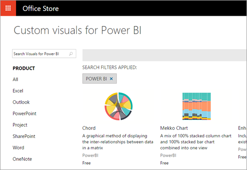
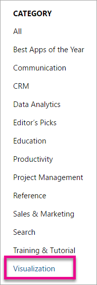
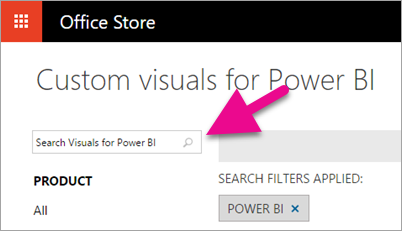
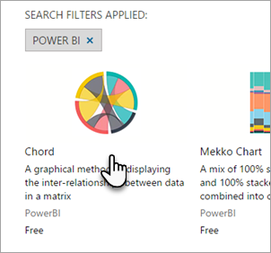
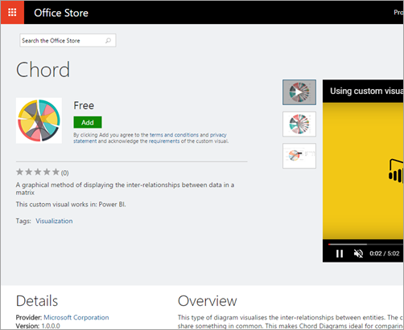
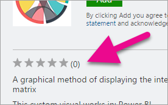
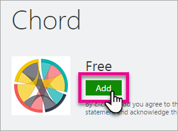
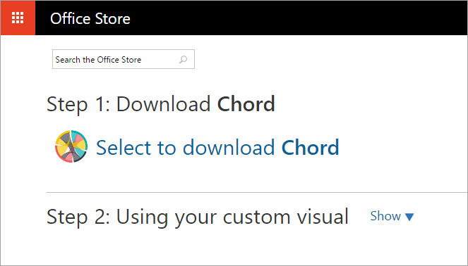
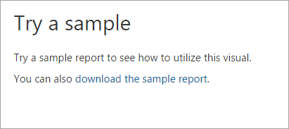

# Scaricare e usare oggetti visivi personalizzati da Office Store
Informazioni su come è possibile individuare e usare oggetti visivi personalizzati da Office Store per usarli nei report in Power BI.

Office Store contiene molti utili oggetti visivi personalizzati, creati dalla community e da [Microsoft](https://www.youtube.com/playlist?list=PL1N57mwBHtN1vIjfvuBIzZllrmKo-Vz6x), che è possibile scaricare e usare nei report di Power BI.

Che cos'è Office Store? In poche parole, è il posto in cui trovare le app (componenti aggiuntivi) per il software di Office 365. [Office Store](https://appsource.microsoft.com/marketplace/apps?product=power-bi-visuals) connette milioni di utenti di Office 365 a soluzioni che li aiutano a lavorare in modo più efficiente, più intelligente o migliore rispetto a prima.

## Visualizzazioni di Power BI
Power BI è un prodotto in Office Store. La selezione di Power BI permette di passare alla pagina principale degli [oggetti visivi personalizzati di Power BI](https://appsource.microsoft.com/marketplace/apps?product=power-bi-visuals) in cui gli utenti possono visualizzare gli oggetti visivi principali in ogni categoria, incluse le *scelte del redattore*.

Se non si seleziona il prodotto Power BI, è possibile selezionare la categoria "Visualizzazione" e visualizzare tutti gli oggetti visivi personalizzati di Power BI tra le altre visualizzazioni di Office.

## Cercare oggetti visivi personalizzati
È possibile utilizzare la casella di ricerca per cercare gli oggetti visivi personalizzati in base al nome.

## Visualizzare la pagina dei dettagli di un oggetto visivo
Selezionare un oggetto visivo personalizzato per aprire la relativa pagina dei dettagli.

Nella pagina dei dettagli è possibile visualizzare schermate, video, una descrizione dettagliata e altro ancora.

## Recensioni e classificazioni
Ogni oggetto visivo personalizzato può essere recensito e classificato dagli utenti, connettendo gli utenti finali direttamente con lo sviluppatore.

## Download e uso
Selezionare il pulsante **Aggiungi** per passare alla pagina di download in cui è possibile scaricare il file *PBIVIZ* dell'oggetto visivo personalizzato.

La pagina include anche istruzioni su come importare l'oggetto visivo personalizzato in Power BI Desktop e nel servizio Power BI.

È possibile scaricare anche un report di esempio che include l'oggetto visivo personalizzato e ne illustra le funzionalità.

> [!NOTE]
> Alcuni oggetti visivi personalizzati hanno superato test rigorosi e sono *registrati* per l'utilizzo sul lato server. Gli oggetti visivi personalizzati registrati sono supportati per l'esportazione in PowerPoint e la visualizzazione nei messaggi di posta elettronica ricevuti quando un utente effettua la sottoscrizione alle pagine del report.
> 
> 

## Passaggi successivi
[Aggiungere un oggetto visivo personalizzato a un report nel servizio Power BI](power-bi-report-add-custom-visual.md)  
[Pubblicare oggetti visivi personalizzati in Office Store](developer/office-store.md)  
[Visualizzazioni in Power BI](power-bi-report-visualizations.md)  
[Visualizzazioni personalizzate in Power BI](power-bi-custom-visuals.md)  

Altre domande? [Provare a rivolgersi alla community di Power BI](http://community.powerbi.com/)

