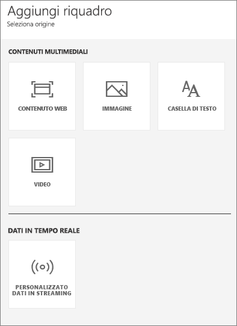
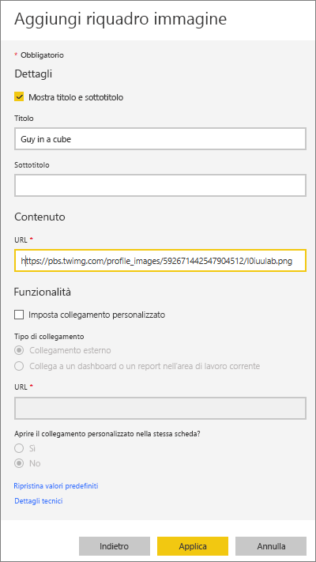
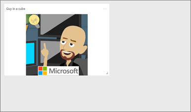
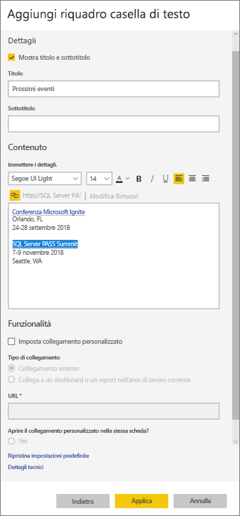
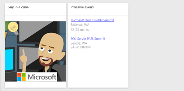
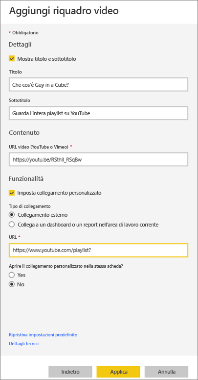
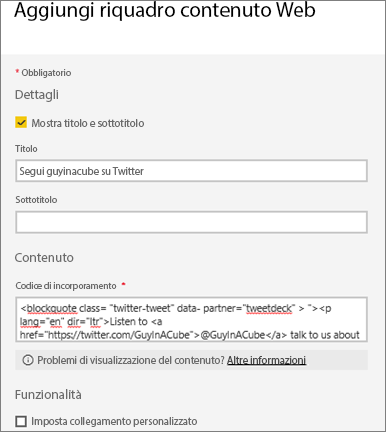
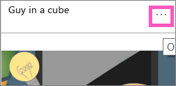

# <a name="add-image-text-video-and-more-to-your-dashboard"></a>Aggiungere immagini, testo, video e altri elementi al dashboard
<iframe width="560" height="315" src="https://www.youtube.com/embed/e2PD8m1Q0vU" frameborder="0" allowfullscreen></iframe>


## <a name="add-tile"></a>Aggiungi riquadro
Il controllo **Aggiungi riquadro** consente di aggiungere direttamente un'immagine, una casella di testo, un video, uno streaming di dati o un codice Web al dashboard.

1. Selezionare **Aggiungi riquadro** nella barra dei menu superiore. A seconda delle limitazioni di spazio, potrebbe essere visualizzato solo il segno più .
   
    
2. Selezionare il tipo di riquadro da aggiungere, ovvero **Immagine**, **Casella di testo**, **Video**, **Contenuto Web** o **Dati in streaming personalizzati**.
   
    

## <a name="add-an-image"></a>Aggiungere un'immagine
Si supponga di volere aggiungere il logo aziendale o un'altra immagine al dashboard. È necessario salvare il file di immagine online e creare un collegamento. Assicurarsi che non siano necessarie credenziali speciali per accedere al file di immagine. Ad esempio OneDrive e SharePoint richiedono l'autenticazione, quindi le immagini che vi sono archiviate non possono essere aggiunte a un dashboard in questo modo.  

1. Selezionare **Immagine** > **Avanti**.
2. Aggiungere le informazioni alla finestra **Aggiungi riquadro immagine**.
   
    
   
   * Per visualizzare un titolo sopra l'immagine, selezionare *Mostra titolo e sottotitolo* e digitare un titolo e/o un sottotitolo.
   * Immettere l'URL dell'immagine.
   * Per trasformare il riquadro in un collegamento ipertestuale, selezionare **Imposta collegamento personalizzato** e immettere l'URL.  Quando i colleghi selezionano questa immagine o questo titolo, verrà aperta la pagina corrispondente all'URL.
   * Selezionare **Applica**.  Nel dashboard ridimensionare e spostare l'immagine in base alla necessità.
     
     

## <a name="add-a-text-box-or-dashboard-heading"></a>Aggiungere un'intestazione per una casella di testo o un dashboard
1. Selezionare **Casella di testo > Avanti**.
   
   > **NOTA**: per aggiungere l'intestazione di un dashboard, digitarne il nome nella casella di testo e aumentare il tipo di carattere.
   > 
2. Formattare la casella di testo:
   
   * Per visualizzare un titolo sopra la casella di testo, selezionare **Mostra titolo e sottotitolo** e digitare un titolo e/o un sottotitolo.
   * Immettere e formattare il contenuto per la casella di testo.  
   * Facoltativamente, impostare un collegamento personalizzato per il titolo. Un collegamento personalizzato può essere un sito esterno o un dashboard oppure un report nell'area di lavoro. In questo esempio, tuttavia, sono stati aggiunti collegamenti ipertestuali entro la casella di testo, quindi occorre lasciare deselezionata l'opzione **Imposta collegamento personalizzato**.

     
   
3. Selezionare **Applica**.  Nel dashboard ridimensionare e spostare la casella di testo in base alla necessità.
   
   

## <a name="add-a-video"></a>Aggiungere un video
Quando si aggiunge un riquadro video di YouTube o Vimeo al dashboard, il video viene riprodotto direttamente nel dashboard.

1. Selezionare **Video > Avanti**.
2. Aggiungere le informazioni sul video al riquadro **Aggiungi riquadro video**.
   
    
   
   * Per visualizzare un titolo e un sottotitolo nella parte superiore del riquadro del video, selezionare *Mostra titolo e sottotitolo* e digitare un titolo e/o un sottotitolo. In questo esempio si aggiungerà un sottotitolo e quindi lo si trasformerà in un collegamento ipertestuale relativo all'intera playlist su YouTube.
   * Immettere l'URL per il video.
   * Aggiungere un collegamento ipertestuale per il titolo e il sottotitolo.  Se, dopo che i colleghi hanno guardato il video incorporato, si vuole che visualizzino l'intera playlist su YouTube, aggiungere qui un collegamento alla playlist.
   * Selezionare **Applica**.  Nel dashboard ridimensionare e spostare il video in base alla necessità.
     
      
3. Selezionare il riquadro video per riprodurre il video.
4. Selezionare il sottotitolo per visitare la playlist su YouTube.

## <a name="add-streaming-data"></a>Aggiungere lo streaming di dati
<iframe width="560" height="315" src="https://www.youtube.com/embed/kOuINwgkEkQ" frameborder="0" allowfullscreen></iframe>

## <a name="add-web-content"></a>Aggiungere contenuto Web
Incollare o digitare qualsiasi contenuto HTML.  Power BI lo aggiunge come riquadro al dashboard. Immettere il codice di incorporamento manualmente oppure copiare e incollare da siti quali Twitter, YouTube, embed.ly e così via.

1. Selezionare **Contenuto Web > Avanti**.
2. Aggiungere le informazioni nel riquadro **Aggiungi riquadro contenuto Web**.
   
    
   
   * Per visualizzare un titolo sopra il riquadro, selezionare *Mostra titolo e sottotitolo* e digitare un titolo e/o un sottotitolo.
   * Immettere il codice di incorporamento. In questo esempio viene copiato e incollato un feed di Twitter.
3. Selezionare **Applica**.  Nel dashboard ridimensionare e spostare il contenuto Web in base alla necessità.
     
      

## <a name="tips-for-embedding-web-content"></a>Suggerimenti per l'incorporamento di contenuto Web
* Per iframes, usare un'origine sicura. Se si immette il codice di incorporamento iframe codice e si ottiene un riquadro vuoto, controllare se è usato **http** per l'origine iframe.  In questo caso, modificarlo in **https**.
  
  ```
  <iframe src="https://xyz.com">
  ```
* Modificare le informazioni su larghezza e altezza. Questo codice incorpora un video e imposta il lettore video su 560 x 315 pixel.  Queste dimensioni non cambierà quando si ridimensiona il riquadro.
  
  ```
  <iframe width="560" height="315"
  src="https://www.youtube.com/embed/Cle_rKBpZ28" frameborder="0"
   allowfullscreen></iframe>
  ```
  
  Se si vuole ridimensionare il lettore per adattarlo ai riquadri, impostare larghezza e altezza su 100%.
  
  ```
  <iframe width="100%" height="100%"
  src="https://www.youtube.com/embed/Cle_rKBpZ28" frameborder="0"
   allowfullscreen></iframe>
  ```
* Questo codice incorpora un tweet e mantiene nel dashboard dei collegamenti separati per podcast **AFK**, **la pagina di Twitter di @GuyInACube**, **Segui**, **#analytics**, **risposta**, **retweet** e **mi piace**.  Selezionando il riquadro si raggiunge il podcast su Twitter.
  
  ```
  <blockquote class="twitter-tweet" data-partner="tweetdeck">
  <p lang="en" dir="ltr">Listen to
  <a href="https://twitter.com/GuyInACube">@GuyInACube</a> talk to
  us about making videos about Microsoft Business Intelligence
  platform
  <a href="https://t.co/TmRgalz7tv">https://t.co/TmRgalz7tv </a>
  <a href="https://twitter.com/hashtag/analytics?src=hash">
  #analytics</a></p>&mdash; AFTK Podcast (@aftkpodcast) <a
  href="https://twitter.com/aftkpodcast/status/693465456531771392">
  January 30, 2016</a></blockquote> <script async src="//platform.twitter.com/widgets.js" charset="utf-8"></script>
  ```

## <a name="edit-a-tile"></a>Modificare un riquadro
Per modificare un riquadro:

1. Passare il puntatore nell'angolo in alto a destra del riquadro e selezionare i puntini di sospensione.
   
    
2. Selezionare l'icona di modifica per riaprire il riquadro **Dettagli riquadro** e apportare modifiche.
   
    

## <a name="considerations-and-troubleshooting"></a>Considerazioni e risoluzione dei problemi
* Per semplificare lo spostamento del riquadro nel dashboard, aggiungere un titolo e/o un sottotitolo.
* Se si vuole incorporare un contenuto da un sito Web, che però non fornisce il codice di incorporamento da copiare e incollare, consultare embed.ly per indicazioni su come generare il codice di incorporamento.

## <a name="next-steps"></a>Passaggi successivi
[Riquadri del dashboard](service-dashboard-tiles.md)

Altre domande? [Provare la community di Power BI](http://community.powerbi.com/).

