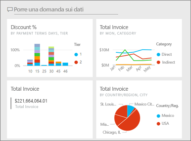
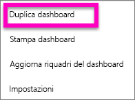
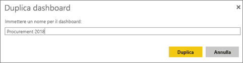
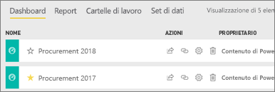

# Creare una copia di un dashboard nel servizio Power BI

 Esistono molte ragioni diverse per creare una copia di un dashboard. Ad esempio, potrebbe essere opportuno apportare modifiche e testarne le prestazioni rispetto all'originale oppure creare versioni lievemente differenti da distribuire in base a colleghi, area o team. Forse un collega ammira la progettazione del dashboard e vuole usarlo per la creazione di report da inviare al proprio responsabile. Un altro motivo potrebbe essere se si ha un nuovo database con la stessa struttura di dati e gli stessi tipi di dati e si vuole riutilizzare il dashboard già creato; tuttavia, ciò richiederebbe alcune operazioni in Power BI Desktop. 

I dashboard vengono creati e copiati tramite il servizio Power BI e possono essere visualizzati in Power BI per dispositivi mobili e in Power BI Embedded.  I dashboard non sono disponibili in Power BI Desktop. 

Per creare una copia di un dashboard, è necessario essere l'*autore* del dashboard. I dashboard che sono stati condivisi con l'utente corrente come app non possono essere duplicati.

1. Aprire il dashboard.
2. Nell'angolo in alto a destra selezionare i puntini di sospensione (...) e scegliere **Duplica dashboard**.
   
   
3. Assegnare un nome al dashboard e scegliere **Duplica**. 
   
   
4. Il nuovo dashboard viene salvato nella stessa area di lavoro dell'originale. 
   
   

5.    Aprire il nuovo dashboard e apportare le modifiche necessarie. È possibile eseguire queste operazioni:    
    a. [Spostare, rinominare, ridimensionare o eliminare i riquadri](service-dashboard-edit-tile.md).  
    b. Modificare i dettagli del riquadro e i collegamenti ipertestuali selezionando i puntini di sospensione (...) nel riquadro e scegliendo **Modifica dettagli**.  
    c. [Aggiungere nuovi riquadri dalla barra dei menu del dashboard](service-dashboard-add-widget.md) (**Aggiungi riquadro**).  
    d. Aggiungere nuovi riquadri [da Domande e risposte](service-dashboard-pin-tile-from-q-and-a.md) o [dai report](service-dashboard-pin-tile-from-report.md).  
    e. Rinominare il dashboard, attivare o disattivare Domande e risposte e configurare il flusso del riquadro dal riquadro Impostazioni del dashboard.  Selezionare il menu a discesa con puntini di sospensione (...) del dashboard e scegliere **Impostazioni**.  
    f. Condividere il dashboard direttamente con i colleghi o come parte di un'app di Power BI. 

## Passaggi successivi
* [Suggerimenti per la progettazione di un dashboard ottimale](service-dashboards-design-tips.md) 

Altre domande? [Provare la community di Power BI](http://community.powerbi.com/)

