# Creare un riquadro a un dashboard di Power BI da un report
Dopo aver letto [Dashboard in Power BI](service-dashboards.md) si vuole creare un dashboard personalizzato. Ci sono molti modi diversi per creare un dashboard: partendo da un report, da zero, da un set di dati, attraverso la duplicazione di un dashboard esistente e altri ancora.  

L'impresa può sembrare complicata all'inizio e per questo di seguito verrà descritta la procedura per creare un dashboard semplice e rapido aggiungendo visualizzazioni da un report già creato. Dopo aver completato questa guida introduttiva, saranno abbastanza chiare le relazioni tra dashboard e report, nonché le procedure per aprire la visualizzazione di modifica nell'editor di report, aggiungere riquadri e spostarsi tra un dashboard e un report. Usare quindi i collegamenti nel sommario a sinistra o in **Passaggi successivi** nella parte inferiore per procedere con argomenti più avanzati.

## Chi può creare un dashboard?
La creazione di un dashboard è una funzionalità per **autori** e richiede autorizzazioni di modifica per il report. Le autorizzazioni di modifica sono disponibili per gli autori dei report e per i colleghi a cui l'autore concede l'accesso. Ad esempio, se un utente crea un report in un'area di lavoro e quindi aggiunge un altro utente come membro di tale area di lavoro, entrambi avranno le autorizzazioni di modifica. Se invece un report viene condiviso direttamente o come parte di un'[app Power BI](service-install-use-apps.md) (**utilizzo** del report), non sarà possibile aggiungere riquadri a un dashboard.

> **NOTA**: i dashboard sono una funzionalità del servizio Power BI, non di Power BI Desktop. I dashboard non possono essere creati nella versione di Power BI per i dispositivi mobili, sui cui possono essere soltanto [visualizzati e condivisi](mobile-apps-view-dashboard.md).
>
> 

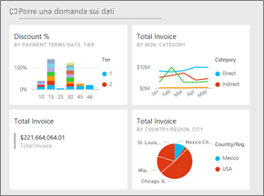

## Video: Creare un dashboard aggiungendo oggetti visivi e immagini da un report
Osserviamo Amanda creare un nuovo dashboard aggiungendo le visualizzazioni da un report. Seguire poi la procedura indicata sotto al video per provare in autonomia usando l'esempio dell'analisi di approvvigionamento.

<iframe width="560" height="315" src="https://www.youtube.com/embed/lJKgWnvl6bQ" frameborder="0" allowfullscreen></iframe>

### Prerequisiti
Per seguire la procedura, è necessario scaricare la cartella di lavoro di Excel di esempio "Procurement Analysis" (Analisi dell'approvvigionamento) e aprirla nel servizio Power BI (app.powerbi.com).

## Importare un set di dati con un report
Importeremo uno dei set di dati di esempio di Power BI e lo useremo per creare il nuovo dashboard. L'esempio che useremo è una cartella di lavoro di Excel con due fogli PowerView. Quando Power BI importa la cartella di lavoro, aggiunge un set di dati e anche un report all'area di lavoro.  Il report viene creato automaticamente dai fogli PowerView.

1. [Selezionare questo collegamento](http://go.microsoft.com/fwlink/?LinkId=529784) per scaricare e salvare il file di Excel di esempio dell'analisi di approvvigionamento. È consigliabile salvarlo in OneDrive for Business.
2. Aprire il servizio Power BI nel browser (app.powerbi.com).
3. Selezionare **Area di lavoro personale**.
4. Nel riquadro di spostamento a sinistra selezionare **Recupera dati**.

    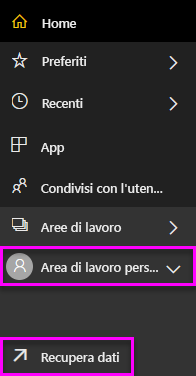
5. Selezionare **File**.

   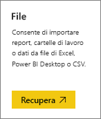
6. Andare al percorso in cui è stato salvato il file di Excel di esempio dell'analisi di approvvigionamento. Selezionarlo e scegliere **Connetti**.

   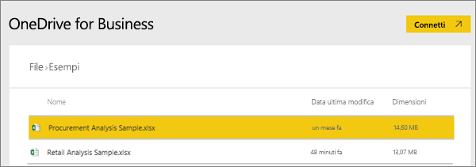
7. Per questo esercizio, selezionare **Importa**.

    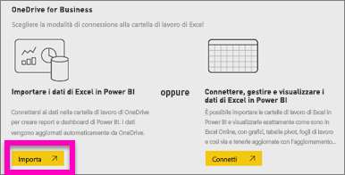
8. Quando viene visualizzato il messaggio di conferma, fare clic sulla **x** per chiuderlo.

   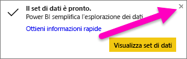

### Aprire il report e aggiungere alcuni riquadri a un dashboard
1. Rimanendo nella stessa area di lavoro selezionare la scheda **Report**. Il report appena importato appare contrassegnato con un asterisco giallo. Selezionare il nome del report per aprirlo.

    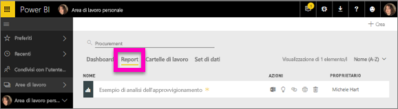
2. Il report viene aperto nella [Visualizzazione di lettura](service-reading-view-and-editing-view.md). Si noti che nella parte inferiore sono presenti due schede: Discount Analysis (Analisi sconti) e Spend Overview (Panoramica spesa). Ogni scheda rappresenta una pagina del report.
    Selezionare **Modifica report** per aprire il report in visualizzazione di modifica.

    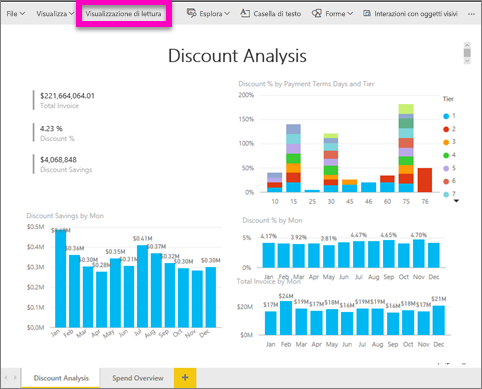
3. Passare il mouse su una visualizzazione per vedere le opzioni disponibili. Per aggiungere la visualizzazione a un dashboard, selezionare l'icona  perno.

    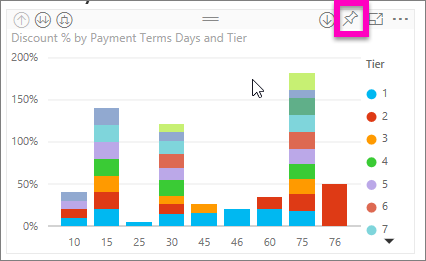
4. Poiché stiamo creando un nuovo dashboard, selezionare l'opzione per **Nuovo dashboard** e assegnare un nuovo nome.

   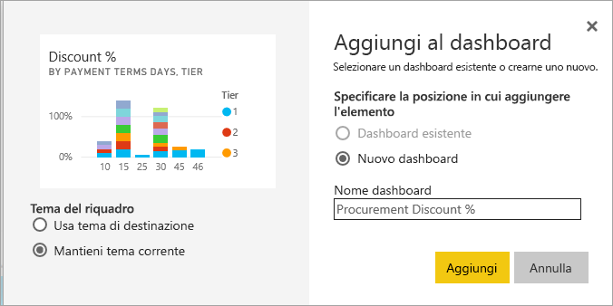
5. Quando si seleziona **Aggiungi**, Power BI crea il nuovo dashboard nell'area di lavoro corrente. Quando appare il messaggio **Aggiunti al dashboard**, selezionare **Vai al dashboard**. Se viene chiesto di salvare il report, scegliere **Salva**.

     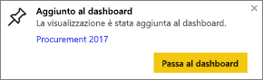
6. Power BI apre il nuovo dashboard in cui è presente un solo riquadro: la visualizzazione appena aggiunta.

   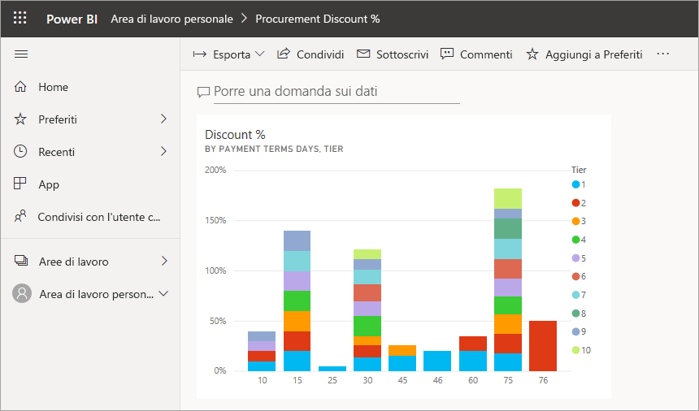
7. Per tornare al report, selezionare il riquadro. Aggiungere qualche altro riquadro al nuovo dashboard. A questo punto, quando viene visualizzata la finestra **Aggiungi al dashboard**, selezionare **Dashboard esistente**.  

   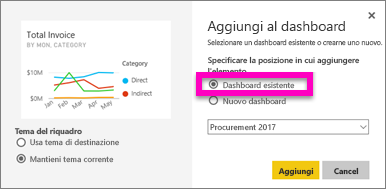

## Aggiungere un'intera pagina del report al dashboard
Invece di aggiungere un singolo oggetto visivo alla volta, è possibile [aggiungere un'intera pagina del report come *riquadro animato*](service-dashboard-pin-live-tile-from-report.md). Di seguito viene descritta la procedura.

1. Nell'editor di report selezionare la scheda **Spend Overview** (Panoramica delle spese) per aprire la seconda pagina del report.

   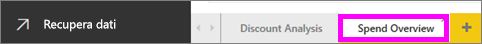

2. Si vogliono aggiungere tutti questi oggetti visivi nel dashboard.  Nell'angolo superiore destro della barra dei menu selezionare **Aggiungi pagina dinamica**. In un dashboard, i riquadri delle pagine dinamiche vengono aggiornati ogni volta che viene aggiornata la pagina.

   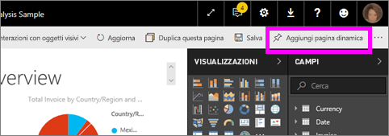

3. Quando viene visualizzata la finestra **Aggiungi al dashboard**, selezionare **Dashboard esistente**.

   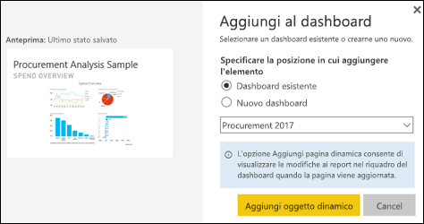

4. Quando viene visualizzato il messaggio di operazione riuscita, selezionare **Vai al dashboard**. Verranno visualizzati i riquadri aggiunti dal report. Nell'esempio seguente vengono aggiunti 2 riquadri dalla pagina 1 del report e un riquadro animato corrispondente alla pagina 2 del report.

   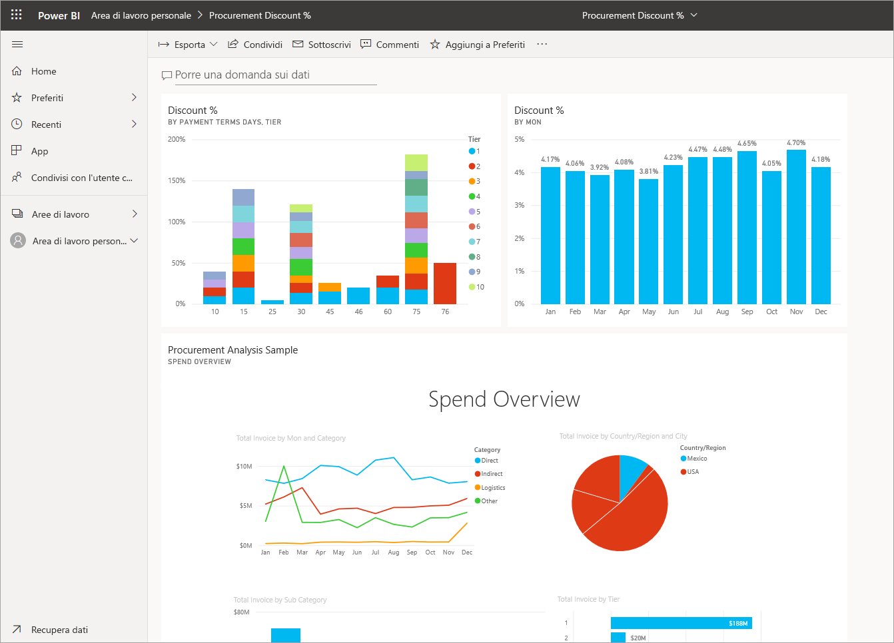

Congratulazioni per aver creato il primo dashboard. Ora che si dispone di un dashboard, ci sono molte altre cose che si possono fare con esso.  Provare uno dei **Passaggi successivi** suggeriti di seguito oppure usare ed esplorare per proprio conto.   

## Passaggi successivi
* [Ridimensionare e spostare i riquadri](service-dashboard-edit-tile.md)
* [Informazioni sui riquadri del dashboard](service-dashboard-tiles.md)
* [Condividere il dashboard creando un'app](service-create-distribute-apps.md)
* [Power BI - Concetti di base](service-basic-concepts.md)
* [Suggerimenti per la progettazione di un dashboard ottimale](service-dashboards-design-tips.md)

Altre domande? [Provare la community di Power BI](http://community.powerbi.com/)
