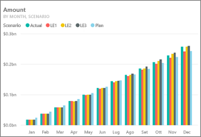
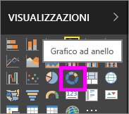
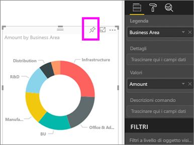
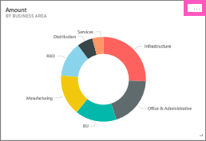
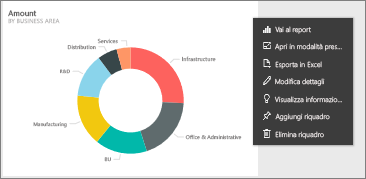
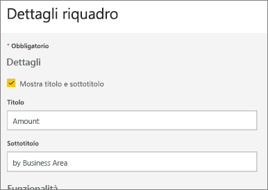
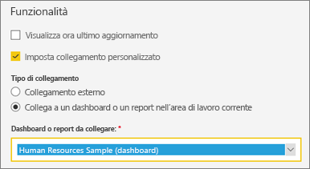
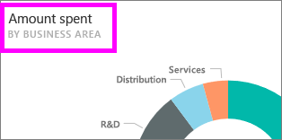
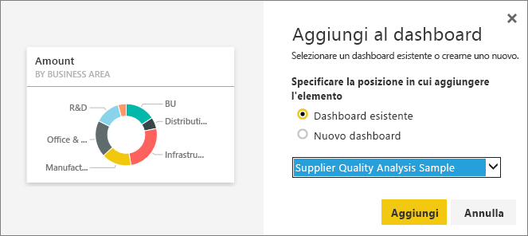

# Modificare o rimuovere un riquadro del dashboard

## Confronto tra *proprietari* del dashboard e *consumer* del dashboard
Quando si crea o si è proprietari di un dashboard, sono disponibili molte opzioni per la modifica dell'aspetto e del comportamento predefinito dei riquadri in tale dashboard. Usare le impostazioni e le strategie seguenti per progettare l'esperienza di *utilizzo* del dashboard per i colleghi.  È possibile stabilire che la selezione di un riquadro comporti l'apertura del report sottostante, di un URL personalizzato o di un dashboard diverso, oppure [aggiungere un riquadro che mostra un video o dati di streaming](service-dashboard-add-widget.md). È anche possibile [creare un riquadro con filtri dei dati interattivi](service-dashboard-pin-live-tile-from-report.md). L'*autore* può scegliere tra diverse opzioni. 

<iframe width="560" height="315" src="https://www.youtube.com/embed/lJKgWnvl6bQ" frameborder="0" allowfullscreen></iframe>

In questo articolo vengono trattati gli argomenti seguenti.

* [Creare una visualizzazione e aggiungerla a un dashboard](#create)
* [Spostare un riquadro](#move)
* [Ridimensionare un riquadro](#resize)
* [Rinominare un riquadro](#rename)
* [Aggiungere un collegamento ipertestuale a un riquadro](#hyperlink)
* [Aggiungere un riquadro a un altro dashboard](#different)
* [Eliminare un riquadro](#delete)
  
 > [!TIP]
 > Per modificare la visualizzazione nel riquadro, eliminare il riquadro e aggiungere un nuovo [riquadro del dashboard](service-dashboard-tiles.md).
 > 

 ### Prerequisiti
 1. Per seguire la procedura, aprire il servizio Power BI (non Power BI Desktop) e [scaricare l'Esempio di analisi della spesa IT](sample-it-spend.md). Quando viene visualizzato il messaggio "Operazione riuscita", selezionare **Vai al dashboard**

- - -

## Creare una nuova visualizzazione e aggiungerla al dashboard
1. Dal dashboard dell'Esempio di analisi della spesa IT selezionare il riquadro "Amount" per aprire il report.

    

2. Aprire il report in visualizzazione di modifica selezionando **Modifica report** sulla barra dei menu in alto.

3. Aggiungere una nuova pagina del report selezionando il segno più (+) nella parte inferiore del report.

    

4. Dal riquadro CAMPI selezionare **Fact > Amount** e **Business Area > Business Area**.
 
5. Dal riquadro VISUALIZZAZIONI selezionare l'icona del grafico ad anello per convertire la visualizzazione in un grafico ad anello.

    

5. Selezionare l'icona a forma di puntina e aggiungere il grafico ad anello al dashboard dell'Esempio di analisi della spesa IT.

   

6. Quando viene visualizzato il messaggio "Operazione riuscita", selezionare **Vai al dashboard**. Verrà richiesto di salvare le modifiche. Selezionare **Salva**.

- - -

## Spostare il riquadro
Individuare il nuovo riquadro nel dashboard. Selezionare e tenere premuto il riquadro per trascinarlo nella nuova posizione nell'area di disegno dashboard.

- - -

## Ridimensionare il riquadro
È possibile creare riquadri di dimensioni diverse, da unità di riquadro 1x1 fino a 5x5. Selezionare e trascinare il punto di controllo (nell'angolo in basso a destra) per ridimensionare il riquadro.

- - -
## Menu di puntini di sospensione (...)

1. Selezionare i puntini di sospensione (...) nell'angolo in alto a destra del riquadro. 
   
   

2. Passare il puntatore del mouse sul riquadro "Account" del dashboard e selezionare i puntini di sospensione per visualizzare le opzioni. Le opzioni disponibili dipendono dal tipo di riquadro.  Ad esempio, le opzioni disponibili per un riquadro animato sono diverse rispetto alle opzioni per un riquadro di visualizzazione standard. Se un dashboard è stato condiviso con l'utente, ovvero se non si è il proprietario del dashboard, saranno inoltre disponibili meno opzioni.

   

3. Selezionare **Modifica dettagli** per aprire la finestra "Dettagli riquadro". 

    Modificare il titolo e il comportamento predefinito del riquadro.  È ad esempio possibile che si voglia stabilire che quando un *consumer* seleziona un riquadro non venga aperto il report usato per creare tale riquadro ma venga invece visualizzato un nuovo dashboard.  
   

### Rinominare il riquadro
Nella parte superiore della finestra "Dettagli riquadro" cambiare **Titolo** in **Amount spent**.

### Modificare il collegamento ipertestuale predefinito
Per impostazione predefinita, se si seleziona un riquadro viene in genere aperto il report in cui è stato creato il riquadro oppure Domande e risposte (se il riquadro è stato creato in Domande e risposte). Per creare un collegamento a una pagina Web, a un altro dashboard o report (nella stessa area di lavoro), a un report SSRS o ad altri contenuti online, aggiungere un collegamento personalizzato.

1. Sotto l'intestazione Funzionalità selezionare **Imposta collegamento personalizzato**.

2. Selezionare **Collega a un dashboard o un report nell'area di lavoro corrente** e quindi selezionare un'opzione dall'elenco a discesa.  In questo esempio è stato selezionato il dashboard dell'Esempio di analisi delle risorse umane. Se questo esempio non è già disponibile nell'area di lavoro, è possibile aggiungerlo e tornare a questo passaggio oppure selezionare un dashboard diverso. 

    

3. Selezionare **Applica**.

4. Il nuovo titolo viene visualizzato nel riquadro.  Quando si seleziona il riquadro, Power BI apre il dashboard delle risorse umane. 

    

### Aggiungere il riquadro a un altro dashboard
1. Dal menu a discesa con puntini di sospensione selezionare **Aggiungi sezione** .
2. Decidere se aggiungere un duplicato di questo riquadro a un dashboard esistente o a un nuovo dashboard. 
   
   
3. Selezionare **Aggiungi**.

### Eliminare il riquadro
1. Per rimuovere in modo permanente un riquadro da un dashboard, selezionare **Elimina riquadro**  dal menu a discesa con puntini di sospensione. 

2. Se si elimina un riquadro, non viene eliminata la visualizzazione sottostante. Aprire il report sottostante selezionando il riquadro "Amount". Aprire l'ultima pagina del report per verificare che le visualizzazioni originali non siano state eliminate dal report. 

- - -
## Passaggi successivi
[Riquadri del dashboard in Power BI](service-dashboard-tiles.md)

[Dashboard in Power BI](service-dashboards.md)

[Power BI - Concetti di base](service-basic-concepts.md)

Altre domande? [Provare la community di Power BI](http://community.powerbi.com/)

