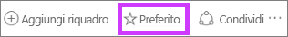
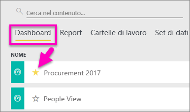
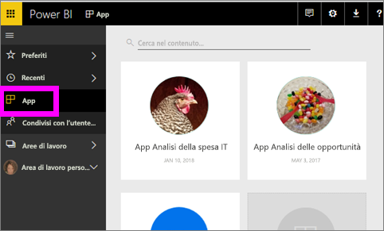
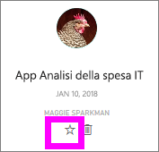
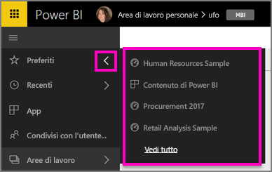
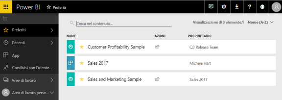
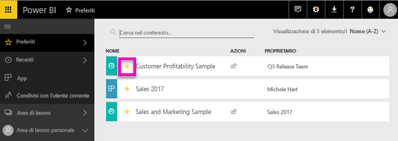

# Aggiungere a Preferiti dashboard, report e app nel servizio Power BI
Dopo aver aggiunto un contenuto a *Preferiti* è possibile accedere a tale contenuto da tutte le aree di lavoro.  I Preferiti sono in genere i contenuti a cui si accede con maggior frequenza.

> [!NOTE]
> Questo argomento si applica al servizio Power BI e non a Power BI Desktop.
> 
> 

È anche possibile selezionare un singolo dashboard come [dashboard in primo piano](service-dashboard-featured.md) nel servizio Power BI.

## Aggiungere un dashboard o un report a *Preferiti*
Il video seguente illustra come aggiungere preferiti all'area di lavoro personale. Seguire quindi tutte le istruzioni riportate sotto il video per provare a farlo da soli.

<iframe width="560" height="315" src="https://www.youtube.com/embed/G26dr2PsEpk" frameborder="0" allowfullscreen></iframe>

1. Aprire un dashboard o un report usato di frequente. È possibile aggiungere a *Preferiti* anche contenuti condivisi da altri utenti.
2. Nell'angolo in alto a destra del servizio Power BI selezionare **Aggiungi a Preferiti** o l'icona a forma di stella .
   
   
   
   È anche possibile aggiungere a Preferiti un dashboard o un report dalla scheda di visualizzazione contenuto **Dashboard** o **Report** dell'area di lavoro.
   
   

## Aggiungere un'app a *Preferiti*

1. Nel riquadro di spostamento a sinistra selezionare **App**.

   

2. Portare il puntatore del mouse su un'app per visualizzare altri dettagli.  Selezionare l'icona a forma di stella   per aggiungere l'app a Preferiti.
   
   

## Uso dei *Preferiti*
1. Per accedere ai Preferiti da qualsiasi area di lavoro, selezionare la freccia del riquadro a comparsa a destra di **Preferiti**.  Da qui è possibile selezionare un elemento di Preferiti per aprirlo. L'elenco include solo cinque dashboard aggiunti ai Preferiti in ordine alfabetico. Se sono presenti più di cinque elementi, selezionare **Visualizza tutto** per aprire la schermata Preferiti (vedere il punto 2 di seguito). 
   
   
2. Per visualizzare **tutti** i contenuti che sono stati aggiunti ai Preferiti, nel riquadro di spostamento a sinistra selezionare **Preferiti** oppure l'icona Preferiti .  
   
    
   
   Da qui è possibile eseguire varie operazioni: aprire l'elemento, identificarne i proprietari o condividerlo con i colleghi.

## Rimuovere contenuti da Preferiti
Se un report viene usato di rado,  è possibile rimuoverlo dai Preferiti. Un contenuto rimosso dall'elenco Preferiti non viene rimosso da Power BI.

1. Nel riquadro di spostamento a sinistra selezionare **Preferiti** per aprire la schermata **Preferiti**.
   
   
2. Selezionare la stella gialla accanto al contenuto per rimuoverlo da Preferiti.

> **NOTA**: è possibile rimuovere da Preferiti un dashboard, un report o anche un'app. È sufficiente aprire l'elemento e deselezionare l'icona gialla.   
> 
> 

## Passaggi successivi
[Introduzione a Power BI](service-get-started.md)

[Power BI - Concetti di base](service-basic-concepts.md)

Altre domande? [Provare la community di Power BI](http://community.powerbi.com/)

