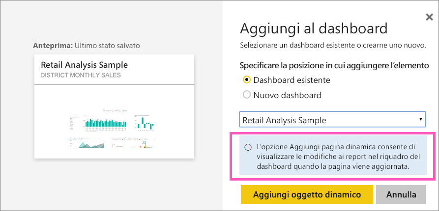
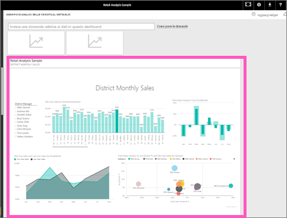

# Aggiungere un'intera pagina del report, come riquadro animato, a un dashboard di Power BI
Per aggiungere un nuovo [riquadro del dashboard](service-dashboard-tiles.md), è anche possibile aggiungere un'intera pagina del report. Questo è un modo semplice per aggiungere più di una visualizzazione contemporaneamente.  Inoltre, quando si aggiunge un'intera pagina, i riquadri sono *animati*. È possibile interagire con essi direttamente nel dashboard. Le modifiche apportate a qualsiasi visualizzazione nell'editor di report, ad esempio l’aggiunta di un filtro o la modifica dei campi utilizzati nel grafico, vengono riflesse anche nel riquadro del dashboard.  

L'aggiunta di riquadri dinamici dai report ai dashboard è disponibile solo nel servizio Power BI (app.powerbi.com).

> [!NOTE]
> Non è possibile aggiungere i riquadri dai report condivisi con l'utente.
> 
> 

## Aggiungere una pagina del report
Il video seguente mostra come aggiungere una pagina dinamica del report. Seguire quindi le istruzioni dettagliate successive per fare una prova in prima persona.

<iframe width="560" height="315" src="https://www.youtube.com/embed/EzhfBpPboPA" frameborder="0" allowfullscreen></iframe>

1. Aprire un report nella [Visualizzazione di modifica](service-interact-with-a-report-in-editing-view.md).
2. Senza selezionare alcuna visualizzazione scegliere **Aggiungi pagina dinamica** nella barra dei menu.
   
    
3. Aggiungere il riquadro a un dashboard esistente o a un nuovo dashboard. Si noti il testo evidenziato: *L'opzione Aggiungi pagina dinamica consente di visualizzare le modifiche ai report nel riquadro del dashboard quando la pagina viene aggiornata.*
   
   * Dashboard esistente: selezionare il nome del dashboard nell'elenco a discesa. I dashboard che sono stati condivisi con l'utente non saranno presenti nell'elenco a discesa.
   * Nuovo dashboard: digitare il nome del nuovo dashboard.
     
     
4. Selezionare **Aggiungi oggetto dinamico**. Un messaggio di operazione completata (nell'angolo superiore destro) informa l'utente che la pagina è stata aggiunta, come riquadro, al dashboard.

## Aprire il dashboard per visualizzare il riquadro animato bloccato
1. Nel riquadro di spostamento selezionare il dashboard con il nuovo riquadro animato. In quel punto è possibile eseguire operazioni come [rinominare, ridimensionare, collegare e spostare](service-dashboard-edit-tile.md) la pagina del report aggiunta.  
2. Interagire con il riquadro animato.  Nella schermata seguente, se si seleziona una barra nell'istogramma, le altre visualizzazioni nel riquadro vengono evidenziate e filtrate in modo incrociato.
   
    

## Passaggi successivi
[Dashboard in Power BI](service-dashboards.md)

Altre domande? [Provare la community di Power BI](http://community.powerbi.com/)

