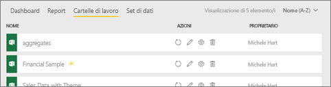
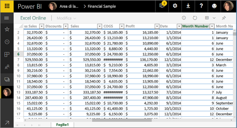
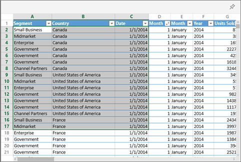
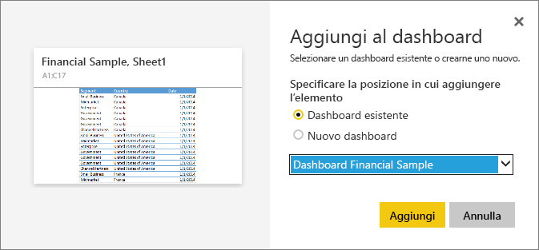

# Aggiungere un riquadro a un dashboard di Power BI da Excel
Prima di poter aggiungere un riquadro dalla cartella di lavoro di Excel, è necessario connettere la cartella di lavoro al servizio Power BI (app.powerbi.com). La connessione di una cartella di lavoro importa essenzialmente una versione di sola lettura collegata della cartella di lavoro nel servizio Power BI e consente di aggiungere intervalli ai dashboard. È anche possibile aggiungere un intero foglio di lavoro a un dashboard.  
Se una cartella di lavoro è stata condivisa con l'utente corrente, sarà possibile visualizzare i riquadri aggiunti dal proprietario, ma non creare altri riquadri del dashboard. 

Per informazioni dettagliate sull'interazione tra Excel e Power BI, vedere [Ottenere dati dai file delle cartelle di lavoro di Excel](http://go.microsoft.com/fwlink/?LinkID=521962).

Il video seguente illustra i diversi modi per importare i dati dalla cartella di lavoro di Excel e connettersi.

<iframe width="560" height="315" src="https://www.youtube.com/embed/l8JoB7w0zJA" frameborder="0" allowfullscreen></iframe>

## Connettere la cartella di lavoro di Excel da OneDrive for Business a Power BI
Quando si sceglie **Connetti**, la cartella di lavoro viene visualizzata in Power BI esattamente come in Excel Online. A differenza di Excel Online, però, sono disponibili alcune utilissime funzionalità per aggiungere elementi dai fogli di lavoro direttamente ai dashboard.

Non è possibile modificare la cartella di lavoro in Power BI. Se è necessario apportare modifiche, selezionare l'icona della matita nella scheda **Cartelle di lavoro** dell'area di lavoro e quindi scegliere se modificare la cartella di lavoro in Excel Online oppure aprirla in Excel nel computer. Le modifiche apportate vengono salvate nella cartella di lavoro in OneDrive.

1. Caricare la cartella di lavoro in OneDrive for Business.

2. Da Power BI [connettersi alla cartella di lavoro](service-excel-workbook-files.md) selezionando **Recupera dati > File > OneDrive for Business** e passare al percorso in cui è stato salvato il file di Excel. Selezionare il file e scegliere **Connetti > Connetti**.

    

3. In Power BI la cartella di lavoro viene aggiunta alla scheda **Cartelle di lavoro** dell'area di lavoro.  L'icona  indica che si tratta di una cartella di lavoro di Excel e l'asterisco giallo indica che è nuova.
    
    
4. Aprire la cartella di lavoro in Power BI selezionandone il nome.

    Le modifiche apportate alla cartella di lavoro in Power BI non vengono salvate e non influiscono sulla cartella di lavoro originale in OneDrive for Business. Se si ordinano, filtrano o modificano i valori in Power BI, tali modifiche non possono essere salvate o bloccate. Se è necessario apportare modifiche che verranno salvate, selezionare **Modifica** nell'angolo in alto a destra per aprirla per la modifica in Excel Online o in Excel. Con le modifiche apportate in questo modo potrebbero essere necessari alcuni minuti per aggiornare i riquadri nei dashboard.
   
    

## Aggiungere un intervallo di celle a un dashboard
Per aggiungere un nuovo [riquadro del dashboard](consumer/end-user-tiles.md), è possibile procedere all'interno di una cartella di lavoro di Excel in Power BI. Gli intervalli possono essere aggiunti dalle cartelle di lavoro di Excel che sono state salvate in OneDrive per Business o in un'altra raccolta documenti condivisi con il gruppo. Gli intervalli possono contenere dati, grafici, tabelle, tabelle pivot, grafici pivot e altre parti di Excel.

1. Evidenziare le celle che si desidera aggiungere a un dashboard.
   
    
2. Seleziona l'icona Aggiungi  . 
3. Aggiungere il riquadro a un dashboard esistente o a un nuovo dashboard. 
   
   * Dashboard esistente: selezionare il nome del dashboard nell'elenco a discesa.
   * Nuovo dashboard: digitare il nome del nuovo dashboard.
   
     
4. Selezionare **Aggiungi**. Un messaggio di operazione completata (nell'angolo superiore destro) informa l'utente che è stato aggiunto l'intervallo, come riquadro, al dashboard. 
   
    
5. Selezionare **Vai al dashboard**. In questa schermata è possibile [rinominare, ridimensionare, collegare e spostare](service-dashboard-edit-tile.md) la visualizzazione aggiunta. Per impostazioni predefinita, se si seleziona il riquadro aggiunto, la cartella di lavoro verrà aperta in Power BI.

## Aggiungere un'intera tabella o una tabella pivot a un dashboard
Seguire la procedura precedente, ma invece di selezionare un intervallo di celle, selezionare un'intera tabella o tabella pivot.

Per aggiungere una tabella, selezionare l'intero intervallo della tabella e assicurarsi di includere le intestazioni.  Per aggiungere una tabella pivot, assicurarsi di includere tutte le parti visibili della tabella pivot, inclusi i filtri se usati.

 

Un riquadro creato da una tabella o una tabella pivot visualizzerà l'intera tabella.  Se si aggiunge/rimuove/filtra righe o colonne nella cartella di lavoro originale, anche queste saranno aggiunte/rimosse/filtrate nel riquadro.

## Visualizzare la cartella di lavoro collegata al riquadro
Se si seleziona un riquadro della cartella di lavoro, la cartella di lavoro collegata verrà aperta in Power BI. Poiché il file della cartella di lavoro si trova nel OneDrive for Business del proprietario, per visualizzarla è necessario disporre delle autorizzazioni di lettura per la cartella di lavoro. Se non si ha l'autorizzazione, si riceverà un messaggio di errore.  

 

## Considerazioni e risoluzione dei problemi
Funzionalità non supportate: Power BI usa Excel Services per recuperare i riquadri della cartella di lavoro. Di conseguenza, poiché alcune funzionalità di Excel non sono supportate nell'API REST di Excel Services, esse non verranno visualizzate nei riquadri in Power BI. ad esempio: grafici sparkline, formattazione condizionale dei set di icone e filtri dei dati ora. Per un elenco completo delle funzionalità non supportate, vedere [Funzionalità non supportate nelle API REST di Excel Services](http://msdn.microsoft.com/library/office/ff394477.aspx).

## Passaggi successivi
[Condividere un dashboard che include collegamenti a una cartella di lavoro di Excel](service-share-dashboard-that-links-to-excel-onedrive.md)

[Ottenere dati dai file delle cartelle di lavoro di Excel](service-excel-workbook-files.md)

Altre domande? [Provare la community di Power BI](http://community.powerbi.com/)

