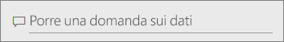
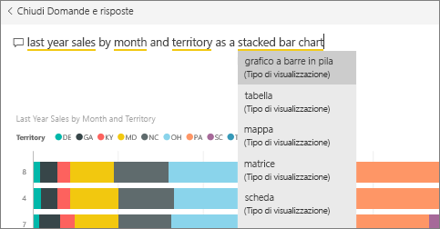
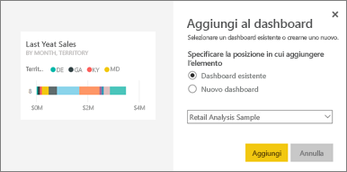
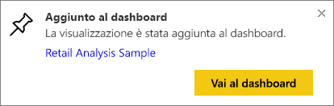
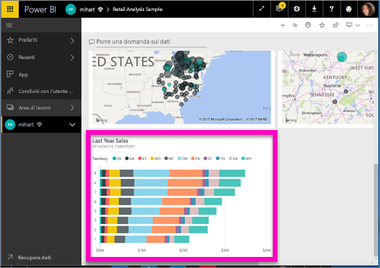
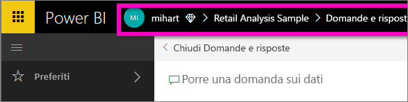

# Aggiungere un riquadro a un dashboard da Domande e risposte
## Come aggiungere un riquadro dalle domande e risposte
Domande e risposte è lo strumento ad hoc per la creazione di report di Power BI. Se ad esempio si vogliono ottenere informazioni dettagliate specifiche, è possibile porre una domanda sui dati per ottenere una risposta sotto forma di visualizzazione.

Domande e risposte è disponibile da dashboard e dai report. In questo articolo Domande e risposte verrà aperto da un dashboard. I dashboard sono disponibili nel servizio Power BI ma non in Power BI Desktop. Per seguire la procedura, aprire il [dashboard dell'esempio di analisi delle vendite al dettaglio](sample-retail-analysis.md).
> 
> 

1. Aprire un [dashboard](service-dashboards.md) a cui è stato aggiunto almeno un riquadro da un report. Quando si pone una domanda, Power BI cerca la risposta in qualsiasi set di dati per il quale è stato aggiunto un riquadro nel dashboard.  Per altre informazioni, vedere [Origini dati per il servizio Power BI](service-get-data.md).
2. Nella casella della domanda nella parte superiore del dashboard iniziare a digitare una domanda relativa ai dati.  
   
3. Ad esempio, se si digita "vendite dell'ultimo anno per mese e territorio"...  
   
   
   la casella della domanda offre alcuni suggerimenti.
4. Per aggiungere il grafico al dashboard sotto forma di riquadro, selezionare la puntina  sul lato destro superiore dell'area di disegno.
5. Aggiungere il riquadro a un dashboard esistente o a un nuovo dashboard. 

   

   * Dashboard esistente: selezionare il nome del dashboard nell'elenco a discesa. I dashboard selezionabili sono solo quelli presenti nell'area di lavoro corrente.
   * Nuovo dashboard: digitare il nome del nuovo dashboard per aggiungerlo all'area di lavoro corrente.
6. Selezionare **Aggiungi**.
   
   Un messaggio di operazione completata (nell'angolo superiore destro) informa l'utente che la visualizzazione è stata aggiunta al dashboard sotto forma di riquadro.  
   
   
7. Selezionare **Vai al dashboard** per visualizzare il nuovo riquadro. È quindi possibile [rinominare, ridimensionare, aggiungere un collegamento ipertestuale, riposizionare il riquadro e molto altro](service-dashboard-edit-tile.md) nel dashboard. 
   
   

## Considerazioni e risoluzione dei problemi
* Quando si inizia a digitare una domanda, Domande e risposte inizia subito a cercare la risposta migliore in tutti i set di dati associati al dashboard corrente,  ovvero quello elencato nella barra di spostamento superiore. Questa domanda, ad esempio, viene posta nel dashboard dell'**esempio di analisi delle vendite al dettaglio**, che fa parte dell'area di lavoro per le app **mihart**.
  
  
* **Per individuare i set di dati da usare**,  Domande e risposte accede a tutti i set di dati per cui sono state aggiunte visualizzazioni al dashboard.

## Passaggi successivi
[Rinominare, ridimensionare, aggiungere un collegamento ipertestuale, riposizionare il riquadro e molto altro ancora](service-dashboard-edit-tile.md)    
[Visualizzare il riquadro del dashboard nella modalità messa a fuoco](service-focus-mode.md)     
Tornare a [Domande e risposte in Power BI](service-q-and-a.md)  
Altre domande? [Provare la community di Power BI](http://community.powerbi.com/)

