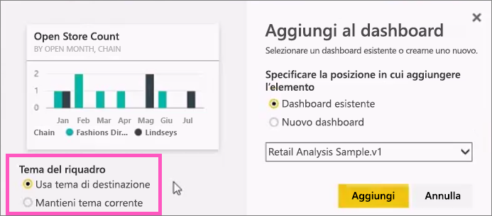
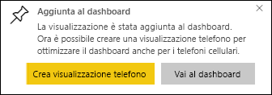

# Aggiungere un riquadro a un dashboard di Power BI da un report

Un modo per aggiungere un [riquadro a un dashboard ](consumer/end-user-tiles.md)è dall'interno di un [report di Power BI](consumer/end-user-reports.md). Quando si seleziona uno di questi riquadri, il riquadro viene aperto nel report.

È possibile aggiungere un'intera pagina del report a un dashboard. Questa operazione è denominata aggiunta di un riquadro *animato*. Il riquadro è definito animato perché è possibile interagirvi nel dashboard. A differenza dei riquadri di visualizzazione singoli, le modifiche apportate nel report vengono sincronizzate automaticamente con il dashboard. Per altre informazioni, vedere [Aggiungere un'intera pagina del report](#pin-an-entire-report-page).

Non è possibile aggiungere riquadri dai report condivisi con l'utente o da Power BI Desktop. 

> [!TIP]
> Poiché alcune visualizzazioni usano immagini di sfondo, è possibile che l'operazione di aggiunta non abbia esito positivo se l'immagine di sfondo è troppo grande. Provare a ridurre le dimensioni dell'immagine o a usare la compressione dell'immagine.  
> 
> 

## Aggiungere un riquadro da un report
Il video seguente mostra come creare un dashboard aggiungendo oggetti visivi e immagini da un report di Power BI.
    

<iframe width="560" height="315" src="https://www.youtube.com/embed/lJKgWnvl6bQ" frameborder="0" allowfullscreen></iframe>

A questo punto si può creare un dashboard personalizzato usando uno dei report di esempio di Power BI.

1. Nel report passare il puntatore del mouse sulla visualizzazione da aggiungere, quindi selezionare l'icona Aggiungi. . Power BI apre la schermata **Aggiungi al dashboard** .
   
     
2. Decidere se aggiungere il riquadro a un dashboard esistente o a uno nuovo.
   
   * **Dashboard esistente**: selezionare il nome del dashboard nell'elenco a discesa. I dashboard che sono stati condivisi da altri utenti non saranno presenti nell'elenco a discesa.
   * **Nuovo dashboard**: immettere il nome del nuovo dashboard.
3. In alcuni casi, l’elemento che si intende aggiungere può avere un *tema* già applicato. Ad esempio, gli elementi visivi aggiunti da una cartella di lavoro di Excel. In questo caso, selezionare il tema da applicare al riquadro.
4. Selezionare **Aggiungi**.
   
   Un messaggio di operazione completata (nell'angolo superiore destro) informa che la visualizzazione è stata aggiunta sotto forma di riquadro al dashboard.
   
   
5. Nel riquadro di spostamento selezionare il dashboard con il nuovo riquadro. [Modificare la visualizzazione e il comportamento del riquadro](service-dashboard-edit-tile.md) oppure selezionare il riquadro per tornare al report.

## Aggiungere un'intera pagina del report
Un'altra opzione consiste nell'aggiungere un'intera pagina del report a un dashboard. Questa operazione rappresenta un modo semplice per aggiungere più visualizzazioni alla volta. Quando si aggiunge un'intera pagina, i riquadri sono *animati*, quindi è possibile interagirvi nel dashboard. Le modifiche che si apportano a una qualsiasi delle visualizzazioni nell'editor di report, ad esempio l’aggiunta di un filtro o la modifica dei campi usati nel grafico, si riflettono anche nel riquadro del dashboard.  

Per altre informazioni, vedere [Aggiungere un'intera pagina del report](service-dashboard-pin-live-tile-from-report.md).

## Passaggi successivi
- [Dashboard per i consumer del servizio Power BI](consumer/end-user-dashboards.md)
- [Riquadri del dashboard in Power BI](consumer/end-user-tiles.md)
- [Report in Power BI](consumer/end-user-reports.md)
- [Aggiornamento dei dati in Power BI](refresh-data.md)
- [Concetti di base sulle finestre di progettazione del servizio Power BI](service-basic-concepts.md)

Altre domande? [Provare la community di Power BI](https://community.powerbi.com/)

