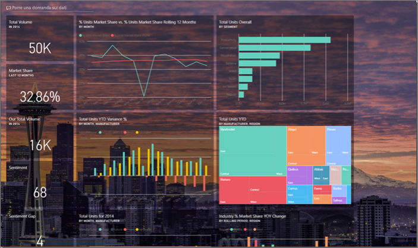
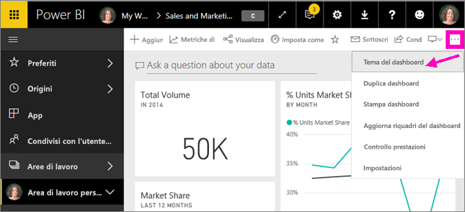
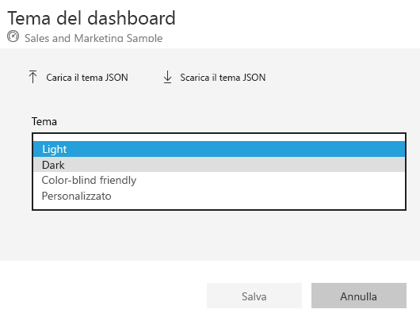
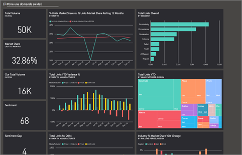
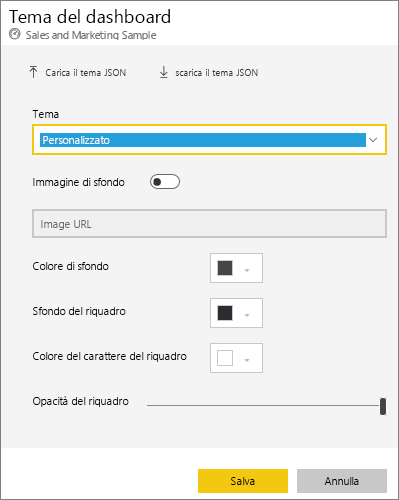
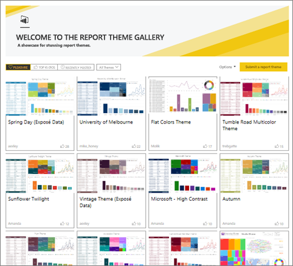
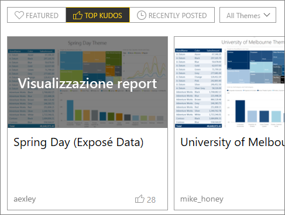
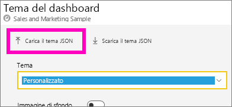
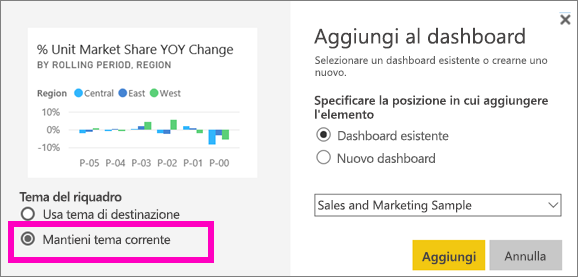
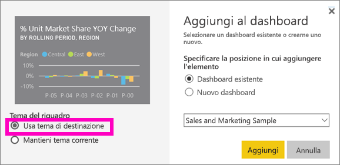

# Usare i temi del dashboard nel servizio Power BI
I **temi del dashboard** consentono di applicare un colore del tema a un intero dashboard, ad esempio i colori aziendali, i colori della stagione o qualunque altro tema di colori. Quando si applica un **tema del dashboard**, tutti gli oggetti visivi del dashboard usano i colori del tema selezionato, salvo alcuni casi particolari descritti più avanti in questo articolo.

La modifica dei colori degli oggetti visivi del report nel dashboard non condiziona gli oggetti visivi nel report. Quando si aggiungono i riquadri di un report in cui è già applicato un [tema del report](desktop-report-themes.md), è anche possibile scegliere di continuare a usare il tema corrente oppure scegliere il tema del dashboard.

## Prerequisiti
* Per procedere, [aprire il dashboard Esempio di analisi di vendite e marketing](sample-datasets.md).

## Funzionamento dei temi del dashboard
Per iniziare, aprire un dashboard creato, o un dashboard di cui si dispone dell'autorizzazione di modifico, che si vuole personalizzare. Selezionare **Altre opzioni** (...) e scegliere **Tema del dashboard**. 

Nel riquadro del dashboard visualizzato selezionare uno dei temi predefiniti.  Nell'esempio seguente è stato selezionato il tema **Scuro**.

## Creare un tema personalizzato

Il tema predefinito per i dashboard di Power BI è **Chiaro**. Per personalizzare i colori o crea un tema personalizzato, selezionare **Personalizzato** nell'elenco a discesa. 

Usare le opzioni personalizzate per creare un tema del dashboard personalizzato. Se si aggiunge un'immagine di sfondo, è consigliabile che la risoluzione sia almeno 1920x1080. Per usare un'immagine come sfondo, caricare l'immagine da un sito Web pubblico, copiare l'URL e incollarlo nel campo **URL immagine**. 

### Uso di temi JSON
Un altro modo per creare un tema personalizzato consiste nel caricare un file JSON contenente le impostazioni per tutti i colori che si vogliono usare nel dashboard. In Power BI Desktop gli autori dei report usano file JSON per [creare temi per i report](desktop-report-themes.md). Questi stessi file JSON possono essere caricati per i dashboard oppure è possibile trovare e caricare i file JSON dalla [pagina della raccolta temi](https://community.powerbi.com/t5/Themes-Gallery/bd-p/ThemesGallery) nella community di Power BI 

È anche possibile salvare il tema personalizzato come file JSON e condividerlo con altri autori di dashboard. 

### Usa un tema dalla raccolta temi

Come accade con le opzioni predefinite e personalizzate, quando si carica il tema, i colori vengono automaticamente applicati a tutti i riquadri del dashboard. 

1. Passare il mouse su un tema e scegliere **Visualizzazione report**.

    

2. Scorrere verso il basso per trovare il collegamento al file JSON.  Selezionare l'icona di download e salvare il file.

    

3. Tornare al servizio Power BI. Nella finestra Tema del dashboard Personalizzato selezionare **Carica il tema JSON**.

    

4. Scegliere il percorso in cui è stato salvato il file del tema JSON e selezionare **Apri**.

5. Nella pagina Tema del dashboard selezionare **Salva**. Il nuovo tema sarà applicato al dashboard.

    

## Considerazioni e limitazioni

* Se il report usa un tema diverso da quello del dashboard, è possibile controllare se l'oggetto visivo mantiene il tema corrente o usa quello del dashboard per rispettare la coerenza tra gli oggetti visivi di varie origini. Quando si aggiunge un riquadro a un dashboard, selezionare **Mantieni tema corrente** se si vuole mantenere il tema del report. L'oggetto visivo nel dashboard continuerà a usare il tema del report, incluse le impostazioni relative alla trasparenza. 

    Le opzioni di **Tema del riquadro** vengono visualizzate solo quando il report è stato creato in Power BI Desktop, [è stato aggiunto un tema del report](desktop-report-themes.md) e il report è stato pubblicato nel servizio Power BI. 

    

    Riprovare aggiungendo il riquadro e selezionando **Usa tema di destinazione**.

    

* I temi del dashboard non possono essere applicati a pagine dinamiche del report aggiunte, riquadri iFrame, riquadri SSRS, riquadri di cartelle di lavoro o immagini.
* I temi del dashboard possono essere visualizzati nei dispositivi mobili, ma un tema del dashboard può essere creato solo nel servizio Power BI. 
* I temi personalizzati del dashboard funzionano solo con i riquadri aggiunti dei report. 

