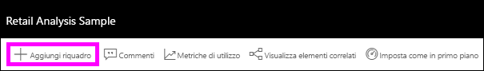
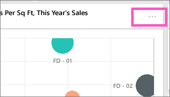
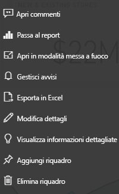

# Introduzione ai riquadri del dashboard per le finestre di progettazione di Power BI

Un riquadro è uno snapshot dei dati, aggiunto al dashboard. È possibile creare un riquadro da un report, da un set di dati, da un dashboard, dalla casella Domande e risposte, da Excel, dai report di SQL Server Reporting Services (SSRS) e da altre origini.  Questo screenshot mostra numerosi riquadri diversi aggiunti a un dashboard.

I dashboard e i riquadri del dashboard sono una funzionalità del servizio Power BI, non di Power BI Desktop. Non è possibile creare dashboard nei dispositivi mobili, ma è possibile [visualizzarli e condividerli](mobile-apps-view-dashboard.md).

Oltre ad aggiungere riquadri, è possibile creare riquadri autonomi direttamente nel dashboard mediante [Aggiungi riquadro](service-dashboard-add-widget.md). I riquadri autonomi includono caselle di testo, immagini, video, streaming di dati e contenuto Web.

Per saperne di più sui componenti essenziali di Power BI,  vedere [Power BI - Concetti di base](service-basic-concepts.md).

> [!NOTE]
> Se la visualizzazione originale usata per creare il riquadro viene modificata, il riquadro non cambia.  Ad esempio, se è stato aggiunto un grafico a linee da un report che è stato modificato successivamente in un grafico a barre, il riquadro del dashboard continua a mostrare un grafico a linee. I dati vengono aggiornati ma il tipo di visualizzazione rimane uguale.
> 
> 

## Aggiungere un riquadro da...
Per aggiungere un riquadro a un dashboard si può procedere in diversi modi. È possibile aggiungere riquadri da:

* [Domande e risposte di Power BI](service-dashboard-pin-tile-from-q-and-a.md)
* [n report](service-dashboard-pin-tile-from-report.md)
* [un altro dashboard](service-pin-tile-to-another-dashboard.md)
* [Cartella di lavoro di Excel in OneDrive for Business](service-dashboard-pin-tile-from-excel.md)
* [Power BI Publisher per Excel](publisher-for-excel.md)
* [Informazioni rapide](service-insights.md)
* [Reporting Services](https://docs.microsoft.com/sql/reporting-services/pin-reporting-services-items-to-power-bi-dashboards)

È anche possibile creare riquadri autonomi per immagini, caselle di testo, video, streaming di dati e contenuto Web direttamente nel dashboard usando [Aggiungi riquadro](service-dashboard-add-widget.md).

  

## Interazione con i riquadri in un dashboard
### Spostare e ridimensionare un riquadro
[Spostare un riquadro nel dashboard](service-dashboard-edit-tile.md) trascinandolo. Passare il puntatore e selezionare il quadratino  per ridimensionare il riquadro.

### Passare il puntatore del mouse su un riquadro per modificarne l'aspetto e il comportamento
1. Passare il puntatore del mouse sul riquadro per visualizzare i puntini di sospensione.
   
    
2. Selezionare i puntini di sospensione per aprire il menu Azione per il riquadro.
   
    
   
    Da qui è possibile:
   
   * [Aprire il report usato per creare questo riquadro](service-reports.md)   
   
   * [Aprire il foglio di lavoro usato per creare questo riquadro](service-reports.md)   
     
    * [Visualizzare il riquadro nella modalità messa a fuoco ](service-focus-mode.md)   
     * [Esportare i dati usati nel riquadro](visuals/power-bi-visualization-export-data.md) 
     * [Modificare titolo e sottotitolo, aggiungere un collegamento ipertestuale](service-dashboard-edit-tile.md) 
     * [Eseguire analisi su informazioni dettagliate ](service-insights.md) 
     * [Aggiungere il riquadro a un altro dashboard ](service-pin-tile-to-another-dashboard.md)
       
     * [Rimuovere il riquadro](service-dashboard-edit-tile.md)
     
3. Per chiudere il menu delle azioni, selezionare un'area vuota nell'area di disegno.

### Selezionare (fare clic su) un riquadro
Quando si seleziona un riquadro, gli elementi visualizzati dipendono da come è stato creato il riquadro. Inoltre, se il riquadro contiene un [collegamento personalizzato](service-dashboard-edit-tile.md), selezionando il riquadro si viene reindirizzati al collegamento. In caso contrario, selezionando il riquadro si viene reindirizzati al report, alla cartella di lavoro di Excel Online, al report di Reporting Services locale o alla domanda di Domande e risposte usata per creare il riquadro.

> [!NOTE]
> Fanno eccezione i riquadri video creati direttamente nel dashboard con **Aggiungi riquadro**. Se si seleziona un riquadro video creato in questo modo, il video viene riprodotto direttamente nel dashboard.   
> 
> 

## Considerazioni e risoluzione dei problemi

* Se il report usato per creare la visualizzazione non è stato salvato, selezionando il riquadro non viene eseguita alcuna azione.
* Se il riquadro è stato creato da una cartella di lavoro in Excel Online, è necessario avere almeno le autorizzazioni di lettura per la cartella di lavoro. In caso contrario, se si seleziona il riquadro non verrà aperta la cartella di lavoro in Excel Online.
* Si supponga di creare un riquadro direttamente nel dashboard usando **Aggiungi riquadro** e di impostare un collegamento ipertestuale personalizzato per il riquadro. In questo caso la selezione del titolo, del sottotitolo o del riquadro apre l'URL. In caso contrario, per impostazione predefinita, quando si seleziona un riquadro creato direttamente nel dashboard per un'immagine, un codice Web o una casella di testo, non viene eseguita alcuna operazione.
* Se non si ha l'autorizzazione per il report in Reporting Services, la selezione di un riquadro creato da un report di Reporting Services visualizza un pagina in cui viene comunicato che non è possibile accedere (rsAccessDenied).
* Se non si ha accesso alla rete in cui si trova il server Reporting Services, la selezione di un riquadro creato da Reporting Services visualizza una pagina in cui viene comunicato che non è possibile trovare il server (HTTP 404). Il dispositivo deve avere accesso al server di report per visualizzare il report.
* Se la visualizzazione originale usata per creare il riquadro viene modificata, il riquadro non cambia.  Ad esempio, se è stato aggiunto un grafico a linee da un report e successivamente si modifica il grafico in un grafico a barre, il riquadro del dashboard continuerà a visualizzare un grafico a linee. I dati vengono aggiornati ma il tipo di visualizzazione rimane uguale.

## Passaggi successivi
[Creare una scheda (riquadro per numeri elevati) per il dashboard](power-bi-visualization-card.md)

[Dashboard in Power BI](service-dashboards.md)  

[Aggiornamento dei dati](refresh-data.md)

[Power BI - Concetti di base](service-basic-concepts.md)

[Esportare un riquadro in Power Point](http://blogs.msdn.com/b/powerbidev/archive/2015/09/28/integrating-power-bi-tiles-into-office-documents.aspx)

[Pin Reporting Services items to Power BI Dashboards (Aggiungere elementi di Reporting Services ai dashboard di Power BI)](https://msdn.microsoft.com/library/mt604784.aspx)

Altre domande? [Provare la community di Power BI](http://community.powerbi.com/)

