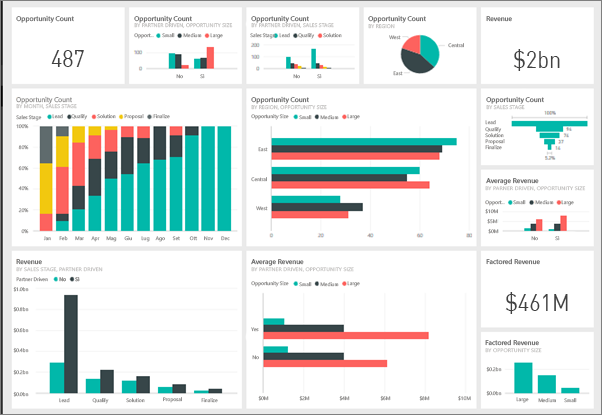
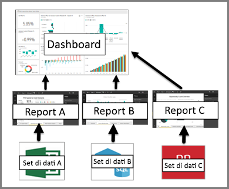

# Dashboard nel servizio Power BI

Un ***dashboard*** Power BI è una singola pagina, spesso denominata area di disegno, che usa le visualizzazioni per raccontare una storia. Essendo limitato a una pagina, un dashboard ben progettato contiene solo gli elementi più importanti per tale storia.

Le visualizzazioni mostrate nel dashboard vengono chiamate *riquadri* e sono *aggiunte* al dashboard dai report. Se non si ha familiarità con Power BI, è possibile imparare le nozioni di base utili leggendo [Concetti di base di Power BI](service-basic-concepts.md).

> [!NOTE]
> I dashboard sono una funzionalità del servizio Power BI e non sono disponibili in Power BI Desktop. Sui dispositivi mobili i dashboard non possono essere creati, ma solo [visualizzati e condivisi](mobile-apps-view-dashboard.md).
> 
> 

Le visualizzazioni in un dashboard provengono dai report e ogni report è basato su un set di dati. Infatti, un dashboard può essere inteso come una via d'accesso ai report e ai set di dati sottostanti. Selezionando una visualizzazione si accede al report (e al set di dati) usato per crearla.

## Vantaggi dei dashboard
I dashboard sono uno strumento eccezionale per monitorare l'attività aziendale, per cercare le risposte e per esaminare tutte le metriche più importanti al primo colpo. Le visualizzazioni in un dashboard potrebbero provenire da uno o più set di dati e report sottostanti. Un dashboard combina i dati locali e quelli generati dal cloud, offrendo una visualizzazione consolidata indipendentemente da dove si trovano i dati.

Un dashboard non è solo un'immagine vera e propria; si tratta, piuttosto, di un elemento altamente interattivo e personalizzabile in cui i riquadri si aggiornano al variare dei dati sottostanti.

## Dashboard e report a confronto
I [report](service-reports.md) sono spesso confusi con i dashboard poiché sono composti da troppe aree di contenuto con le visualizzazioni. Tuttavia, ci sono alcune importanti differenze.

| **Capacità** | **Dashboard** | **Report** |
| --- | --- | --- |
| Pagine |Una pagina |Una o più pagine |
| Origini dati |Uno o più report e uno o più set di dati per dashboard |Un singolo set di dati per report |
| Disponibile in Power BI Desktop |No |Sì, è possibile creare e visualizzare i report in Power BI Desktop |
| Aggiunta |È possibile aggiungere visualizzazioni esistenti (riquadri) solo dal dashboard corrente ad altri dashboard |È possibile aggiungere visualizzazioni (come riquadri) a uno dei dashboard. È possibile aggiungere tutte le pagine del report a uno dei dashboard. |
| Sottoscrivi |Non è possibile sottoscriversi a un dashboard |È possibile sottoscriversi alle pagine del report |
| Applicazione di filtri |Non è possibile filtrare o sezionare |Molti modi diversi di filtrare, evidenziare e sezionare |
| Impostazione di avvisi |Permette di creare avvisi per e-mail quando vengono soddisfatte determinate condizioni |No |
| Funzionalità |Permette di impostare un dashboard come dashboard "in primo piano" |Non permette di creare un report in primo piano |
| Query in linguaggio naturale |Disponibile dal dashboard |Non disponibile dai report |
| Permette di modificare il tipo di visualizzazione |No. Infatti, se il proprietario di un report modifica il tipo di visualizzazione nel report, la visualizzazione bloccata nel dashboard non viene aggiornata |Sì |
| Permette di visualizzare i campi e le tabelle del set di dati sottostante |No. Consente di esportare i dati ma le tabelle e i campi nel dashboard stesso non sono visibili. |Sì. È possibile visualizzare le tabelle, i campi e valori del set di dati. |
| Permette di creare le visualizzazioni |Si limita all'aggiunta di widget al dashboard tramite "Aggiungi riquadro" |È possibile creare molti tipi diversi di elementi visivi, aggiungere elementi visivi personalizzati, modificare gli elementi visivi e altro ancora con le autorizzazioni di modifica |
| Personalizzazione |È possibile fare operazioni con le visualizzazioni (riquadri) come spostare e disporre, ridimensionare, aggiungere collegamenti, rinominare, eliminare e visualizzare a schermo intero. Ma i dati e le visualizzazioni sono di sola lettura. |Nella visualizzazione di lettura è possibile pubblicare, incorporare, filtrare, esportare, scaricare come file .pbix, visualizzare il contenuto correlato, generare codici QR, analizzare in Excel e così via.  Nella visualizzazione di modifica è possibile eseguire tutte le operazioni indicate finora e molto altro. |

## Autori dei dashboard e utenti dei dashboard
In base al ruolo, si potrebbe essere un utente che crea i dashboard per uso personale o da condividere con i colleghi. Si desidera imparare a creare e condividere i dashboard. In alternativa, si potrebbe essere un utente che riceve i dashboard dagli altri. Si desidera imparare a comprendere e interagire con il dashboard.

Per iniziare, è possibile leggere gli argomenti seguenti organizzati in base al ruolo.

Power BI Pro è necessario per condividere un dashboard e visualizzare un dashboard condiviso.

### Se si intende creare e condividere i dashboard
* Usare uno degli esempi di [creare un dashboard da un report](service-dashboard-create.md).
* Informazioni sui [riquadri del dashboard](service-dashboard-tiles.md) e tutti i modi differenti di aggiungerli a un dashboard.
* È possibile sostenere i fruitori del dashboard creando dashboard che [funzionano bene anche con le query in linguaggio naturale di Domande e risposte](service-prepare-data-for-q-and-a.md) e con [Informazioni rapide](service-insights-optimize.md).
* Scoprire tutti i modi diversi in cui è possibile [Condividere un dashboard con i colleghi](service-how-to-collaborate-distribute-dashboards-reports.md).

### Se si intende ricevere e usare i dashboard
* Per acquisire familiarità con i dashboard, consultare la presentazione di uno dei [dashboard di esempio](sample-tutorial-connect-to-the-samples.md).
* Informazioni sui [riquadri del dashboard](service-dashboard-tiles.md) e cosa succede quando se ne seleziona uno.
* Non si è soddisfatti dall'aspetto del dashboard?  È possibile [ridimensionare, spostare e rinominare i riquadri](service-dashboard-edit-tile.md).
* Si desidera monitorare un singolo riquadro del dashboard e ricevere un'e-mail quando raggiunge una certa soglia? [Creare avvisi sui riquadri](service-set-data-alerts.md).
* È possibile porre liberamente le domande al dashboard. Informazioni su come usare lo strumento [Domande e risposte di Power BI](power-bi-tutorial-q-and-a.md) per porre una domanda sui dati e ottenere una risposta sotto forma di visualizzazione.

> [!TIP]
> Se nell'articolo non si è trovato ciò che si stava cercando, fare ricorso al sommario a sinistra.
> 
> 

## Passaggi successivi
[Introduzione a Power BI](service-get-started.md)  
[Power BI - Concetti di base](service-basic-concepts.md)  
[Power BI Premium: di cosa si tratta?](service-premium.md)  

Altre domande? [Provare a rivolgersi alla community di Power BI](http://community.powerbi.com/)

