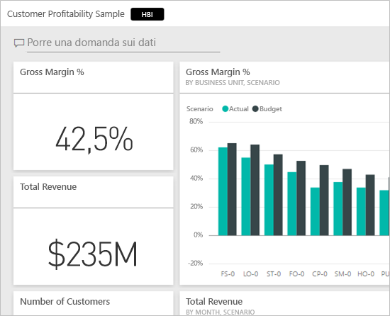
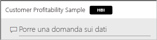
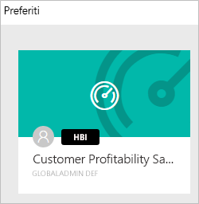
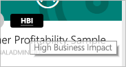
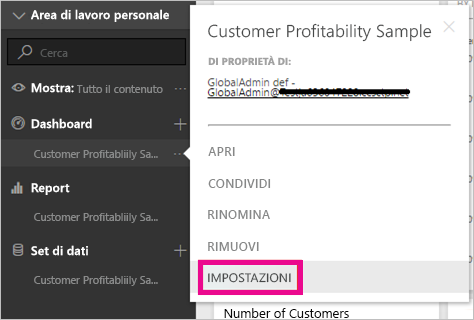
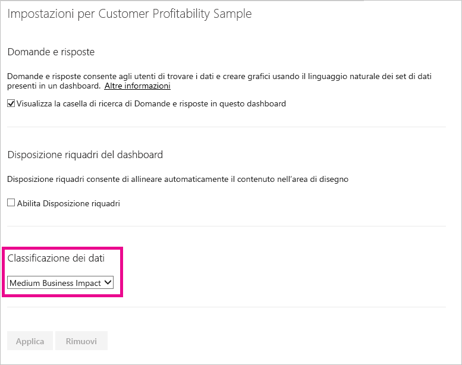
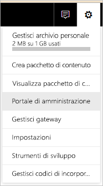
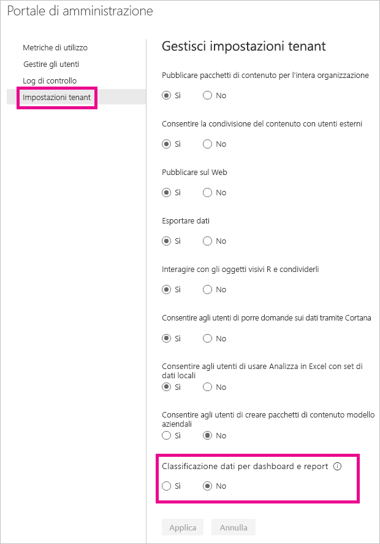
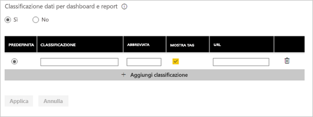
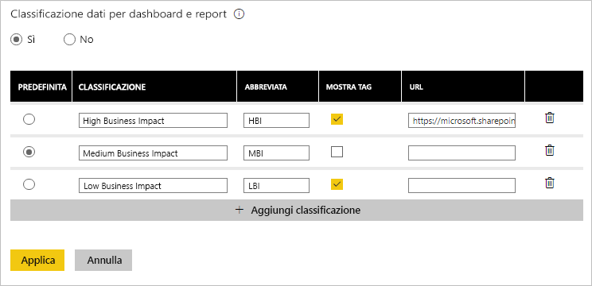

# Classificazione dei dati del dashboard
Ogni dashboard è diverso e, a seconda dell'origine dati a cui ci si connette e ai dati che si condividono con i colleghi, è necessario adottare precauzioni specifiche per garantire la riservatezza dei dati. Alcuni dashboard non devono essere mai stampati o condivisi con persone esterne all'azienda, mentre altri possono essere condivisi liberamente. Con la classificazione dei dati del dashboard è possibile informare gli utenti che visualizzano i dashboard sul livello di sicurezza da usare. È possibile contrassegnare i dashboard con classificazioni definite dal reparto IT della propria azienda, in modo che tutti quelli che visualizzano il contenuto abbiano lo stesso livello di informazioni relative alla riservatezza dei dati.

## Tag di classificazione dei dati
I tag di classificazione dei dati vengono visualizzati accanto al nome del dashboard e consentono a chiunque lo visualizzi di conoscere il livello di sicurezza da applicare al dashboard e ai dati contenuti.

Un tag viene visualizzato anche accanto al riquadro del dashboard nell'elenco Preferiti.

Quando si passa il mouse sul tag viene visualizzato il nome completo della classificazione.

Gli amministratori possono anche impostare un URL per un tag per fornire altre informazioni.

> [!NOTE]
> A seconda delle impostazioni di classificazione configurate dall'amministratore, alcuni tipi di classificazione possono non essere visualizzati come tag nel dashboard. I proprietari del dashboard possono controllare in qualsiasi momento il tipo di classificazione nelle impostazioni del dashboard.
> 
> 

## Impostazione di una classificazione del dashboard
Se la classificazione dei dati è attivata per l'azienda, tutti i dashboard hanno inizialmente un tipo di classificazione predefinito, ma i proprietari del dashboard possono modificare la classificazione in modo che corrisponda al livello di sicurezza del dashboard.

Per modificare il tipo di classificazione, eseguire queste operazioni:

1. Passare alle impostazioni del dashboard selezionando i **puntini di sospensione** accanto al nome del dashboard e scegliere **Impostazioni**.
   
    
2. Nelle impostazioni del dashboard è possibile visualizzare la classificazione corrente del dashboard e usare il menu a discesa per modificare il tipo di classificazione.
   
    
3. Al termine, selezionare **Applica**.

Dopo aver applicato la modifica, gli utenti che condividono il dashboard visualizzeranno l'aggiornamento dopo aver ricaricato il dashboard.

## Utilizzo dei tag di classificazione dei dati come amministratore
La classificazione dei dati viene configurata dall'amministratore globale dell'organizzazione. Per attivare la classificazione dei dati, eseguire queste operazioni:

1. Selezionare l'icona dell'ingranaggio Impostazioni e scegliere **Portale di amministrazione**.
   
    
2. Impostare **Classificazione dati per dashboard e report** su *attiva* nella scheda **Impostazioni tenant**.
   
    

Dopo l'attivazione viene visualizzato un modulo per creare le varie classificazioni all'interno dell'organizzazione.

Ogni classificazione include un **nome** e una **sintassi abbreviata**, visualizzati nel dashboard. Per ogni classificazione è possibile decidere se visualizzare il tag a sintassi abbreviata nel dashboard selezionando **Mostra tag**. Se si decide di non visualizzare il tipo di classificazione nel dashboard, il proprietario potrà comunque visualizzare il tipo controllando le impostazioni del dashboard. È anche possibile aggiungere facoltativamente un **URL** che contiene altre informazioni sulle linee guida per la classificazione e sui requisiti di utilizzo dell'organizzazione.  

L'ultima scelta riguarda il tipo di classificazione da impostare come predefinito.  

Dopo aver compilato il modulo con i tipi di classificazione, selezionare **Applica** per salvare le modifiche.

A questo punto, a tutti i dashboard verrà assegnata la classificazione predefinita. I proprietari dei dashboard possono ora aggiornare il tipo di classificazione a quello appropriato per il contenuto. È possibile tornare qui in futuro per aggiungere o rimuovere i tipi di classificazione o per modificare l'impostazione predefinita.  

> [!NOTE]
> Quando si apportano modifiche successive, è necessario tenere presenti alcuni aspetti importanti:
> 
> * Se si disattiva la classificazione dei dati, non verrà memorizzato alcun tag. Se si decide di riattivarla in un secondo momento, sarà necessario eseguire di nuovo tutta la procedura.  
> * Se si rimuove un tipo di classificazione, a tutti i dashboard a cui è assegnato il tipo di classificazione rimosso verrà riassegnato il valore predefinito finché il proprietario non imposta nuovamente il tipo.  
> * Se si modifica l'impostazione predefinita, tutti i dashboard a cui il proprietario non aveva ancora assegnato un tipo di classificazione verranno impostati sul nuovo valore predefinito.
> 
> 

