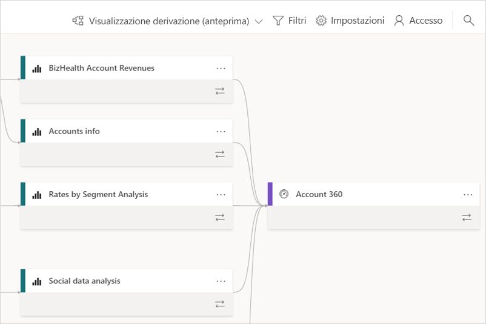
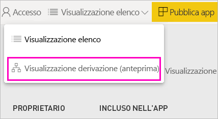
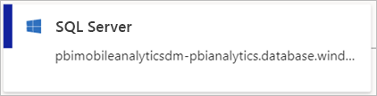
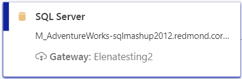
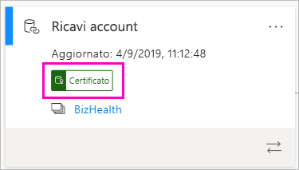
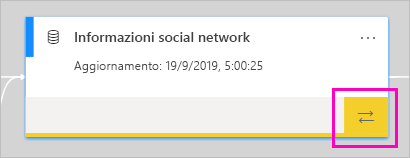
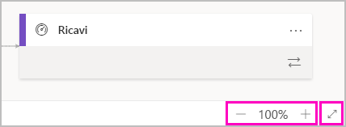

# Derivazione dei dati (anteprima)
Nei moderni progetti di business intelligence (BI) una delle possibili problematiche da affrontare è la necessità di conoscere il flusso dei dati dall'origine dati alla destinazione. La sfida è ancora più complessa se sono stati compilati progetti di analisi avanzati che comprendono più origini dati, elementi e dipendenze.  Rispondere a domande come "Che cosa accade se si modificano questi dati?" o "Perché questo report non è aggiornato?" può essere difficile. Per trovare una risposta potrebbe essere necessario un team di esperti o un'analisi approfondita. La visualizzazione di derivazione dei dati è stata pensata per poter rispondere a queste domande.

 
Power BI ha diversi tipi di elementi, ad esempio dashboard, report, set di dati e flussi di dati. Molti set di dati e flussi di dati si connettono a origini dati esterne, ad esempio SQL Server, e a set di dati esterni in altre aree di lavoro. Un set di dati esterno a un'area di lavoro di cui si è proprietari potrebbe trovarsi in un'area di lavoro di proprietà di un utente IT o di un altro analista. In definitiva, le origini dati e i set di dati esterni rendono più difficile sapere da dove provengono i dati. Per i progetti complessi e per quelli più semplici, è stata introdotta la visualizzazione di derivazione. 

Nella visualizzazione di derivazione vengono indicate le relazioni di derivazione tra tutti gli elementi di un'area di lavoro e tutte le dipendenze esterne. La visualizzazione di derivazione espande la visualizzazione diagramma dei flussi di dati mostrando le connessioni tra tutti gli elementi dell'area di lavoro, incluse le connessioni ai flussi di dati, sia upstream che downstream. La visualizzazione diagramma separata dei flussi di dati non sarà più disponibile a partire da novembre.

## Esplorare la visualizzazione di derivazione

Per impostazione predefinita, ogni area di lavoro, nuova o classica, ha una visualizzazione di derivazione, tranne Area di lavoro personale. È necessario almeno un ruolo Collaboratore nell'area di lavoro per visualizzarla. Per informazioni dettagliate, vedere [Autorizzazioni](#permissions) in questo articolo. 

- Per accedere alla visualizzazione di derivazione, passare alla visualizzazione elenco dell'area di lavoro. Toccare la freccia accanto a **Visualizzazione Elenco** e selezionare **Visualizzazione derivazione**.

    

    In questa visualizzazione sono visibili tutti gli elementi dell'area di lavoro e il flusso dei dati da uno all'altro.

**Origini dati**

Vengono visualizzate le origini dati da cui i set di dati e i flussi di dati ottengono i dati. Nelle schede delle origini dati vengono visualizzate altre informazioni che consentono di identificare l'origine. Ad esempio, per il server di Azure SQL viene visualizzato anche il nome del database.

 
**Gateway**

Se un'origine dati è connessa tramite un gateway locale, le informazioni sul gateway vengono aggiunte alla scheda dell'origine dati. Se si hanno le autorizzazioni come amministratore del gateway o come utente dell'origine dati, vengono visualizzate altre informazioni, ad esempio il nome del gateway.

**Set di dati e flussi di dati**
 
Nei set di dati viene visualizzata l'ora dell'ultimo aggiornamento e viene indicato se un set di dati è stato certificato o alzato di livello.

 
Se un report nell'area di lavoro si basa su un set di dati in un'altra area di lavoro, viene visualizzato il nome dell'area di lavoro di origine nella scheda del set di dati. Per passare all'area di lavoro di origine, selezionarne il nome.
 
- Per qualsiasi elemento, selezionare i puntini di sospensione (...) per visualizzare il menu delle opzioni, che include le stesse azioni disponibili nella visualizzazione elenco.
  
Per visualizzare altri metadati nei set di dati, selezionare la scheda di un set di dati. Informazioni aggiuntive sul set di dati vengono visualizzate in un riquadro laterale.

 
## Visualizzare la derivazione per qualsiasi elemento 

Si supponga di voler visualizzare la derivazione per un elemento specifico.

- Selezionare le frecce doppie sotto un elemento.

    

    Power BI evidenzia tutti gli elementi correlati a tale elemento e attenua gli altri. 

## Esplorazione e schermo intero 

La visualizzazione di derivazione è un canvas interattivo. È possibile usare il mouse e il touchpad per spostarsi nel canvas e per fare zoom avanti o indietro.  

- Per fare zoom avanti e indietro, usare il menu nell'angolo in basso a destra oppure il mouse o il touchpad. 

- Per avere più spazio per il grafo, usare l'opzione schermo intero nell'angolo in basso a destra. 

    

## Autorizzazioni

- Per vedere la visualizzazione di derivazione, è necessaria una licenza Power BI Pro.
- La visualizzazione di derivazione è disponibile solo per gli utenti con accesso all'area di lavoro.
- Gli utenti devono avere un ruolo Amministratore, Membro o Collaboratore nell'area di lavoro. Gli utenti con un ruolo Visualizzatore non possono passare alla visualizzazione di derivazione.

## Considerazioni e limitazioni

La visualizzazione di derivazione non è disponibile in Internet Explorer. Per informazioni dettagliate, vedere [Browser supportati per Power BI](power-bi-browsers.md).

## Passaggi successivi

- [Introduzione ai set di dati in aree di lavoro diverse (anteprima)](service-datasets-across-workspaces.md)
