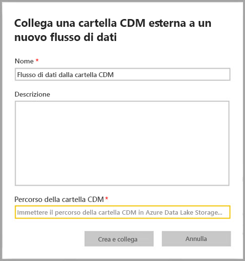
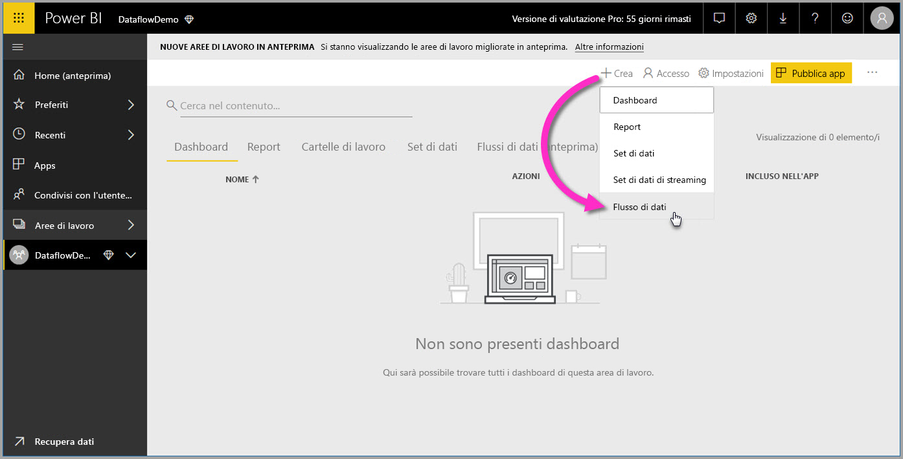
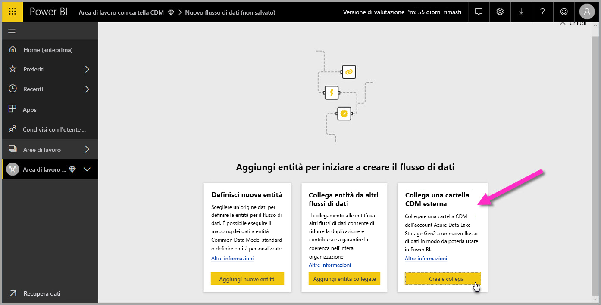

# Aggiungere una cartella CDM a Power BI come flusso di dati (anteprima)

In Power BI, è possibile aggiungere cartelle CDM (Common Data Model) archiviate in Azure Data Lake Storage Gen2 come flussi di dati. E dopo aver creato un flusso di dati da una cartella CDM, è possibile usare **Power BI Desktop** e il **servizio Power BI** per creare set di dati, report, dashboard e app basati sui dati inseriti nelle cartelle CDM.

Esistono alcuni requisiti per la creazione di flussi di dati dalle cartelle CDM, come descritto nell'elenco seguente:

* La creazione di flussi di dati dalle cartelle CDM è disponibile *solo* nella [nuova esperienza dell'area di lavoro](service-create-the-new-workspaces.md). 
* Per aggiungere una cartella CDM a Power BI, è necessario che l'utente che aggiunge la cartella abbia l'[autorizzazione per la cartella CDM e i relativi file](https://go.microsoft.com/fwlink/?linkid=2029121).
* Per poterli aggiungere in Power BI, occorre avere autorizzazioni di lettura ed esecuzione per tutti i file e le cartelle nella cartella CDM.

Le sezioni seguenti descrivono come creare un flusso di dati da una cartella CDM.

> [!NOTE]
> La funzionalità dei flussi di dati è disponibile in anteprima ed è soggetta a modifiche e aggiornamenti prima della disponibilità generale.

## Creare un flusso di dati da una cartella CDM

Per iniziare a creare un flusso di dati da una cartella CDM, avviare il **servizio Power BI** e selezionare un'**area di lavoro per app** nel riquadro di spostamento a sinistra. È anche possibile creare una nuova area di lavoro in cui creare il nuovo flusso di dati.

Nella schermata visualizzata selezionare **Crea e collega** come illustrato nell'immagine seguente.

Nella schermata successiva è possibile assegnare un nome al flusso di dati, specificare una descrizione del flusso di dati e indicare il percorso della cartella CDM nell'account Azure Data Lake Gen2 dell'organizzazione. Leggere la sezione dell'articolo che descrive [come ottenere il percorso della cartella CDM](service-dataflows-configure-workspace-storage-settings.md#get-the-uri-of-stored-dataflow-files). 

Dopo aver fornito le informazioni, selezionare **Crea e collega** per creare il flusso di dati.

I flussi di dati dalle cartelle CDM sono contrassegnati con l'icona *esterno* quando sono visualizzati in Power BI. Nella sezione successiva vengono descritte le differenze tra flussi di dati standard e flussi di dati creati da cartelle CDM.

Dopo aver impostato correttamente le autorizzazioni, come descritto in precedenza in questo articolo, è possibile connettersi al flusso di dati in **Power BI Desktop**.

## Considerazioni e limitazioni

Per gestire le autorizzazioni per un flusso di dati creato da una cartella CDM, il processo è simile alle origini dati esterne in Power BI. Le autorizzazioni vengono gestite nell'origine dati e non da Power BI. Le autorizzazioni devono essere impostate in modo appropriato nell'origine dati, ad esempio un flusso di dati creato da una cartella CDM, per il corretto funzionamento con Power BI.

L'elenco seguente è utile per chiarire le interazioni dei flussi di dati da cartelle CDM con Power BI.

Aree di lavoro di Power BI Pro, Premium ed Embedded:
* I flussi di dati da cartelle CDM non possono essere modificati
* Le autorizzazioni per leggere un flusso di dati creato da una cartella CDM sono gestite dal proprietario della cartella CDM e non da Power BI

Power BI Desktop:
* Solo gli utenti autorizzati sia per l'area di lavoro in cui è stato creato il flusso di dati che per la cartella CDM possono accedere ai dati dal connettore di flussi di dati di Power BI

Esistono alcune altre considerazioni, descritte nell'elenco seguente:

* La creazione di flussi di dati dalle cartelle CDM è disponibile *solo* nella [nuova esperienza dell'area di lavoro](service-create-the-new-workspaces.md)
* Le entità collegate non sono disponibili per i flussi di dati creati dalle cartelle CDM

I clienti di **Power BI Desktop** non possono accedere ai flussi di dati archiviati in un account di Azure Data Lake Storage Gen2 a meno che non siano proprietari del flusso di dati oppure non siano stati autorizzati in modo esplicito per la cartella CDM del flusso di dati. Considerare la situazione seguente:

1.  Anna crea una nuova area di lavoro per app e la configura per archiviare flussi di dati da una cartella CDM.
2.  Bruno, anch'esso membro dell'area di lavoro creata da Anna, vuole usare Power BI Desktop e il connettore per i flussi di dati per ottenere dati dal flusso creato da Anna.
3.  Bruno riceve un errore perché non è stato aggiunto come utente autorizzato alla cartella CDM del flusso di dati nel data lake.

    

Per risolvere il problema, a Bruno devono essere concesse le autorizzazioni di lettore per la cartella CDM e i relativi file. In [questo articolo](https://go.microsoft.com/fwlink/?linkid=2029121) sono disponibili altre informazioni su come concedere l'accesso alla cartella CDM.

## Passaggi successivi

In questo articolo è stato illustrato come configurare l'archiviazione dell'area di lavoro per i flussi di dati. Per altre informazioni, vedere gli articoli seguenti:

Per altre informazioni su flussi di dati, CDM e Azure Data Lake Storage Gen2, vedere gli articoli seguenti:

* [Integrazione di flussi di dati e Azure Data Lake (anteprima)](service-dataflows-azure-data-lake-integration.md)
* [Configurare le impostazioni del flusso di dati dell'area di lavoro (anteprima)](service-dataflows-configure-workspace-storage-settings.md)
* [Connettere Azure Data Lake Storage Gen2 per l'archiviazione dei flussi di dati (anteprima)](service-dataflows-connect-azure-data-lake-storage-gen2.md)

Per informazioni sui flussi di dati in generale, vedere questi articoli:

* [Creare e usare flussi di dati in Power BI](service-dataflows-create-use.md)
* [Uso delle entità calcolate in Power BI Premium (anteprima)](service-dataflows-computed-entities-premium.md)
* [Uso di flussi di dati con origini dati locali (anteprima)](service-dataflows-on-premises-gateways.md)
* [Risorse per sviluppatori per i flussi di dati Power BI (anteprima)](service-dataflows-developer-resources.md)

Per altre informazioni sull'archiviazione di Azure, è possibile leggere questi articoli:
* [Guida alla sicurezza di Archiviazione di Azure](https://docs.microsoft.com/azure/storage/common/storage-security-guide)
* [Configurazione dell'aggiornamento pianificato](refresh-scheduled-refresh.md)
* [Esempi ed esercitazioni di GitHub per Servizi dati di Azure](https://aka.ms/cdmadstutorial)

Per altre informazioni sul modello CDM (Common Data Model), è possibile leggere l'articolo di panoramica:
* [Panoramica del modello CDM (Common Data Model)](https://docs.microsoft.com/powerapps/common-data-model/overview)
* [Cartelle CDM](https://go.microsoft.com/fwlink/?linkid=2045304)
* [Definizione del file del modello CDM](https://go.microsoft.com/fwlink/?linkid=2045521)

È inoltre sempre possibile provare a [porre domande alla Community di Power BI](http://community.powerbi.com/).

