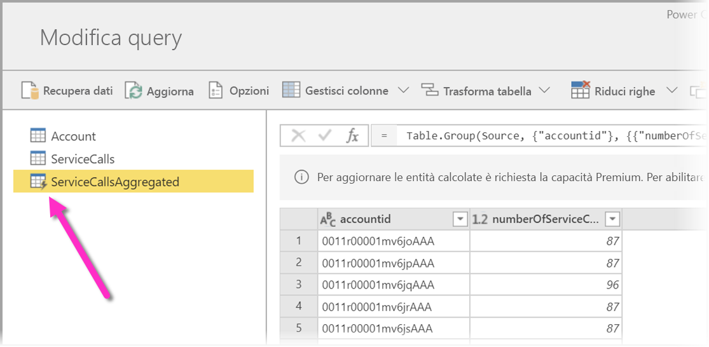
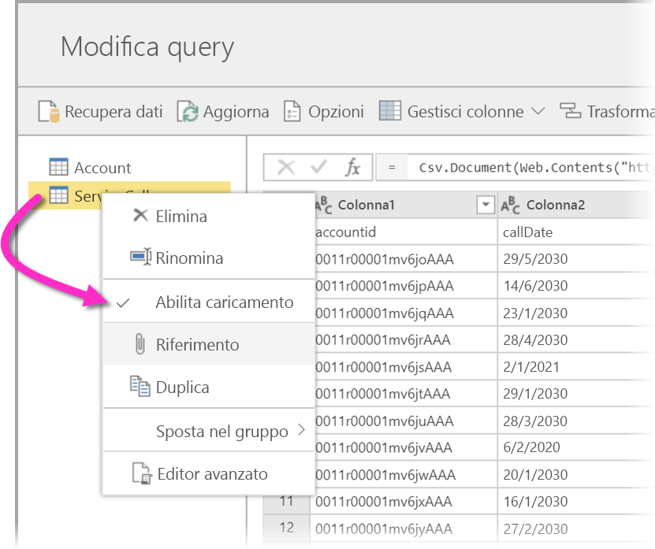
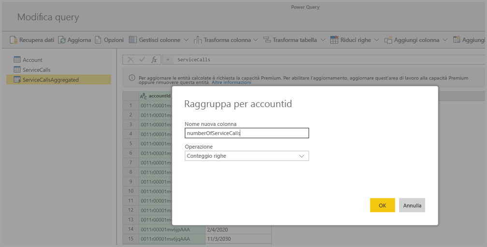
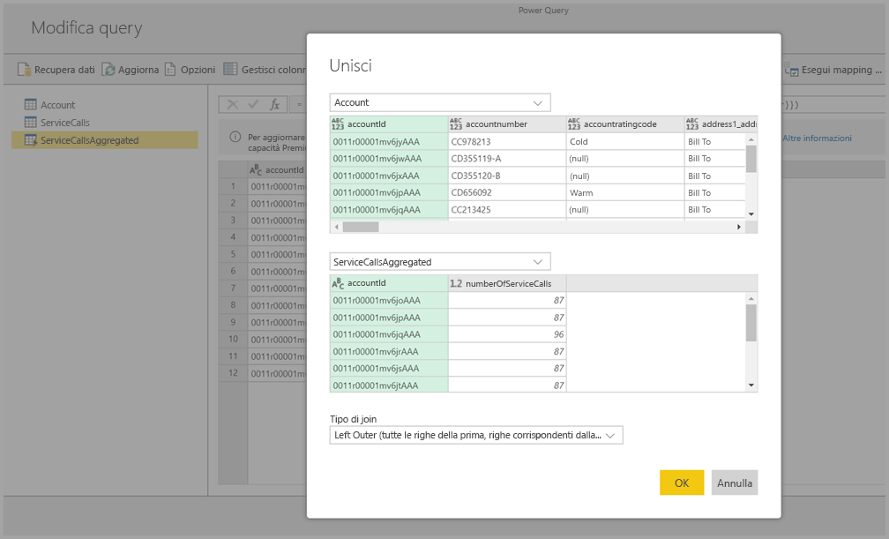
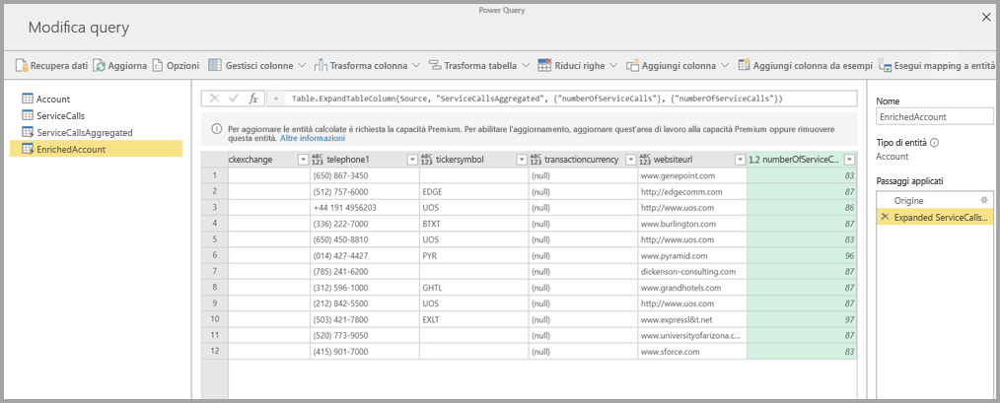

# Uso delle entità calcolate in Power BI Premium

È possibile eseguire **calcoli in archivio** quando si usano i **flussi di dati** con una sottoscrizione di Power BI Premium. Ciò consente di eseguire i calcoli sui flussi di dati esistenti e ottenere risultati che consentono di concentrarsi sulla creazione di report e sull'analisi. 

Per eseguire i **calcoli in archivio**, è prima di tutto necessario creare il flusso di dati e inserire i dati nell'archivio del flusso di dati di Power BI. Dopo aver creato un flusso di dati contenente dati, è possibile creare **entità calcolate**, ovvero le entità che eseguono calcoli in archivio. 

Ci sono due modi per connettere i dati del flusso di dati a Power BI:

* [Usando la creazione self-service di un flusso di dati](service-dataflows-create-use.md)
* Usando un flusso di dati esterno

Le sezioni seguenti descrivono come creare entità calcolate sui dati del flusso di dati.

## Come creare entità calcolate 

Dopo aver creato un flusso di dati con un elenco di entità, è possibile eseguire calcoli su tali entità.

Nello strumento di creazione del flusso di dati nel servizio Power BI selezionare **Modifica entità**, quindi fare clic con il pulsante destro del mouse sull'entità da usare come base per l'entità calcolata e in cui eseguire i calcoli. Dal menu di scelta rapida scegliere **Riferimento**.

Affinché l'entità possa essere usata come entità calcolata, l'opzione **Abilita caricamento** deve essere selezionata, come illustrato nell'immagine seguente. Fare clic con il pulsante destro del mouse sull'entità per visualizzare il menu di scelta rapida.

Se si seleziona **Abilita caricamento**, si crea una nuova entità la cui origine è l'entità di riferimento. L'icona cambia per indicare l'entità **calcolata**, come illustrato nell'immagine seguente.

Qualsiasi trasformazione eseguita su questa entità appena creata verrà eseguita sui dati già presenti nell'archivio del flusso di dati di Power BI. Ciò significa che la query non verrà eseguita sull'origine dati esterna da cui sono stati importati i dati (ad esempio, il database SQL da cui è stato eseguito il pull dei dati), bensì sui dati che si trovano nell'archivio del flusso di dati.

### Casi d'uso di esempio
Quale tipo di trasformazioni è possibile eseguire con le entità calcolate? Tutte le trasformazioni che in genere si specificano usando l'interfaccia utente di trasformazione in Power BI o l'editor M sono supportate quando si esegue il calcolo in archivio. 

Considerare l'esempio seguente: si ha un'entità *Account* che contiene i dati non elaborati per tutti i clienti dalla sottoscrizione di Dynamics 365. Si hanno inoltre i dati non elaborati di *ServiceCalls* forniti dal centro assistenza, con dati relativi alle chiamate al supporto tecnico che sono state effettuate dai diversi account in ogni giorno dell'anno.

Si supponga di voler arricchire l'entità *Account* con i dati di *ServiceCalls*. 

Prima di tutto, è necessario aggregare i dati di ServiceCalls per calcolare il numero di chiamate al supporto tecnico per ogni account nell'anno precedente. 

È quindi necessario unire l'entità *Account* con l'entità *ServiceCallsAggregated* per calcolare la tabella **Account** arricchita.

È quindi possibile visualizzare i risultati, illustrati in *EnrichedAccount* nell'immagine seguente.

La procedura è completata: la trasformazione viene eseguita sui dati nel flusso di dati che si trova nella sottoscrizione di Power BI Premium e non sui dati di origine.

## Considerazioni e limitazioni

È importante notare che se si rimuove l'area di lavoro dalla capacità di Power BI Premium, il flusso di dati associato non verrà più aggiornato. 

Quando si usano flussi di dati creati in modo specifico in un account di Azure Data Lake Storage Gen2 dell'organizzazione, le entità collegate e calcolate funzionano correttamente solo quando risiedono nello stesso account di archiviazione. Per altre informazioni, vedere [Connettere Azure Data Lake Storage Gen2 per l'archiviazione dei flussi di dati (anteprima)](service-dataflows-connect-azure-data-lake-storage-gen2.md).

Le entità collegate non sono disponibili per i flussi di dati creati dalle cartelle CDM (Common Data Model). Per altre informazioni, vedere [Aggiungere una cartella CDM a Power BI come flusso di dati (anteprima)](service-dataflows-add-cdm-folder.md).

Quando si eseguono calcoli su dati uniti da origini dati locali e cloud, è consigliabile creare una nuova entità per eseguire tali calcoli. Ciò offre un'esperienza migliore rispetto all'uso di un'entità esistente per i calcoli, ad esempio un'entità che esegue anche query sui dati di entrambe le origini ed esegue trasformazioni in Data Lake.

## Passaggi successivi

In questo articolo sono stati descritti le entità calcolate e i flussi di dati disponibili nel servizio Power BI. Ecco alcuni altri articoli che potrebbero essere utili.

* [Preparazione dei dati self-service con flussi di dati](service-dataflows-overview.md)
* [Creare e usare flussi di dati in Power BI](service-dataflows-create-use.md)
* [Uso di flussi di dati con origini dati locali](service-dataflows-on-premises-gateways.md)
* [Risorse per sviluppatori per i flussi di dati Power BI](service-dataflows-developer-resources.md)
* [Configurare le impostazioni del flusso di dati dell'area di lavoro (anteprima)](service-dataflows-configure-workspace-storage-settings.md)
* [Aggiungere una cartella CDM a Power BI come flusso di dati (anteprima)](service-dataflows-add-cdm-folder.md)
* [Connettere Azure Data Lake Storage Gen2 per l'archiviazione dei flussi di dati (anteprima)](service-dataflows-connect-azure-data-lake-storage-gen2.md)

Per altre informazioni su Power Query e sull'aggiornamento pianificato, è possibile leggere questi articoli:
* [Panoramica delle query in Power BI Desktop](desktop-query-overview.md)
* [Configurazione dell'aggiornamento pianificato](refresh-scheduled-refresh.md)

Per altre informazioni sul modello CDM (Common Data Model), è possibile leggere l'articolo di panoramica:
* [Panoramica del modello CDM (Common Data Model)](https://docs.microsoft.com/powerapps/common-data-model/overview)

