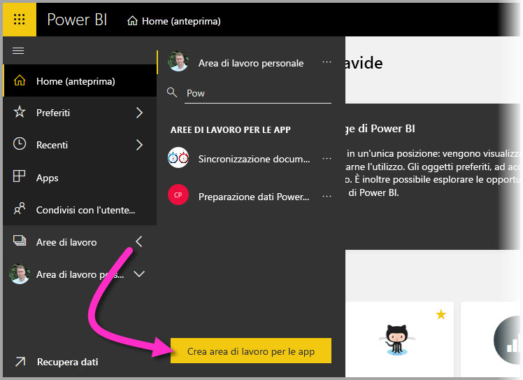
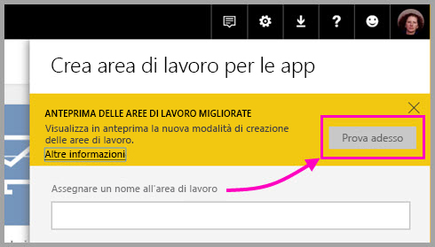
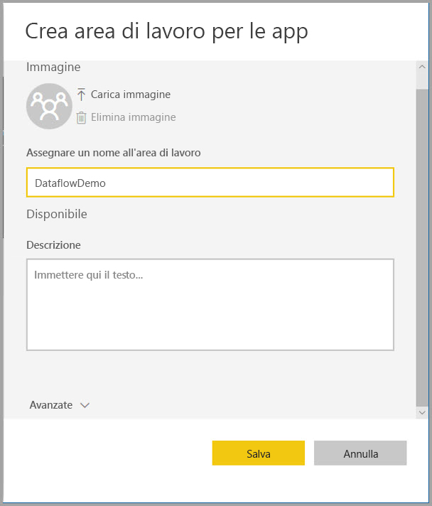
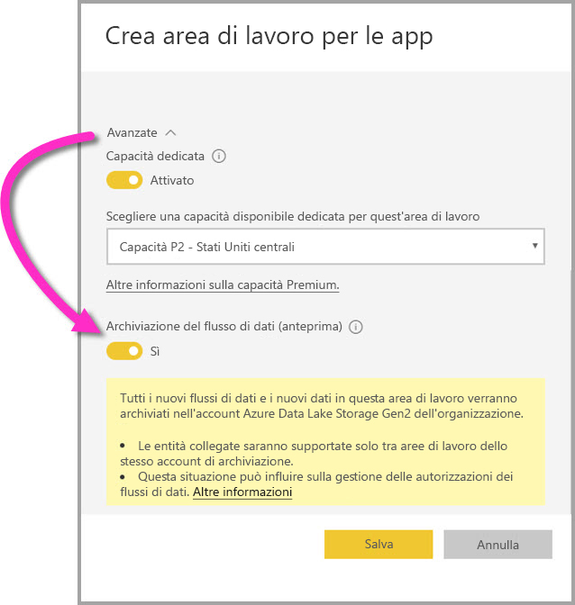
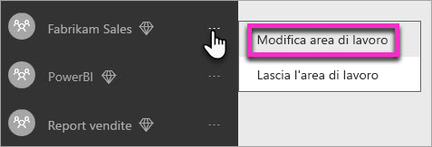
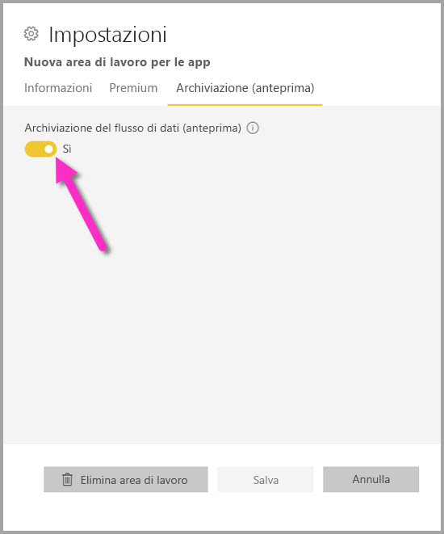
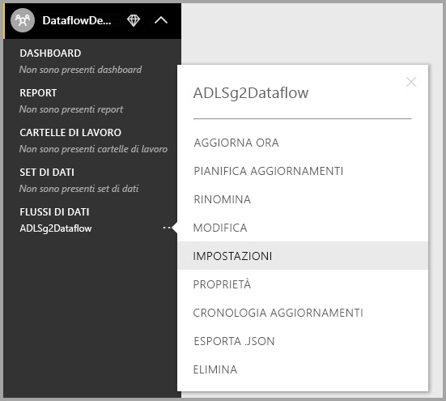
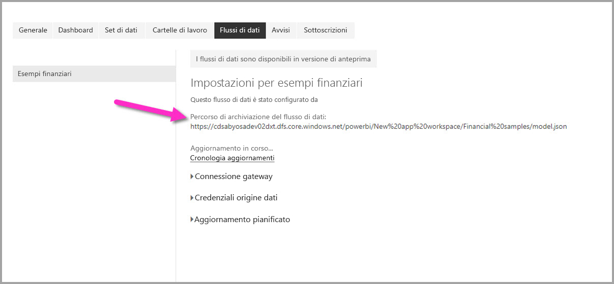

# Configurare le impostazioni del flusso di dati dell'area di lavoro (anteprima)

Con Power BI e i flussi di dati è possibile archiviare file di dati e file di definizione del flusso di dati di un'area di lavoro nell'account di Azure Data Lake Storage Gen2. Gli amministratori di aree di lavoro possono configurare Power BI a tale scopo e questo articolo illustra i passaggi necessari. 

Prima di poter configurare la posizione di archiviazione del flusso di dati dell'area di lavoro, l'amministratore globale della società deve connettere l'account di archiviazione dell'organizzazione a Power BI e abilitare le autorizzazioni di assegnazione dell'archiviazione a tale account di archiviazione. *[Connettere Azure Data Lake Storage Gen2 per l'archiviazione dei flussi di dati (anteprima)](service-dataflows-connect-azure-data-lake-storage-gen2.md)* 

Esistono due modi per configurare le impostazioni di archiviazione del flusso di dati dell'area di lavoro: 

* Durante la creazione dell'area di lavoro
* Modificando un'area di lavoro esistente

Entrambi i modi verranno presentati nelle sezioni seguenti. 

> [!IMPORTANT]
> L'impostazione di archiviazione del flusso di dati dell'area di lavoro può essere modificata solo se l'area di lavoro non contiene flussi di dati. Inoltre, questa funzionalità è disponibile solo nella nuova esperienza dell'area di lavoro. Per altre informazioni sulla nuova area di lavoro, vedere l'articolo [Creare le nuove aree di lavoro (anteprima) in Power BI](service-create-the-new-workspaces.md).

## Creare una nuova area di lavoro e configurare l'archiviazione del flusso di dati

Per creare una nuova area di lavoro nel servizio Power BI, selezionare **Aree di lavoro > Crea area di lavoro**.

Nella finestra di dialogo Crea area di lavoro può essere visualizzata una casella gialla con il titolo **Anteprima aree di lavoro migliorate**. In tale area selezionare **Prova adesso**.

Nella finestra di dialogo visualizzata, è possibile assegnare un nome univoco alla nuova area di lavoro. Non selezionare ancora **Salva** perché è necessario specificare impostazioni avanzate.

Espandere quindi l'area **Avanzate** della finestra di dialogo **Crea area di lavoro** in cui è possibile attivare l'impostazione **Archiviazione del flusso di dati (anteprima)** .

Selezionare **Salva** per creare la nuova area di lavoro. Qualsiasi nuovo flusso di dati creato nell'area di lavoro archivia ora il file di definizione (file Model.json) e i dati nell'account di Azure Data Lake Storage Gen2 dell'organizzazione. 

## Aggiornare l'archiviazione del flusso di dati per un'area di lavoro esistente

In alternativa alla creazione di una nuova area di lavoro, è possibile aggiornare un'area di lavoro esistente per archiviare i file di definizione e di dati nell'account di Azure Data Lake Storage Gen2 della propria organizzazione. Ricordarsi che l'impostazione di archiviazione del flusso di dati può essere modificata solo se l'area di lavoro non contiene già flussi di dati.

Per modificare un'area di lavoro, selezionare i puntini di sospensione **(...)** e quindi selezionare **Modifica area di lavoro**. 

Nella finestra **Modifica area di lavoro** visualizzata, espandere **Avanzate** e quindi attivare l'impostazione **Archiviazione del flusso di dati (anteprima)** impostandola su **Sì**. 

Selezionare quindi **Salva**. Qualsiasi nuovo flusso di dati creato nell'area di lavoro archivia il file di definizione e i dati nell'account di Azure Data Lake Storage Gen2 dell'organizzazione.

## Ottenere l'URI dei file del flusso di dati archiviati

Dopo aver creato un flusso di dati in un'area di lavoro assegnata all'account di Azure Data Lake della propria organizzazione, è possibile accedere direttamente ai file di definizione e di dati corrispondenti. La posizione di questi file è indicata nella pagina **Impostazioni del flusso di dati**. Per accedere a questa pagina, seguire questa procedura:

Selezionare i puntini di sospensione **(...)**  accanto a un flusso di dati elencato in **Flussi di dati** nell'area di lavoro. Nel menu visualizzato selezionare **Impostazioni**.

Nelle informazioni visualizzate, la posizione della cartella CDM del flusso di dati è indicata in **Percorso di archiviazione del flusso di dati**, come illustrato nell'immagine seguente.

> [!NOTE]
> Power BI configura il proprietario del flusso di dati con autorizzazioni di lettura per la cartella CDM in cui sono archiviati i file del flusso di dati. Per concedere l'accesso ad altri utenti o servizi alla posizione di archiviazione del flusso di dati, è necessario che il proprietario dell'account di archiviazione conceda l'accesso in Azure.

## Considerazioni e limitazioni

Alcune funzionalità del flusso di dati non sono supportate quando è archiviato in Azure Data Lake Storage Gen2: 

Aree di lavoro di Power BI Pro, Premium ed Embedded:
* Le **entità collegate** sono supportate solo tra aree di lavoro nello stesso account di archiviazione.
* Le autorizzazioni dell'area di lavoro non si applicano ai flussi di dati archiviati in Azure Data Lake Storage Gen2. Solo il proprietario del flusso di dati può accedervi.
* Tutte le altre funzionalità di preparazione dei dati sono uguali a quelle disponibili per i flussi di dati archiviati in Power BI

Esistono alcune altre considerazioni, descritte nell'elenco seguente:

* Dopo aver configurato la posizione di archiviazione del flusso di dati, non può essere modificata.
* Solo il proprietario di un flusso di dati archiviato in Azure Data Lake Storage Gen2 può accedere ai relativi dati.
* Le origini dati locali, nelle capacità condivise di Power BI, non sono supportate nei flussi di dati archiviati nell'account di Azure Data Lake Storage Gen2 dell'organizzazione.

I clienti di **Power BI Desktop** non possono accedere ai flussi di dati archiviati in un account di Azure Data Lake Storage Gen2 a meno che non siano proprietari del flusso di dati. Considerare la situazione seguente:

1.  Anna crea una nuova area di lavoro e la configura per l'archiviazione dei flussi di dati nel data lake dell'organizzazione.
2.  Bruno, anch'esso membro dell'area di lavoro creata da Anna, vuole usare Power BI Desktop e il connettore per i flussi di dati per ottenere dati dal flusso creato da Anna.
3.  Bruno riceve un errore perché non è stato aggiunto come utente autorizzato alla cartella CDM del flusso di dati nel data lake.

    

## Passaggi successivi

In questo articolo è stato illustrato come configurare l'archiviazione dell'area di lavoro per i flussi di dati. Per altre informazioni, vedere gli articoli seguenti:

Per altre informazioni su flussi di dati, CDM e Azure Data Lake Storage Gen2, vedere gli articoli seguenti:

* [Integrazione di flussi di dati e Azure Data Lake (anteprima)](service-dataflows-azure-data-lake-integration.md)
* [Aggiungere una cartella CDM a Power BI come flusso di dati (anteprima)](service-dataflows-add-cdm-folder.md)
* [Connettere Azure Data Lake Storage Gen2 per l'archiviazione dei flussi di dati (anteprima)](service-dataflows-connect-azure-data-lake-storage-gen2.md)

Per informazioni sui flussi di dati in generale, vedere questi articoli:

* [Creare e usare flussi di dati in Power BI](service-dataflows-create-use.md)
* [Uso delle entità calcolate in Power BI Premium (anteprima)](service-dataflows-computed-entities-premium.md)
* [Uso di flussi di dati con origini dati locali (anteprima)](service-dataflows-on-premises-gateways.md)
* [Risorse per sviluppatori per i flussi di dati Power BI (anteprima)](service-dataflows-developer-resources.md)

Per altre informazioni sull'archiviazione di Azure, è possibile leggere questi articoli:

* [Guida alla sicurezza di Archiviazione di Azure](https://docs.microsoft.com/azure/storage/common/storage-security-guide)
* [Esempi ed esercitazioni di GitHub per Servizi dati di Azure](https://aka.ms/cdmadstutorial)

Per altre informazioni sul modello CDM (Common Data Model), è possibile leggere l'articolo di panoramica:

* [Panoramica del modello CDM (Common Data Model)](https://docs.microsoft.com/powerapps/common-data-model/overview)
* [Cartelle CDM](https://go.microsoft.com/fwlink/?linkid=2045304)
* [Definizione del file del modello CDM](https://go.microsoft.com/fwlink/?linkid=2045521)

È inoltre sempre possibile provare a [porre domande alla Community di Power BI](http://community.powerbi.com/).
