# Connettere Azure Data Lake Storage Gen2 per l'archiviazione dei flussi di dati (anteprima)

È possibile configurare le aree di lavoro di Power BI per archiviare i flussi di dati nell'account di Azure Data Lake Storage Gen2 della propria organizzazione. Questo articolo descrive i passaggi generali necessari a tale scopo, oltre a presentare linee guida e procedure consigliate. La configurazione di aree di lavoro per archiviare le definizioni dei flussi di dati e i file di dati nel data lake personale offre alcuni vantaggi, tra i quali:

* Azure Data Lake Storage Gen2 rende disponibile un'infrastruttura di archiviazione per i dati estremamente scalabile
* I file di dati e i file di definizione dei flussi di dati possono essere usati dagli sviluppatori del reparto IT per sfruttare i servizi dati e di intelligenza artificiale di Azure come illustrato negli [esempi di GitHub per Servizi dati di Azure](https://aka.ms/cdmadstutorial)
* Consente agli sviluppatori all'interno dell'organizzazione di integrare i dati dei flussi di dati in applicazioni interne e soluzioni line-of-business, usando risorse per sviluppatori per i flussi di dati e Azure

Per usare Azure Data Lake Storage Gen2 per i flussi di dati, è necessario quanto segue:

* **Tenant di Power BI** - Almeno un account nel tenant di Azure Active Directory (AAD) deve essere iscritto a Power BI
* **Un account amministratore globale** - Questo account è necessario per connettersi e configurare Power BI per archiviare la definizione e i dati del flusso di dati nell'account di Azure Data Lake Storage Gen2
* **Una sottoscrizione di Azure** - È necessaria una sottoscrizione di Azure per usare Azure Data Lake Storage Gen2
* **Gruppo di risorse** - Usare un gruppo di risorse già disponibile oppure crearne uno nuovo
* **Un account di Archiviazione di Azure con la funzionalità Data Lake Storage Gen2 (anteprima) abilitata** - Per connettersi ad Azure Data Lake Storage Gen2, è necessario iscriversi per la versione di anteprima pubblica

> [!TIP]
> Se non si ha una sottoscrizione di Azure, prima di iniziare creare un [account gratuito](https://azure.microsoft.com/free/).

## Preparare Azure Data Lake Storage Gen2 per Power BI

Prima di poter configurare Power BI con un account di archiviazione Azure Data Lake Storage Gen2, è necessario creare e configurare un account di archiviazione. I requisiti per Power BI sono i seguenti:

1. L'account di archiviazione deve essere creato nello stesso tenant di AAD del tenant di Power BI.
2. L'account di archiviazione deve essere creato nella stessa area AAD del tenant di Power BI. Per determinare la posizione del tenant di Power BI, vedere [Dove si trova il tenant di Power BI?](service-admin-where-is-my-tenant-located.md).
3. Per l'account di archiviazione deve essere abilitata la funzionalità *Spazio dei nomi gerarchico*.
4. Al servizio Power BI deve essere concesso il ruolo di *Lettore* nell'account di archiviazione.
5. Deve essere creato un file system denominato **powerbi**.
6. I servizi di Power BI devono essere autorizzati per il file system **powerbi** creato.

Le sezioni seguenti illustrano in dettaglio i passaggi necessari per configurare l'account di Azure Data Lake Storage Gen2.

> [!NOTE]
> La funzionalità dei flussi di dati è disponibile in anteprima ed è soggetta a modifiche e aggiornamenti prima della disponibilità generale.

### Creare l'account di archiviazione

Seguire la procedura nell'articolo [Create an Azure Data Lake Storage Gen2 storage account](https://docs.microsoft.com/azure/storage/blobs/data-lake-storage-quickstart-create-account) (Creare un account di archiviazione di Azure Data Lake Storage Gen2).

1. Assicurarsi di selezionare la stessa posizione del tenant di Power BI e impostare lo spazio di archiviazione come **Archiviazione V2 (utilizzo generico v2)**
2. Assicurarsi di abilitare la funzionalità dello spazio dei nomi gerarchico
3. È consigliabile impostare la replica su **Archiviazione con ridondanza geografica e accesso in lettura (RA-GRS)**

### Concedere il ruolo di lettore al servizio Power BI

È poi necessario concedere al servizio Power BI il ruolo di lettore nell'account di archiviazione creato. Si tratta di un ruolo predefinito, quindi la procedura è immediata. 

Seguire i passaggi nell'articolo [Assegnare un ruolo a un'entità di sicurezza](https://docs.microsoft.com/azure/storage/common/storage-auth-aad-rbac#assign-a-role-to-a-security-principal).

Nella finestra **Aggiungi un'assegnazione di ruolo** selezionare il ruolo **Lettore** da assegnare al servizio Power BI. Usare quindi la ricerca per individuare il **servizio Power BI**. L'immagine seguente mostra il ruolo **Lettore** assegnato al servizio Power BI.

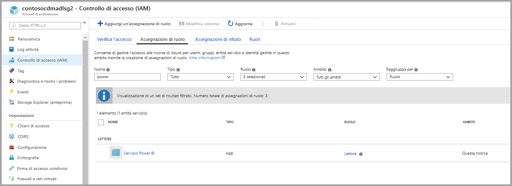

### Creare un file system per Power BI

È necessario creare un file system denominato *powerbi* prima di poter aggiungere l'account di archiviazione a Power BI. Esistono molti modi per creare questo tipo di file system, incluso l'uso di Azure Databricks, HDInsight, AZCopy o Azure Storage Explorer. Questa sezione illustra un modo semplice per creare un file system con Azure Storage Explorer.

Per questa procedura è necessario installare Azure Storage Explorer 1.6.2 o versione successiva. Per installare Azure Storage Explorer per Windows, Macintosh o Linux, vedere [Azure Storage Explorer](https://azure.microsoft.com/features/storage-explorer/).

1. Dopo aver installato correttamente Azure Storage Explorer, al primo avvio viene visualizzata la finestra Microsoft Azure Storage Explorer - Connetti. Anche se Storage Explorer offre numerosi modi per connettersi agli account di archiviazione, è attualmente supportato un solo modo per la configurazione necessaria. 

2. Nel riquadro sinistro individuare ed espandere l'account di archiviazione creato in precedenza.

3. Fare clic con il pulsante destro del mouse su Contenitori BLOB e scegliere Crea contenitore BLOB.

   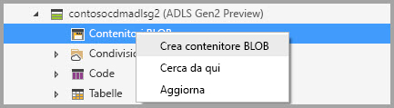

4. Verrà visualizzata una casella di testo sotto la cartella Contenitori BLOB. Immettere il nome *powerbi* 

   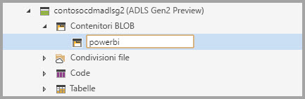

5. Premere INVIO al termine per creare il contenitore BLOB

   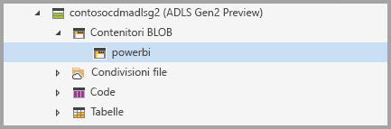

Nella sezione successiva verrà descritto come concedere alla famiglia di servizi Power BI l'accesso completo al file system creato. 

### Concedere le autorizzazioni per Power BI al file system

Per concedere le autorizzazioni al file system, si applicano impostazioni dell'elenco di controllo di accesso (ACL) che concedono l'accesso al servizio Power BI. Il primo passaggio consiste nell'ottenere l'identità dei servizi Power BI nel tenant. È possibile visualizzare le applicazioni di Azure Active Directory (AAD) nella sezione **Applicazioni aziendali** del portale di Azure.

Per trovare le applicazioni del tenant, seguire questa procedura:

1. Nel [portale di Azure](https://portal.azure.com/) selezionare **Azure Active Directory** dal pannello di navigazione a sinistra.
2. Nel pannello **Azure Active Directory** selezionare **Applicazioni aziendali**.
3. Nel menu a discesa **Tipo di applicazione** selezionare **Tutte le applicazioni** e quindi selezionare **Applica**. Viene visualizzato un elenco delle applicazioni del tenant, simile all'immagine seguente.

    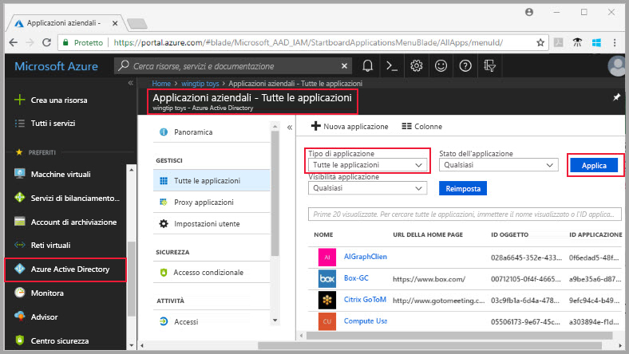

4. Nella barra di ricerca digitare *Power*. Viene visualizzata una raccolta di ID di oggetto per le applicazioni Power BI e Power Query. Nei passaggi successivi saranno necessari tutti e tre i valori.  

    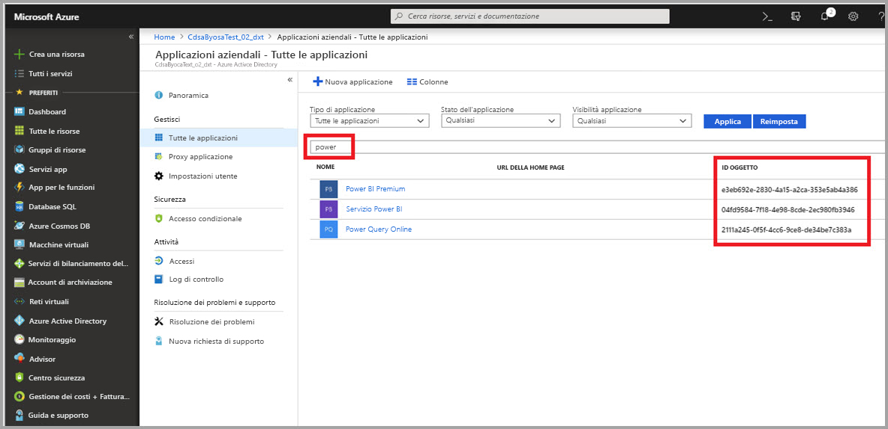

5. Selezionare e copiare gli ID degli oggetti per il servizio Power BI e per Power BI Premium dai risultati della ricerca. Sarà necessario incollare tali valori nei passaggi successivi.

7. Usare quindi **Azure Storage Explorer** per passare al file system *powerbi* creato nella sezione precedente. Seguire le istruzioni nella sezione [Managing access](https://docs.microsoft.com/azure/storage/blobs/data-lake-storage-how-to-set-permissions-storage-explorer#managing-access) (Gestione dell'accesso) dell'articolo [Set file and directory level permissions using Azure Storage explorer](https://docs.microsoft.com/azure/storage/blobs/data-lake-storage-how-to-set-permissions-storage-explorer) (Impostare le autorizzazioni a livello di file e directory tramite Azure Storage Explorer).

8. Per ognuno dei due ID di oggetto di Power BI raccolti nel passaggio 5, assegnare l'accesso in **Lettura**, **Scrittura** ed **Esecuzione** e gli ACL predefiniti per il file system *powerbi*.

   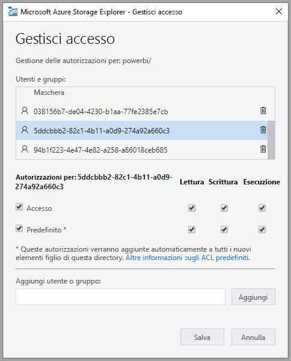

9. Per l'ID oggetto di Power Query online raccolto nel passaggio 4, assegnare l'accesso in **Scrittura** ed **Esecuzione** e gli ACL predefiniti al file system *powerbi*.

   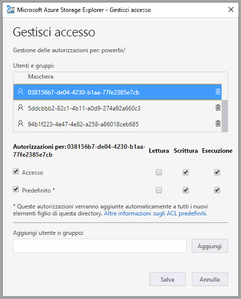

10. Inoltre, anche per **Altro** assegnare l'accesso in **Esecuzione** e gli ACL predefiniti.

    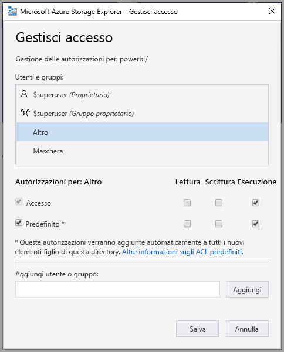

## Connettere Azure Data Lake Storage Gen2 a Power BI

Dopo aver configurato l'account di Azure Data Lake Storage Gen2 nel portale di Azure, connetterlo a Power BI nel **portale di amministrazione di Power BI**. Nella sezione delle impostazioni **Archiviazione del flusso di dati (anteprima)** del portale di amministrazione di Power BI è anche possibile gestire l'archiviazione dei flussi di dati di Power BI. Per indicazioni sull'avvio e l'uso di base, vedere [Come accedere al portale di amministrazione](service-admin-portal.md) per informazioni dettagliate.

Connettere l'account di **Azure Data Lake Storage Gen2** seguendo questa procedura:

1. Passare alla scheda **Impostazioni del flusso di dati (anteprima)** del **portale di amministrazione di Power BI**

    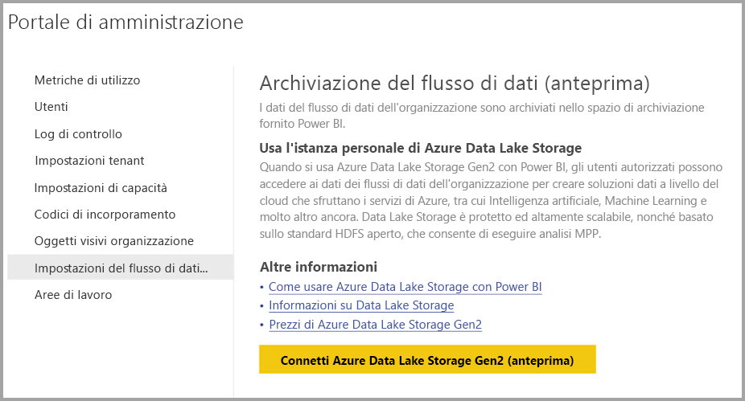 

2. Selezionare il pulsante **Connetti Azure Data Lake Storage Gen2 (anteprima)**. Verrà visualizzata la finestra seguente.

    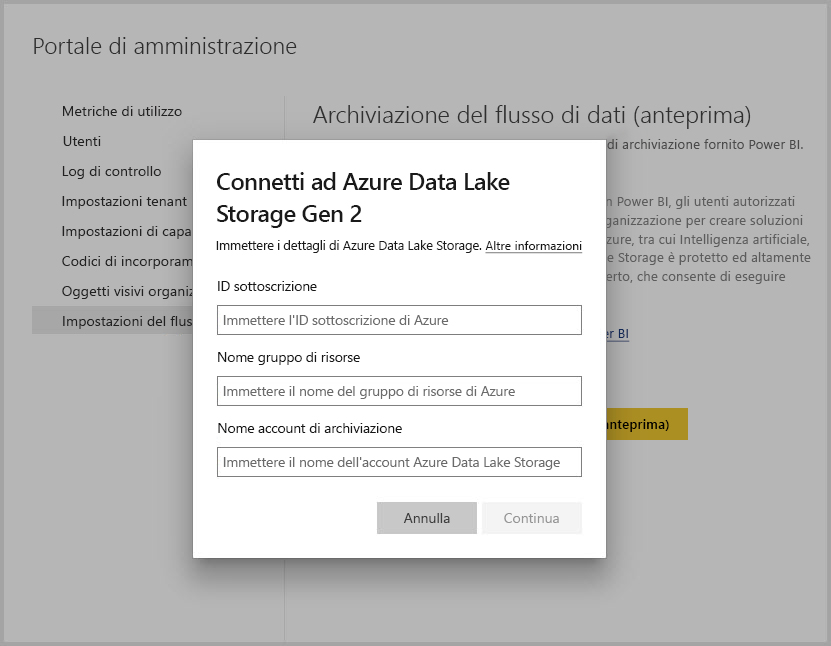 

3. Specificare l'**ID sottoscrizione** dell'account di archiviazione.
4. Specificare il **Nome gruppo di risorse** in cui è stato creato l'account di archiviazione.
5. Specificare il **Nome account di archiviazione**.
6. Selezionare **Connetti**.

Dopo aver completato questa procedura, l'account di Azure Data Lake Storage Gen2 è connesso a Power BI. 

A questo punto è necessario consentire agli utenti dell'organizzazione di configurare le aree di lavoro personali, in modo da poter usare questo account di archiviazione per l'archiviazione delle definizioni di flussi di dati e dei dati. Questa operazione verrà descritta nella sezione successiva. 

## Consentire agli amministratori di assegnare aree di lavoro

Per impostazione predefinita, i file di definizione dei flussi di dati e i file di dati sono archiviati nello spazio di archiviazione fornito da Power BI. Per accedere ai file dei flussi di dati nell'account di archiviazione personale, gli amministratori dell'area di lavoro devono prima di tutto configurare l'area di lavoro per consentire l'assegnazione e l'archiviazione dei flussi di dati nel nuovo account di archiviazione. Prima che un amministratore dell'area di lavoro possa configurare le impostazioni di archiviazione del flusso di dati, all'amministratore devono essere concesse autorizzazioni di assegnazione per l'archiviazione nel **portale di amministrazione di Power BI**.

Per concedere le autorizzazioni di assegnazione per l'archiviazione, passare alla scheda **Impostazioni del flusso di dati (anteprima)** nel **portale di amministrazione di Power BI**. È disponibile il pulsante di opzione *Consenti agli amministratori dell'area di lavoro di assegnare aree di lavoro a questo account di archiviazione* che deve essere impostato su **Consenti**. Dopo aver abilitato tale dispositivo di scorrimento, selezionare il pulsante **Applica** per rendere effettiva la modifica. 

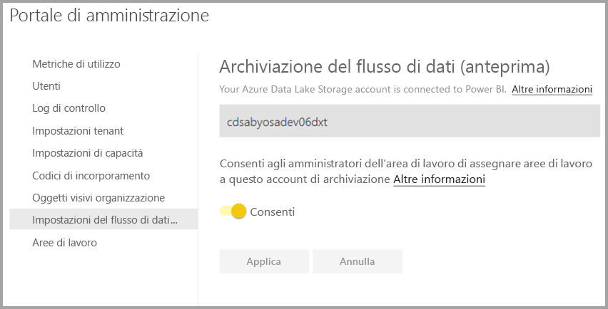 

Questo è tutto. Gli amministratori delle aree di lavoro di Power BI possono ora assegnare i flussi di lavoro al file system creato.

## Considerazioni e limitazioni

Questa funzionalità è in anteprima e il relativo comportamento potrebbe cambiare in procinto del rilascio. Quando si usa l'archiviazione dei flussi di dati è necessario tenere presenti alcune considerazioni e limitazioni:

* Dopo aver configurato la posizione di archiviazione del flusso di dati, non può essere modificata.
* Solo i proprietari di un flusso di dati archiviato in Azure Data Lake Storage Gen2 possono accedere ai dati per impostazione predefinita. Per autorizzare altri utenti per i flussi di dati archiviati in Azure, è necessario aggiungerli alla cartella CDM del flusso di dati 
* La creazione di flussi di dati con entità collegate è possibile solo quando sono archiviate nello stesso account di archiviazione
* Le origini dati locali, nelle capacità condivise di Power BI, non sono supportate nei flussi di dati archiviati nel data lake dell'organizzazione

Esistono anche alcuni problemi noti, come descritto in questa sezione.

I clienti di Power BI Desktop non possono accedere ai flussi di dati archiviati in un **account di Azure Data Lake Storage** a meno che non siano proprietari del flusso di dati oppure non siano stati autorizzati per la cartella CDM nel data lake. Lo scenario è il seguente:

1. Anna ha creato una nuova area di lavoro per app e l'ha configurata per archiviare i flussi di dati nel data lake dell'organizzazione. 
2. Bruno, anch'esso membro dell'area di lavoro creata da Anna, vorrebbe sfruttare Power BI Desktop e il connettore per i flussi di dati per ottenere dati dal flusso creato da Anna.
3. Bruno riceve un errore simile all'immagine seguente, perché non è stato autorizzato per la cartella CDM del flusso di dati nel data lake.

Domande e risposte comuni:

**Domanda**: cosa accade se dopo aver creato flussi di dati in un'area di lavoro si vuole modificare la posizione di archiviazione?

**Risposta**: non è possibile modificare la posizione di archiviazione di un flusso di dati dopo la creazione. 

**Domanda**: quando è possibile modificare la posizione di archiviazione del flusso di dati di un'area di lavoro?

**Risposta**: la modifica della posizione di archiviazione del flusso di dati di un'area di lavoro è consentita solo se l'area di lavoro non contiene flussi di dati.

## Passaggi successivi

In questo articolo sono state presentate le procedure per connettere Azure Data Lake Gen2 per l'archiviazione dei flussi di dati. Per altre informazioni, vedere gli articoli seguenti:

Per altre informazioni su flussi di dati, CDM e Azure Data Lake Storage Gen2, vedere gli articoli seguenti:

* [Integrazione di flussi di dati e Azure Data Lake (anteprima)](service-dataflows-azure-data-lake-integration.md)
* [Configurare le impostazioni del flusso di dati dell'area di lavoro (anteprima)](service-dataflows-configure-workspace-storage-settings.md)
* [Aggiungere una cartella CDM a Power BI come flusso di dati (anteprima)](service-dataflows-add-cdm-folder.md)

Per informazioni sui flussi di dati in generale, vedere questi articoli:

* [Creare e usare flussi di dati in Power BI](service-dataflows-create-use.md)
* [Uso delle entità calcolate in Power BI Premium (anteprima)](service-dataflows-computed-entities-premium.md)
* [Uso di flussi di dati con origini dati locali (anteprima)](service-dataflows-on-premises-gateways.md)
* [Risorse per sviluppatori per i flussi di dati Power BI (anteprima)](service-dataflows-developer-resources.md)

Per altre informazioni sull'archiviazione di Azure, è possibile leggere questi articoli:
* [Guida alla sicurezza di Archiviazione di Azure](https://docs.microsoft.com/azure/storage/common/storage-security-guide)

Per altre informazioni sul modello CDM (Common Data Model), è possibile leggere l'articolo di panoramica:
* [Panoramica del modello CDM (Common Data Model)](https://docs.microsoft.com/powerapps/common-data-model/overview)
* [Cartelle CDM](https://go.microsoft.com/fwlink/?linkid=2045304)
* [Definizione del file del modello CDM](https://go.microsoft.com/fwlink/?linkid=2045521)

È inoltre sempre possibile provare a [porre domande alla Community di Power BI](http://community.powerbi.com/).
