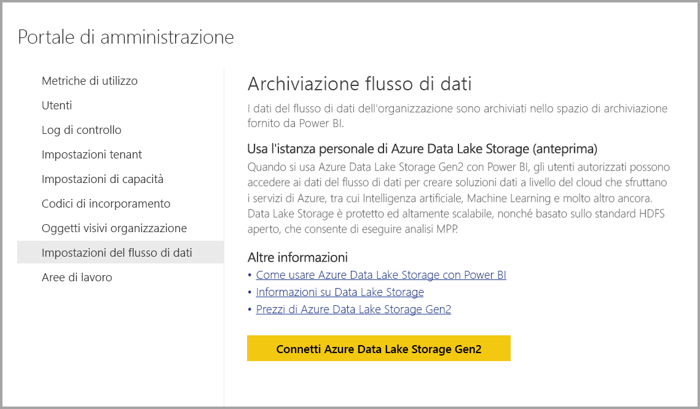

# Connettere Azure Data Lake Storage Gen2 per l'archiviazione dei flussi di dati

È possibile configurare le aree di lavoro di Power BI per archiviare i flussi di dati nell'account di Azure Data Lake Storage Gen2 della propria organizzazione. Questo articolo descrive i passaggi generali necessari a tale scopo, oltre a presentare linee guida e procedure consigliate. La configurazione di aree di lavoro per archiviare le definizioni dei flussi di dati e i file di dati nel data lake personale offre alcuni vantaggi, tra i quali:

* Azure Data Lake Storage Gen2 rende disponibile un'infrastruttura di archiviazione per i dati estremamente scalabile
* I file di dati e i file di definizione dei flussi di dati possono essere usati dagli sviluppatori del reparto IT per sfruttare i servizi dati e di intelligenza artificiale di Azure come illustrato negli [esempi di GitHub per i servizi dati di Azure](https://aka.ms/cdmadstutorial)
* Consente agli sviluppatori all'interno dell'organizzazione di integrare i dati dei flussi di dati in applicazioni interne e soluzioni line-of-business, usando risorse per sviluppatori per i flussi di dati e Azure

Per usare Azure Data Lake Storage Gen2 per i flussi di dati, è necessario quanto segue:

* **Tenant di Power BI** - Almeno un account nel tenant di Azure Active Directory (AAD) deve essere iscritto a Power BI
* **Un account amministratore globale** - Questo account è necessario per connettersi e configurare Power BI per archiviare la definizione e i dati del flusso di dati nell'account di Azure Data Lake Storage Gen2
* **Una sottoscrizione di Azure** - È necessaria una sottoscrizione di Azure per usare Azure Data Lake Storage Gen2
* **Gruppo di risorse** - Usare un gruppo di risorse già disponibile oppure crearne uno nuovo
* **Un account di archiviazione di Azure con la funzionalità Data Lake Storage Gen2 abilitata** 

> [!TIP]
> Se non si ha una sottoscrizione di Azure, prima di iniziare creare un [account gratuito](https://azure.microsoft.com/free/).

> [!WARNING]
> Dopo aver configurato la posizione di archiviazione del flusso di dati, non può essere modificata. Vedere la sezione relativa a [considerazioni e limitazioni](#considerations-and-limitations) verso la fine di questo articolo per informazioni su altri elementi importanti da considerare.

## Preparare Azure Data Lake Storage Gen2 per Power BI

Prima di poter configurare Power BI con un account di archiviazione Azure Data Lake Storage Gen2, è necessario creare e configurare un account di archiviazione. I requisiti per Power BI sono i seguenti:

1. È necessario essere il proprietario dell'account di archiviazione ADLS. Questo stato deve essere assegnato a livello di risorsa e non ereditato dal livello di sottoscrizione.
2. L'account di archiviazione deve essere creato nello stesso tenant di AAD del tenant di Power BI.
3. L'account di archiviazione deve essere creato nella stessa area AAD del tenant di Power BI. Per determinare la posizione del tenant di Power BI, vedere [Dove si trova il tenant di Power BI?](service-admin-where-is-my-tenant-located.md).
4. Per l'account di archiviazione deve essere abilitata la funzionalità *Spazio dei nomi gerarchico*.

Le sezioni seguenti illustrano in dettaglio i passaggi necessari per configurare l'account di Azure Data Lake Storage Gen2.

### Creare l'account di archiviazione

Seguire la procedura nell'articolo [Create an Azure Data Lake Storage Gen2 storage account](https://docs.microsoft.com/azure/storage/blobs/data-lake-storage-quickstart-create-account) (Creare un account di archiviazione di Azure Data Lake Storage Gen2).

1. Assicurarsi di selezionare la stessa posizione del tenant di Power BI e impostare lo spazio di archiviazione come **Archiviazione V2 (utilizzo generico v2)**
2. Assicurarsi di abilitare la funzionalità dello spazio dei nomi gerarchico
3. È consigliabile impostare la replica su **Archiviazione con ridondanza geografica e accesso in lettura (RA-GRS)**

### Concedere le autorizzazioni ai servizi Power BI

È poi necessario concedere al servizio Power BI i ruoli di Lettore e Accesso ai dati nell'account di archiviazione creato. Sono entrambi ruoli predefiniti, quindi la procedura è immediata. 

Seguire la procedura descritta in [Assegnare un ruolo RBAC predefinito](https://docs.microsoft.com/azure/storage/common/storage-auth-aad-rbac#assign-a-built-in-rbac-role).

Nella finestra **Aggiungi assegnazione di ruolo** selezionare il ruolo **Lettore e accesso ai dati**. Usare quindi la funzione di ricerca per individuare l'applicazione **Servizio Power BI**.
Ripetere gli stessi passaggi per il ruolo **Proprietario dei dati dei BLOB di archiviazione** e assegnare il ruolo a entrambe le applicazioni **Servizio Power BI** e **Power BI Premium**.

> [!NOTE]
> Attendere almeno 30 minuti per la propagazione dell'autorizzazione in Power BI dal portale. Ogni volta che si modificano le autorizzazioni nel portale, attendere 30 minuti affinché le autorizzazioni vengano riflesse in Power BI. 

## Connettere Azure Data Lake Storage Gen2 a Power BI

Dopo aver configurato l'account di Azure Data Lake Storage Gen2 nel portale di Azure, connetterlo a Power BI nel **portale di amministrazione di Power BI**. È anche possibile gestire l'archiviazione del flusso di dati di Power BI nella sezione delle impostazioni di **Archiviazione flusso di dati** del portale di amministrazione di Power BI. Per indicazioni sull'avvio e l'uso di base, vedere [Come accedere al portale di amministrazione](service-admin-portal.md) per informazioni dettagliate.

Connettere l'account di **Azure Data Lake Storage Gen2** seguendo questa procedura:

1. Passare alla scheda **Impostazioni del flusso di dati** del **portale di amministrazione di Power BI**

     

2. Fare clic sul pulsante **Connetti Azure Data Lake Storage Gen2**. Verrà visualizzata la finestra seguente.

     

3. Specificare l'**ID sottoscrizione** dell'account di archiviazione.
4. Specificare il **Nome gruppo di risorse** in cui è stato creato l'account di archiviazione.
5. Specificare il **Nome account di archiviazione**.
6. Selezionare **Connetti**.

Dopo aver completato questa procedura, l'account di Azure Data Lake Storage Gen2 è connesso a Power BI. 

> [!NOTE]
> Per configurare una connessione ad Azure Data Lake Storage Gen2 nel portale di amministrazione di Power BI sono necessarie le autorizzazioni di amministratore globale. Gli amministratori globali non possono però connettere una risorsa di archiviazione esterna nel portale di amministrazione.  

A questo punto è necessario consentire agli utenti dell'organizzazione di configurare le aree di lavoro personali, in modo da poter usare questo account di archiviazione per l'archiviazione delle definizioni di flussi di dati e dei dati. Questa operazione verrà descritta nella sezione successiva. 

## Consentire agli amministratori di assegnare aree di lavoro

Per impostazione predefinita, i file di definizione dei flussi di dati e i file di dati sono archiviati nello spazio di archiviazione fornito da Power BI. Per accedere ai file dei flussi di dati nell'account di archiviazione personale, gli amministratori dell'area di lavoro devono prima di tutto configurare l'area di lavoro per consentire l'assegnazione e l'archiviazione dei flussi di dati nel nuovo account di archiviazione. Prima che un amministratore dell'area di lavoro possa configurare le impostazioni di archiviazione del flusso di dati, all'amministratore devono essere concesse autorizzazioni di assegnazione per l'archiviazione nel **portale di amministrazione di Power BI**.

Per concedere le autorizzazioni di assegnazione per l'archiviazione, passare alla scheda **Impostazioni del flusso di dati** nel **portale di amministrazione di Power BI**. È disponibile il pulsante di opzione *Consenti agli amministratori dell'area di lavoro di assegnare aree di lavoro a questo account di archiviazione* che deve essere impostato su **Consenti**. Dopo aver abilitato tale dispositivo di scorrimento, selezionare il pulsante **Applica** per rendere effettiva la modifica. 

 

Questo è tutto. Gli amministratori delle aree di lavoro di Power BI possono ora assegnare i flussi di lavoro al file system creato.

## Considerazioni e limitazioni

Questa funzionalità è in anteprima e il relativo comportamento potrebbe cambiare in procinto del rilascio. Quando si usa l'archiviazione dei flussi di dati è necessario tenere presenti alcune considerazioni e limitazioni:

* Dopo aver configurato la posizione di archiviazione del flusso di dati, non può essere modificata.
* Solo i proprietari di un flusso di dati archiviato in Azure Data Lake Storage Gen2 possono accedere ai dati per impostazione predefinita. Per autorizzare altri utenti per i flussi di dati archiviati in Azure, è necessario aggiungerli alla cartella CDM del flusso di dati 
* La creazione di flussi di dati con entità collegate è possibile solo quando sono archiviate nello stesso account di archiviazione
* Le origini dati locali, nelle capacità condivise di Power BI, non sono supportate nei flussi di dati archiviati nel data lake dell'organizzazione
* Gli snapshot non vengono eliminati automaticamente in Azure Data Lake Storage Gen2. Se si vuole liberare spazio, è possibile creare una funzione di Azure per pulire periodicamente gli snapshot obsoleti.

Esistono anche alcuni problemi noti, come descritto in questa sezione.

I clienti di Power BI Desktop non possono accedere ai flussi di dati archiviati in un **account di Azure Data Lake Storage** a meno che non siano proprietari del flusso di dati oppure non siano stati autorizzati per la cartella CDM nel data lake. Lo scenario è il seguente:

1. Anna ha creato una nuova area di lavoro e l'ha configurata per l'archiviazione dei flussi di dati nel data lake dell'organizzazione. 
2. Bruno, anch'esso membro dell'area di lavoro creata da Anna, vorrebbe sfruttare Power BI Desktop e il connettore per i flussi di dati per ottenere dati dal flusso creato da Anna.
3. Bruno riceve un errore simile perché non ha ricevuto l'autorizzazione per la cartella CDM del flusso di dati nel data lake.

Domande e risposte comuni:

**Domanda**: cosa accade se dopo aver creato flussi di dati in un'area di lavoro si vuole modificare la posizione di archiviazione?

**Risposta**: non è possibile modificare la posizione di archiviazione di un flusso di dati dopo la creazione. 

**Domanda**: quando è possibile modificare la posizione di archiviazione del flusso di dati di un'area di lavoro?

**Risposta**: la modifica della posizione di archiviazione del flusso di dati di un'area di lavoro è consentita solo se l'area di lavoro non contiene flussi di dati.

## Passaggi successivi

In questo articolo sono state presentate le procedure per connettere Azure Data Lake Gen2 per l'archiviazione dei flussi di dati. Per altre informazioni, vedere gli articoli seguenti:

Per altre informazioni su flussi di dati, CDM e Azure Data Lake Storage Gen2, vedere gli articoli seguenti:

* [Integrazione di flussi di dati e Azure Data Lake (anteprima)](service-dataflows-azure-data-lake-integration.md)
* [Configurare le impostazioni del flusso di dati dell'area di lavoro (anteprima)](service-dataflows-configure-workspace-storage-settings.md)
* [Aggiungere una cartella CDM a Power BI come flusso di dati (anteprima)](service-dataflows-add-cdm-folder.md)

Per informazioni sui flussi di dati in generale, vedere questi articoli:

* [Creare e usare flussi di dati in Power BI](service-dataflows-create-use.md)
* [Uso delle entità calcolate in Power BI Premium](service-dataflows-computed-entities-premium.md)
* [Uso di flussi di dati con origini dati locali](service-dataflows-on-premises-gateways.md)
* [Risorse per sviluppatori per i flussi di dati Power BI](service-dataflows-developer-resources.md)

Per altre informazioni sull'archiviazione di Azure, è possibile leggere questi articoli:
* [Guida alla sicurezza di Archiviazione di Azure](https://docs.microsoft.com/azure/storage/common/storage-security-guide)

Per altre informazioni sul modello CDM (Common Data Model), è possibile leggere l'articolo di panoramica:
* [Panoramica del modello CDM (Common Data Model)](https://docs.microsoft.com/powerapps/common-data-model/overview)
* [Cartelle CDM](https://go.microsoft.com/fwlink/?linkid=2045304)
* [Definizione del file del modello CDM](https://go.microsoft.com/fwlink/?linkid=2045521)

È inoltre sempre possibile provare a [porre domande alla Community di Power BI](https://community.powerbi.com/).
