# Creazione e uso di flussi di dati in Power BI (anteprima)

Con la preparazione dei dati avanzata disponibile in **Power BI**, è possibile creare una raccolta di dati detta flusso di dati, che è quindi possibile usare per connettersi ai dati aziendali da diverse origini, pulire i dati, trasformarli e quindi caricarli nello spazio di archiviazione di Power BI.

Un **flusso di dati** è una raccolta di *entità* (le entità sono simili alle tabelle) che vengono create e gestite in aree di lavoro per le app nel servizio Power BI. È possibile aggiungere e modificare le entità nel flusso di dati, oltre che gestire le pianificazioni per gli aggiornamenti dei dati, direttamente dall'area di lavoro in cui è stato creato il flusso di dati.

Dopo aver creato un flusso di dati, è possibile usare **Power BI Desktop** e il **servizio Power BI** per creare set di dati, report, dashboard e app basati sui dati inseriti nei flussi di dati di Power BI e ottenere così informazioni dettagliate sulle attività aziendali.

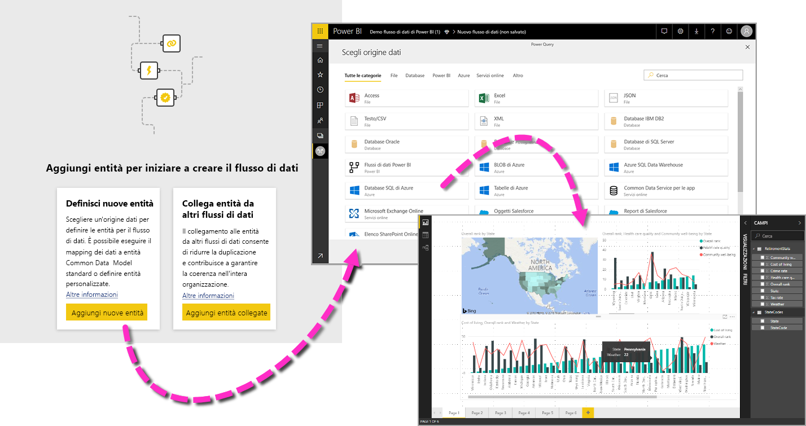

I passaggi principali per l'uso di un flusso di dati sono tre:

1. Creare il flusso di dati, usando gli strumenti di Microsoft progettati per semplificare tale operazione
2. Pianificare la frequenza di aggiornamento dei dati da inserire nel flusso di dati
3. Creare il set di dati usando il flusso di dati, tramite Power BI Desktop 

Nelle sezioni seguenti vengono esaminati questi passaggi e sarà possibile acquisire familiarità con gli strumenti disponibili per completare ogni passaggio. È possibile iniziare subito.

> [!NOTE]
> La funzionalità dei flussi di dati è disponibile in anteprima ed è soggetta a modifiche e aggiornamenti prima della disponibilità generale.

## Creazione di un flusso di dati
Per creare un flusso di dati, avviare il servizio Power BI in un browser, quindi selezionare un'**area di lavoro per le app** (i flussi di dati non sono disponibili nell'*area di lavoro personale* nel servizio Power BI) dal riquadro di spostamento a sinistra, come illustrato nella schermata seguente. È anche possibile creare una nuova area di lavoro in cui creare il nuovo flusso di dati. 

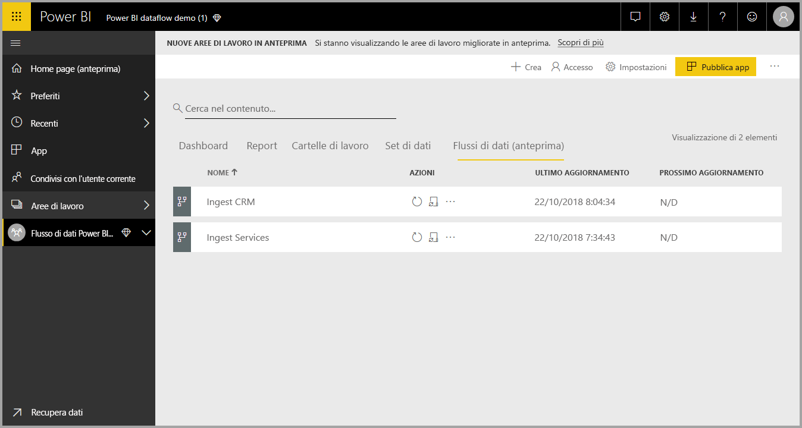

Quando ci si trova in un'**area di lavoro per le app** dove è possibile creare un flusso di dati, viene visualizzato il pulsante **+ Crea** nell'angolo superiore destro dell'area di disegno. Selezionare il pulsante **+ Crea** e quindi selezionare **Flusso di dati** nell'elenco a discesa. 

È importante sapere che c'è solo *un proprietario* di un flusso di dati, ovvero la persona che lo crea. Solo il proprietario può modificare il flusso di dati. Tutti i membri dell'**area di lavoro per le app** con autorizzazioni di lettura o scrittura per l'area di lavoro per le app in cui viene creato il flusso di dati possono connettersi al flusso di dati da **Power BI Desktop**, come descritto più avanti in questo articolo.

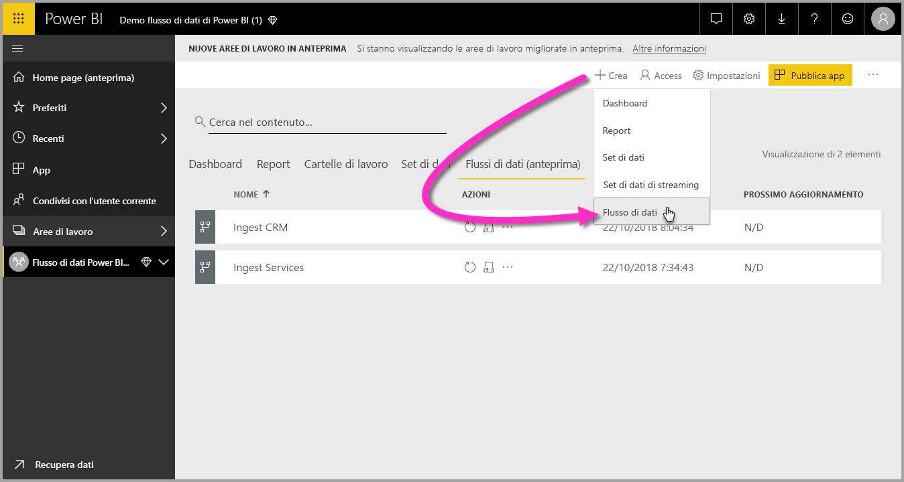

Da qui, è possibile aggiungere **entità**, come descritto nella sezione successiva.

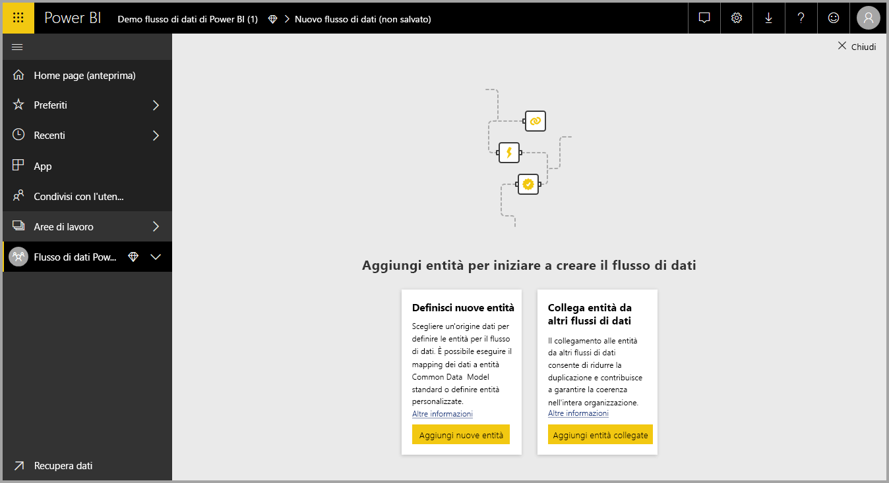

### Aggiungere entità

Un'**entità** è un set di campi usati per archiviare i dati, in modo analogo a una tabella in un database. Nell'immagine seguente sono illustrate le origini dati da cui è possibile inserire dati in Power BI.

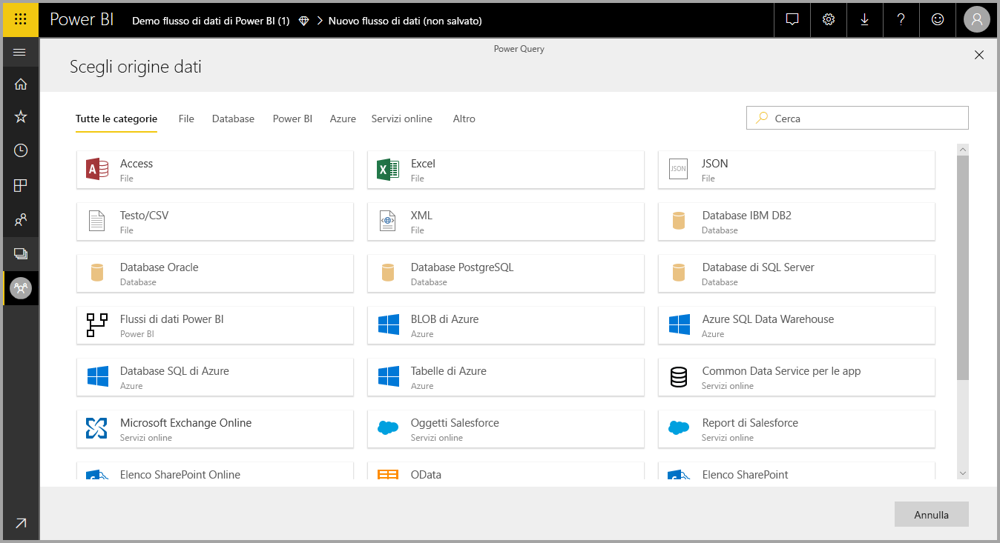

Quando si seleziona un'origine dati, viene chiesto di fornire le impostazioni di connessione, tra cui l'account da usare per la connessione all'origine dati, come illustrato nell'immagine seguente.

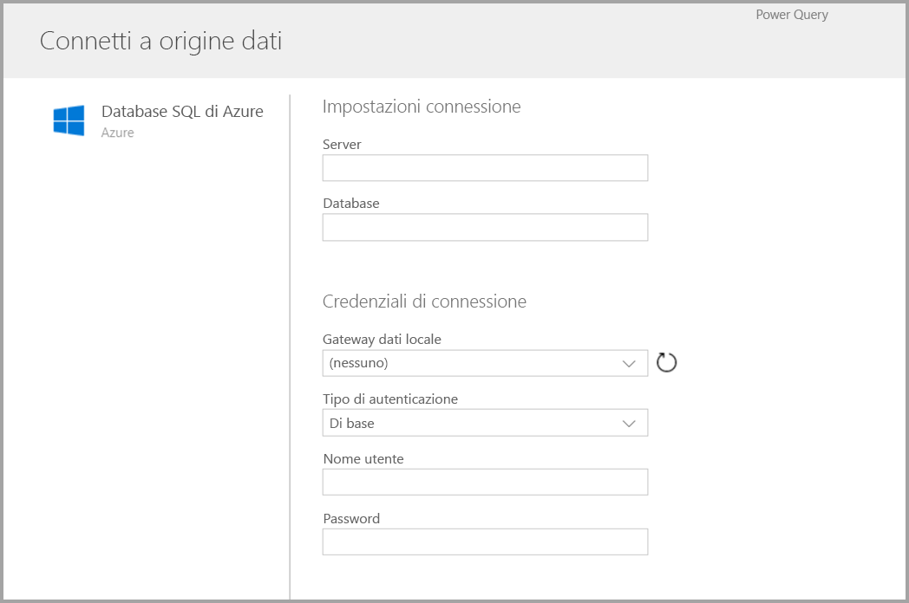

Una volta stabilita la connessione, è possibile scegliere i dati da usare per l'entità. Quando si scelgono i dati e un'origine, Power BI successivamente si riconnette all'origine dati per mantenere aggiornati i dati nel flusso di dati, in base alla frequenza selezionata più avanti nel processo di configurazione.

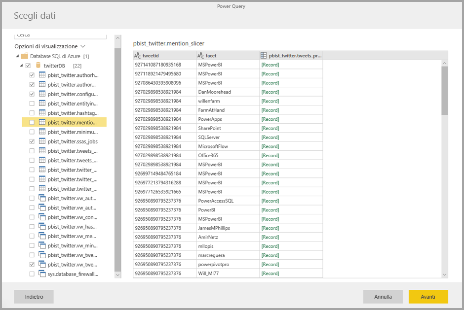

Una volta selezionati i dati per da usare nell'entità, è possibile usare l'editor del flusso di dati per modellare o trasformare i dati nel formato necessario per l'uso nel flusso di dati.

### Uso dell'editor del flusso di dati

Una volta selezionati i dati dall'origine da usare per l'entità, è possibile modellarli nel formato più appropriato per l'entità usando un'esperienza di modifica di Power Query, analoga all'**Editor di Power Query** in  **Power BI Desktop**. Per altre informazioni su Power Query (Power Query è uno strumento integrato in Power BI Desktop come l'Editor di Power Query), vedere [Panoramica delle query in Power BI Desktop](desktop-query-overview.md). 

Se si vuole visualizzare il codice che Query crea a ogni passaggio o si vuole creare un codice di shaping personalizzato, è possibile usare l' **Editor avanzato**. 

### Flussi di dati e modello CDM (Common Data Model)

Le entità dei flussi di dati includono nuovi strumenti per eseguire facilmente il mapping dei dati aziendali al modello CDM (Common Data Model), ovvero lo schema standardizzato di Microsoft, arricchirli con dati di Microsoft e di terze parti e accedere facilmente a funzionalità di apprendimento automatico. Queste nuove funzionalità possono essere sfruttate per fornire informazioni dettagliate intelligenti e di utilità pratica in relazione ai dati aziendali. Una volta completate tutte le trasformazioni nel passaggio Modifica query, è possibile mappare le colonne dalle tabelle dell'origine dati a campi di entità standard, come definito dal modello CDM (Common Data Model). Le entità standard hanno uno schema noto definito dal modello CDM.

Per altre informazioni su questo approccio e sul modello CDM, vedere l'articolo [Che cos'è il modello CDM (Common Data Model)?](https://docs.microsoft.com/powerapps/common-data-model/overview).

Per sfruttare i vantaggi del modello CDM con il flusso di dati, fare clic sulla trasformazione **Esegui mapping a entità standard** nella finestra di dialogo **Modifica query**. Nella schermata **Mapping entità** visualizzata è possibile selezionare l'entità standard a cui si desidera eseguire il mapping.

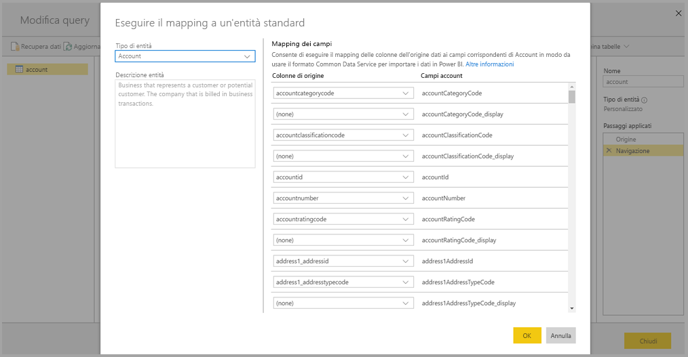

Quando si esegue il mapping di una colonna di origine a un campo standard, si verifica quanto segue:

1. La colonna di origine assume il nome del campo standard (la colonna viene rinominata se i nomi sono diversi)
2. La colonna di origine ottiene il tipo di dati del campo standard

Per mantenere l'entità standard del modello CDM, tutti i campi standard che non sono mappati ottengono valori *Null*.

Tutte le colonne di origine che non sono mappate rimangono invariate, per garantire che il risultato del mapping sia un'entità standard con campi personalizzati.

Una volta completate le selezioni, quando l'entità e le relative impostazioni dei dati sono pronte per il salvataggio, è possibile scegliere **Salva** dal menu. Si noti che è possibile creare più entità selezionando il pulsante **Aggiungi entità** ed è possibile modificare le entità per ottimizzare le query e le entità create.

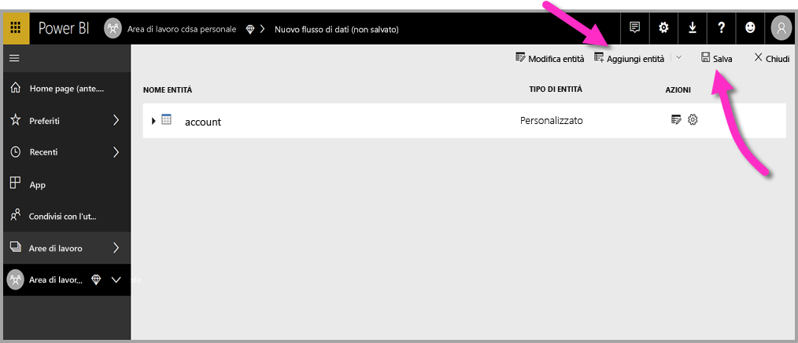

Quando si seleziona **Salva**, viene chiesto di fornire un nome e una descrizione per il flusso di dati.

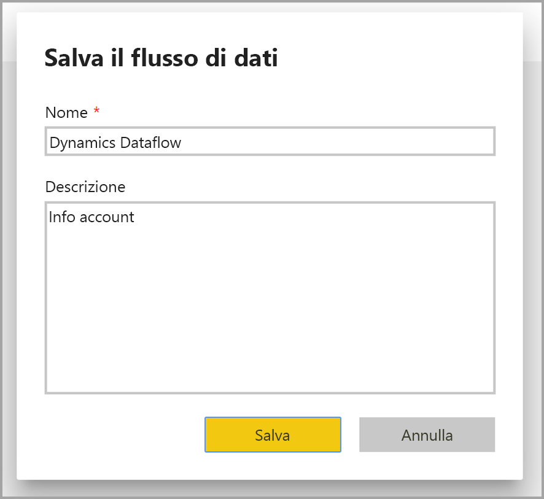

Quando si è pronti e si seleziona il pulsante **Salva**, viene visualizzata una finestra che indica che il **flusso di dati** è stato creato. 

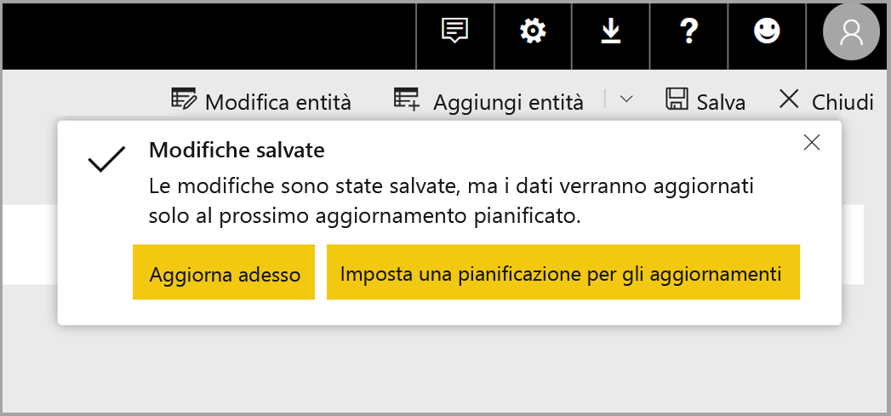

A questo punto è possibile eseguire il passaggio successivo, ovvero pianificare la frequenza di aggiornamento delle origini dati.

## Pianificare la frequenza di aggiornamento

Dopo aver salvato il flusso di dati, è possibile pianificare la frequenza di aggiornamento per ognuna delle origini dati connesse.

I flussi di dati di Power BI usano il processo di aggiornamento dei dati di Power BI per mantenere aggiornati i dati. Nel **servizio Power BI**, nella sezione dell'**area di lavoro per le app**, è presente una raccolta di aree in cui possono essere elencate le informazioni, inclusi i flussi di dati, come illustrato nell'immagine seguente.

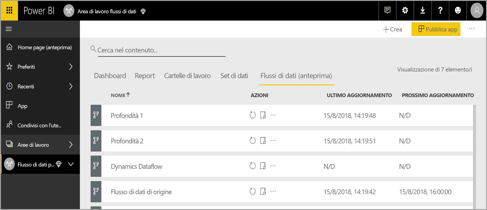

La voce *Dynamics dataflow* nell'immagine sopra si riferisce al flusso di dati creato nella sezione precedente. Per pianificare l'aggiornamento, selezionare l'icona **Pianifica aggiornamento** nella sezione **Azioni**, come illustrato nell'immagine seguente. 

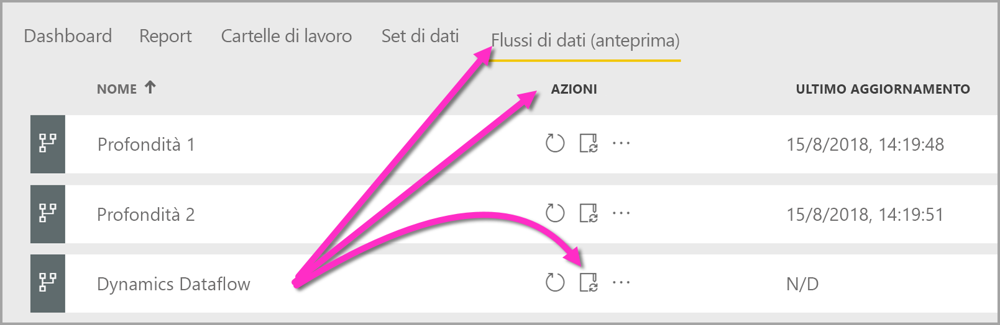

Quando si seleziona l'icona **Pianifica aggiornamento**, viene visualizzato il riquadro **Pianifica aggiornamento**, che consente di impostare la frequenza e l'ora per l'aggiornamento del flusso di dati.

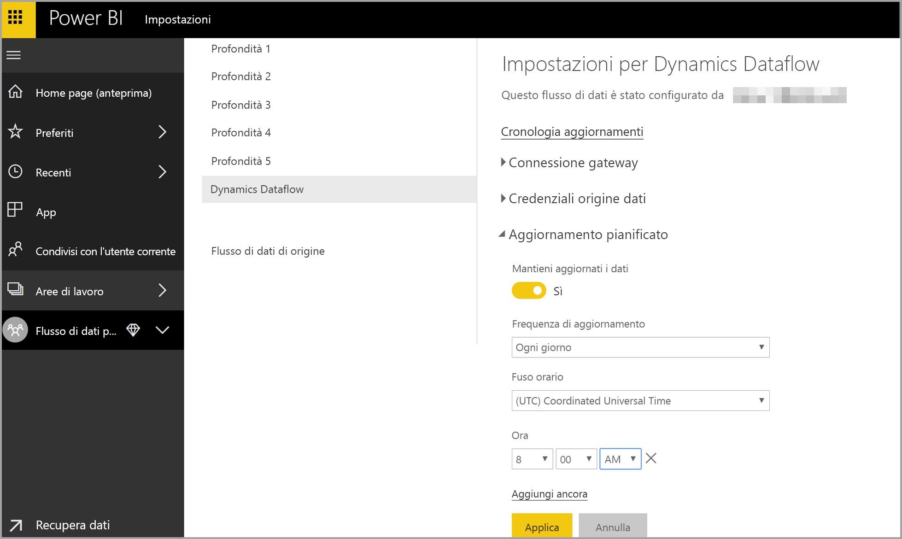

Per altre informazioni sulla pianificazione dell'aggiornamento, vedere l'articolo [Configurazione dell'aggiornamento pianificato](refresh-scheduled-refresh.md), che descrive il comportamento di aggiornamento dei set di dati di Power BI. I flussi di dati presentano lo stesso comportamento dei set di dati di Power BI per quanto riguarda le impostazioni di aggiornamento. 

## Connettersi al flusso di dati in Power BI Desktop

Dopo aver creato il flusso di dati e aver pianificato la frequenza di aggiornamento per ogni origine dati che popolerà il modello, è possibile eseguire il terzo e ultimo passaggio, ovvero la connessione al flusso di dati da **Power BI Desktop**. 

Per connettersi al flusso di dati, in Power BI Desktop selezionare **Recupera dati > Power BI > Flussi di dati Power BI (beta)**, come illustrato nell'immagine seguente.

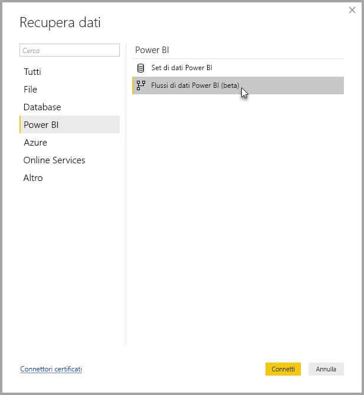

Da questa posizione, passare all'**area di lavoro per le app** dove è stato salvato il flusso di dati, selezionare il flusso di dati e quindi selezionare le entità create nell'elenco.

È anche possibile usare la **barra di ricerca** nella parte superiore della finestra per trovare rapidamente il nome del flusso di dati o le entità tra le numerose entità del flusso di dati.

Quando si seleziona l'entità e quindi si fa clic sul pulsante **Carica**, le entità vengono visualizzate nel riquadro **Campi** in **Power BI Desktop** e hanno lo stesso aspetto e lo stesso comportamento delle **tabelle** di qualsiasi altro set di dati.

## Risoluzione dei problemi relativi alle connessioni dati

In alcuni casi potrebbero verificarsi problemi di connessione alle origini dati per i flussi di dati. In questa sezione vengono forniti suggerimenti per la risoluzione di questi problemi quando si verificano. 

* **Connettore Salesforce**: l'uso di un account di valutazione per Salesforce con i flussi di dati genera un errore di connessione per il quale non vengono fornite informazioni. Per risolvere questo problema, usare un account Salesforce di produzione o un account sviluppatore per i test.

* **Connettore SharePoint**: assicurarsi di specificare l'indirizzo radice del sito di SharePoint, senza sottocartelle o documenti. Usare, ad esempio, un collegamento simile al seguente: https://microsoft.sharepoint.com/teams/ObjectModel/ 

## Passaggi successivi

In questo articolo è stato illustrato come creare un **flusso di dati** personalizzato e come creare un set di dati e un report in **Power BI Desktop** per sfruttarne i vantaggi. Gli articoli seguenti forniscono altre informazioni e illustrano scenari d'uso dei flussi di dati:

* [Preparazione dei dati self-service con flussi di dati](service-dataflows-overview.md)
* [Uso delle entità calcolate in Power BI Premium (anteprima)](service-dataflows-computed-entities-premium.md)
* [Uso di flussi di dati con origini dati locali (anteprima)](service-dataflows-on-premises-gateways.md)
* [Risorse per sviluppatori per i flussi di dati Power BI (anteprima)](service-dataflows-developer-resources.md)

Per altre informazioni sul modello CDM (Common Data Model), è possibile leggere l'articolo di panoramica:
* [Panoramica del modello CDM (Common Data Model)](https://docs.microsoft.com/powerapps/common-data-model/overview)
* [Altre informazioni sullo schema CDM (Common Data Model) e sulle entità in GitHub](https://github.com/Microsoft/CDM)

Articoli di Power BI Desktop correlati:

* [Connettersi ai set di dati nel servizio Power BI da Power BI Desktop](desktop-report-lifecycle-datasets.md)
* [Panoramica delle query in Power BI Desktop](desktop-query-overview.md)

Articoli del servizio Power BI correlati:
* [Configurazione dell'aggiornamento pianificato](refresh-scheduled-refresh.md)
